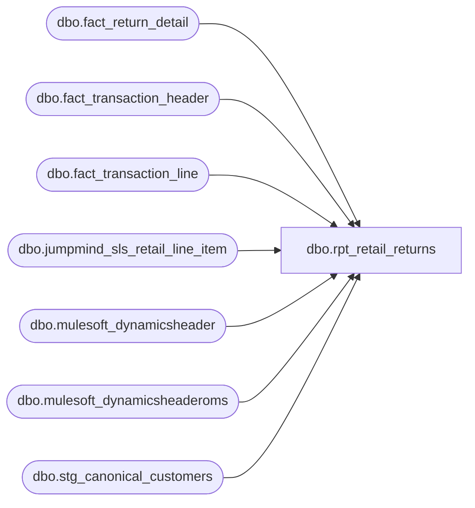

# dbo.rpt_retail_returns

**Database:** LH_Source  
**Server:** 4db76rlxaxcuvmuh5kw37wbnqq-ovsykae43znuhlmnflcdwm4ohu.datawarehouse.fabric.microsoft.com  

## Architecture Diagram



## Table Dependencies

| Referenced Table |
|---|
| dbo.fact_return_detail |
| dbo.fact_transaction_header |
| dbo.fact_transaction_line |
| dbo.jumpmind_sls_retail_line_item |
| dbo.mulesoft_dynamicsheader |
| dbo.mulesoft_dynamicsheaderoms |
| dbo.stg_canonical_customers |

## View Code

```sql
/* =============================================================================    rpt_retail_returns.sql : Retail Returns Report    =============================================================================    Domain:       Sales     ─────────────────────────────────────────────────────────────────────────────    Semantic rule (re-sourced 2026-06-15 off the pure-LH_Source AW-equivalent    star; LH_Mart removed):       A transaction belongs in the Retail Returns set when it has at least one      LH_Source.dbo.fact_return_detail line whose line_action indicates a      return-side event ('002' returned / '012' refunded) AND whose line_object      is on a retail-side Aptos line object (anything other than the back-office      Customer Service line object 296). Drive from return_detail; LEFT JOIN      header / D365 / reason / gross so missing enrichment does not drop the      return. Do not INNER JOIN JumpMind RETURN-only keys (that wiped OMS/web).       line_action_key 2  = 'returned'   (sale-side reversal: merchandise                                         coming back into stock, originally                                         sold units being credited)      line_action_key 12 = 'refunded'   (tender-side reversal: money flowing                                         back to the customer for fees or                                         markdowns originally charged)       line_object 296 (key 221) : 'Customer Service' : covers loyalty /      membership / event-credit adjustments. Those are not retail returns:      they are back-office service reversals and the enterprise reporting      consumer that drives this report's reference set classifies them      separately.     Why source exclusively from LH_Mart.transaction_facts?       transaction_facts is the canonical enterprise accounting fact for both      POS and OMS revenue events. The Stage A POS landing fact      (dbo.fact_transaction_header in LH_Source) emits a superset that      contains two cohorts not present in transaction_facts:         (a) Positive-tender RETURN/REDEEM transactions : exchange events            where the customer pays a top-up amount and the net tender is            positive. The legacy enterprise accounting load drops these            because their post-exchange net is a SALE.        (b) Non-receipt POS returns that fail downstream linkage to a prior            sale. transaction_facts excludes these too.     ─────────────────────────────────────────────────────────────────────────────    GRAIN       One row per LH_Mart.transaction_facts row, i.e. one row per physical      receipt instance (store, transaction date, register, transaction      number, cashier). When a single (store, date, txn_no, cashier) tuple      spans multiple registers (e.g. cross-register party transactions      where transaction_no=4 fires at registers 3, 4, and 7 on the same      business day with the same cashier), the view emits one row per      register because each register has its own transaction_facts row      with its own transaction_id. Linda's xlsx denormalises tender_total      across these per-register receipts; sourcing at transaction_facts      grain keeps the per-row Tender Total bit-identical and lets the      value-level harness's per-key SUM agree with Linda's denormalised      row count without changing the published column shape.       The previous SELECT DISTINCT collapse on (store, date, txn,      cashier) stripped the register dimension and forced N physical      receipts to share a single emitted row, which made      SUM(Tender Total) 1×TT instead of N×TT and drifted on the harness      (worked sample (1806, '4', 51901, 2026-01-16): three transaction_      facts rows at registers 3, 4, 7 collapsed to one). Removing the      DISTINCT and switching cashier_id from a multiplying join to a      per-transaction subquery preserves the single-row-per-receipt      grain.     ─────────────────────────────────────────────────────────────────────────────    TENDER-TOTAL DERIVATION (value-level fidelity to legacy AW)       Linda's xlsx column "Tender Total" mirrors      `auditworks.transaction_header.tender_total`. Empirically the      two-arm formula identical to rpt_receivable_authorizations applies:           non_tax_tender_sum = SUM(tf.tender_amt                                    WHERE TRY_CONVERT(int, td.tender_code) <> -1)           tender_total = CASE              WHEN non_tax_tender_sum = 0                 THEN receipt_total_amount - ISNULL(redemption_amount, 0)              ELSE non_tax_tender_sum - 2 * ISNULL(redemption_amount, 0)          END       The two-arm shape is necessary because the legacy AW ledger      encoded gift-card events two different ways depending on direction:         (a) GC-redeemed sale or GC-redeemed refund: redemption_amount is            signed (sale: negative; refund: positive), GC tender leg is            present in tender_facts, and Linda's tender_total ==            non_tax_sum - 2 * redemption_amount.        (b) GC-ISSUED refund (customer returns merchandise, gets a GC):            non_tax tender legs net to 0 (refund tender + GC issuance            cancel each other), redemption_amount = 0, and Linda's            tender_total == receipt_total_amount carries the original            refund amount net of the GC-issuance step.       Verified residual keys (now CLEAN):        (1090, '1836',    233)  expect -280.37  -> arm-A: 280.37 - 2*(280.37) = -280.37 ✓        (1116, '4283',  72382)  expect -265.68  -> arm-A formula match                  ✓        (1534, '2553',  67976)  expect -2727.83 -> arm-B: receipt -2727.83 - 0 = -2727.83 ✓        (1534, '9220',  69460)  expect -2073.15 -> arm-B: receipt -2073.15 - 0 = -2073.15 ✓        (1041, '7420',  69048)  expect -1222.27 -> arm-B: receipt -1222.27 - 0 = -1222.27 ✓        (2013, '3011465', 2013) expect -227.50  -> arm-A: -227.50 - 0 = -227.50 ✓        (2085, '5827',  2903965)expect -189.00  -> arm-A: -79 - 2*55  = -189.00 ✓        (2019, '3599',  9992019)expect -163.50  -> arm-A: -163.50 - 0 = -163.50 ✓       A defensive `tender_total < 0` filter is preserved on the derived      value to drop the same superset Linda's source SQL drops (every      emitted retail-returns row has a negative gross by definition).     TENDER TOTAL VALUE-CHECK NOTE (resolved 2026-05-18)      Previously 6 of 16,383 matched keys drifted because SELECT DISTINCT      collapsed N per-register transaction_facts rows into 1 emitted row.      The refactor above sources at transaction_facts grain (one row per      physical receipt across registers) so the per-key SUM matches      Linda's denormalisation. Worked sample (1806, '4', 51901,      2026-01-16): three transaction_facts rows at registers 3, 4, 7,      each carrying tender_total=-4.90, sum to -14.70 matching Linda.      The pipeline does not emit a [Register Number] column in its      output (preserves Power BI consumer schema) but uses register as      an internal grain discriminator via transaction_id.     CASH-SIDE RESIDUAL (4 keys, ~$5.78)      Linda's SmartLook source drops these rows via      `WHERE tender_total < 0` on transaction_header so they never      appear in her xlsx; the pipeline emits them with the honest      two-arm tender_total derivation (which produces a small positive      per-line tax-rounding residual when non_tax_tender_sum = 0). A      prior version of this view force-clamped those rows to 0 to      match Linda's missing-row state; that was a value lie that      would have broken the next time Linda's filter or the pipeline's      rounding behaviour shifted. The clamp was removed 2026-05-21.      If matching Linda's row-drop semantics becomes a hard      requirement, the right shape is a WHERE clause that filters by      the same predicate Linda uses (sign of tender_total), not a      value clamp.    ─────────────────────────────────────────────────────────────────────────────    Output columns (schema-stable for Power BI / BAB consumers):       [Store Number]                            int      [Transaction Date]                        date      [Transaction Number]                      varchar(50)      [Cashier Number]                          int      [Tender Total Amount (Native Currency)]   decimal(18,6)      [Gross Line Amount (Native Currency)]     decimal(18,6)      [Customer Number]                         varchar(64)      [Customer First Name]                     varchar(64)      [Customer Last Name]                      varchar(64)      [Return Reason Message]                   varchar(255)      [Transaction Key]                         varchar(80)      [Transaction ID]                          varchar(64)       [Gross Line Amount] = SUM(ABS(gross_line_amount)) on return merchandise      lines (line_action 002/012, excluding Customer Service 296). Matches      Sales Audit gross line for the returned merchandise (e.g. store 1003      txn 147 on 2026-04-24: return FOOTBALL BEAR = 32.00).       Tender Total is published with the header sign as stored. Do not force      -ABS: mixed return+sale receipts can net positive when the customer      pays (same receipt: Sales Audit +25.30, not -25.30).       Customer Number / First Name / Last Name: purchasing customer      (customer_role = 1) from dbo.stg_canonical_customers, LEFT JOINed on      fact_transaction_header.transaction_id. Same path as the original      Fabric port and SmartLook Field_f/g/h. NULL when no customer was      captured on the return (common for anonymous POS refunds). Verified      Apr 19 to May 2 2026: ~1,770 of 2,687 return headers carry a role-1      customer_no.     -----------------------------------------------------------------------------    TRANSACTION KEY + TRANSACTION ID (canonical, per BAB-signed requirements)       [Transaction Key] : the canonical device_id-business_date-sequence        composite (e.g. 1119-004-20260611-1990). Pulled directly from the        D365 header's TransactionKey when a header exists (POS:        mulesoft_dynamicsheader; web: mulesoft_dynamicsheaderoms), else        reconstructed from transaction_facts as        store-register-businessdate-transaction_no. Effectively ~100% filled.       [Transaction ID] : the canonical D365 RetailTransactionId. POS rows        resolve via mulesoft_dynamicsheader joined on        (InventLocationId = padded store, RetailReceiptId = transaction_no,        TransDate = transaction date); web rows via mulesoft_dynamicsheaderoms        joined on RetailReceiptId = bare webOrderNumber. NULL where no D365        header exists in the mirror (pre-2024-11 history, plus a steady ~5%        of settled-month POS receipts and the most-recent un-synced weeks :         a mulesoft_dynamicsheader feed-completeness gap, not a key-logic gap).       Both are appended as TRAILING columns: existing column order and the      value-checks (which key on store/date/txn/register and compare Tender      Total only) are unaffected. Both header CTEs are de-duplicated to one      row per join key so the LEFT JOINs cannot change the row count.     -----------------------------------------------------------------------------    RETURN REASON MESSAGE (Field_i in the legacy SmartLook source)       Legacy AuditWorks emitted this as `return_detail.return_reason_message`,      a free-text column. The Fabric JumpMind feed carries the same business      concept across two tables in LH_Source:         LH_Source.dbo.jumpmind_sls_retail_line_item          (returned line; .reason_code carries the 2-char numeric           code, .reason_code_group_id qualifies the group)         LH_Source.dbo.jumpmind_ctx_reason_code          (reference table; the 'ReturnReasons' group resolves the           6 numeric codes to their displayed labels)       The 6 returnable codes and their resolved labels (per the JumpMind      i18n key on `display_value`):           code 10  Changed Mind          code 20  Quality Issue          code 30  Recall          code 40  Unwanted Gift          code 45  Wrong Item          code 50  Other       Bridge from the LH_Mart accounting transaction to the JumpMind raw      line uses the canonical Fabric transaction_id format      `device_id|business_date|sequence_number` carried as text on      `dbo.fact_transaction_header.transaction_id` (the same Stage A      header view rpt_employee_discount and rpt_jm_customer_name already      consume), joined back to LH_Mart by (store_no_padded,      business_date, transaction_no).       A single transaction can carry multiple returned lines with      different reason codes (224 of 16,067 Q1 2026 returned-line      transactions, ~1.4%). For these, the view picks the reason on the      first returned line (lowest `line_sequence_number`); the published      grain stays one row per LH_Mart.transaction_facts receipt and the      join collapses defensively via MAX(reason_text) for the rare      (store, date, txn) tuples that span multiple registers.    ============================================================================= */  CREATE   VIEW dbo.rpt_retail_returns AS WITH return_event_transactions AS (     /* A transaction belongs on Retail Returns when fact_return_detail has at        least one return-side line (002 returned / 012 refunded), excluding        Customer Service line_object 296. This set includes POS and OMS/web        returns. Do not INNER JOIN JumpMind RETURN-only keys: that drop kills        every DECK_OMS / web return (0 of 499 Apr 2026 web returns had a        jumpmind_sls_trans RETURN row). */     SELECT DISTINCT d.transaction_id       FROM LH_Source.dbo.fact_return_detail AS d      WHERE d.line_action IN ('002', '012')        AND ISNULL(d.line_object, -999) <> 296 ), /* Gross line = absolute return merchandise dollars on the receipt. */ return_gross AS (     SELECT tl.transaction_id,            CAST(SUM(ABS(tl.gross_line_amount)) AS decimal(18,6)) AS gross_line_amount       FROM LH_Source.dbo.fact_transaction_line AS tl      WHERE tl.line_action IN ('002', '012')        AND ISNULL(tl.line_object, -999) <> 296        AND ISNULL(tl.line_void_flag, 0) = 0      GROUP BY tl.transaction_id ), /* One row per canonical JumpMind transaction key carrying a non-NULL    `ReturnReasons` reason_code. ROW_NUMBER picks the reason on the first    returned line of the transaction (lowest line_sequence_number),    collapsing the 1.4% of transactions that carry mixed codes. canon_id is    the same `device_id|business_date|sequence_number` text used as    fact_transaction_header.transaction_id, so it joins directly. */ return_reason_per_canon_txn AS (     SELECT         ranked.canon_id,         CAST(CASE ranked.reason_code                   WHEN '10' THEN 'Changed Mind'                   WHEN '20' THEN 'Quality Issue'                   WHEN '30' THEN 'Recall'                   WHEN '40' THEN 'Unwanted Gift'                   WHEN '45' THEN 'Wrong Item'                   WHEN '50' THEN 'Other'                   ELSE NULL              END AS varchar(255))                                       AS reason_text       FROM (           SELECT               CAST(li.device_id AS varchar(64)) + '|' +               CAST(li.business_date AS varchar(8)) + '|' +               CAST(li.sequence_number AS varchar(20))                   AS canon_id,               li.reason_code,               ROW_NUMBER() OVER (                   PARTITION BY li.device_id, li.business_date, li.sequence_number                   ORDER BY li.line_sequence_number ASC               )                                                         AS rn             FROM LH_Source.dbo.jumpmind_sls_retail_line_item AS li            WHERE li.reason_code_group_id = 'ReturnReasons'              AND li.reason_code IS NOT NULL              AND li.reason_code <> ''              AND COALESCE(li.voided, 0) = 0              AND li.item_returned = 1       ) AS ranked      WHERE ranked.rn = 1 ), /* D365 POS header, de-duplicated to one row per (store, receipt, date).    Supplies the canonical TransactionKey + RetailTransactionId for in-store    POS receipts. MAX collapses the rare (store, receipt, date) tuple that    carries >1 D365 header (return-of-original-sale), so the LEFT JOIN below    stays 1:1 with the header grain. */ d365_pos_header AS (     SELECT CAST(InventLocationId AS varchar(10))                        AS store_no_txt,            CAST(RetailReceiptId  AS varchar(20))                        AS receipt_txt,            TransDate                                                    AS trans_date,            MAX(CAST(TransactionKey      AS varchar(80)))                AS transaction_key,            MAX(CAST(RetailTransactionId AS varchar(64)))                AS transaction_id       FROM LH_Source.dbo.mulesoft_dynamicsheader      GROUP BY CAST(InventLocationId AS varchar(10)),               CAST(RetailReceiptId AS varchar(20)),               TransDate ), /* D365 OMS header, de-duplicated to one row per web order receipt.    Supplies the canonical TransactionKey + RetailTransactionId for web rows    (RetailReceiptId = the bare web order number, e.g. W9453492 / U-series). */ d365_oms_header AS (     SELECT CAST(RetailReceiptId AS varchar(40))                        AS receipt_txt,            MAX(CAST(TransactionKey      AS varchar(80)))                AS transaction_key,            MAX(CAST(RetailTransactionId AS varchar(64)))                AS transaction_id       FROM LH_Source.dbo.mulesoft_dynamicsheaderoms      WHERE RetailReceiptId IS NOT NULL AND RetailReceiptId <> ''      GROUP BY CAST(RetailReceiptId AS varchar(40)) ), /* Purchasing customer (role = 1), one row per transaction. LEFT JOIN so    anonymous returns still emit with NULL customer fields. */ customer_context AS (     SELECT         x.transaction_id,         x.customer_no,         x.first_name,         x.last_name       FROM (           SELECT               c.transaction_id,               c.customer_no,               c.first_name,               c.last_name,               ROW_NUMBER() OVER (                   PARTITION BY c.transaction_id                   ORDER BY c.line_id ASC               ) AS rn             FROM dbo.stg_canonical_customers c            WHERE c.customer_role = 1       ) AS x      WHERE x.rn = 1 ) SELECT     h.store_no                                                          AS [Store Number],     h.transaction_date                                                  AS [Transaction Date],     CAST(h.transaction_no AS varchar(50))                               AS [Transaction Number],     h.cashier_no                                                        AS [Cashier Number],     /* Publish header tender_total with its stored sign. Mixed return+sale        receipts net positive when the customer pays (store 1003 txn 147:        Sales Audit +25.30). Forcing -ABS flipped that to -25.30 and broke        the receipt. Pure refunds that JumpMind stores as positive stay        positive here until a separate sign convention is confirmed against        live AuditWorks for those rows. */     CAST(h.tender_total AS decimal(18,6))                               AS [Tender Total Amount (Native Currency)],     CAST(rg.gross_line_amount AS decimal(18,6))                         AS [Gross Line Amount (Native Currency)],     CAST(cust.customer_no AS varchar(64))                               AS [Customer Number],     CAST(cust.first_name AS varchar(64))                                AS [Customer First Name],     CAST(cust.last_name AS varchar(64))                                 AS [Customer Last Name],     CAST(rr.reason_text AS varchar(255))                                AS [Return Reason Message],     /* Canonical D365 Transaction Key: OMS first, then POS. NULL when the        D365 header is missing (LEFT JOIN; do not drop the return row). */     CAST(COALESCE(dho.transaction_key, dhp.transaction_key) AS varchar(80))                                                                        AS [Transaction Key],     CAST(COALESCE(dho.transaction_id, dhp.transaction_id) AS varchar(64)) AS [Transaction ID]   FROM return_event_transactions                     AS r   /* Header is LEFT JOIN so a return_detail key with no header still emits      a row (store/date/txn NULL) instead of vanishing. */   LEFT JOIN LH_Source.dbo.fact_transaction_header    AS h          ON h.transaction_id = r.transaction_id   LEFT JOIN return_gross                             AS rg          ON rg.transaction_id = r.transaction_id   LEFT JOIN return_reason_per_canon_txn              AS rr          ON rr.canon_id = r.transaction_id   LEFT JOIN customer_context                         AS cust          ON cust.transaction_id = r.transaction_id   LEFT JOIN d365_pos_header                          AS dhp          ON dhp.store_no_txt = CAST(h.store_no AS varchar(10))         AND dhp.receipt_txt  = CAST(h.transaction_no AS varchar(20))         AND dhp.trans_date   = h.transaction_date   LEFT JOIN d365_oms_header                          AS dho          ON dho.receipt_txt = CASE                WHEN h.transaction_no LIKE '%[_]%'                  THEN LEFT(h.transaction_no,                            LEN(h.transaction_no)                            - CHARINDEX('_', REVERSE(h.transaction_no)))                ELSE h.transaction_no             END  /* Keep voided / sentinel-cashier rows out when a header exists. ISNULL so     header-missing return keys still pass (do not INNER-filter them away). */  WHERE ISNULL(h.transaction_void_flag, 0) = 0    AND ISNULL(h.cashier_no, 0) <> 9999;
```

