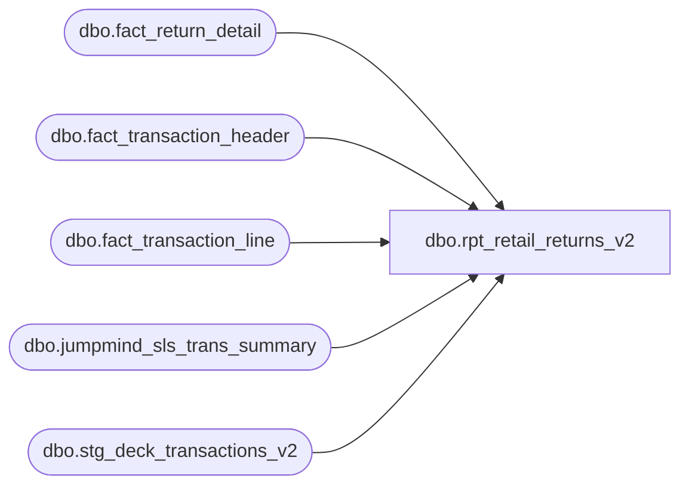

# dbo.rpt_retail_returns_v2

**Database:** LH_Source  
**Server:** 4db76rlxaxcuvmuh5kw37wbnqq-ovsykae43znuhlmnflcdwm4ohu.datawarehouse.fabric.microsoft.com  

## Architecture Diagram



## Table Dependencies

| Referenced Table |
|---|
| dbo.fact_return_detail |
| dbo.fact_transaction_header |
| dbo.fact_transaction_line |
| dbo.jumpmind_sls_trans_summary |
| dbo.stg_deck_transactions_v2 |

## View Code

```sql
/* =============================================================================    rpt_retail_returns_v2.sql — Retail Returns Report (OMS rebuild)    =============================================================================    Domain:        Sales    Status:        Parallel _v2 view forked from rpt_retail_returns.sql    Source:        docs/reference-data/smartlook-source-sql/Retail Returns Report.sql                   + manual reference query 5e8ca9a5-sqlretailreturnsrequirements.sql     Why v2:      The verbatim port (rpt_retail_returns) drives all rows through the      fact_transaction_header → fact_transaction_line → fact_return_detail      INNER-JOIN chain. OMS orders never produced fact_return_detail rows, so      OMS returns were invisible to the report. The 6 BOPIS cancel-pickup rows      in the legacy CSV exposed this gap.       Attempts to surface them by detecting OIV item status (commits 21298ba /      fffcdd5, reverted in 482131f / c7623ef) produced ~630 false-positive      rows. Diagnosis: OIV is a superset, not a discriminator.       This v2 uses the manual reference query's pattern instead — the OMS      branch ignores OIV/PickupNodeCode entirely and lets signed      payment_transactions amounts drive tender_total < 0. Refunds fall out      naturally; sales stay above the threshold.     Output shape: identical column contract to rpt_retail_returns.     Structure:      POS branch — fact_transaction_header + line + return_detail (unchanged                   from v1, filtered to JumpMind source).      OMS branch — stg_deck_transactions_v2 directly. No fact-layer joins;                   customer attribution from root.FirstName1/LastName1/Custom3                   carried through the v2 stage view.     Why no fact_return_detail join on the OMS branch:      fact_return_detail's contract is AuditWorks return-detail rows. Synthesizing      OMS rows there would conflate two semantic spaces. Keeping the OMS      branch fact-free preserves the production fact layer and isolates the      v2 path. [Return Reason Message] is NULL for OMS rows — same convention      as POS rows where the JumpMind return-reason column has not been      identified.    ============================================================================= */  CREATE   VIEW dbo.rpt_retail_returns_v2 AS /* ── POS branch — verbatim from rpt_retail_returns, scoped to JumpMind only. */ SELECT DISTINCT     a.store_no              AS [Store Number],     a.transaction_date      AS [Transaction Date],     a.transaction_no        AS [Transaction Number],     a.cashier_no            AS [Cashier Number],     a.tender_total          AS [Tender Total Amount (Native Currency)],     COALESCE(TRY_CAST(ts.loyalty_card_number AS bigint), 0)            AS [Customer Number],     CASE         WHEN CHARINDEX(' ', LTRIM(RTRIM(ts.customer_name))) > 0             THEN LEFT(LTRIM(RTRIM(ts.customer_name)),                       CHARINDEX(' ', LTRIM(RTRIM(ts.customer_name))) - 1)         ELSE NULL     END                                                                AS [Customer First Name],     CASE         WHEN CHARINDEX(' ', LTRIM(RTRIM(ts.customer_name))) > 0             THEN LTRIM(SUBSTRING(LTRIM(RTRIM(ts.customer_name)),                       CHARINDEX(' ', LTRIM(RTRIM(ts.customer_name))) + 1,                       LEN(ts.customer_name)))         ELSE NULLIF(LTRIM(RTRIM(ts.customer_name)), '')     END                                                                AS [Customer Last Name],     b.return_reason_message AS [Return Reason Message]   FROM dbo.fact_transaction_header AS a   JOIN dbo.fact_transaction_line   AS d ON d.transaction_id = a.transaction_id   JOIN dbo.fact_return_detail      AS b ON b.transaction_id = d.transaction_id                                        AND b.line_id        = d.line_id   LEFT JOIN LH_Source.dbo.jumpmind_sls_trans_summary AS ts         ON CAST(ts.device_id       AS varchar(64)) + '|' +            CAST(ts.business_date   AS varchar(8))  + '|' +            CAST(ts.sequence_number AS varchar(20)) = a.transaction_id  WHERE a.tender_total  < 0    AND a.source_system = 'JUMPMIND_POS'  UNION ALL  /* ── OMS branch — direct from stg_deck_transactions_v2; tender_total < 0    filter surfaces refund orders by sign of payment_transactions sum. */ SELECT DISTINCT     v.store_no                                            AS [Store Number],     CAST(v.business_date AS datetime2(6))                 AS [Transaction Date],     v.transaction_no                                      AS [Transaction Number],     v.cashier_no                                          AS [Cashier Number],     v.oms_order_total                                     AS [Tender Total Amount (Native Currency)],     COALESCE(TRY_CAST(v.customer_loyalty_card AS bigint), 0)                                                           AS [Customer Number],     v.customer_first_name                                 AS [Customer First Name],     v.customer_last_name                                  AS [Customer Last Name],     CAST(NULL AS varchar(1000))                           AS [Return Reason Message]   FROM dbo.stg_deck_transactions_v2 AS v  WHERE v.oms_order_total < 0;
```

