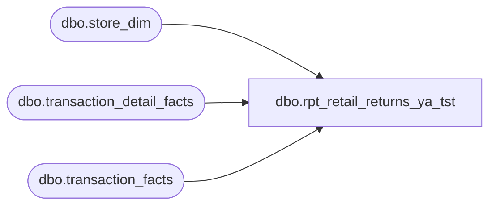

# dbo.rpt_retail_returns_ya_tst

**Database:** LH_Source  
**Server:** 4db76rlxaxcuvmuh5kw37wbnqq-ovsykae43znuhlmnflcdwm4ohu.datawarehouse.fabric.microsoft.com  

## Architecture Diagram



## Table Dependencies

| Referenced Table |
|---|
| dbo.store_dim |
| dbo.transaction_detail_facts |
| dbo.transaction_facts |

## View Code

```sql
CREATE   VIEW dbo.rpt_retail_returns_ya_tst AS WITH return_event_transactions AS (     SELECT DISTINCT d.transaction_id       FROM LH_Mart.dbo.transaction_detail_facts AS d      WHERE d.line_action_key IN (2, 12)        AND d.line_object_key <> 221 ) SELECT DISTINCT     CAST(CASE WHEN sd.store_id < 1000 THEN sd.store_id + 1000               ELSE sd.store_id END AS int)                              AS [Store Number],     CAST(DATEADD(day, m.date_key, '1997-01-04') AS date)                AS [Transaction Date],     CAST(m.transaction_no AS varchar(50))                               AS [Transaction Number],     CAST(d.cashier_id AS int)                                           AS [Cashier Number],     CAST(m.receipt_total_amount AS decimal(18,6))                       AS [Tender Total Amount (Native Currency)],     CAST(NULL AS varchar(64))                                           AS [Customer Number],     CAST(NULL AS varchar(64))                                           AS [Customer First Name],     CAST(NULL AS varchar(64))                                           AS [Customer Last Name],     CAST(NULL AS varchar(255))                                          AS [Return Reason Message]   FROM LH_Mart.dbo.transaction_facts             AS m   INNER JOIN return_event_transactions           AS r           ON r.transaction_id = m.transaction_id   INNER JOIN LH_Mart.dbo.store_dim               AS sd           ON sd.store_key = m.store_key   INNER JOIN LH_Mart.dbo.transaction_detail_facts AS d           ON d.transaction_id = m.transaction_id;
```

