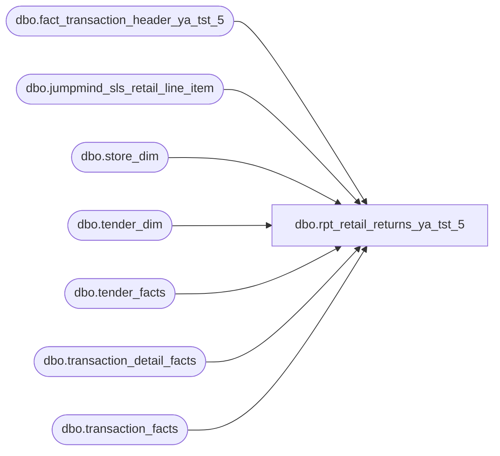

# dbo.rpt_retail_returns_ya_tst_5

**Database:** LH_Source  
**Server:** 4db76rlxaxcuvmuh5kw37wbnqq-ovsykae43znuhlmnflcdwm4ohu.datawarehouse.fabric.microsoft.com  

## Architecture Diagram



## Table Dependencies

| Referenced Table |
|---|
| dbo.fact_transaction_header_ya_tst_5 |
| dbo.jumpmind_sls_retail_line_item |
| dbo.store_dim |
| dbo.tender_dim |
| dbo.tender_facts |
| dbo.transaction_detail_facts |
| dbo.transaction_facts |

## View Code

```sql
CREATE   VIEW dbo.rpt_retail_returns_ya_tst_5 AS WITH return_event_transactions AS (     SELECT DISTINCT d.transaction_id       FROM LH_Mart.dbo.transaction_detail_facts AS d      WHERE d.line_action_key IN (2, 12)        AND d.line_object_key <> 221 ), /* Per-transaction cashier_id picked off transaction_detail_facts    (transaction_facts carries cashier_key, not cashier_id; the legacy    AW 4-digit cashier_no the report consumer expects only lives on    transaction_detail_facts.cashier_id and is constant within a    transaction). Aggregating with MAX collapses N detail rows per    transaction back to one row, so this CTE doesn't multiply the row    count of the main query the way the previous direct join did. */ txn_cashier AS (     SELECT d.transaction_id,            MAX(d.cashier_id) AS cashier_id       FROM LH_Mart.dbo.transaction_detail_facts AS d      GROUP BY d.transaction_id ), txn_gross_receipt AS (     SELECT tf.transaction_id,            SUM(CASE WHEN TRY_CONVERT(int, td.tender_code) = -1 THEN 0                     ELSE tf.tender_amt END) AS non_tax_tender_sum       FROM LH_Mart.dbo.tender_facts tf       JOIN LH_Mart.dbo.tender_dim   td ON td.tender_key = tf.tender_key      GROUP BY tf.transaction_id ), /* One row per canonical JumpMind transaction key carrying a non-NULL    `ReturnReasons` reason_code. ROW_NUMBER picks the reason on the first    returned line of the transaction (lowest line_sequence_number),    collapsing the 1.4% of transactions that carry mixed codes. */ return_reason_per_canon_txn AS (     SELECT         ranked.canon_id,         CAST(CASE ranked.reason_code                   WHEN '10' THEN 'Changed Mind'                   WHEN '20' THEN 'Quality Issue'                   WHEN '30' THEN 'Recall'                   WHEN '40' THEN 'Unwanted Gift'                   WHEN '45' THEN 'Wrong Item'                   WHEN '50' THEN 'Other'                   ELSE NULL              END AS varchar(255))                                       AS reason_text       FROM (           SELECT               CAST(li.device_id AS varchar(64)) + '|' +               CAST(li.business_date AS varchar(8)) + '|' +               CAST(li.sequence_number AS varchar(20))                   AS canon_id,               li.reason_code,               ROW_NUMBER() OVER (                   PARTITION BY li.device_id, li.business_date, li.sequence_number                   ORDER BY li.line_sequence_number ASC               )                                                         AS rn             FROM LH_Source.dbo.jumpmind_sls_retail_line_item AS li            WHERE li.reason_code_group_id = 'ReturnReasons'              AND li.reason_code IS NOT NULL              AND li.reason_code <> ''              AND COALESCE(li.voided, 0) = 0              AND li.item_returned = 1       ) AS ranked      WHERE ranked.rn = 1 ), /* Bridge from the published (store, business_date, transaction_no) tuple    to the canonical Fabric transaction_id text on    LH_Source.dbo.fact_transaction_header_ya_tst_5. The header's transaction_id    embeds `device_id|business_date|sequence_number`; the business_date    substring is parsed back out so the join key matches the published    columns of this view. The MAX collapse over reason_text is defensive    for the rare (store, date, txn) tuples that span multiple registers    (max observed: 6 distinct canon_ids per published key in Q1 2026). */ return_reason_per_published_key AS (     SELECT         h.store_no                                                      AS pub_store_no,         TRY_CONVERT(date,             SUBSTRING(h.transaction_id,                       CHARINDEX('|', h.transaction_id) + 1, 8), 112)    AS pub_biz_date,         CAST(h.transaction_no AS varchar(50))                           AS pub_transaction_no,         MAX(rr.reason_text)                                             AS reason_text       FROM dbo.fact_transaction_header_ya_tst_5          AS h       JOIN return_reason_per_canon_txn          AS rr         ON rr.canon_id = h.transaction_id      GROUP BY         h.store_no,         TRY_CONVERT(date,             SUBSTRING(h.transaction_id,                       CHARINDEX('|', h.transaction_id) + 1, 8), 112),         CAST(h.transaction_no AS varchar(50)) ) SELECT     CAST(CASE WHEN sd.store_id < 1000 THEN sd.store_id + 1000               ELSE sd.store_id END AS int)                              AS [Store Number],     CAST(DATEADD(day, m.date_key, '1997-01-04') AS date)                AS [Transaction Date],     CAST(m.transaction_no AS varchar(50))                               AS [Transaction Number],     CAST(c.cashier_id AS int)                                           AS [Cashier Number],     CAST(CASE             WHEN ISNULL(g.non_tax_tender_sum, 0) = 0                THEN m.receipt_total_amount - ISNULL(m.redemption_amount, 0)             ELSE g.non_tax_tender_sum - 2 * ISNULL(m.redemption_amount, 0)          END AS decimal(18,6))                                          AS [Tender Total Amount (Native Currency)],     CAST(NULL AS varchar(64))                                           AS [Customer Number],     CAST(NULL AS varchar(64))                                           AS [Customer First Name],     CAST(NULL AS varchar(64))                                           AS [Customer Last Name],     CAST(rr.reason_text AS varchar(255))                                AS [Return Reason Message]   FROM LH_Mart.dbo.transaction_facts             AS m   INNER JOIN return_event_transactions           AS r           ON r.transaction_id = m.transaction_id   INNER JOIN LH_Mart.dbo.store_dim               AS sd           ON sd.store_key = m.store_key   LEFT JOIN  txn_cashier                         AS c           ON c.transaction_id = m.transaction_id   LEFT JOIN  txn_gross_receipt                   AS g           ON g.transaction_id = m.transaction_id   LEFT JOIN  return_reason_per_published_key     AS rr           ON rr.pub_store_no        = CAST(CASE WHEN sd.store_id < 1000                                                 THEN sd.store_id + 1000                                                 ELSE sd.store_id END AS int)          AND rr.pub_biz_date        = CAST(DATEADD(day, m.date_key, '1997-01-04') AS date)          AND rr.pub_transaction_no  = CAST(m.transaction_no AS varchar(50));
```

