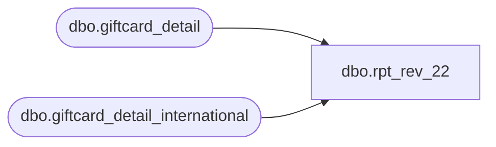

# dbo.rpt_rev_22

**Database:** LH_Source  
**Server:** 4db76rlxaxcuvmuh5kw37wbnqq-ovsykae43znuhlmnflcdwm4ohu.datawarehouse.fabric.microsoft.com  

## Architecture Diagram



## Table Dependencies

| Referenced Table |
|---|
| dbo.giftcard_detail |
| dbo.giftcard_detail_international |

## View Code

```sql
/* =============================================================================    rpt_rev_22.sql — Rev 22 Gift Card Liability / Search Report    =============================================================================    Domain:    Gift Card (Rev Rec / SOX subledger)    Audience:  Accounting / Sales Audit    Consumer:  SmartLook "Gift Card / Liability / Search"               workspace/BBW_SmartLook_SQL_Reports-main/.../#19 REV 22 - Gift Card               Testing - Q1 2026 Feb, Mar, April - KAI (20260515).xlsx     Linda's 12-column shape (from xlsx "Selections for Linda"):        Account #, Consortium, Consortium Name, Promotion, Promotion Name,        Activation Date, Activation Location, Activation MID,        Activation Amount, Redemption Amount, Balance, Last Positive Transaction Date     Source:    LH_Mart.dbo.giftcard_detail               (US/CA ValueLink master)               LH_Mart.dbo.giftcard_detail_international (UK/EU/Intl ValueLink)     ┌────────────────────────────────────────────────────────────────────────┐    │ LH_MART BLOCKER 2026-06-15 — CANNOT be migrated to LH_Source by SQL.      │    │ This report is built on the FDMS / ValueLink vendor gift-card subledger   │    │ (account_number, balance, consortium_code, request_code,                  │    │ FDMS_local_timestamp, reversal_flag, alternate_merchant_number). That     │    │ vendor feed is landed ONLY in LH_Mart — verified there is NO LH_Source    │    │ table carrying these columns (INFORMATION_SCHEMA.COLUMNS sweep across all  │    │ of LH_Source returns 0 matches; the LH_Source gift-card tables            │    │ rpt_gc_transaction_details, vw_integrated_activated_gift_cards and        │    │ mulesoft_deckjsonraw_giftcards are POS/OMS grains and carry none of the   │    │ ValueLink account/balance/consortium model).                              │    │ ACTION REQUIRED (BBW pipeline, upstream of SQL): ingest the FDMS/ValueLink │    │ giftcard_detail + giftcard_detail_international feeds into LH_Source, then │    │ re-point the gc_master CTE below. Until then this view stays on LH_Mart so │    │ the report keeps working; it is the ONE report that cannot be decommissioned│    │ from LH_Mart with the data available today.                               │    └────────────────────────────────────────────────────────────────────────┘     Date window: rolling prior 3 complete calendar months.    Window edges are anchored to the 1st of the current month so the view    always covers [first-of-month-3-months-ago, first-of-current-month).    Example: run on any day in May 2026 → window = Feb 1 – Apr 30 2026,    which matches Linda's Q1 2026 xlsx exactly.     Fix history:      D-01  Add date filter to activation_pick (was returning all-time ~12M+ rows)      D-07  Consortium 8615 renamed 'BAB Blackhawk Cross' → 'US Blackhawk'      D-13  Balance pick capped at period-end upper bound    ============================================================================= */  CREATE   VIEW dbo.rpt_rev_22 AS WITH /* ── date window anchors (computed once, reused across CTEs) ─────────────── */ window_bounds AS (     SELECT         DATEADD(MONTH, -3,             DATEFROMPARTS(YEAR(GETDATE()), MONTH(GETDATE()), 1))  AS window_start,         DATEFROMPARTS(YEAR(GETDATE()), MONTH(GETDATE()), 1)       AS window_end         -- window_start inclusive, window_end exclusive (= first day of current month) ),  gc_master AS (     -- ValueLink master combines US/CA + intl shards into one stream.     -- reversal_flag = '1' marks a leg that was reversed (e.g. a redemption     -- that failed/declined and was credited back by an offsetting rc=800     -- reversal); those legs must be dropped from the redemption sum so a     -- failed-then-reprocessed redemption is not counted twice (D-15).     SELECT account_number, balance, consortium_code, merchant_id,            alternate_merchant_number, promotion_code, request_code,            transaction_amount, FDMS_local_timestamp, terminal_local_timestamp,            processed_date, reversal_flag       FROM LH_Mart.dbo.giftcard_detail     UNION ALL     SELECT account_number, balance, consortium_code, merchant_id,            alternate_merchant_number, promotion_code, request_code,            transaction_amount, FDMS_local_timestamp, terminal_local_timestamp,            processed_date, reversal_flag       FROM LH_Mart.dbo.giftcard_detail_international ),  -- Activation row.  ValueLink uses different activation codes per region: --   US/CA:   request_code ending in '100' (100, 1100, 2100, 3100, 7100, ...) --   UK/Intl: request_codes '2102' (secondary activation) and '2104' (BDAY/HUGS) -- We exclude '6100' (response variant) per SmartLook canonical filter. -- D-01: date filter restricts to the rolling 3-month window so the result --       set matches Linda's quarterly xlsx instead of all-time activations. activation_pick AS (     SELECT g.account_number,            g.consortium_code,            g.promotion_code,            g.merchant_id,            g.alternate_merchant_number,            g.FDMS_local_timestamp                                               AS activation_dt,            CAST(g.transaction_amount AS decimal(18,2))                          AS activation_amount,            ROW_NUMBER() OVER (PARTITION BY g.account_number                               ORDER BY g.FDMS_local_timestamp,                                        g.terminal_local_timestamp)              AS rn       FROM gc_master          g       CROSS JOIN window_bounds wb      WHERE (g.request_code LIKE '%100' OR g.request_code IN ('2102','2104'))        AND g.request_code <> '6100'        AND g.FDMS_local_timestamp >= wb.window_start   -- D-01: period start (inclusive)        AND g.FDMS_local_timestamp <  wb.window_end     -- D-01: period end   (exclusive) ),  -- Lifetime redemption total.  Region variants: --   US/CA:   request_code ending '200' (200, 1200, 2200, 6200, 7200, ...) --   UK/Intl: request_codes '202' / '2202' / similar (ending '02'). -- transaction_amount is negative for redemption; Linda's xlsx preserves -- the sign (e.g. card 6323161003736370 shows -8.00, not 8.00), so the -- view emits the SIGNED sum directly without ABS(). redemption_total AS (     -- D-15: exclude reversal_flag='1' legs. A redemption that failed the first     -- time and was reprocessed leaves the failed leg in the feed AND an     -- offsetting rc=800 reversal credit. The reversal credit is already outside     -- the %200/%202 redemption codes, so the only fix needed is to drop the     -- reversed (flag='1') redemption leg; otherwise the card shows -20 redeemed     -- against a -10 card (the value counted twice).     SELECT account_number,            SUM(CAST(transaction_amount AS decimal(18,2))) AS redemption_amount       FROM gc_master      WHERE (request_code LIKE '%200' OR request_code LIKE '%202')        AND ISNULL(reversal_flag, '0') <> '1'      GROUP BY account_number ),  -- Latest known balance per card within the report window. -- D-13: capped at window_end so balance reflects the period-end snapshot --       rather than any post-report activity. balance_pick AS (     SELECT g.account_number,            CAST(g.balance AS decimal(18,2)) AS balance,            ROW_NUMBER() OVER (PARTITION BY g.account_number                               ORDER BY g.FDMS_local_timestamp DESC,                                        g.terminal_local_timestamp DESC)         AS rn       FROM gc_master          g       CROSS JOIN window_bounds wb      WHERE g.FDMS_local_timestamp < wb.window_end    -- D-13: period-end snapshot ),  -- Last POSITIVE-amount transaction date per card (Linda column). -- ValueLink positive-amount = activation, reload, or other crediting events. last_pos_txn AS (     SELECT account_number,            MAX(FDMS_local_timestamp) AS last_pos_dt       FROM gc_master      WHERE CAST(transaction_amount AS decimal(18,2)) > 0      GROUP BY account_number ),  -- ValueLink promotion master decode.  The vendor (FDMS / ValueLink) does -- not mirror its promotion dimension into Fabric, so we seed the known -- (code → name) pairs from Linda's authoritative xlsx as a VALUES CTE. -- Extend this list when new gift-card promotion codes are added; cells -- with no entry fall back to NULL (preserving honest gap signal). promotion_decode AS (     SELECT * FROM (VALUES         (7163597, 'BUILD-A-BEAR $15-250'),         (7205606, 'UK BDAY HUGS GC23'),         (7986052, 'US BAB GC 24 HERO'),         (7986152, 'US BAB GC 24 PROMO 10'),         (7986187, 'CA BAB GC 24 HERO'),         (7986252, 'UK BAB GC 24 PROMO 10')     ) AS pd (promotion_code, promotion_name) ),  -- Consortium name decode mirrors the SmartLook canonical CASE. -- D-07: code 8615 corrected from 'BAB Blackhawk Cross' to 'US Blackhawk' --       to match SmartLook and Linda's xlsx authoritative value. consortium_decode AS (     SELECT consortium_code,            CASE consortium_code                WHEN 192  THEN 'Build a Bear Intl'                WHEN 5901 THEN 'BAB Walgreens'                WHEN 8409 THEN 'Build a Bear UK'                WHEN 8410 THEN 'Build a Bear Denmark'                WHEN 8411 THEN 'Sweden'                WHEN 8478 THEN 'Build A Bear Incomm'                WHEN 8615 THEN 'US Blackhawk'              -- D-07: was 'BAB Blackhawk Cross'                WHEN 8760 THEN 'Build A Bear Blackhawk Canada'                WHEN 8826 THEN 'UK Blackhawk'                WHEN 9151 THEN 'Mexico Blackhawk'                WHEN 9342 THEN 'Build a Bear Ireland'                WHEN 9707 THEN 'US Promo'                ELSE 'Unknown Consortium'            END AS consortium_name       FROM (SELECT DISTINCT consortium_code FROM gc_master) c )  SELECT     a.account_number                                                  AS [Account #],     CAST(a.consortium_code AS varchar(16))                            AS [Consortium],     cd.consortium_name                                                AS [Consortium Name],     CAST(a.promotion_code AS varchar(32))                             AS [Promotion],     CAST(pd.promotion_name AS varchar(128))                           AS [Promotion Name],     a.activation_dt                                                   AS [Activation Date],     /* D-16: web-activated gift cards carry the online-processor merchant_id and        alternate_merchant_number = 0 (no physical store), so the raw column        showed 0/blank. Map the online MID blocks to the canonical web store:        US online (99909...) -> 1013, UK/EU online (99086...) -> 2013. Physical        stores (970.../972... MIDs) keep their real alternate_merchant_number. */     CAST(CASE             WHEN a.merchant_id LIKE '99909%' THEN '1013'             WHEN a.merchant_id LIKE '99086%' THEN '2013'             ELSE CAST(a.alternate_merchant_number AS varchar(32))          END AS varchar(32))                                          AS [Activation Location],     CAST(a.merchant_id AS varchar(32))                                AS [Activation MID],     a.activation_amount                                               AS [Activation Amount],     ISNULL(r.redemption_amount, 0)                                    AS [Redemption Amount],     b.balance                                                         AS [Balance],     lp.last_pos_dt                                                    AS [Last Positive Transaction Date]   FROM activation_pick a   LEFT JOIN consortium_decode cd ON cd.consortium_code = a.consortium_code   LEFT JOIN promotion_decode  pd ON pd.promotion_code  = a.promotion_code   LEFT JOIN redemption_total r   ON r.account_number   = a.account_number   LEFT JOIN balance_pick     b   ON b.account_number   = a.account_number AND b.rn = 1   LEFT JOIN last_pos_txn     lp  ON lp.account_number  = a.account_number  WHERE a.rn = 1;
```

