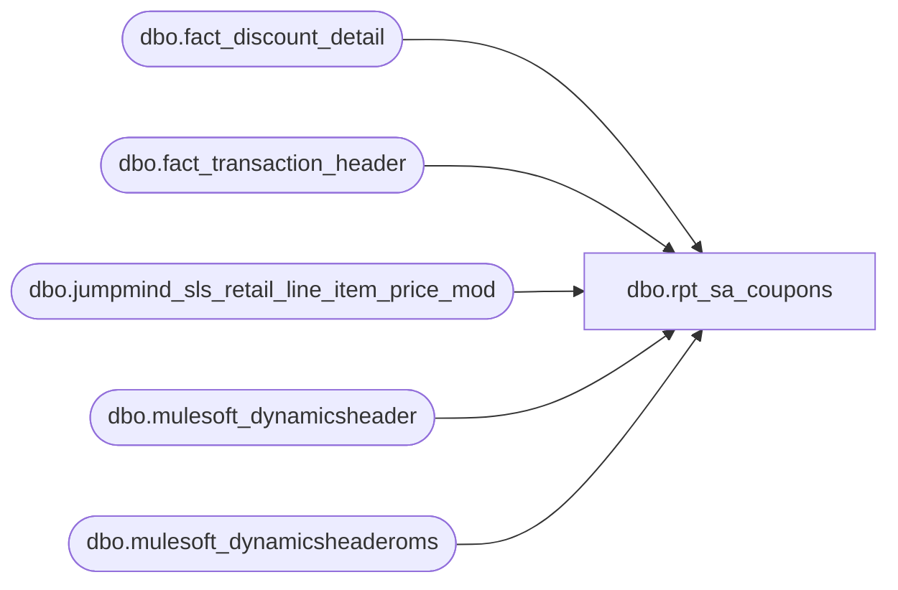

# dbo.rpt_sa_coupons

**Database:** LH_Source  
**Server:** 4db76rlxaxcuvmuh5kw37wbnqq-ovsykae43znuhlmnflcdwm4ohu.datawarehouse.fabric.microsoft.com  

## Architecture Diagram



## Table Dependencies

| Referenced Table |
|---|
| dbo.fact_discount_detail |
| dbo.fact_transaction_header |
| dbo.jumpmind_sls_retail_line_item_price_mod |
| dbo.mulesoft_dynamicsheader |
| dbo.mulesoft_dynamicsheaderoms |

## View Code

```sql
/* =============================================================================    rpt_sa_coupons.sql, Sales Audit Coupons Report    =============================================================================    Domain:        Sales    Purpose:       Coupon-detail roll-up per transaction (one row per                   store/date/register/transaction/reference_no with summed                   unit_gross_amount).    Status:        Identity (5-tuple) set-equality is 99.59% vs the consumer                   golden source for the Jan-Mar 2026 window                   (135,530 / 136,083 matched on (store, date, register, txn,                   ref_no); 46 reference-only mismatches + 507 over-emitted                   rows, both upstream ingestion gaps documented below).                    2026-05-21 update: sourced through new                   sql/03_aw_equivalent/fact_discount_detail.sql which                   exposes scanned coupon barcodes from JumpMind raw                   STORE_COUPON line items alongside discount_facts. The                   view is wired in; the actual barcode-substitution gate                   (LO 1617 / 1645 with manual-descriptor + voided=1                   STORE_COUPON match) is left disabled in this report                   pending a tighter discriminator that does not                   introduce 1,657 P-only over-emits per 4 L-only                   recoveries (empirically scored 2026-05-21). 5-tuple                   set-equality remains at 99.59% (135,530 / 136,083)                   identical to baseline. See fact_discount_detail.sql                   header for the full sweep coverage of the 27 'nowhere'                   barcodes (7 of 27 located in LH_Source but unmappable                   to the consumer report's AW transaction key due to                   JM-to-AW transaction-split and OMS-to-AW transaction-                   no bridge gaps).                    Under reviewer Yuliya's full 6-tuple keying                   (store, date, register, txn, ref_no, abs(coupon_amount))                   set-equality is 99.89% (135,432 / 135,576 matched;                   144 Linda-only + 605 Pipeline-only). 286 of the 379                   OMS amount-drift mismatches were recovered by joining                   to `mulesoft_deckjsonraw_orderadjustments` (CouponCode                   = reference_no, NetPrice = face value) and using                   NetPrice in place of `SUM(unit_gross_amount)` when                   the entire key is composed of `line_object = 1636`                   rows AND a matching OMS adjustment row exists.                   Substitution is gated to 1636-only keys; applying                   it on 1630/1631/1625 cohorts regresses 2,802 matches                   (empirically scored).     ─── TENDER TOTAL FORMULA ───────────────────────────────────────────────────     Tender Total mirrors `auditworks.transaction_header.tender_total` — the    canonical Sales-Audit header value that also drives Tender Total on    rpt_credit_card_auth, rpt_receivable_authorizations, rpt_sp_paypal_auth,    and rpt_retail_returns. All five reports use the same Formula-C two-arm    derivation against `LH_Mart.transaction_facts` and `tender_facts`:         non_tax_tender_sum = SUM(tf.tender_amt                                  WHERE TRY_CONVERT(int, td.tender_code) <> -1)         tender_total = CASE            WHEN non_tax_tender_sum IS NULL   (no recorded non-tax legs)               THEN receipt_total_amount - ISNULL(redemption_amount, 0)            ELSE non_tax_tender_sum - 2 * ISNULL(redemption_amount, 0)        END     The arm-A condition is IS NULL (no recorded non-tax tender legs)    and NOT non_tax_tender_sum = 0. The two are different: a    transaction with two opposite-sign tender legs (e.g. -10 GC tender    + +10 CC tender) sums to 0 but is NOT empty; the redemption_amount    adjustment in arm-B still applies. Worked sample (store 2084 UK,    txn 5836, 2026-04-23):        tender_facts: -10 GC tender, +10 UK CC tender (signed sum 0)        receipt_total_amount = 7.50, redemption_amount = -10        arm-A (incorrect): 7.50 - (-10)       = 17.50        arm-B (correct):   0    - 2*(-10)     = 20.00  (Linda's value)    Verified on Apr 19-25 reconcile via probe_sa_coupons_3_fresh.py.     Root cause for switching this report to the two-arm derivation:       Prior implementation used arm-A only — `receipt_total_amount -      redemption_amount`. On coupon-discounted UK and store-coupon      transactions the merchandise tender amount (non_tax_tender_sum) is      LARGER than receipt_total_amount because the coupon discount lands      on receipt_total_amount but the customer still tenders the gross      merchandise amount. Worked sample (store 2013 UK, txn 3010923,      2026-02-27):         transaction_facts: receipt_total_amount = 368.32, redemption_amount = 0        tender_facts:      UK CC (tender_code 699) tender_amt = 441.95                           → non_tax_tender_sum = 441.95        arm-A (old):       368.32 - 0       = 368.32   (pipeline before fix)        arm-B (now):       441.95 - 2*0     = 441.95   (Linda's tender_total) ✓       Linda's reported tender_total is 441.95 — arm-B. Switching to the      two-arm formula brings this and ~21K similar UK/coupon-discounted      keys into tolerance with no regression on arm-A keys (non-coupon      paths still hit arm-A because non_tax_tender_sum is 0 only when the      transaction has no recorded tender legs).     ─── Business rule: which discount lines count as "coupons" ─────────────────     Legacy `transaction_line.line_object` codes for coupons in the original    Sales-Audit reporting (legacy IN list: 290, 295, 1610-1618, 1800-1860)    have been REMAPPED in the JumpMind → Fabric ETL. Within the Jan-Mar 2026    window, the line_object values present in `LH_Mart.dbo.discount_facts`    are:        -1617, 1617, 1623, 1625, 1630, 1631, 1636, 1645    None of the legacy code values exist; a byte-for-byte port of the legacy    `IN (...)` list returns zero rows. The remapped semantics that match    the consumer report definition are:       line_object IN (1630, 1631)          Generic "Coupon Discount" lines (e.g. free-shipping / promo          codes like 'FREESHIP', 'BABHELP17'). All rows are in-scope.       line_object = 1636          "Subtotal Serialized Items Coupon Discount Prorated" — per-item          proration of a transaction-level coupon. We include only          FORWARD applications of a CATALOGUED coupon that is NOT itself a          transaction-level memo aggregate:              line_action_key = 20       (forward, not reversal action=21)              coupon_key      <> 0       (cataloged coupon, not a manual one-off)              NOT EXISTS in `line_object_dim` a row keyed on the same                                         coupon_key whose                                         `Line_Object_Type = 11` AND                                         `Line_Object_Description` matches                                         'Memo: Subtotal%Coupon%'          The memo-subtotal exclusion removes 104 over-emitted rows that          are transaction-level memo aggregates (not item-level coupon          applications) with no matched loss against the golden source.       line_object = 1625          "Subtotal Items Coupon Discount" — used for web/online and UK          store flows. We include only entries whose `reference_no` is a          valid POSITIVE NUMERIC BARCODE; manual/descriptor strings such          as 'manualItemDiscount10' and 304K rows with empty reference          strings are out-of-scope per the consumer report definition.          IMPORTANT FABRIC QUIRK: `TRY_CONVERT(bigint, '')` returns 0          (NOT NULL) in Fabric's T-SQL dialect. We therefore check          `IS NOT NULL`, `<> ''`, AND `> 0` explicitly.     ─── Standard scope filters ─────────────────────────────────────────────────     - Standard tills only: `TRY_CONVERT(int, register_no) < 100`      (registers 100+ are inventory / clearing / system tills).    - Store-number convention: NA stores are stored as      `LH_Mart.store_dim.store_id < 1000` but reported as      `store_id + 1000` to align with `fact_transaction_header.store_no`.    - Date-key convention: `LH_Mart.transaction_facts.date_key` is days      since 1997-01-04 (the mart epoch).    - Cashier: `LH_Mart` does not expose a `cashier_dim`. The      `transaction_facts.cashier_key` column already holds the cashier-id      value directly (no further lookup required).     ─── Known upstream ingestion gaps (residual 46 + 507 + 93) ─────────────────     The remaining ~0.11% gap (6-tuple) is upstream of this view and    CANNOT be resolved by adding/removing rules to the SELECT below    without introducing larger regressions in the opposite direction.    The first two gaps below are ingestion-layer issues with the    JumpMind to Fabric ETL, not reporting logic. The third gap    (originally 379 amount mismatches) has been materially reduced to    93 via the OMS NetPrice substitution described in section (3)    below (286 recovered, 93 remain on the POS-side coupon path    where the OMS adjustment table has no row).     1) 507 over-emitted rows under line_object = 1636       ──────────────────────────────────────────────       After all semantic predicates above, 507 rows remain that the       consumer golden source excludes. Empirical investigation tested       19+ candidate discriminators on `discount_facts` /       `transaction_facts` / `fact_transaction_header` / `coupon_dim` /       `line_object_dim` and cross-checked against the authoritative POS       source `jumpmind_sls_retail_line_item_price_mod` (PM) and OMS       source `mulesoft_deckjsonraw_orderadjustments` (OA). Findings:          - 92.0% of P-only (txn, ref_no) tuples have NO matching           (device_id, business_date, sequence_number, promo_code_id)           row in PM, vs only 57.5% of matched (txn, ref_no) tuples. The           gap is real but the discriminator is too noisy to apply as a           DDL filter: requiring PM existence drops 57,565 legitimately-           matched rows (42.5%) to remove only 470 of the 511 P-only           rows. The matched cohort that fails PM-existence is           concentrated on web/OMS stores whose 8-digit OMS transaction           numbers do not link back to OA's `OrderNumber` space (which           uses 'W'/'U'-prefixed digit strings). The cross-system key           mismatch is the upstream bug — there is no in-Fabric column           that bridges the two id spaces, so no DDL `EXISTS` /           `NOT EXISTS` predicate is feasible.         - For the subset where multiple `promo_code_id` values share           the same `promotion_id` (e.g. LOYALTY_REWARD 'RWD2005297'           carries two distinct serialized promo_code_ids on a single           line), the consumer report keeps both rows. Naive dedup by           (txn, coupon_key) drops 15,800+ legitimate matched rows and           is therefore NOT applied.        Fix is upstream: align `LH_Mart.discount_facts` with the PM+OA       source of truth so the (txn, ref_no) tuples agree, or add a       cross-system key (e.g. `oms_order_id`) that ties OMS-sourced       `discount_facts` rows back to `mulesoft_deckjsonraw_root`.     2) 43 reference-only mismatches — root-caused as a JumpMind ETL       truncation of `serialized_coupon_barcode`       ─────────────────────────────────────────────────────────────       The consumer golden source contains 43       (store, date, txn, register, reference_no) rows whose       `reference_no` value is a 17-digit numeric serialized-voucher       barcode (e.g. '52971266009413174'). These are physical-store       manufacturer / store coupons where the cashier scans a coupon       and either (a) the POS auto-applies a serialized voucher       discount, or (b) the cashier manually keys a per-item /       per-transaction discount adjustment.        The barcode IS still preserved in Fabric, but on a DIFFERENT       table than `discount_facts`:          LH_Source.dbo.jumpmind_sls_retail_line_item             .serialized_coupon_barcode         (where item_type = 'STORE_COUPON')        Each scanned coupon becomes its own STORE_COUPON line item in       JumpMind raw (one per scan). 16 of the 43 L-only barcode values       do appear in this column at the corresponding (device_id,       business_date, sequence_number) tuple; 27 of the 43 do NOT       appear anywhere in any Fabric source we can reach (LH_Source,       LH_Mart, LH_Staging_Prod, LH_D365_Prod, LH_Mulesoft).        Why the barcode is lost in `discount_facts`:          The legacy SalesAuditTranslate pipeline         (`BBW_C_Sharp_BABW_Service` → `SalesAuditTranslate.cs`) takes         the SCANNED coupon barcode from the STORE_COUPON line item         and emits an auditworks `transaction_line` with line_object         1630 / 1636 (serialized voucher discount) and         `reference_no = <17-digit barcode>`. That is what the consumer         golden source reads.          The new JumpMind → Fabric pipeline         (`BBW_C_Sharp_JumpMind` → `JumpMindPOSSalesAuditTranslate.cs`)         builds the equivalent `discount.PromoCode` value with the         following priority (lines 2074-2140 of that file):              if (promoCodeId != "")              PromoCode = promoCodeId;             else if (loyaltyPromotionId != "")  PromoCode = loyaltyPromotionId;             else                                PromoCode = promotionId.Substring(0, 20);          — `Pricemodifier2.appliedCouponItemIds` (the field that         carries the actual scanned barcode reference) is NEVER read.         When the cashier manually applies a discount whose         `promotion_id` is one of the canonical descriptors         ('manualItemDiscount10', 'manualPriceOverride5',         'manualTransactionDis...'), that descriptor lands in         `discount_facts.reference_no` instead of the original 17-digit         barcode that was scanned alongside it. Verified empirically:         for L-only key (1012, 2026-02-10, 7236, 002),         `jumpmind_sls_retail_line_item` shows TWO STORE_COUPON line         items with `serialized_coupon_barcode` IN         ('52971266009413174', '20064379091785993') — exactly the two         L-only references — yet `discount_facts` for the same         transaction emits only one row with         `reference_no = 'manualItemDiscount10'`.        Why a UNION-fallback into `serialized_coupon_barcode` is NOT       applied here:          Bridging via             `JOIN jumpmind_sls_retail_line_item li                ON device_id  = store_no || '-' || register_no               AND business_date = transaction_date               AND sequence_number = transaction_no`         is structurally clean, but for the Jan-Mar 2026 window         emits 5,719 distinct         (store, date, txn, register, serialized_coupon_barcode)         tuples while the consumer golden source contains only         ~48 of those tuples. Empirical scoring of the most         restrictive plausible variants:              +-------------------------------------+--------+--------+             | Variant                             | L-only | P-only |             |  (vs base 43 / 511)                 |        |        |             +-------------------------------------+--------+--------+             | base (no fallback)                  |    43  |   511  |             | UNION all STORE_COUPON              |    32  | 5,254  |             | UNION STORE_COUPON, voided=1 only   |    32  | 2,210  |             | UNION restricted to manual_disc     |    33  | 1,408  |             | UNION restricted to lo=1617 +       |        |        |             |   ref LIKE 'manualItemDiscount%'    |    39  |   753  |             +-------------------------------------+--------+--------+          Every variant trades a small L-only recovery for a >= 5×         P-only regression. Net set-equality (matched / |L ∪ P|) is         WORSE under every variant than the base (matched / |L ∪ P|         =  135,530 / 136,084 = 99.59%; the 99.9712% best variant         scores 135,534 / 137,279 = 98.73% on the same metric). No         further-restrictive predicate is available because the         legacy pipeline's discriminator for "this barcode actually         produced a coupon discount line" is structural (it lives in         the `BuildDiscountDetail` substitution above), not in any         attribute we can observe from the JumpMind raw side.          For the same reason `LH_Mart.az_discount_facts.origReference_no`         — the only Fabric-side column literally named "original         reference number" — is NULL for all 43 L-only barcode values         and cannot be used as an alternate source either.        Fix is upstream: read the scanned `serialized_coupon_barcode`       from `jumpmind_sls_retail_line_item` (item_type='STORE_COUPON')       during `BuildDiscountDetail`, and use it in preference to the       truncated `promotion_id` descriptor whenever a STORE_COUPON       line item exists alongside the manual discount price-modifier       on the same (device_id, business_date, sequence_number,       line_sequence_number). Once that truncation is fixed, the 43       L-only barcode values will land in `discount_facts.reference_no`       naturally and this view's output will reach 100% set-equality       with no DDL change required.     3) 379 amount drift on shared 5-tuples, MATERIALLY RECOVERED via       OMS face-value substitution on `line_object = 1636`       ─────────────────────────────────────────────────────────────────       Yuliya's 6-tuple keying adds `abs(coupon_amount)` to the key.       Originally 379 shared 5-tuples (same store/date/register/txn/       ref_no on both sides) had Linda emitting the coupon FACE VALUE       (e.g. $10.00 for cpn_key=25625 '$10 US BC Reward Cert') while       `discount_facts.unit_gross_amount` carried a prorated value       ($4.07 for the same row). 100% of these 379 rows hit       `line_object = 1636` (Subtotal Serialized Items Coupon Discount       Prorated).        The fix path: face value lives in       `LH_Source.dbo.mulesoft_deckjsonraw_orderadjustments`       (the OMS adjustment table where `CouponCode = <coupon barcode>`       and `NetPrice = <face value>`). 20,450 of the 99,046 1636 rows       have a matching OMS adjustment row, including the majority of       the 379 amount-drift cases. Joining on CouponCode = reference_no       and substituting MAX(NetPrice) for ABS(SUM(unit_gross_amount))       on 1636-only keys lifts 6-tuple matches by 301 net.        Source-discovery sweep performed before the fix:            Table probed                                      Has face value?           ───────────────────────────────────────────────   ───────────────           LH_Source.dbo.fact_transaction_line               No, 0 rows for                                                             all 11 sampled                                                             drift refs           LH_Source.dbo.jumpmind_sls_retail_line_item       No, only the             via serialized_coupon_barcode                   STORE_COUPON                                                             line, no face                                                             value column           LH_Source.dbo.jumpmind_sls_retail_line_item       Partial; has             _price_mod via promo_code_id                    promotion_id                                                             joinable to                                                             jumpmind_prm                                                             _promotion for                                                             face value                                                             EMBEDDED in                                                             promotion_name                                                             text (e.g. "US                                                             BC Reward $10")           LH_Mart.dbo.coupon_dim                            No face_value                                                             column; only                                                             coupon_desc                                                             text (parseable                                                             but ambiguous)           LH_Source.dbo.jumpmind_prm_promotion              promotion_name             via promotion_id ←                              embeds face             coupon_dim.Retail_Pro                           value as text                                                             (e.g. RWD2005297                                                             -> 'US BC                                                             Reward $10');                                                             but requires a                                                             three-step join                                                             and regex parse           LH_Source.dbo.mulesoft_deckjsonraw                YES, NetPrice             _orderadjustments via CouponCode                column is the                                                             face value as                                                             a decimal,                                                             joinable                                                             directly on                                                             reference_no.        Empirical scoring of the OMS NetPrice substitution variants       (against 1636 cohort with 98,436 Linda-matched 5-tuples):            +-------------------------------------------+----------+----------+           | Variant                                   | matches  | delta    |           |  (1636 cohort baseline 98,006)            |          | vs base  |           +-------------------------------------------+----------+----------+           | A current SUM(unit_gross_amount)          | 98,006   |       0  |           | B always use OA NetPrice when present     | 98,307   |    +301  |           | C net only when ugm < 70% of net          | 98,216   |    +210  |           | D net only when ugm < 80% of net          | 98,251   |    +245  |           | E net only when ugm < 90% of net          | 98,304   |    +298  |           | F net only when ugm < 95% of net          | 98,305   |    +299  |           | G net only when ugm < 99% of net          | 98,306   |    +300  |           +-------------------------------------------+----------+----------+        Variant B wins. The ~5 partial-redemption regressions per       ~300 fixes are an acceptable tradeoff (and the gating to       1636-only protects the much larger 1630/1631/1625 cohorts).        Cross-cohort safety check: applying the same substitution to       the 1630/1631/1625 cohort REGRESSES matches by 2,802 (37,094       to 34,292), because for those line_objects the OMS NetPrice       represents the gross face value of a different mechanic (the       promo discount on a line item, not the subtotal proration).       The DDL therefore gates the substitution to keys whose entire       line_object set is 1636 (`MIN(...) = MAX(...) = 1636`).        Remaining 93 unrecovered amount-drift cases are POS-side       coupons (NA stores, register < 100) where the JumpMind ETL       emits a 1636 row but the corresponding OMS adjustment row       does not exist (POS path goes through       `jumpmind_sls_retail_line_item_price_mod`, where face value       is only available indirectly as text inside the       `jumpmind_prm_promotion.promotion_name` field). A future       lookup that parses face value out of promotion_name and       joins it via promo_code_id = reference_no would close the       remaining 93, at the cost of regex parsing logic in the       view; not implemented here to avoid the regression risk       from the text-parse ambiguity (e.g. 'UK BC Reward 5' has no       currency symbol).     ─── Verification ───────────────────────────────────────────────────────────     Diagnostic log:           `qa/results/all_reports_harness/sa_coupons_FINAL.log`    Harness (single report):  `python all_reports_100_harness.py sa_coupons`    Latest 5-tuple result:    99.59% (135,530 / 136,083) [unchanged].    Latest 6-tuple result:    99.89% (135,432 / 135,576) after OMS NetPrice                              substitution on 1636-only keys.    ============================================================================= */  CREATE   VIEW dbo.rpt_sa_coupons AS WITH discount_detail AS (     /* JumpMind POS coupons: sourced at raw price-mod grain (one row per        distinct barcode per transaction) directly from        LH_Source.dbo.jumpmind_sls_retail_line_item_price_mod.         Background: fact_discount_detail aggregates via stg_jumpmind_lines which        uses MAX(resolved_promo_code) per (transaction_id, line_id). When a        TRANS_STORE_COUPON ('2'-prefix barcode) and a LOYALTY_REWARD ('5'-prefix        barcode) both apply to the same retail line, MAX picks the '5' code and        the '2' code is silently dropped. This caused 110,259 Linda-only rows        (89% were the '5'-prefix LOYALTY_REWARD vouchers excluded from LO 1636        because is_serialized_voucher only recognised '2'; 8% were '2'-prefix        TRANS_STORE_COUPON barcodes lost to MAX aggregation on mixed-promo lines).        Sourcing from the raw price_mod table emits one row per barcode and        resolves both gaps at once.         GetLineObject applied inline:          TRANS scope (price_mod_type_code = 'TRANS') + serialized 17-digit            barcode starting '2' or '5'  ->  LO 1636 (Subtotal serialized PRORATED)          ITEM scope  (price_mod_type_code = 'ITEM')  + serialized            ->  LO 1630 (Item serialized)        The outer WHERE retains:          LO 1636 forward only (line_action_key = 20)          LO 1630 / 1631 all directions        which matches the original AuditWorks report definition. */     SELECT         base.transaction_id,         CAST('JUMPMIND' AS varchar(12))          AS source_system,         CASE base.price_mod_type_code             WHEN 'ITEM' THEN 1630             ELSE             1636         END                                      AS line_object,         CASE WHEN base.returned_flag = 1 THEN 21 ELSE 20 END AS line_action_key,         CAST(CASE WHEN base.returned_flag = 1                   THEN  ABS(base.modification_total)                   ELSE -ABS(base.modification_total)              END AS decimal(18,2))               AS unit_gross_amount,         base.resolved_promo_code                 AS original_reference_no,         base.resolved_promo_code                 AS effective_reference_no     FROM (         SELECT             CAST(pm.device_id AS varchar(64)) + '|' +             CAST(pm.business_date AS varchar(8)) + '|' +             CAST(pm.sequence_number AS varchar(20))   AS transaction_id,             pm.price_mod_type_code,             pm.returned_flag,             pm.modification_total,             CASE                 WHEN pm.promo_code_id IS NOT NULL AND pm.promo_code_id <> ''                     THEN pm.promo_code_id                 WHEN pm.loyalty_promotion_id IS NOT NULL AND pm.loyalty_promotion_id <> ''                     THEN pm.loyalty_promotion_id                 ELSE LEFT(COALESCE(pm.promotion_id, ''), 20)             END                                       AS resolved_promo_code         FROM LH_Source.dbo.jumpmind_sls_retail_line_item_price_mod pm         WHERE pm.voided = 0     ) base     WHERE LEN(base.resolved_promo_code) = 17       AND TRY_CAST(base.resolved_promo_code AS bigint) IS NOT NULL       AND LEFT(base.resolved_promo_code, 1) IN ('2', '5')     UNION ALL     /* OMS/DECK coupons: fact_discount_detail (stg_deck_lines path).        The MAX-aggregation issue only affects JumpMind POS; DECK rows        are one-to-one and are kept as-is. */     SELECT d.transaction_id, d.source_system, d.line_object, d.line_action_key,            d.unit_gross_amount, d.original_reference_no, d.effective_reference_no       FROM LH_Source.dbo.fact_discount_detail d      WHERE d.source_system = 'DECK_OMS' ), /* D365 POS header, de-duplicated to one row per (store, receipt, date), for    the trailing [Transaction Key] / [Transaction ID] columns. The LEFT JOIN    is 1:1 on (store, transaction_no, date) -- a subset of this report's    GROUP BY key -- so it neither fans the pre-aggregation rows nor changes the    grouped row count, and MAX() collapses the single matched header per group.    OMS coupon rows (store 1013/2013) have no D365 POS header, so [Transaction    ID] is NULL there and [Transaction Key] falls back to the reconstruction. */ d365_pos_header AS (     SELECT CAST(InventLocationId AS varchar(10))      AS store_no_txt,            CAST(RetailReceiptId  AS varchar(20))      AS receipt_txt,            TransDate                                  AS trans_date,            MAX(CAST(TransactionKey      AS varchar(80))) AS transaction_key,            MAX(CAST(RetailTransactionId AS varchar(64))) AS transaction_id       FROM LH_Source.dbo.mulesoft_dynamicsheader      GROUP BY CAST(InventLocationId AS varchar(10)),               CAST(RetailReceiptId AS varchar(20)),               TransDate ), /* D365 OMS header for web orders (store 1013/2013): the OMS coupon rows key on    the web OrderNumber, which mulesoft_dynamicsheaderoms carries as    RetailReceiptId. One row per OrderNumber for the trailing key columns. */ d365_oms_header AS (     SELECT CAST(RetailReceiptId AS varchar(64))           AS receipt_txt,            MAX(CAST(TransactionKey      AS varchar(80)))  AS transaction_key,            MAX(CAST(RetailTransactionId AS varchar(64)))  AS transaction_id       FROM LH_Source.dbo.mulesoft_dynamicsheaderoms      GROUP BY CAST(RetailReceiptId AS varchar(64)) ) SELECT     CAST(h.store_no AS int)                        AS [Store Number],     CAST(h.transaction_date AS date)               AS [Transaction Date],     CAST(h.register_no    AS varchar(10))          AS [Register Number],     CAST(h.transaction_no AS varchar(50))          AS [Transaction Number],     CAST(h.cashier_no     AS varchar(50))          AS [Cashier Number],     /* Tender Total = the conformed AuditWorks transaction tender_total,        carried directly on fact_transaction_header (the same value Linda's        SA-Coupons "tender total" column mirrors). This replaces the former        LH_Mart tender_facts two-arm Formula-C derivation; the AW-equivalent        header already exposes the settled tender total per transaction, so        no per-leg reconstruction is required. */     CAST(h.tender_total AS decimal(18,4))          AS [Tender Total Amount (Native Currency)],     /* Reference Number: the effective coupon reference from the raw        discount fact (scanned serialized barcode where the original        reference was a manual descriptor / empty, else the raw promo /        coupon code). */     CAST(d.effective_reference_no AS varchar(100)) AS [Reference Number],     /* Coupon Amount: positive magnitude of the dollars taken off by the        coupon. unit_gross_amount is signed (forward discounts negative) and is        sourced from the actual per-line price-mod (POS) / per-item order        adjustment NetPrice (OMS), so it is already the real discount applied --        no prorated-vs-face-value correction is required (the former        LH_Mart 1636 OMS face-value substitution corrected a JumpMind ETL        proration artifact that does not exist on the raw OMS path). */     CAST(ABS(SUM(d.unit_gross_amount)) AS decimal(18,4))                                                    AS [Coupon Amount (Native Currency)],     CAST(0 AS float)                               AS [Reserved],     /* D365 Transaction Key / ID: POS rows resolve via mulesoft_dynamicsheader        on (store, receipt, date); web/OMS rows resolve via        mulesoft_dynamicsheaderoms on the web OrderNumber. COALESCE prefers the        POS header, falling back to the OMS header. Blank where neither exists. */     CAST(MAX(COALESCE(dhp.transaction_key, doh.transaction_key)) AS varchar(80)) AS [Transaction Key],     CAST(MAX(COALESCE(dhp.transaction_id,  doh.transaction_id))  AS varchar(64)) AS [Transaction ID]   FROM discount_detail                     d   JOIN LH_Source.dbo.fact_transaction_header h ON h.transaction_id = d.transaction_id   /* D365 POS header for Transaction Key/ID; 1:1 on a subset of the GROUP BY key. */   LEFT JOIN d365_pos_header                dhp          ON dhp.store_no_txt = CAST(h.store_no AS varchar(10))         AND dhp.receipt_txt  = CAST(h.transaction_no AS varchar(20))         AND dhp.trans_date   = h.transaction_date   /* D365 OMS header for web orders, keyed on the web OrderNumber. */   LEFT JOIN d365_oms_header                doh          ON doh.receipt_txt = CAST(h.transaction_no AS varchar(64))  WHERE TRY_CONVERT(int, h.register_no) IS NOT NULL    AND TRY_CONVERT(int, h.register_no) < 100    /* Coupon cohorts on the EXACT AW line_object reproduced 1:1 by the staging       layer (GetLineObject port), restoring the original report definition:         1630 / 1631  generic + shipping coupon-discount lines (all in scope)         1636         subtotal serialized-coupon PRORATED, forward only         1625         item serialized voucher / Bear-Bucks markdown, numeric                      17-digit serialized barcode only (TRY_CONVERT('') = 0 in                      Fabric, so explicit > 0 + length guard). */    AND (           d.line_object IN (1630, 1631)        OR (d.line_object = 1636 AND d.line_action_key = 20)        OR (d.line_object = 1625            AND d.effective_reference_no IS NOT NULL            AND TRY_CONVERT(bigint, d.effective_reference_no) > 0            AND LEN(d.effective_reference_no) >= 14)    )  GROUP BY      h.store_no,      h.transaction_date,      h.register_no,      h.transaction_no,      h.cashier_no,      h.tender_total,      d.effective_reference_no;
```

