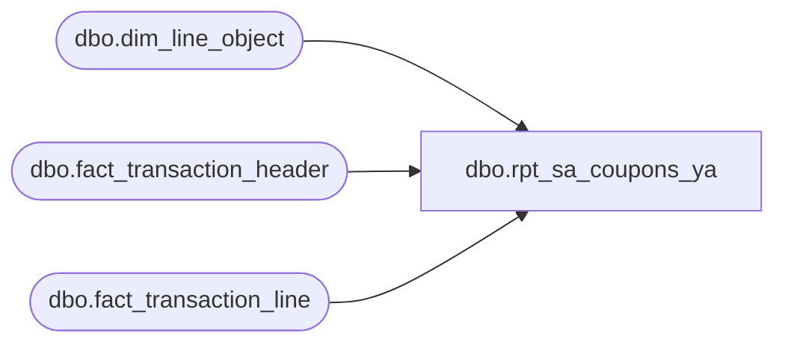

# dbo.rpt_sa_coupons_ya

**Database:** LH_Source  
**Server:** 4db76rlxaxcuvmuh5kw37wbnqq-ovsykae43znuhlmnflcdwm4ohu.datawarehouse.fabric.microsoft.com  

## Architecture Diagram



## Table Dependencies

| Referenced Table |
|---|
| dbo.dim_line_object |
| dbo.fact_transaction_header |
| dbo.fact_transaction_line |

## View Code

```sql
CREATE   VIEW dbo.rpt_sa_coupons_ya AS WITH coupon_base_grid AS (     SELECT DISTINCT         a.store_no,         a.transaction_date,         a.register_no,         a.transaction_no,         a.cashier_no,         a.tender_total,         b.reference_no     FROM dbo.fact_transaction_header a     JOIN dbo.fact_transaction_line   b       ON a.transaction_id = b.transaction_id     WHERE a.transaction_category IN (1, 2)       AND a.transaction_void_flag = 0       AND b.line_void_flag = 0       AND b.line_object IN (               290, 295,               1610, 1611, 1615, 1618,               1630, 1631, 1801, 1830,               1800, 1802, 1803, 1806, 1809,               1842, 1843, 1846, 1849, 1860           ) ), coupon_amount AS (     SELECT         a.store_no,         a.transaction_date,         a.register_no,         a.transaction_no,         a.cashier_no,         a.tender_total,         b.reference_no,         SUM(b.gross_line_amount) AS [Coupon Amount (Native Currency)]     FROM dbo.fact_transaction_header  a     JOIN dbo.fact_transaction_line    b       ON a.transaction_id = b.transaction_id     /* iter 2 (2026-05-16): legacy SmartLook joined on        b.line_object_type = c.line_object_type because AuditWorks        transaction_line carried a denormalised line_object_type        column. Fabric fact_transaction_line does NOT carry that        column — line_object_type lives only on dim_line_object.        Switch the join to b.line_object = c.line_object so we look up        the type from the dim. Filter on c.line_object_type unchanged.        Schema adaptation, not a SmartLook logic change. */     JOIN dbo.dim_line_object          c       ON b.line_object = c.line_object_code     WHERE a.transaction_category IN (1, 2)       AND a.transaction_void_flag = 0       AND b.line_void_flag = 0       AND b.line_object IN (               290, 295,               1610, 1611, 1615, 1618,               1630, 1631, 1801, 1830,               1800, 1802, 1803, 1806, 1809,               1842, 1843, 1846, 1849, 1860           )       AND c.line_object_type IN (11, 16, 17, 18)     GROUP BY         a.store_no,         a.transaction_date,         a.register_no,         a.transaction_no,         a.cashier_no,         a.tender_total,         b.reference_no ) SELECT DISTINCT     g.store_no         AS [Store Number],     g.transaction_date AS [Transaction Date],     g.register_no      AS [Register Number],     g.transaction_no   AS [Transaction Number],     g.cashier_no       AS [Cashier Number],     g.tender_total     AS [Tender Total Amount (Native Currency)],     g.reference_no     AS [Reference Number],     a.[Coupon Amount (Native Currency)] AS [Coupon Amount (Native Currency)],     CAST(0 AS float)   AS [Reserved] FROM coupon_base_grid g LEFT JOIN coupon_amount a        ON g.store_no         = a.store_no       AND g.transaction_date = a.transaction_date       AND g.register_no      = a.register_no       AND g.transaction_no   = a.transaction_no       AND g.cashier_no       = a.cashier_no       AND g.tender_total     = a.tender_total       AND g.reference_no     = a.reference_no;
```

