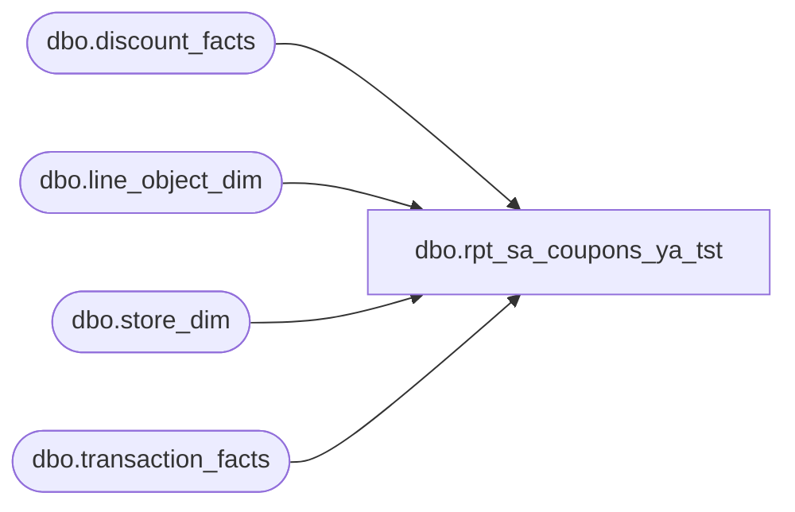

# dbo.rpt_sa_coupons_ya_tst

**Database:** LH_Source  
**Server:** 4db76rlxaxcuvmuh5kw37wbnqq-ovsykae43znuhlmnflcdwm4ohu.datawarehouse.fabric.microsoft.com  

## Architecture Diagram



## Table Dependencies

| Referenced Table |
|---|
| dbo.discount_facts |
| dbo.line_object_dim |
| dbo.store_dim |
| dbo.transaction_facts |

## View Code

```sql
CREATE   VIEW dbo.rpt_sa_coupons_ya_tst AS SELECT     CAST(         CASE WHEN s.store_id < 1000 THEN s.store_id + 1000 ELSE s.store_id END         AS int     )                                              AS [Store Number],     CAST(DATEADD(day, tf.date_key, '1997-01-04') AS date)                                                    AS [Transaction Date],     CAST(tf.register_no    AS varchar(10))         AS [Register Number],     CAST(tf.transaction_no AS varchar(50))         AS [Transaction Number],     CAST(tf.cashier_key    AS varchar(50))         AS [Cashier Number],     CAST(tf.receipt_total_amount AS decimal(18,4))                                                    AS [Tender Total Amount (Native Currency)],     CAST(d.reference_no    AS varchar(100))        AS [Reference Number],     CAST(SUM(d.unit_gross_amount) AS decimal(18,4))                                                    AS [Coupon Amount (Native Currency)],     CAST(0 AS float)                               AS [Reserved]   FROM LH_Mart.dbo.discount_facts    d   JOIN LH_Mart.dbo.line_object_dim   lo ON lo.Line_Object_Key = d.line_object_key   JOIN LH_Mart.dbo.transaction_facts tf ON tf.transaction_id  = d.transaction_id   JOIN LH_Mart.dbo.store_dim         s  ON s.store_key        = tf.store_key  WHERE TRY_CONVERT(int, tf.register_no) IS NOT NULL    AND TRY_CONVERT(int, tf.register_no) < 100    AND (        /* Generic coupon-discount line objects. */        TRY_CONVERT(int, lo.Line_Object) IN (1630, 1631)         /* Per-item prorated transaction-coupon: forward applications of a           cataloged coupon, EXCLUDING those whose coupon_key resolves to a           transaction-level Memo Subtotal aggregate. The memo aggregates           are stored back in `line_object_dim` as their own           `Line_Object_Type = 11` 'Memo: Subtotal*Coupon*' descriptor           rows; they represent the rolled-up totals already accounted           for by the per-item lines and would otherwise double-count. */        OR (TRY_CONVERT(int, lo.Line_Object) = 1636            AND d.line_action_key = 20            AND d.coupon_key      <> 0            AND NOT EXISTS (                SELECT 1                  FROM LH_Mart.dbo.line_object_dim memo                 WHERE TRY_CONVERT(int, memo.Line_Object) = d.coupon_key                   AND memo.Line_Object_Type = 11                   AND memo.Line_Object_Description LIKE 'Memo: Subtotal%Coupon%'            ))         /* Web/UK item-coupon line: numeric-barcode reference only.           `TRY_CONVERT(bigint, '')` returns 0 in Fabric T-SQL — explicit           empty / null / non-positive checks required. */        OR (TRY_CONVERT(int, lo.Line_Object) = 1625            AND d.reference_no IS NOT NULL            AND d.reference_no <> ''            AND TRY_CONVERT(bigint, d.reference_no) IS NOT NULL            AND TRY_CONVERT(bigint, d.reference_no) > 0)    )  GROUP BY      s.store_id,      tf.date_key,      tf.register_no,      tf.transaction_no,      tf.cashier_key,      tf.receipt_total_amount,      d.reference_no;
```

