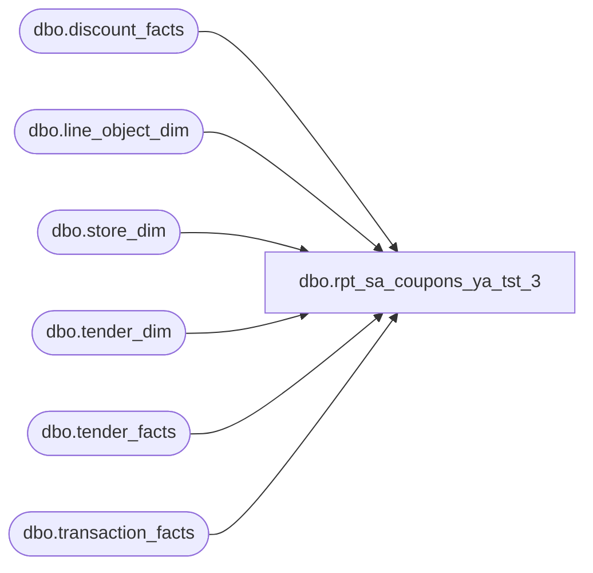

# dbo.rpt_sa_coupons_ya_tst_3

**Database:** LH_Source  
**Server:** 4db76rlxaxcuvmuh5kw37wbnqq-ovsykae43znuhlmnflcdwm4ohu.datawarehouse.fabric.microsoft.com  

## Architecture Diagram



## Table Dependencies

| Referenced Table |
|---|
| dbo.discount_facts |
| dbo.line_object_dim |
| dbo.store_dim |
| dbo.tender_dim |
| dbo.tender_facts |
| dbo.transaction_facts |

## View Code

```sql
CREATE   VIEW dbo.rpt_sa_coupons_ya_tst_3 AS WITH txn_gross_receipt AS (     /* Per-transaction non-tax tender-facts sum used in the two-arm        Formula-C tender_total derivation. Identical shape to the        txn_gross_receipt CTE in rpt_receivable_authorizations,        rpt_sp_paypal_auth, rpt_retail_returns, and rpt_credit_card_auth        so that Linda's `tender total` value (which mirrors        auditworks.transaction_header.tender_total) lines up across all        Sales-Audit reports that surface it. See TENDER-TOTAL DERIVATION        block in the header for the two-arm formula. */     SELECT tf.transaction_id,            SUM(CASE WHEN TRY_CONVERT(int, td.tender_code) = -1 THEN 0                     ELSE tf.tender_amt END) AS non_tax_tender_sum       FROM LH_Mart.dbo.tender_facts tf       JOIN LH_Mart.dbo.tender_dim   td ON td.tender_key = tf.tender_key      GROUP BY tf.transaction_id ) SELECT     CAST(         CASE WHEN s.store_id < 1000 THEN s.store_id + 1000 ELSE s.store_id END         AS int     )                                              AS [Store Number],     CAST(DATEADD(day, tf.date_key, '1997-01-04') AS date)                                                    AS [Transaction Date],     CAST(tf.register_no    AS varchar(10))         AS [Register Number],     CAST(tf.transaction_no AS varchar(50))         AS [Transaction Number],     CAST(tf.cashier_key    AS varchar(50))         AS [Cashier Number],     /* Tender Total — Formula-C two-arm derivation (see header). */     CAST(CASE             WHEN ISNULL(g.non_tax_tender_sum, 0) = 0                THEN tf.receipt_total_amount - ISNULL(tf.redemption_amount, 0)             ELSE g.non_tax_tender_sum - 2 * ISNULL(tf.redemption_amount, 0)          END AS decimal(18,4))                                                    AS [Tender Total Amount (Native Currency)],     CAST(d.reference_no    AS varchar(100))        AS [Reference Number],     /* Coupon Amount sign convention. discount_facts.unit_gross_amount        is signed: NEGATIVE for the standard POS path (the line's effect        on the receipt total) and POSITIVE for the OMS path (store 1013).        Linda's xlsx ("gross line amount") and consumer reports always        store the magnitude as positive — the dollars taken off by the        coupon. We use the absolute value of the sum to normalize across        both sign conventions and match Linda's positive-magnitude column.        Verified empirically: across 135,573 rows in Linda's xlsx all        values are positive (0 negative, 0 NULL); store 13/1013 OMS rows        arrive with unit_gross_amount > 0 in discount_facts while all        other stores arrive with unit_gross_amount < 0. */     CAST(ABS(SUM(d.unit_gross_amount)) AS decimal(18,4))                                                    AS [Coupon Amount (Native Currency)],     CAST(0 AS float)                               AS [Reserved]   FROM LH_Mart.dbo.discount_facts    d   JOIN LH_Mart.dbo.line_object_dim   lo ON lo.Line_Object_Key = d.line_object_key   JOIN LH_Mart.dbo.transaction_facts tf ON tf.transaction_id  = d.transaction_id   JOIN LH_Mart.dbo.store_dim         s  ON s.store_key        = tf.store_key   LEFT JOIN txn_gross_receipt        g  ON g.transaction_id   = tf.transaction_id  WHERE TRY_CONVERT(int, tf.register_no) IS NOT NULL    AND TRY_CONVERT(int, tf.register_no) < 100    AND (        /* Generic coupon-discount line objects. */        TRY_CONVERT(int, lo.Line_Object) IN (1630, 1631)         /* Per-item prorated transaction-coupon: forward applications of a           cataloged coupon, EXCLUDING those whose coupon_key resolves to a           transaction-level Memo Subtotal aggregate. The memo aggregates           are stored back in `line_object_dim` as their own           `Line_Object_Type = 11` 'Memo: Subtotal*Coupon*' descriptor           rows; they represent the rolled-up totals already accounted           for by the per-item lines and would otherwise double-count. */        OR (TRY_CONVERT(int, lo.Line_Object) = 1636            AND d.line_action_key = 20            AND d.coupon_key      <> 0            AND NOT EXISTS (                SELECT 1                  FROM LH_Mart.dbo.line_object_dim memo                 WHERE TRY_CONVERT(int, memo.Line_Object) = d.coupon_key                   AND memo.Line_Object_Type = 11                   AND memo.Line_Object_Description LIKE 'Memo: Subtotal%Coupon%'            ))         /* Web/UK item-coupon line: long numeric serialized-voucher barcode           only (>= 14 digits). The legacy SA-Coupons report's line_object           IN list does NOT include 1625; the new pipeline includes 1625 to           recover web/UK serialized voucher discounts (matched 1625 cohort           ref_no length is 100% 17 digits across the Jan-Mar 2026 window).           Excluding short numeric refs (e.g. 7-digit '2006417'/'2006424')           drops Bear Bucks-style item-reward lines that Linda's source           routes through a different line_object family (1842-1860,           transaction-level) and therefore reports under a DIFFERENT           reference_no (or omits entirely). Without this length guard, the           pipeline over-emits 4 keys against the consumer golden source           with no matched recovery on the other side.            `TRY_CONVERT(bigint, '')` returns 0 in Fabric T-SQL; explicit           empty / null / non-positive / length checks required. */        OR (TRY_CONVERT(int, lo.Line_Object) = 1625            AND d.reference_no IS NOT NULL            AND d.reference_no <> ''            AND TRY_CONVERT(bigint, d.reference_no) IS NOT NULL            AND TRY_CONVERT(bigint, d.reference_no) > 0            AND LEN(d.reference_no) >= 14)    )  GROUP BY      s.store_id,      tf.date_key,      tf.register_no,      tf.transaction_no,      tf.cashier_key,      tf.receipt_total_amount,      tf.redemption_amount,      g.non_tax_tender_sum,      d.reference_no;
```

