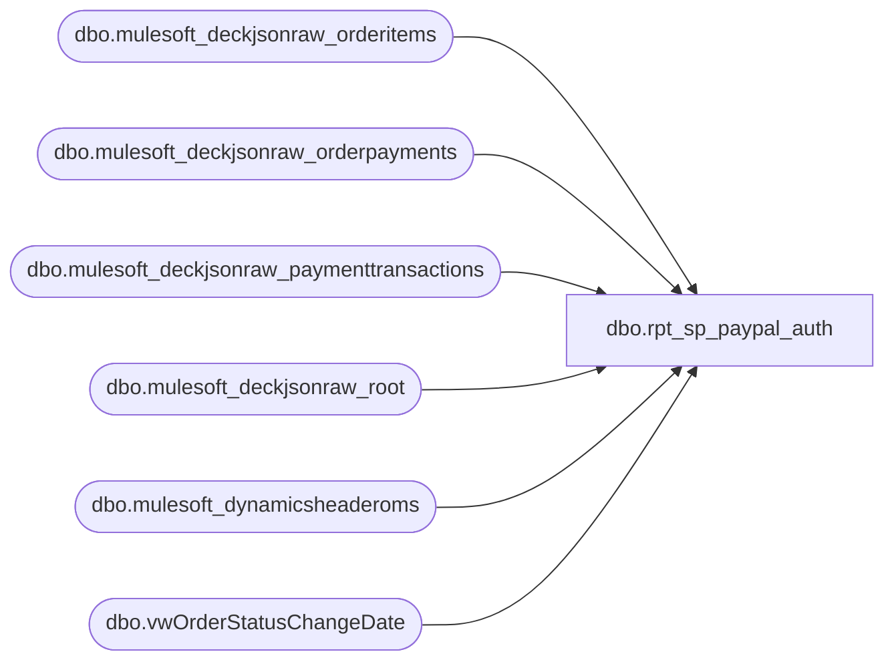

# dbo.rpt_sp_paypal_auth

**Database:** LH_Source  
**Server:** 4db76rlxaxcuvmuh5kw37wbnqq-ovsykae43znuhlmnflcdwm4ohu.datawarehouse.fabric.microsoft.com  

## Architecture Diagram



## Table Dependencies

| Referenced Table |
|---|
| dbo.mulesoft_deckjsonraw_orderitems |
| dbo.mulesoft_deckjsonraw_orderpayments |
| dbo.mulesoft_deckjsonraw_paymenttransactions |
| dbo.mulesoft_deckjsonraw_root |
| dbo.mulesoft_dynamicsheaderoms |
| dbo.vwOrderStatusChangeDate |

## View Code

```sql
/* =============================================================================    rpt_sp_paypal_auth.sql: SP PayPal Authorization Report    =============================================================================    Domain:        Reconciliation    Status:        Rebuilt from DECK source 2026-06-17 per requirements doc.    Source:        docs/reference-data/smartlook-source-sql/SP PayPal Auth.sql                   qa/validation_sources/requirements/Requirements-SP PayPal.xlsx     All PayPal flows through Adyen OMS (PaymentSubType = 'Adyen_PayPal').    Payment lifecycle events in mulesoft_deckjsonraw_paymenttransactions:      13 = Early Capture (the PayPal auth/capture event this report uses)      14 = Capture from Early (later confirmation of the early capture)      11 = Pending Refund  (AuditWorks books this as a separate auth event)       3 = Refund          (AuditWorks books this as a separate auth event)     Early-capture dedup:      When isEarlyCapture=1: use TypeId=13 (Early Capture) for date and        Auth Amount. Exclude TypeId=14 (Capture From Early) so the order is        not double-counted and Transaction Date matches the Early Capture        timestamp in DECK.      For non-early-capture orders (isEarlyCapture=0 or NULL): both TypeId=13        and TypeId=14 are included as they appear.     For the same Generic1, types 11 and 3 can both exist (pending then confirmed).    We suppress type 11 when type 3 exists for the same reference via NOT EXISTS.    If no type 3 has posted yet we still emit the type 11 (pending refund).     Tender Total for refunds (types 3/11): auth_amount (the actual signed refund    amount from DECK). EarlyCaptureAmount / order Total are the positive    original-order figures and are wrong for partial refunds.     Tender Total for sales (types 13/14): DECK root.Total (full order tender,    PayPal + gift cards + other payments). Sales Audit books that figure on the    PayPal reference row; PayPal-only EarlyCaptureAmount understates split-tender    orders (e.g. PayPal 8.23 + GiftCard 50.00 -> Tender 58.23).     Auth Amount = pt.Amount on the PayPal payment event (PayPal leg only),    negative for refunds.     Why stg_canonical_payments is NOT used:    stg_canonical_payments filters types 3/10/11 only.  PayPal via Adyen uses    type 14 for settled sales (type 10 never appears).  Orders with both a sale    (type 14) and a refund (type 3/11): Part A emits the refund, Part B is    suppressed, sale leg is dropped.  Querying DECK directly avoids this.     Date = DECK TransactionDateUTC converted to Central Standard Time.    No 2-hour business-day rollover. The date is the DECK payment capture    calendar day in CST, which is what DECK shows and what QA validates    against. D365 TransDate / Transaction Key date can differ on midnight    boundary orders; those keys remain informational only.    See handoff/sp_paypal_auth_gaps.txt for gap detail.     Store = MIN(WarehouseCode) from orderitems, '0' prefix → '1' prefix.    Reference = pt.Generic1 (16-char Adyen reference).    Line Object = 674 (Adyen PayPal).     Read-only and idempotent.    ============================================================================= */  CREATE   VIEW dbo.rpt_sp_paypal_auth AS WITH paypal_settled AS (     SELECT         r.OrderNumber,         r.OrderID,         CAST(r.Total AS decimal(18,6))                              AS order_total,         pt.PaymentTransactionTypeId,         CAST(pt.Generic1 AS varchar(100))                           AS reference_no,         CAST(             CASE WHEN pt.PaymentTransactionTypeId IN (3, 11)                  THEN -ABS(CAST(pt.Amount AS decimal(18,6)))                  ELSE  ABS(CAST(pt.Amount AS decimal(18,6)))             END AS decimal(18,6))                                   AS auth_amount,         CAST(             pt.TransactionDateUTC AT TIME ZONE 'UTC'             AT TIME ZONE 'Central Standard Time'         AS date)                                                    AS transaction_date       FROM LH_Source.dbo.mulesoft_deckjsonraw_orderpayments     op       JOIN LH_Source.dbo.mulesoft_deckjsonraw_root              r            ON r.OrderID = op._ParentKeyField       JOIN LH_Source.dbo.mulesoft_deckjsonraw_paymenttransactions pt            ON pt.OrderPaymentId = op.ID       LEFT JOIN LH_Source.dbo.vwOrderStatusChangeDate            v2            ON v2.OrderNumber = r.OrderNumber      WHERE op.PaymentSubType           = 'Adyen_PayPal'        AND pt.PaymentTransactionTypeId IN (3, 11, 13, 14)        AND (pt.IsDecline = 0 OR pt.IsDecline IS NULL)        AND pt.Generic1                 IS NOT NULL        AND pt.Generic1                 <> ''        AND pt.Amount                   IS NOT NULL        -- Early-capture dedup: PayPal Early Capture (type 13) is the event this        -- report uses. When isEarlyCapture=1, drop Capture From Early (type 14)        -- so date and Auth Amount come from the Early Capture row in DECK.        AND NOT (pt.PaymentTransactionTypeId = 14                 AND v2.isEarlyCapture = 1)        -- Drop pending refund (type 11) when the confirmed refund (type 3)        -- has already arrived for the same reference in this order payment.        AND NOT (                pt.PaymentTransactionTypeId = 11                AND EXISTS (                    SELECT 1                      FROM LH_Source.dbo.mulesoft_deckjsonraw_paymenttransactions pt2                     WHERE pt2.OrderPaymentId          = op.ID                       AND CAST(pt2.Generic1 AS varchar(100)) = CAST(pt.Generic1 AS varchar(100))                       AND pt2.PaymentTransactionTypeId = 3                )            ) ), warehouse_store AS (     SELECT         oi._ParentKeyField                                          AS OrderID,         MIN(             CASE WHEN oi.WarehouseCode LIKE '0%'                  THEN STUFF(oi.WarehouseCode, 1, 1, '1')                  ELSE oi.WarehouseCode             END         )                                                           AS store_code       FROM LH_Source.dbo.mulesoft_deckjsonraw_orderitems oi      WHERE oi.WarehouseCode IS NOT NULL AND oi.WarehouseCode <> ''      GROUP BY oi._ParentKeyField ), d365_header AS (     SELECT         CAST(RetailReceiptId AS varchar(64))                        AS receipt_txt,         MAX(CAST(Barcode             AS varchar(64)))               AS barcode,         MAX(CAST(TransactionKey      AS varchar(80)))               AS transaction_key,         MAX(CAST(RetailTransactionId AS varchar(64)))               AS transaction_id,         MAX(CAST(RetailTerminalId    AS varchar(10)))               AS register_id       FROM LH_Source.dbo.mulesoft_dynamicsheaderoms      WHERE RetailReceiptId IS NOT NULL AND RetailReceiptId <> ''      GROUP BY CAST(RetailReceiptId AS varchar(64)) ) SELECT     TRY_CONVERT(int, ws.store_code)                                 AS [Store Number],     CAST(ps.transaction_date AS date)                               AS [Transaction Date],     CAST(dh.barcode AS varchar(64))                                 AS [Transaction Number],     CAST(dh.register_id AS varchar(10))                             AS [Register Number],     -- Sales: Deck order Total (includes gift cards). Refunds: signed PayPal amount.     CASE WHEN ps.PaymentTransactionTypeId IN (3, 11)          THEN ps.auth_amount          ELSE ps.order_total     END                                                             AS [Tender Total Amount (Native Currency)],     ps.reference_no                                                 AS [Reference Number],     ps.auth_amount                                                  AS [Auth Amount (Native Currency)],     CAST(674 AS int)                                                AS [Line Object Code],     CAST(dh.transaction_key AS varchar(80))                         AS [Transaction Key],     CAST(dh.transaction_id  AS varchar(64))                         AS [Transaction ID]    FROM paypal_settled                 ps   LEFT JOIN warehouse_store           ws ON ws.OrderID     = ps.OrderID   LEFT JOIN d365_header               dh ON dh.receipt_txt = ps.OrderNumber;
```

