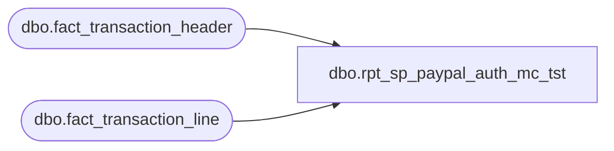

# dbo.rpt_sp_paypal_auth_mc_tst

**Database:** LH_Source  
**Server:** 4db76rlxaxcuvmuh5kw37wbnqq-ovsykae43znuhlmnflcdwm4ohu.datawarehouse.fabric.microsoft.com  

## Architecture Diagram



## Table Dependencies

| Referenced Table |
|---|
| dbo.fact_transaction_header |
| dbo.fact_transaction_line |

## View Code

```sql
CREATE   VIEW dbo.rpt_sp_paypal_auth_mc_tst AS SELECT     a.store_no          AS [Store Number],     a.transaction_date  AS [Transaction Date],     a.transaction_no    AS [Transaction Number],     a.register_no       AS [Register Number],     a.tender_total      AS [Tender Total Amount (Native Currency)],     b.reference_no      AS [Reference Number],     SUM(b.gross_line_amount * b.db_cr_none * b.voiding_reversal_flag) AS [Auth Amount (Native Currency)],     b.line_object       AS [Line Object Code]   FROM dbo.fact_transaction_header AS a,        dbo.fact_transaction_line   AS b  WHERE a.transaction_id = b.transaction_id    AND ( a.transaction_void_flag = 0    AND   2=2    AND   2=2    AND   2=2    AND   a.transaction_category IN (1,2)    AND   b.line_object IN (632,674) )  GROUP BY a.store_no, a.transaction_date, a.transaction_no, a.register_no,           a.tender_total, b.reference_no, b.line_object;
```

