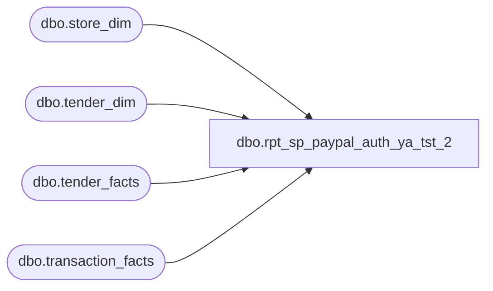

# dbo.rpt_sp_paypal_auth_ya_tst_2

**Database:** LH_Source  
**Server:** 4db76rlxaxcuvmuh5kw37wbnqq-ovsykae43znuhlmnflcdwm4ohu.datawarehouse.fabric.microsoft.com  

## Architecture Diagram



## Table Dependencies

| Referenced Table |
|---|
| dbo.store_dim |
| dbo.tender_dim |
| dbo.tender_facts |
| dbo.transaction_facts |

## View Code

```sql
CREATE   VIEW dbo.rpt_sp_paypal_auth_ya_tst_2 AS WITH txn_gross_receipt AS (     SELECT tf.transaction_id,            SUM(CASE WHEN TRY_CONVERT(int, td.tender_code) = -1 THEN 0                     ELSE tf.tender_amt END) AS non_tax_tender_sum       FROM LH_Mart.dbo.tender_facts tf       JOIN LH_Mart.dbo.tender_dim   td ON td.tender_key = tf.tender_key      GROUP BY tf.transaction_id ) SELECT     CASE WHEN s.store_id < 1000 THEN s.store_id + 1000 ELSE s.store_id END         AS [Store Number],     CAST(DATEADD(day, m.date_key, '1997-01-04') AS date)  AS [Transaction Date],     CAST(m.transaction_no AS varchar(50))                 AS [Transaction Number],     CAST(m.register_no    AS varchar(10))                 AS [Register Number],     CAST(CASE             WHEN ISNULL(g.non_tax_tender_sum, 0) = 0                THEN m.receipt_total_amount - ISNULL(m.redemption_amount, 0)             ELSE g.non_tax_tender_sum - 2 * ISNULL(m.redemption_amount, 0)          END AS decimal(18,6))                            AS [Tender Total Amount (Native Currency)],     CAST(NULL AS varchar(80))                             AS [Reference Number],     tf.tender_amt                                         AS [Auth Amount (Native Currency)],     TRY_CONVERT(int, td.tender_code)                      AS [Line Object Code]   FROM LH_Mart.dbo.transaction_facts m   JOIN LH_Mart.dbo.store_dim    s  ON s.store_key  = m.store_key   JOIN LH_Mart.dbo.tender_facts tf ON tf.transaction_id = m.transaction_id   JOIN LH_Mart.dbo.tender_dim   td ON td.tender_key = tf.tender_key   LEFT JOIN txn_gross_receipt   g  ON g.transaction_id = m.transaction_id  WHERE TRY_CONVERT(int, td.tender_code) IN (632, 674)    AND TRY_CONVERT(int, m.register_no) IS NOT NULL    AND TRY_CONVERT(int, m.register_no) < 100;
```

