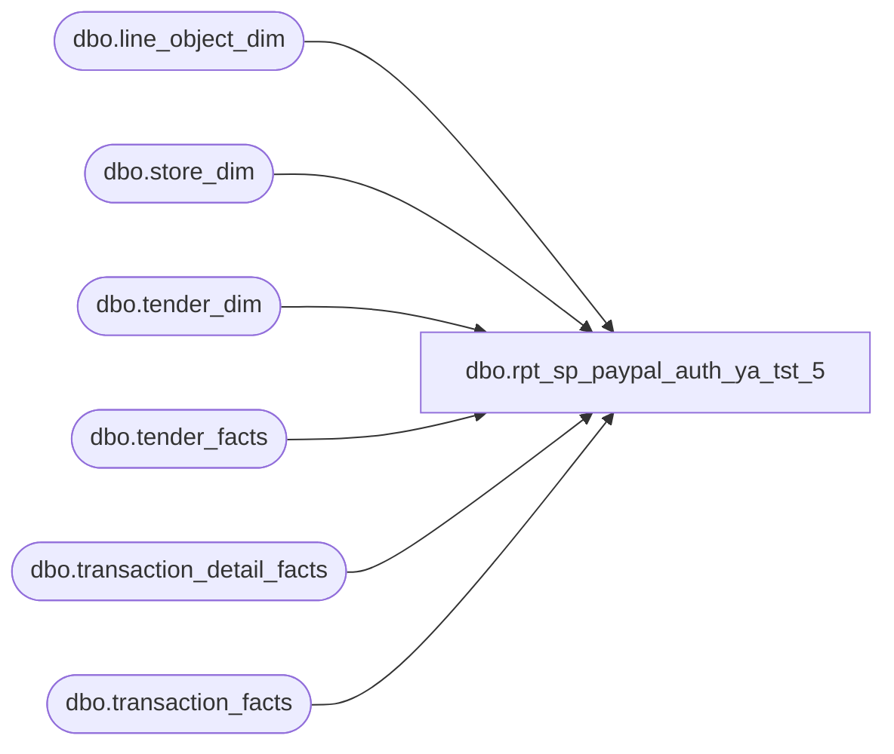

# dbo.rpt_sp_paypal_auth_ya_tst_5

**Database:** LH_Source  
**Server:** 4db76rlxaxcuvmuh5kw37wbnqq-ovsykae43znuhlmnflcdwm4ohu.datawarehouse.fabric.microsoft.com  

## Architecture Diagram



## Table Dependencies

| Referenced Table |
|---|
| dbo.line_object_dim |
| dbo.store_dim |
| dbo.tender_dim |
| dbo.tender_facts |
| dbo.transaction_detail_facts |
| dbo.transaction_facts |

## View Code

```sql
CREATE   VIEW dbo.rpt_sp_paypal_auth_ya_tst_5 AS WITH txn_gross_receipt AS (     SELECT tf.transaction_id,            SUM(CASE WHEN TRY_CONVERT(int, td.tender_code) = -1 THEN 0                     ELSE tf.tender_amt END) AS non_tax_tender_sum       FROM LH_Mart.dbo.tender_facts tf       JOIN LH_Mart.dbo.tender_dim   td ON td.tender_key = tf.tender_key      GROUP BY tf.transaction_id ), paypal_tender_per_code AS (     /* One row per (transaction_id, PayPal tender_code) from LH_Mart.        Used both for Branch B emission and as the lookup table for        Branch-A [Line Object Code] attribution by leg amount. */     SELECT tf.transaction_id,            tf.tender_amt,            TRY_CONVERT(int, td.tender_code) AS tender_code_int       FROM LH_Mart.dbo.tender_facts tf       JOIN LH_Mart.dbo.tender_dim   td ON td.tender_key = tf.tender_key      WHERE TRY_CONVERT(int, td.tender_code) IN (632, 674) ), txn_paypal_total AS (     /* Per-transaction total across both PayPal tender_codes (632 + 674). */     SELECT transaction_id,            SUM(tender_amt) AS total_paypal_amt       FROM paypal_tender_per_code      GROUP BY transaction_id ), tdf_paypal_legs AS (     /* Per-leg PayPal refund detail from LH_Mart.transaction_detail_facts.        Customer Service (line_object=296) is the per-Linda-leg refund        row carried at the tdf grain for multi-auth PayPal refunds.        Probed 2026-05-18 across Jan-2026 multi-leg keys: 8 of 17        multi-leg keys have a Customer-Service leg structure whose        sum and count match Linda's per-leg row layout exactly. */     SELECT tdf.transaction_id,            tdf.unit_gross_amount   AS leg_amt,            tdf.transaction_line_seq       FROM LH_Mart.dbo.transaction_detail_facts tdf       JOIN LH_Mart.dbo.line_object_dim          lo         ON lo.Line_Object_Key = tdf.line_object_key      WHERE lo.Line_Object = 296 ), txn_tdf_paypal_sum AS (     SELECT transaction_id,            SUM(leg_amt) AS leg_sum,            COUNT(*)     AS leg_count       FROM tdf_paypal_legs      GROUP BY transaction_id ), exploded_txns AS (     /* Transactions whose Customer-Service leg sum equals the PayPal        tender-facts sum (within 1 cent) AND have more than one leg.        Only these transactions are exploded; everything else falls        through to Branch B at the original LH_Mart.tender_facts grain.        Tolerance guard ensures we never explode a transaction whose        LH_Mart shape mixes PayPal with sales/GC/FX-tax distortion. */     SELECT tps.transaction_id       FROM txn_tdf_paypal_sum tps       JOIN txn_paypal_total   tpt ON tpt.transaction_id = tps.transaction_id      WHERE ABS(tps.leg_sum - tpt.total_paypal_amt) < 0.01        AND tps.leg_count > 1 ), exploded_txn_default_code AS (     /* MIN(tender_code_int) per exploded transaction. Used as the        fallback [Line Object Code] for legs whose amount does not        uniquely match a specific tender_amt (e.g., two same-amount        legs against a single tender_facts row). 632 outranks 674 by        MIN(), aligning with Linda's same-code attribution on single-        PayPal-code multi-leg refunds. */     SELECT p.transaction_id,            MIN(p.tender_code_int) AS default_code       FROM paypal_tender_per_code p       JOIN exploded_txns ex ON ex.transaction_id = p.transaction_id      GROUP BY p.transaction_id ), tender_leg_tally AS (     /* 1..100 numbers list for Branch B fan-out across        tender_facts.tender_count legs. Max observed tender_count        for PayPal Jan 2026 is 3; 100 leaves headroom. */     SELECT TOP (100)            ROW_NUMBER() OVER (ORDER BY (SELECT NULL)) AS leg_no       FROM (VALUES (0),(0),(0),(0),(0),(0),(0),(0),(0),(0)) a(x)       CROSS JOIN (VALUES (0),(0),(0),(0),(0),(0),(0),(0),(0),(0)) b(x) ) SELECT     /* Branch A: per-leg exploded rows from transaction_detail_facts.        One row per Customer-Service leg, each carrying the same        denormalised header [Tender Total Amount] (matching Linda's        denormalised tender_total across legs) and the leg's per-row        unit_gross_amount as [Auth Amount]. */     CASE WHEN s.store_id < 1000 THEN s.store_id + 1000 ELSE s.store_id END         AS [Store Number],     CAST(DATEADD(day, m.date_key, '1997-01-04') AS date)  AS [Transaction Date],     CAST(m.transaction_no AS varchar(50))                 AS [Transaction Number],     CAST(m.register_no    AS varchar(10))                 AS [Register Number],     CAST(CASE             WHEN ISNULL(g.non_tax_tender_sum, 0) = 0                THEN m.receipt_total_amount - ISNULL(m.redemption_amount, 0)             ELSE g.non_tax_tender_sum - 2 * ISNULL(m.redemption_amount, 0)          END AS decimal(18,6))                            AS [Tender Total Amount (Native Currency)],     CAST(NULL AS varchar(80))                             AS [Reference Number],     CAST(tdf.leg_amt AS decimal(18,6))                    AS [Auth Amount (Native Currency)],     COALESCE(p2.tender_code_int, exc.default_code)        AS [Line Object Code]   FROM LH_Mart.dbo.transaction_facts m   JOIN LH_Mart.dbo.store_dim          s   ON s.store_key      = m.store_key   JOIN exploded_txns                  ex  ON ex.transaction_id = m.transaction_id   JOIN tdf_paypal_legs                tdf ON tdf.transaction_id = m.transaction_id   JOIN exploded_txn_default_code      exc ON exc.transaction_id = m.transaction_id   LEFT JOIN paypal_tender_per_code    p2  ON p2.transaction_id  = m.transaction_id                                          AND p2.tender_amt      = tdf.leg_amt   LEFT JOIN txn_gross_receipt         g   ON g.transaction_id   = m.transaction_id  WHERE TRY_CONVERT(int, m.register_no) IS NOT NULL    AND TRY_CONVERT(int, m.register_no) < 100  UNION ALL  SELECT     /* Branch B: collapsed tender_facts emission for transactions        that did not qualify for Branch A per-leg explosion. Fans out        to one row per (txn, tender_code, leg_no) via tender_leg_tally        joined on leg_no <= tf.tender_count, recovering Linda's per-        reference_no row count. Auth Amount is even-split        (tender_amt / tender_count); per-key SUM stays equal to        tender_facts.tender_amt. */     CASE WHEN s.store_id < 1000 THEN s.store_id + 1000 ELSE s.store_id END         AS [Store Number],     CAST(DATEADD(day, m.date_key, '1997-01-04') AS date)  AS [Transaction Date],     CAST(m.transaction_no AS varchar(50))                 AS [Transaction Number],     CAST(m.register_no    AS varchar(10))                 AS [Register Number],     CAST(CASE             WHEN ISNULL(g.non_tax_tender_sum, 0) = 0                THEN m.receipt_total_amount - ISNULL(m.redemption_amount, 0)             ELSE g.non_tax_tender_sum - 2 * ISNULL(m.redemption_amount, 0)          END AS decimal(18,6))                            AS [Tender Total Amount (Native Currency)],     CAST(NULL AS varchar(80))                             AS [Reference Number],     CAST(tf.tender_amt          / NULLIF(ISNULL(tf.tender_count, 1), 0)          AS decimal(18,6))                                AS [Auth Amount (Native Currency)],     TRY_CONVERT(int, td.tender_code)                      AS [Line Object Code]   FROM LH_Mart.dbo.transaction_facts m   JOIN LH_Mart.dbo.store_dim    s  ON s.store_key  = m.store_key   JOIN LH_Mart.dbo.tender_facts tf ON tf.transaction_id = m.transaction_id   JOIN LH_Mart.dbo.tender_dim   td ON td.tender_key = tf.tender_key   JOIN tender_leg_tally         tlt        ON tlt.leg_no <= ISNULL(tf.tender_count, 1)   LEFT JOIN txn_gross_receipt   g  ON g.transaction_id = m.transaction_id  WHERE TRY_CONVERT(int, td.tender_code) IN (632, 674)    AND TRY_CONVERT(int, m.register_no) IS NOT NULL    AND TRY_CONVERT(int, m.register_no) < 100    AND NOT EXISTS (          SELECT 1 FROM exploded_txns ex           WHERE ex.transaction_id = m.transaction_id        );
```

