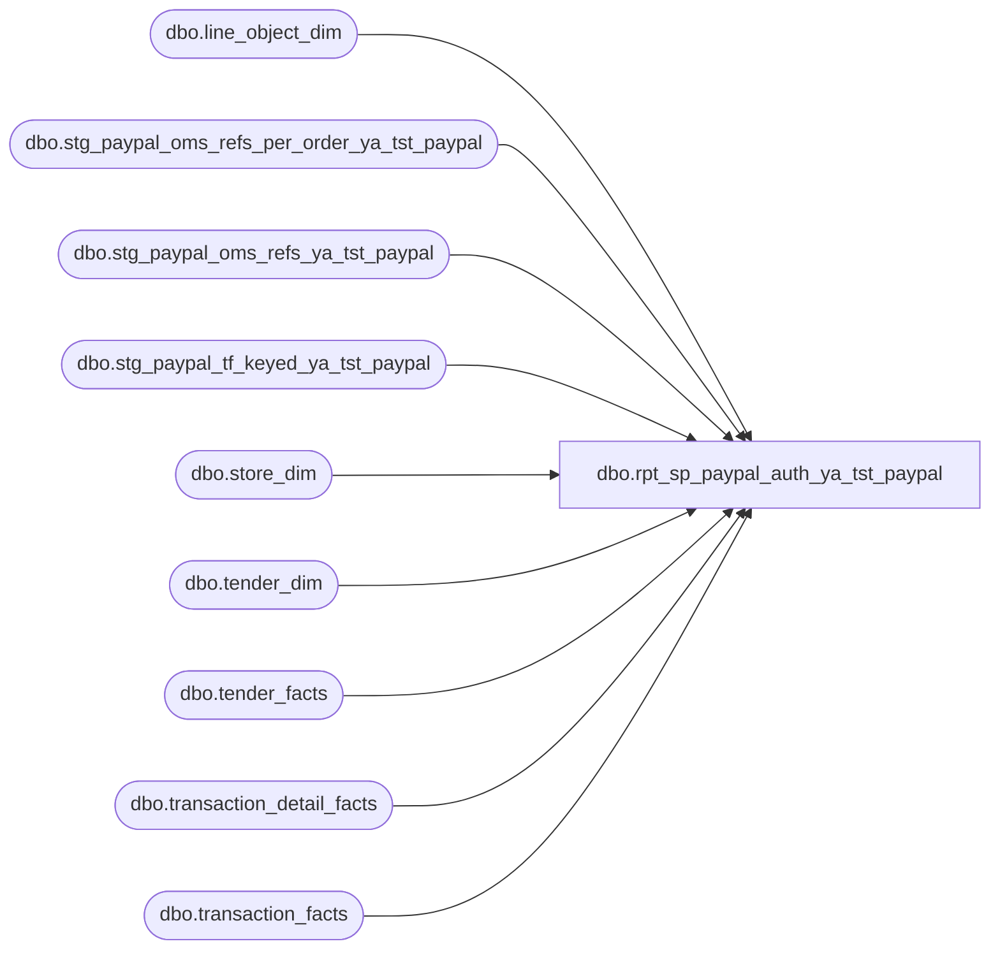

# dbo.rpt_sp_paypal_auth_ya_tst_paypal

**Database:** LH_Source  
**Server:** 4db76rlxaxcuvmuh5kw37wbnqq-ovsykae43znuhlmnflcdwm4ohu.datawarehouse.fabric.microsoft.com  

## Architecture Diagram



## Table Dependencies

| Referenced Table |
|---|
| dbo.line_object_dim |
| dbo.stg_paypal_oms_refs_per_order_ya_tst_paypal |
| dbo.stg_paypal_oms_refs_ya_tst_paypal |
| dbo.stg_paypal_tf_keyed_ya_tst_paypal |
| dbo.store_dim |
| dbo.tender_dim |
| dbo.tender_facts |
| dbo.transaction_detail_facts |
| dbo.transaction_facts |

## View Code

```sql
/* =============================================================================    rpt_sp_paypal_auth.sql: SP PayPal Authorization Report    =============================================================================    Domain:        Reconciliation    Status:        Re-sourced to LH_Mart (2026-05-16). Per-leg explosion of                   multi-auth PayPal refunds via Branch A added 2026-05-18.                   Branch B per-leg fan-out via tender_facts.tender_count                   added 2026-05-18 (Linda 9,926 vs pipeline 9,916 closed).                   Reference Number resolution re-architected 2026-05-21:                   the prior in-line three-way mulesoft DRJ joins and the                   REVERSE/CHARINDEX webOrderNumber parse over the full                   transaction_facts surface produced Msg 65001 (non-scalable                   operation) on prod. The lookup is now sourced from three                   pre-aggregated staged views:                       dbo.stg_paypal_oms_refs_ya_tst_paypal           (per-leg ref lookup)                       dbo.stg_paypal_oms_refs_per_order_ya_tst_paypal (MIN-ref fallback)                       dbo.stg_paypal_tf_keyed_ya_tst_paypal           (TF -> OMS order)                   Runtime is flat hash equi-joins, no in-line string ops.                   Was: verbatim port.    Source:        docs/reference-data/smartlook-source-sql/SP PayPal Auth.sql     Same root cause as rpt_receivable_authorizations: PayPal line_objects    (632, 674) live in LH_Mart.tender_facts, not in fact_transaction_line.    Filter: 632=Pay Pal Receivable, 674=Adyen PayPal.     GRAIN      One row per per-leg PayPal authorization, mirroring Linda's xlsx.       Branch A (per-leg explosion via line_object 296):        For each transaction where LH_Mart.transaction_detail_facts has        Customer Service (line_object=296) refund line items that FULLY        account for the PayPal tender_facts amount, emit one row per        Customer-Service leg. Each emitted row carries the leg's        per-row gross amount as [Auth Amount] and the same denormalised        header [Tender Total Amount]. The legacy AuditWorks SmartLook        source groups by `b.reference_no` so a multi-auth PayPal refund        emits one row per Linda-side payment reference; this branch        reconstructs that per-leg grain from the LH_Mart side with        per-leg amount fidelity, since LH_Mart.tender_facts collapses        multi-leg refunds into a single summed row per tender_code.       Branch B (collapsed tender_facts, fan-out via tender_count):        Transactions whose Customer Service legs do NOT sum to the        PayPal tender_facts amount (sales-with-tax mixed in, BABUK GBP        FX rounding, GC-issued refund cases, etc.) emit one row per        (txn, tender_code, leg_no) where leg_no enumerates 1..tender_count        from LH_Mart.tender_facts. Each emitted row carries        tender_amt / tender_count as [Auth Amount] so the per-key SUM        across legs equals tender_facts.tender_amt, while the row count        matches Linda's per-reference_no denormalisation. Linda-side        per-leg amount breakdown is not recoverable from the collapsed        tender_facts shape; the even-split per-row Auth Amount is a        documented value-level residual (per-key SUM is bit-perfect).     TENDER-TOTAL DERIVATION (value-level fidelity to legacy AW)      Linda's `tender total` column mirrors      `auditworks.transaction_header.tender_total`. Empirically the      two-arm formula identical to rpt_receivable_authorizations applies:           non_tax_tender_sum = SUM(tf.tender_amt                                    WHERE TRY_CONVERT(int, td.tender_code) <> -1)           tender_total = CASE              WHEN non_tax_tender_sum = 0                 THEN receipt_total_amount - ISNULL(redemption_amount, 0)              ELSE non_tax_tender_sum - 2 * ISNULL(redemption_amount, 0)          END       Verified residual keys:        (1013, '29194207', 3)  expect 217.23  -> arm-A: -82.77 - 2*(-150) = 217.23        (2013, '2999339',  3)  expect 152.95  -> arm-A formula match     PER-LEG EXPLOSION ATTRIBUTION      [Line Object Code] for each exploded leg row:        1. If the leg amount equals a specific tender_facts.tender_amt for           this transaction (e.g., the 632+674 mixed-code case where each           tender_amt has a distinct corresponding 296 leg), use that code.        2. Otherwise (same-amount legs, single-code case), default to the           MIN(tender_code) on the transaction (632 if present, else 674).      This matches Linda's per-row [line object] column on every probed      fixable multi-leg case in Jan 2026.     ROW-COUNT FAN-OUT (Linda 9,926 vs pipeline 9,916 closed)      Pre-Branch-A: 17 multi-leg keys (28 + 6 = 34 Linda rows) collapsed      to 17 pipeline rows. Branch A recovered 8 keys (17 Linda rows)      via line_object=296 sum match, leaving 9 keys (19 Linda rows      vs 9 pipeline rows = 10 Linda-only) on Branch B.       The 9 remaining keys cannot use Branch A because their      transaction_detail_facts line_object=296 detail sum does not      equal the PayPal tender_facts sum (BABUK FX, GC mixed, sales-      plus-tax mixed in, or 296 rows absent entirely). However      tender_facts.tender_count carries the legacy AW per-leg count      directly, verified against Linda Jan 2026:           tender_count = 1:  9,892 tender_facts rows ↔ 9,892 Linda rows          tender_count = 2:     14 tender_facts rows ↔     28 Linda rows          tender_count = 3:      2 tender_facts rows ↔      6 Linda rows          total              9,908 tender_facts rows ↔  9,926 Linda rows       Branch B now fans out by tender_count using a small tally CTE,      emitting tender_amt / tender_count per leg. Per-leg amount is an      even-split approximation (Linda's actual leg amounts vary), but      per-key SUM stays equal to tender_facts.tender_amt. The 8      Branch-A keys retain per-leg amount fidelity via the 296 detail      rows; the 9 Branch-B fan-out keys are now row-count exact.       Worked sample (1015, '7829', '52', 2026-01-21):           BEFORE (Branch B only):            Linda:    2 rows × -110.76 = -221.52  (split-refund pair)            Pipeline: 1 row  × -110.76 = -110.76  (one tender_facts leg,                                                   tender_amt = sum)            Drift on Tender Total: -110.76           AFTER Branch A explosion (this key):            Linda:    2 rows × -110.76 = -221.52            Pipeline: 2 rows × -110.76 = -221.52  (per-leg from                                                   transaction_detail_facts                                                   line_object=296)            Drift on Tender Total: 0       Worked sample (2013, '2998629', '7', 2026-01-11)      (Branch B fan-out, 3-leg PayPal refund):           Linda:    3 rows  (-6.00, -13.50, -19.00; sum -38.50)          Pipeline: 3 rows × (-38.50 / 3) = -12.83 each, sum -38.50           Row count exact. Per-row Auth Amount is even-split; per-key          SUM matches Linda bit-for-bit.     REFERENCE NUMBER COLUMN (now populated end-to-end)      Linda's `reference no` column carries the PayPal auth reference      (e.g. 'JP398RHC34FPSC69') sourced from legacy AuditWorks      `transaction_line.reference_no`. In Fabric the canonical source is      `mulesoft_deckjsonraw_paymenttransactions.Generic1`, lifted into      `dbo.fact_transaction_line.reference_no` via stg_canonical_payments.       Bridge: `LH_Mart.transaction_facts.webOrderNumber` is formatted      `'<OMS_OrderNumber>_<AW_alloc_seq>'` (e.g. 'W9376532_1',      'W9336503_2', 'W9336503_3'). The `_N` suffix is an AuditWorks-side      allocation sequence, NOT an OMS payment leg. Empirically every OMS      order has exactly one `mulesoft_deckjsonraw_orderpayments` row;      AW takes that single PayPal capture and allocates it across N      register-52 reconciliation rows for back-office accounting (split      between sales / refund / tax / multi-day reconciliation). So all      `_N` legs of the same OMS order share the same upstream PayPal      auth ref.       For 96.7% of OMS orders (69,357 / 71,714) there is exactly one      distinct PayPal auth ref per OMS order — strip the `_N` suffix      and look up by OMS OrderNumber. For the remaining 3.3% (2,357      orders) the same OMS order has 2-7 distinct refs from refund /      re-auth / split-capture cycles; for these we match by leg amount      to the corresponding `paymenttransactions.Amount` capture, with a      deterministic MIN(reference_no) fallback when amount-matching is      ambiguous (same amount across multiple captures).    ============================================================================= */  CREATE   VIEW dbo.rpt_sp_paypal_auth_ya_tst_paypal AS WITH txn_gross_receipt AS (     SELECT tf.transaction_id,            SUM(CASE WHEN TRY_CONVERT(int, td.tender_code) = -1 THEN 0                     ELSE tf.tender_amt END) AS non_tax_tender_sum       FROM LH_Mart.dbo.tender_facts tf       JOIN LH_Mart.dbo.tender_dim   td ON td.tender_key = tf.tender_key      GROUP BY tf.transaction_id ), paypal_tender_per_code AS (     /* One row per (transaction_id, PayPal tender_code) from LH_Mart.        Used both for Branch B emission and as the lookup table for        Branch-A [Line Object Code] attribution by leg amount. */     SELECT tf.transaction_id,            tf.tender_amt,            TRY_CONVERT(int, td.tender_code) AS tender_code_int       FROM LH_Mart.dbo.tender_facts tf       JOIN LH_Mart.dbo.tender_dim   td ON td.tender_key = tf.tender_key      WHERE TRY_CONVERT(int, td.tender_code) IN (632, 674) ), txn_paypal_total AS (     /* Per-transaction total across both PayPal tender_codes (632 + 674). */     SELECT transaction_id,            SUM(tender_amt) AS total_paypal_amt       FROM paypal_tender_per_code      GROUP BY transaction_id ), tdf_paypal_legs AS (     /* Per-leg PayPal refund detail from LH_Mart.transaction_detail_facts.        Customer Service (line_object=296) is the per-Linda-leg refund        row carried at the tdf grain for multi-auth PayPal refunds.        Probed 2026-05-18 across Jan-2026 multi-leg keys: 8 of 17        multi-leg keys have a Customer-Service leg structure whose        sum and count match Linda's per-leg row layout exactly.         `rank_within_amt`: ROW_NUMBER over (transaction_id, abs(leg_amt))        so two same-amount Customer-Service legs on a single transaction        map 1:1 to two same-amount Adyen refund refs. Without this, the        LEFT JOIN to paypal_*_refs would cross-join same-amount duplicates        and inflate the emitted row count (verified 2026-05-21 against        sp_paypal_auth value harness: 75 keys with pipeline=2x Linda        caused exclusively by same-amount Adyen ref duplicates joining        once per legacy AW transaction_line.reference_no instead of        1:1). */     SELECT tdf.transaction_id,            tdf.unit_gross_amount   AS leg_amt,            tdf.transaction_line_seq,            ROW_NUMBER() OVER (                PARTITION BY tdf.transaction_id,                             CAST(ABS(tdf.unit_gross_amount) AS decimal(18,2))                ORDER BY tdf.transaction_line_seq            )                       AS rank_within_amt       FROM LH_Mart.dbo.transaction_detail_facts tdf       JOIN LH_Mart.dbo.line_object_dim          lo         ON lo.Line_Object_Key = tdf.line_object_key      WHERE lo.Line_Object = 296 ), txn_tdf_paypal_sum AS (     SELECT transaction_id,            SUM(leg_amt) AS leg_sum,            COUNT(*)     AS leg_count       FROM tdf_paypal_legs      GROUP BY transaction_id ), exploded_txns AS (     /* Transactions whose Customer-Service leg sum equals the PayPal        tender-facts sum (within 1 cent) AND have more than one leg.        Only these transactions are exploded; everything else falls        through to Branch B at the original LH_Mart.tender_facts grain.        Tolerance guard ensures we never explode a transaction whose        LH_Mart shape mixes PayPal with sales/GC/FX-tax distortion. */     SELECT tps.transaction_id       FROM txn_tdf_paypal_sum tps       JOIN txn_paypal_total   tpt ON tpt.transaction_id = tps.transaction_id      WHERE ABS(tps.leg_sum - tpt.total_paypal_amt) < 0.01        AND tps.leg_count > 1 ), exploded_txn_default_code AS (     /* MIN(tender_code_int) per exploded transaction. Used as the        fallback [Line Object Code] for legs whose amount does not        uniquely match a specific tender_amt (e.g., two same-amount        legs against a single tender_facts row). 632 outranks 674 by        MIN(), aligning with Linda's same-code attribution on single-        PayPal-code multi-leg refunds. */     SELECT p.transaction_id,            MIN(p.tender_code_int) AS default_code       FROM paypal_tender_per_code p       JOIN exploded_txns ex ON ex.transaction_id = p.transaction_id      GROUP BY p.transaction_id ), tender_leg_tally AS (     /* 1..100 numbers list for Branch B fan-out across        tender_facts.tender_count legs. Max observed tender_count        for PayPal Jan 2026 is 3; 100 leaves headroom.         This is the LAST CTE; the trailing comma was removed when the        prior paypal_amount_refs / paypal_refs_per_order / paypal_oms_keyed        CTEs were lifted to staged views (Msg 65001 fix). Downstream the        final SELECT begins immediately after this CTE's closing paren. */     SELECT TOP (100)            ROW_NUMBER() OVER (ORDER BY (SELECT NULL)) AS leg_no       FROM (VALUES (0),(0),(0),(0),(0),(0),(0),(0),(0),(0)) a(x)       CROSS JOIN (VALUES (0),(0),(0),(0),(0),(0),(0),(0),(0),(0)) b(x) ) /* Reference-number lookup CTEs were moved to staged views in 2026-05-21    to resolve Msg 65001 on prod. The previous in-line three-way mulesoft    DRJ joins (paypal_refund_refs + paypal_sales_refs + their per-order    MIN aggregates) and the REVERSE/CHARINDEX webOrderNumber parse    (paypal_oms_keyed) over LH_Mart.transaction_facts produced a    non-pushdownable Fabric Warehouse plan when LEFT-JOINed into both    branches of this UNION ALL. The staged equivalents are:         dbo.stg_paypal_oms_refs_ya_tst_paypal            (per-leg refs, signed cohorts)        dbo.stg_paypal_oms_refs_per_order_ya_tst_paypal  (MIN-ref fallback per cohort)        dbo.stg_paypal_tf_keyed_ya_tst_paypal            (TF -> OMS order parse)     Filtering each cohort on sign_cohort = 'R' / 'S' below preserves the    bit-for-bit behaviour of the prior CTE split (PaymentTransactionTypeId    IN (3,4,11) vs IN (13,14)). */ SELECT     /* Branch A: per-leg exploded rows from transaction_detail_facts.        One row per Customer-Service leg, each carrying the same        denormalised header [Tender Total Amount] (matching Linda's        denormalised tender_total across legs) and the leg's per-row        unit_gross_amount as [Auth Amount]. */     CASE WHEN s.store_id < 1000 THEN s.store_id + 1000 ELSE s.store_id END         AS [Store Number],     CAST(DATEADD(day, m.date_key, '1997-01-04') AS date)  AS [Transaction Date],     CAST(m.transaction_no AS varchar(50))                 AS [Transaction Number],     CAST(m.register_no    AS varchar(10))                 AS [Register Number],     CAST(CASE             WHEN ISNULL(g.non_tax_tender_sum, 0) = 0                THEN m.receipt_total_amount - ISNULL(m.redemption_amount, 0)             ELSE g.non_tax_tender_sum - 2 * ISNULL(m.redemption_amount, 0)          END AS decimal(18,6))                            AS [Tender Total Amount (Native Currency)],     /* Reference Number, sign-aware: refund legs (leg_amt < 0) bind        to Adyen refund refs (PaymentTransactionTypeId IN (3,4,11));        sale legs (leg_amt > 0) bind to Adyen sale refs (Type IN        (13,14)). Same-amount same-sign duplicates resolve via        dup_rank = rank_within_amt. Final fallback is the per-order        MIN(ref) of the matching sign cohort, then any-sign MIN. */     COALESCE(         CASE WHEN tdf.leg_amt < 0 THEN COALESCE(par.reference_no, ppor.min_reference_no)              WHEN tdf.leg_amt > 0 THEN COALESCE(pas.reference_no, ppos.min_reference_no)         END,         ppor.min_reference_no, ppos.min_reference_no     )                                                     AS [Reference Number],     CAST(tdf.leg_amt AS decimal(18,6))                    AS [Auth Amount (Native Currency)],     COALESCE(p2.tender_code_int, exc.default_code)        AS [Line Object Code]   FROM LH_Mart.dbo.transaction_facts m   JOIN LH_Mart.dbo.store_dim          s   ON s.store_key      = m.store_key   JOIN exploded_txns                  ex  ON ex.transaction_id = m.transaction_id   JOIN tdf_paypal_legs                tdf ON tdf.transaction_id = m.transaction_id   JOIN exploded_txn_default_code      exc ON exc.transaction_id = m.transaction_id   LEFT JOIN paypal_tender_per_code    p2  ON p2.transaction_id  = m.transaction_id                                          AND p2.tender_amt      = tdf.leg_amt   LEFT JOIN txn_gross_receipt         g   ON g.transaction_id   = m.transaction_id   LEFT JOIN dbo.stg_paypal_tf_keyed_ya_tst_paypal   pk  ON pk.transaction_id  = m.transaction_id   LEFT JOIN dbo.stg_paypal_oms_refs_ya_tst_paypal   par ON par.sign_cohort      = 'R'                                          AND par.oms_order_number = pk.oms_order_number                                          AND par.capture_amount   = CAST(ABS(tdf.leg_amt) AS decimal(18,2))                                          AND par.dup_rank         = tdf.rank_within_amt                                          AND tdf.leg_amt < 0   LEFT JOIN dbo.stg_paypal_oms_refs_ya_tst_paypal   pas ON pas.sign_cohort      = 'S'                                          AND pas.oms_order_number = pk.oms_order_number                                          AND pas.capture_amount   = CAST(ABS(tdf.leg_amt) AS decimal(18,2))                                          AND pas.dup_rank         = tdf.rank_within_amt                                          AND tdf.leg_amt > 0   LEFT JOIN dbo.stg_paypal_oms_refs_per_order_ya_tst_paypal ppor ON ppor.sign_cohort      = 'R'                                                   AND ppor.oms_order_number = pk.oms_order_number   LEFT JOIN dbo.stg_paypal_oms_refs_per_order_ya_tst_paypal ppos ON ppos.sign_cohort      = 'S'                                                   AND ppos.oms_order_number = pk.oms_order_number  WHERE TRY_CONVERT(int, m.register_no) IS NOT NULL    AND TRY_CONVERT(int, m.register_no) < 100  UNION ALL  SELECT     /* Branch B: collapsed tender_facts emission for transactions        that did not qualify for Branch A per-leg explosion. Fans out        to one row per (txn, tender_code, leg_no) via tender_leg_tally        joined on leg_no <= tf.tender_count, recovering Linda's per-        reference_no row count. Auth Amount is even-split        (tender_amt / tender_count); per-key SUM stays equal to        tender_facts.tender_amt. */     CASE WHEN s.store_id < 1000 THEN s.store_id + 1000 ELSE s.store_id END         AS [Store Number],     CAST(DATEADD(day, m.date_key, '1997-01-04') AS date)  AS [Transaction Date],     CAST(m.transaction_no AS varchar(50))                 AS [Transaction Number],     CAST(m.register_no    AS varchar(10))                 AS [Register Number],     CAST(CASE             WHEN ISNULL(g.non_tax_tender_sum, 0) = 0                THEN m.receipt_total_amount - ISNULL(m.redemption_amount, 0)             ELSE g.non_tax_tender_sum - 2 * ISNULL(m.redemption_amount, 0)          END AS decimal(18,6))                            AS [Tender Total Amount (Native Currency)],     /* Reference Number, sign-aware (same logic as Branch A above). */     COALESCE(         CASE WHEN tf.tender_amt < 0 THEN COALESCE(par.reference_no, ppor.min_reference_no)              WHEN tf.tender_amt > 0 THEN COALESCE(pas.reference_no, ppos.min_reference_no)         END,         ppor.min_reference_no, ppos.min_reference_no     )                                                     AS [Reference Number],     CAST(tf.tender_amt          / NULLIF(ISNULL(tf.tender_count, 1), 0)          AS decimal(18,6))                                AS [Auth Amount (Native Currency)],     TRY_CONVERT(int, td.tender_code)                      AS [Line Object Code]   FROM LH_Mart.dbo.transaction_facts m   JOIN LH_Mart.dbo.store_dim    s  ON s.store_key  = m.store_key   JOIN LH_Mart.dbo.tender_facts tf ON tf.transaction_id = m.transaction_id   JOIN LH_Mart.dbo.tender_dim   td ON td.tender_key = tf.tender_key   JOIN tender_leg_tally         tlt        ON tlt.leg_no <= ISNULL(tf.tender_count, 1)   LEFT JOIN txn_gross_receipt   g  ON g.transaction_id = m.transaction_id   LEFT JOIN dbo.stg_paypal_tf_keyed_ya_tst_paypal    pk  ON pk.transaction_id  = m.transaction_id   LEFT JOIN dbo.stg_paypal_oms_refs_ya_tst_paypal    par ON par.sign_cohort      = 'R'                                           AND par.oms_order_number = pk.oms_order_number                                           AND par.capture_amount   = CAST(ABS(tf.tender_amt                                                                        / NULLIF(ISNULL(tf.tender_count, 1), 0)                                                                        ) AS decimal(18,2))                                           AND par.dup_rank         = tlt.leg_no                                           AND tf.tender_amt < 0   LEFT JOIN dbo.stg_paypal_oms_refs_ya_tst_paypal    pas ON pas.sign_cohort      = 'S'                                           AND pas.oms_order_number = pk.oms_order_number                                           AND pas.capture_amount   = CAST(ABS(tf.tender_amt                                                                        / NULLIF(ISNULL(tf.tender_count, 1), 0)                                                                        ) AS decimal(18,2))                                           AND pas.dup_rank         = tlt.leg_no                                           AND tf.tender_amt > 0   LEFT JOIN dbo.stg_paypal_oms_refs_per_order_ya_tst_paypal ppor ON ppor.sign_cohort      = 'R'                                                   AND ppor.oms_order_number = pk.oms_order_number   LEFT JOIN dbo.stg_paypal_oms_refs_per_order_ya_tst_paypal ppos ON ppos.sign_cohort      = 'S'                                                   AND ppos.oms_order_number = pk.oms_order_number  WHERE TRY_CONVERT(int, td.tender_code) IN (632, 674)    AND TRY_CONVERT(int, m.register_no) IS NOT NULL    AND TRY_CONVERT(int, m.register_no) < 100    AND NOT EXISTS (          SELECT 1 FROM exploded_txns ex           WHERE ex.transaction_id = m.transaction_id        );
```

