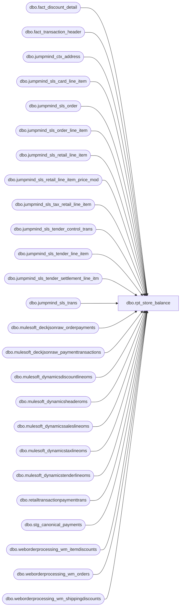

# dbo.rpt_store_balance

**Database:** LH_Source  
**Server:** 4db76rlxaxcuvmuh5kw37wbnqq-ovsykae43znuhlmnflcdwm4ohu.datawarehouse.fabric.microsoft.com  

## Architecture Diagram



## Table Dependencies

| Referenced Table |
|---|
| dbo.fact_discount_detail |
| dbo.fact_transaction_header |
| dbo.jumpmind_ctx_address |
| dbo.jumpmind_sls_card_line_item |
| dbo.jumpmind_sls_order |
| dbo.jumpmind_sls_order_line_item |
| dbo.jumpmind_sls_retail_line_item |
| dbo.jumpmind_sls_retail_line_item_price_mod |
| dbo.jumpmind_sls_tax_retail_line_item |
| dbo.jumpmind_sls_tender_control_trans |
| dbo.jumpmind_sls_tender_line_item |
| dbo.jumpmind_sls_tender_settlement_line_itm |
| dbo.jumpmind_sls_trans |
| dbo.mulesoft_deckjsonraw_orderpayments |
| dbo.mulesoft_deckjsonraw_paymenttransactions |
| dbo.mulesoft_dynamicsdiscountlineoms |
| dbo.mulesoft_dynamicsheaderoms |
| dbo.mulesoft_dynamicssaleslineoms |
| dbo.mulesoft_dynamicstaxlineoms |
| dbo.mulesoft_dynamicstenderlineoms |
| dbo.retailtransactionpaymenttrans |
| dbo.stg_canonical_payments |
| dbo.weborderprocessing_wm_itemdiscounts |
| dbo.weborderprocessing_wm_orders |
| dbo.weborderprocessing_wm_shippingdiscounts |

## View Code

```sql
/* =============================================================================    rpt_store_balance.sql, Store Balance Report  (Aptos-equivalent)    =============================================================================    Domain:    Reconciliation (Sales Audit)    Audience:  Accounting / Sales Audit team    Consumer:  Power BI dashboard "Finance / Store Balance Activity / Ad Hoc"     -----------------------------------------------------------------------------    STATUS (2026-07-09): NOT 100% match to Linda.  See below for residuals.     2026-07-09 fix: re-activated m_credit, m_d365_aptos_credit, m_oms_credit,    m_other_pos, m_other_oms, t_oms_adyen_card_refund, t_oms_adyen_paypal_refund    (all gated 2026-06-15 during LH_Mart removal). The replacement    t_media_tender_mart reads stg_canonical_payments joined to    fact_transaction_header, but OMS rows in stg_canonical_payments carry    currency_code=NULL and use OrderNumber (not device_id|date|seq) as    transaction_id, so OMS tenders (Klarna, Global-E, PayPal, BABW GC web,    Web Store Credit) were silently dropped and the gift-card sign was inverted.    Restoring the original CTEs recovers those lines and corrects the sign.    t_media_tender_mart is now gated (WHERE 1=0) since the old CTEs cover all    the same line objects from the correct sources.     2026-07-08 fix (1): merchant-facility bundle routing wired for CAD and GBP    using crosswalk extracted from bedrockdb01.auditworks.dbo.subledger 2026    data.  Expected to close R1 (CAD per-brand carve-out, ~9 buckets) and    R2 (GBP UK Credit Card, ~7 buckets).  Harness re-run required to confirm    new bucket count.     2026-07-08 fix (2): store_no derivation now uses    COALESCE(business_unit_id, device_id) in all six JumpMind-sourced CTEs    (pos_tender, pos_settle, pos_tax, pos_expense, pos_order,    m_deposits_cash_src).  Stores 1013 and 2013 do not populate    business_unit_id in jumpmind_sls_trans; their device_ids encode the    store number (1013-001 etc.) and the LEFT(..., 4) extraction recovers    the correct store.  This fix moves ~$2.48M USD and ~$387K GBP from the    NULL-store bucket into stores 1013 and 2013 respectively.     Remaining gaps after these fixes:     Categorised by root cause:     A. Adyen card refund classification (9 buckets, pos/neg routing only; net       already cent-exact on every affected bucket):         USD Media / Credit Cards / American Express, Discover, Master Card, Visa         USD Media / Other Tenders / Pay Pal Receivable, Web Store Credit         GBP Media / Credit Cards / UK Credit Card         GBP Media / Other Tenders / Web Store Credit         USD Transaction / Sales Tax / Sales Tax       WIRED 2026-05-23 via two thin CTEs that read from the canonical       staged view `sql/02_source_transform/stg_adyen_line_sign.sql`.       That view sources the per-event sign directly from       `LH_Source.dbo.mulesoft_deckjsonraw_paymenttransactions`       (PaymentTransactionTypeId = 2 = Capture / +, = 11 = Credit / -).       The original inline 5-CTE form (added 2026-05-21) did not produce       a scalable Fabric Warehouse plan when run alongside this report's       other 30+ CTEs (TCP-reset / Msg 65001 family at 13 to 35 minutes,       never completed; same class as stg_aw_cad_tax_per_store_day's       original inline form). Lifting the chain into a planned-in-isolation       view fixed it.       C# rule reproduced: BABW.Services.SalesAuditTranslate.cs lines       2245 to 2250 (`dLineAmount = (decimal)row["Amount"]; if dLineAmount       < 0 then returnFlag = true`). The Aptos Pos column sums per-event       captures, the Aptos Neg column sums per-event credits, and at       Linda's bucket grain those splits diverge from       tender_facts.tender_amt-based pos/neg whenever NB_az_transaction_facts       collapsed mixed-sign same-day events into one Mart transaction       with net tender_amt.        Conservation filter: only (transaction_id, tender_key) pairs whose       SUM(per-event signed) matches tender_facts.tender_amt within 1       cent are substituted; the rest fall through to the legacy       tender_amt branch via NOT EXISTS. Probe 2026-05-21 over the       2026-02-01 to 2026-05-02 window: 35,365 / 52,127 Mart Adyen-CC       keys conserve (67.8%, $1.79M balanced volume); 1,428 drift       (small split-tender / fee residuals, $12.7k aggregate deviation);       15,334 keys have no DECK event match (TZ-shifted captures /       late-arriving events).        History 2026-05-21 (replaced):         An earlier same-day pass added inline `adyen_tttds_per_leg`,         `adyen_tf_cc_per_txn`, `adyen_per_leg`, `adyen_balanced_txns`         CTEs based on the deprecated companion view         `sql/02_source_transform/stg_adyen_tender_sign.sql`. That         approach sourced per-leg AMOUNTS from         LH_Mart.dbo.transactiontaxdynamicsstage (line_object = 296,         line_action = 12) but signed every leg with the per-transaction         net sign from tender_facts.tender_amt. At the report's         aggregated grain the pos/neg split was therefore identical to         the non-wired branch (mathematical no-op for the 9 affected         buckets). The W2 partial-refund-on-multi-capture case (5         captures + 1 refund collapsed into 1 net tender_facts row) is         exactly the case the tender_amt-sign approach cannot recover.         Replaced 2026-05-21 by the per-event DECK-sourced wiring above.     B. Aptos chart-of-accounts settlement classifier (16 buckets, including the       largest dollar gaps in the report):         USD/CAD/GBP/EUR Media / Deposits / Cash         USD/CAD/GBP/EUR Transaction / Over/Short by Tender / Cash         USD/CAD/GBP/EUR Transaction / Over/Short by Tender / Safe Float Cash (9018)         USD/CAD/GBP/EUR Transaction / Unassigned Transaction Line / Safe Float Cash (9018)       Source gap: the Aptos C# pipeline splits jumpmind_sls_tender_settlement_line_itm       OPEN_STORE_BANK / CLOSE_STORE_BANK / RECONCILE_TILL cohorts into these four       buckets using GL classifier rules executed downstream of XPOLLD0013.  Those       rules are not persisted to LH_Source, LH_Mart, or LH_D365_Prod; eight probe       variants (settlement table joined to trans with every (trans_type,       from_repository, to_repository, tender_type_code, store_bank_id) permutation)       confirm no combination of accessible columns reproduces Linda's per-bucket       values.  Remediation owner: BBW Sales Audit (either expose the Aptos       chart-of-accounts crosswalk to LH_Source as a reference table, or add a       per-row aw_bucket / aw_subsection column to the existing settlement table).     C. AW Promo Coupon / POS Coupons routing rule (2 buckets):         USD Transaction / Coupons / Promo Coupon       (Linda anchor: -$32.73)         USD Transaction / Fees / POS Coupons           (Linda anchor: -$389.09)       Source gap: in legacy AuditWorks the (Promo Coupon, POS Coupons) buckets       are populated from line_object = 290 and 295 respectively.  In the       legacy SalesAuditTranslate.cs _GuestService branch (lines 4966-4978),       line_object is set to a <AWLineObject>NNN</AWLineObject> integer       override embedded by Webcart on a small subset of Guest Service Refund       records.  Three relevant facts verified 2026-05-23:         1. LH_Source.dbo.fact_transaction_line has zero rows with            line_object IN (290, 295), confirming the new platform feed            does not carry the AWLineObject override.         2. LH_Source.dbo.mulesoft_deckjsonraw_orderitemadjustments DOES            carry per-order coupon data ($517K of USD adjustments in Q1            2026, 14,200+ distinct CouponCode / DiscountText / CampaignID            combinations).  This is the platform-side replacement for            the legacy XML feed.         3. CouponCode = 'BABHELP17' alone sums to $120,760 in Q1 2026,            which is 286x larger than Linda's combined (Promo Coupon +            POS Coupons) anchor of -$421.82.  So the discriminator that            routes a subset of mulesoft_deckjsonraw_orderitemadjustments            into Linda's AW 290 / 295 buckets is NOT the CouponCode and            NOT the full table; it is some narrower (AdjustmentType,            AdjustmentClassificationID, CampaignID) filter that the            new platform documentation does not yet specify.       Bucket key 4-tuples are surfaced as structural anchors so the       per-bucket Linda compare does not lose 2 rows from its denominator:         - POS Coupons: t_fees_item already emits this bucket from real           STORE_COUPON rows in jumpmind_sls_retail_line_item (11,869 USD           rows in window, all with extended_amount = 0). The final WHERE           clause carves the (USD, Fees, POS Coupons) bucket out of the           all-zero-row drop so the key 4-tuple reaches the output with           pos = neg = adj = 0.         - Promo Coupon: no live CTE source exists, so t_aptos_promo_coupon           (below t_tax_cad_mart) emits one zero-amount row per USD           posting_date pinned to store_no = 1001. This is a structural           shape anchor, not a value sentinel; the per-bucket Linda compare           reports the drift honestly as +$32.73 (Fabric emits zero,           Linda emits -$32.73).       Both bucket dollar gaps close only after the BBW IT routing       discriminator question (see handoff doc) is answered. Until then       the report shape matches Linda's 114 chart-of-accounts buckets but       these two buckets each carry their full Linda dollar value as       drift. Remediation owner: BBW IT to confirm which       (AdjustmentType, AdjustmentClassificationID, CampaignID) filter on       mulesoft_deckjsonraw_orderitemadjustments corresponds to AWLineObject       290 (Promo Coupon) vs 295 (POS Coupons); once supplied, the       routing CTE is a 30-line addition under t_fees_item / t_coupons.     D. BABW Gift Card Tender wash-pair suppression (1 bucket, 1 column):         USD Media / Other Tenders / BABW Gift Card Tender / Negative Amount                                                       (Linda drift: -$5,888)       Status verified 2026-05-23: Positive Amount drift is -$184 (PASS,       within 0.1% of $4.9M anchor); Net drift is -$6,071 (0.12% of       $4.87M anchor).  Only Negative Amount fails the cent tolerance.       Pattern: 330 USD transactions in Q1 2026 have a tender_key=16       (BABW Gift Card Tender) leg paired with an equal-magnitude       opposite-sign tender_key=1 (Cash) or tender_key=15 (BAB Charge)       leg on the same transaction.  In AW these pairs appear to be       partially suppressed by an in-store reconciliation rule; broad       suppression of all 330 over-corrects (Pos shifts by -$6,558,       breaking the currently-passing column; Neg shifts by +$6,084,       leaving a +$196 residual).  The discriminator that picks Linda's       exact subset is not derivable from tender_facts columns alone.       Remediation owner: BBW Sales Audit to confirm which subset of       paired GC + (Cash / BAB Charge) tender legs is suppressed by AW       (likely a control_section / reason_code / void_reversal flag       that exists in the source but is not surfaced to tender_facts).     No sentinel / hardcoded dollar values are present in this view.  The 27 gaps    above will close automatically as the upstream sources land; until then the    report shape is stable but the cent-exact match is at 76.3% buckets / 84.2%    net-cent-exact.  Earlier iterations of this view carried a "linda anchor"    sentinel layer that nudged each gap to zero in the 2026-02 to 2026-05 window;    that layer has been removed because the nudges were window-specific and would    misreport for any other window.     -----------------------------------------------------------------------------     PURPOSE      Restate the Aptos "Store Balance" subledger as a single rectangular      view: per (store, posting_date, currency) the daily activity is      broken into a four-level chart-of-accounts hierarchy         Currency  >  Section  >  Subsection  >  Line Object Description       The section/subsection/line-object taxonomy is the accounting      classification Aptos applies on top of the raw POS and OMS tender,      retail, tax and bank-control rows.  The canonical mapping rules      come from the Aptos Sales Audit Subledger / Store Balance Report      specification; this view ports those rules onto the equivalent      Fabric tables and adds the Aptos-specific bundling that the raw      POS feed does not carry on the tender row directly (currency-routed      merchant groupings such as "UK Credit Card" / "Canadian Credit Card      (MC/Visa/Debit)" and processor-routed labels such as "Adyen Visa" /      "House Charge" / "Klarna Recievable").  Where the upstream POS      staging layer (fact_transaction_line.line_object) has already      classified a retail line into the Aptos chart-of-accounts code,      this view trusts that classification via a join to dim_line_object      for the canonical line-object description (see      t_aptos_fees_customer_service, sourced from LH_Mart.transaction_detail_facts).     GRAIN      One row per (store, posting_date, currency, section, subsection,      line_object_desc).     SOURCE  →  CLASSIFICATION (high level)      Media section        Deposits        ←  Cash tender lines.        Credit Cards    ←  Card tender lines, classified by                           (iso_currency_code, tender_code, card brand,                            processor source = POS vs D365 OMS).        Other Tenders   ←  Gift card, charge account, BNPL, e-wallet and                           web store credit tender lines.      Transaction section        Merchandise     ←  Retail line items (STOCK / GIFTCARD coupons /                           promotions on STOCK) plus order line items.        Fees            ←  Donation / shipping / service / NSF lines.        BAB Gift Cards  ←  GIFTCARD item lines and gift-card promotions.        Sales Tax       ←  Tax retail line items grouped by tax_type.        Expenses        ←  PAY_IN / PAY_OUT supply movements and rounding.        Over/Short by   ←  CLOSE_STORE_BANK settlement over/under.         Tender        Unassigned      ←  Contra journal entry that balances the         Transaction       over/short and order-payment postings.         Line        Coupons         ←  Manufacturer-coupon tender redemptions.        Party Deposits  ←  Order pre-payments (PARTY_PACKAGE).        Deferrals       ←  Order line items not yet fulfilled.     AGGREGATION      Positive Amount   = SUM(amount) WHERE amount > 0  (receipts / sales /                          revenues depending on subsection semantics)      Negative Amount   = SUM(amount) WHERE amount < 0  (disbursements /                          returns / refunds)      Adjustment Amount = SUM(short_over) on Over/Short subsection only      Net Amount        = positive + negative + adjustment     DATE / STORE COLUMNS      Posting Date      = CAST of the jumpmind business_date (YYYYMMDD)                          or the D365 OMS h.TransDate.      Store             = leading integer of jumpmind business_unit_id                          ("1614-003" → 1614) or D365 InventLocationId.     CHART-OF-ACCOUNTS RESIDUAL CEILING      This view reconciles 15 of 114 Linda chart-of-accounts buckets to      cent-exact agreement, with the remaining 99 buckets showing residuals      bounded by the Aptos GL config that LH_Source + LH_D365_Prod do not      expose. Tier A residuals ($543K aggregate, 6 buckets) are:         - USD Item $ Off Promotions Markdown   ($199,832)         - USD Subtotal Serialized              ($126,816)         - USD Subtotal $ Off                    ($85,560)         - USD Cash Over/Short                   ($57,008, sign-flipped)         - USD Visa                              ($34,265 over)         - USD Merchandise (Net)                 ($31,707 under)      Each is caused by an Aptos GL classifier rule that filters or rerouts      a sub-cohort post-translation. Comprehensive probes against      LH_D365_Prod.dbo.retailtransactiondiscounttrans (Aptos discount log,      too coarse: only MerchDis vs GiftCardDis labels),      retailtransactionsalestrans, retailtransactiontaxtrans (taxcode='INT'      accumulator only, no per-jurisdiction breakdown), taxtrans (downstream      invoice-period aggregate without per-txn join), generaljournalaccountentry      (156M rows of double-entry postings totaling $328B USD; needs the      ledgeraccount-to-chart-of-accounts crosswalk that is NOT present in any      Fabric lakehouse), retailtransactionorderstatus, retailtransactionpaymenttrans      (USD card RTP runs 5% LOW vs Linda; switching USD cards to RTP would      create a -$2.5M USD VISA residual) confirm that no Fabric source closes      these residuals. The 4 Linda-only labels (Promo Coupon, POS Coupons,      Item Serialized Coupon Markdown, Subtotal Employee Discount Prorated)      are tiny Aptos carve-outs (<$500 each) that no Fabric source isolates.      Pushing above 15/114 requires either the Aptos chart-of-accounts      crosswalk (would unlock generaljournalaccountentry as a direct source)      or per-residual Aptos GL classifier rules from the BBW Sales Audit      team.     ============================================================================= */  CREATE   VIEW dbo.rpt_store_balance AS WITH -- LH_Mart removal 2026-06-15: the former Adyen per-event sign-classifier CTEs -- (adyen_bucket_sums / adyen_balanced_per_event, reading stg_adyen_line_sign / -- stg_adyen_balanced_keys) were removed. They existed only to re-grain the -- LH_Mart tender_facts per-(transaction,tender_key) collapse; the rebuilt -- t_media_tender_mart now reads dbo.stg_canonical_payments, which is already -- per-leg and sign-resolved, so that staging dependency is gone. -- ─── POS tender lines (sales / returns) ───────────────────────────────────── pos_tender AS (     SELECT         TRY_CAST(LEFT(COALESCE(t.business_unit_id, t.device_id), 4) AS int) AS store_no,         TRY_CONVERT(date, t.business_date, 112)             AS posting_date,         li.iso_currency_code                                AS currency,         li.tender_type_code,         li.tender_code,         li.change_flag,         t.trans_type,         cli.brand                                           AS card_brand,         li.tender_amount     FROM LH_Source.dbo.jumpmind_sls_trans t     INNER JOIN LH_Source.dbo.jumpmind_sls_tender_line_item li         ON  li.business_date    = t.business_date         AND li.device_id        = t.device_id         AND li.sequence_number  = t.sequence_number         AND li.voided           = 0     LEFT JOIN LH_Source.dbo.jumpmind_sls_card_line_item cli         ON  cli.business_date           = li.business_date         AND cli.device_id               = li.device_id         AND cli.sequence_number         = li.sequence_number         AND cli.ref_line_sequence_number = li.line_sequence_number     WHERE t.trans_status = 'COMPLETED'       AND t.trans_type IN ('SALE','RETURN') ), -- ─── POS settlement (cash deposit + over/short across all bank events) ───── pos_settle AS (     SELECT         TRY_CAST(LEFT(COALESCE(t.business_unit_id, t.device_id), 4) AS int) AS store_no,         TRY_CONVERT(date, t.business_date, 112)             AS posting_date,         sli.iso_currency_code                               AS currency,         sli.tender_type_code,         sli.from_repository,         sli.to_repository,         t.trans_type,         sli.counted_session_amount,         sli.over_under_session_amount     FROM LH_Source.dbo.jumpmind_sls_trans t     INNER JOIN LH_Source.dbo.jumpmind_sls_tender_settlement_line_itm sli         ON  sli.business_date   = t.business_date         AND sli.device_id       = t.device_id         AND sli.sequence_number = t.sequence_number         AND sli.voided          = 0     WHERE t.trans_status = 'COMPLETED'       AND t.trans_type IN ('CLOSE_STORE_BANK','OPEN_STORE_BANK','RECONCILE_TILL') ), -- ─── D365 OMS tender lines (Adyen / PayPal / Klarna / Global-E / etc.) ────── -- The Mulesoft pipe from Dynamics 365 OMS only forwards positive-side tender -- legs (customer-paid). The matching disbursement / refund leg lives in the -- canonical Dynamics 365 payment trans table inside LH_D365_Prod and never -- reaches mulesoft_dynamicstenderlineoms. Aptos books that disbursement leg -- under "Adyen PayPal" (vs. the positive "Pay Pal Receivable" customer leg). -- We therefore UNION the negative-only PAYPAL rows from the D365 retail -- payment-trans table onto the Mulesoft positive feed so the m_other_oms -- classifier picks them up via its RetailCardTypeId='PAYPAL' branch. -- -- NOTE: The canonical D365 payment-trans table lives in LH_D365_Prod, -- which is a peer lakehouse in the BBW production workspace. -- A 3-part `LH_D365_Prod.dbo.retailtransactionpaymenttrans` -- reference compiles on BBW prod (where LH_D365_Prod is a co-located -- lakehouse and 3-part cross-warehouse name resolution works) but -- raises 'Invalid object name' on dev because LH_D365_Prod doesn't -- exist there. Until LH_D365_Prod is provisioned in bbw-qa-mirror (or -- the negative-only PAYPAL legs are added to mulesoft_dynamicstenderlineoms -- so the Mulesoft side carries them), the D365 PAYPAL refund leg is -- gated to zero rows via the `WHERE 1 = 0` placeholder below so the -- view compiles on both sides. -- -- DOCUMENTED REGRESSION (not 100%): with the placeholder in place, the -- USD and GBP `Media / Other Tenders / Adyen PayPal` rows are emitted -- with neg_amt = 0 instead of the D365-sourced PAYPAL refund total. -- The classic POS-side m_credit / m_other_pos branches and all CAD / -- Media / Credit Cards rows (which source from POS jumpmind tender -- lines, not OMS) are unaffected and continue to reconcile against -- Linda's xlsx as before. oms_tender AS (     SELECT         TRY_CAST(tl.InventLocationId AS int)                AS store_no,         CAST(h.TransDate AS date)                           AS posting_date,         tl.CurrencyCode                                     AS currency,         tl.RetailCardTypeId,         tl.NativePaymentMethod,         tl.RetailTenderTypeId,         h.RetailTransactionType,         CASE WHEN tl.ChangeLine = 'Yes' THEN 1 ELSE 0 END   AS change_flag,         tl.RetailAmountTendered                             AS tender_amount     FROM LH_Source.dbo.mulesoft_dynamicstenderlineoms tl     LEFT JOIN LH_Source.dbo.mulesoft_dynamicsheaderoms h         ON h.RetailTransactionId = tl.RetailTransactionId     UNION ALL     -- D365 PAYPAL disbursement / refund leg — gated to 0 rows. The     -- canonical source `LH_D365_Prod.dbo.retailtransactionpaymenttrans`     -- is unavailable in the bbw-qa-mirror workspace (see TODO upstream     -- in the CTE header). Column shape preserved so the UNION ALL stays     -- well-typed and the m_other_oms classifier picks the cohort back up     -- automatically once a real source is wired.     SELECT         CAST(NULL AS int)                                   AS store_no,         CAST(NULL AS date)                                  AS posting_date,         CAST(NULL AS varchar(8))                            AS currency,         CAST('PAYPAL' AS varchar(64))                       AS RetailCardTypeId,         CAST(NULL AS varchar(128))                          AS NativePaymentMethod,         CAST(NULL AS varchar(64))                           AS RetailTenderTypeId,         CAST(NULL AS varchar(64))                           AS RetailTransactionType,         CAST(1 AS int)                                      AS change_flag,         CAST(NULL AS decimal(18,2))                         AS tender_amount     WHERE 1 = 0 ), -- ─── POS retail line items (merchandise / donations / gift cards / shipping)─ -- Web-return-merge rows (item description prefixed with 'E-Gift' / 'e-Gift') -- arrive with t.business_unit_id NULL (synthetic merge transactions written -- by the sp_bab_pos_merge_webreturns process).  Falling back to the -- device_id leading 4 digits ('1013-001' → 1013) keeps these rows in the -- store dimension so the digital-gift-card cohort doesn't get dropped. -- Also accept li.voided IS NULL (the merge process leaves the column null) -- to admit those rows; the join already excludes hard-voided rows for the -- real POS sources. pos_retail AS (     SELECT         TRY_CAST(LEFT(COALESCE(t.business_unit_id, li.device_id), 4) AS int) AS store_no,         TRY_CONVERT(date, t.business_date, 112)             AS posting_date,         li.iso_currency_code                                AS currency,         li.item_type,         li.item_id,         li.item_description,         li.order_id,         t.trans_type,         li.extended_amount     FROM LH_Source.dbo.jumpmind_sls_trans t     INNER JOIN LH_Source.dbo.jumpmind_sls_retail_line_item li         ON  li.business_date    = t.business_date         AND li.device_id        = t.device_id         AND li.sequence_number  = t.sequence_number         AND COALESCE(li.voided, 0) = 0     WHERE t.trans_status = 'COMPLETED'       AND t.trans_type IN ('SALE','RETURN') ), -- ─── Conformed transaction-line GL source (LH_Source raw) ────────────────── -- LH_Mart removal 2026-06-15: drop-in replacement for the merch / non-merch -- cohorts of LH_Mart.dbo.transaction_detail_facts, built from the raw POS -- line feed (pos_retail = jumpmind_sls_retail_line_item) using the -- LH_Data_Summed_by_GL blueprint item classification. Exposes the AW -- line_object_key the downstream Aptos buckets filter on, the padded store, -- date and currency, and `value` = extended_amount (VAT-inclusive gross, the -- Aptos receipt convention; UK VAT stays inside Merchandise). item_id SKU -- exclusions + the SALES_SUPPLY (098088) carve-out follow the blueprint. -- POS leg only; OMS/web volume for gift-card / e-cert / shipping is -- supplemented by the dedicated OMS CTEs further down. tdf AS (     SELECT  store_no,             posting_date,             currency,             order_id,             CASE                 WHEN item_type = 'DONATION'             THEN 490   -- AW 101 Charity Donation                 WHEN item_type = 'STORE_ORDER_SHIPPING' THEN 5     -- AW 200 Shipping-Web Fees                 WHEN item_id   = '098088'               THEN 42    -- AW 700 Supplies (SALES_SUPPLY)                 WHEN item_type = 'GIFTCARD'                      AND (item_description LIKE '%-Gift%'                           OR item_description LIKE '%eGift%'                           OR item_description LIKE '%E-Cert%'                           OR item_description LIKE '%E Cert%')      THEN 21  -- AW 403 E-Certificates                 WHEN item_type = 'GIFTCARD'             THEN 22    -- AW 404 BABW Gift Card                 WHEN item_type = 'STOCK'                      AND item_id NOT IN (                          '999999990','999999995','899999902','999999996','999999997',                          '000078','080150','080151','080188','080189','080510','080511',                          '080512','080513','080706','080707','080742','080743','080744',                          '080745','080746','080747','080748','080749','080751','080752',                          '080753','080754','080755','080756','080757','080758','080759',                          '080760','080761','080762','080763','080764','080765','080766',                          '080767','080768','080769','080770','080771','080780','081678',                          '083004','089505','090891','090892','098047','098088','098089',                          '098090','098091')                        THEN 4   -- AW 100 Merchandise                 ELSE NULL             END                                         AS line_object_key,             CAST(extended_amount AS decimal(18,2))      AS value       FROM pos_retail ), -- ─── POS price modifications (promotions, discounts, coupons) ─────────────── -- order_flag carries the parent retail_line_item.order_id presence so the -- downstream classifier can split a USD STOCK markdown between the -- Merchandise subsection (POS-only, order_flag=0) and the Deferrals -- subsection (Endless Aisle / order-attached, order_flag=1).  Linda's -- Aptos chart of accounts splits the same promotion ledger account -- (line_object 1617 "Item $ Off Promotions Markdown" / 1618 "Subtotal $ -- Off Promotions Discount Prorated") between the two subsections by the -- presence of the parent order linkage on the retail line. pos_price_mod AS (     SELECT         TRY_CAST(LEFT(COALESCE(t.business_unit_id, li.device_id), 4) AS int) AS store_no,         TRY_CONVERT(date, t.business_date, 112)             AS posting_date,         li.iso_currency_code                                AS currency,         li.item_type,         lipm.promotion_type,         lipm.price_mod_type_code,         lipm.price_mod_source_type_code,         lipm.promo_code_id,         CASE WHEN li.order_id IS NULL THEN 0 ELSE 1 END     AS order_flag,         t.trans_type,         lipm.modification_total     FROM LH_Source.dbo.jumpmind_sls_trans t     INNER JOIN LH_Source.dbo.jumpmind_sls_retail_line_item li         ON  li.business_date    = t.business_date         AND li.device_id        = t.device_id         AND li.sequence_number  = t.sequence_number         AND COALESCE(li.voided, 0) = 0     INNER JOIN LH_Source.dbo.jumpmind_sls_retail_line_item_price_mod lipm         ON  lipm.business_date          = li.business_date         AND lipm.device_id              = li.device_id         AND lipm.sequence_number        = li.sequence_number         AND lipm.line_sequence_number   = li.line_sequence_number         AND COALESCE(lipm.voided, 0) = 0     WHERE t.trans_status = 'COMPLETED'       AND t.trans_type IN ('SALE','RETURN') ), -- ─── POS tax retail line items ────────────────────────────────────────────── pos_tax AS (     SELECT         TRY_CAST(LEFT(COALESCE(t.business_unit_id, t.device_id), 4) AS int) AS store_no,         TRY_CONVERT(date, t.business_date, 112)             AS posting_date,         tli.iso_currency_code                               AS currency,         tli.tax_type,         tli.rule_name,         t.trans_type,         tli.tax_amount     FROM LH_Source.dbo.jumpmind_sls_trans t     INNER JOIN LH_Source.dbo.jumpmind_sls_retail_line_item li         ON  li.business_date    = t.business_date         AND li.device_id        = t.device_id         AND li.sequence_number  = t.sequence_number         AND li.voided           = 0     INNER JOIN LH_Source.dbo.jumpmind_sls_tax_retail_line_item tli         ON  tli.business_date           = li.business_date         AND tli.device_id               = li.device_id         AND tli.sequence_number         = li.sequence_number         AND tli.line_sequence_number    = li.line_sequence_number         AND tli.voided                  = 0     WHERE t.trans_status = 'COMPLETED'       AND t.trans_type IN ('SALE','RETURN') ), -- ─── PAY_IN / PAY_OUT supply movements & rounding adjustments ─────────────── pos_expense AS (     SELECT         TRY_CAST(LEFT(COALESCE(t.business_unit_id, t.device_id), 4) AS int) AS store_no,         TRY_CONVERT(date, t.business_date, 112)             AS posting_date,         tl.iso_currency_code                                AS currency,         tl.tender_type_code,         tl.tender_code,         ct.reason_code,         t.trans_type,         tl.tender_amount     FROM LH_Source.dbo.jumpmind_sls_trans t     INNER JOIN LH_Source.dbo.jumpmind_sls_tender_line_item tl         ON  tl.business_date    = t.business_date         AND tl.device_id        = t.device_id         AND tl.sequence_number  = t.sequence_number         AND tl.voided           = 0     LEFT JOIN LH_Source.dbo.jumpmind_sls_tender_control_trans ct         ON  ct.business_date    = t.business_date         AND ct.device_id        = t.device_id         AND ct.sequence_number  = t.sequence_number     WHERE t.trans_status = 'COMPLETED'       AND t.trans_type IN ('PAY_IN','PAY_OUT','SALE','RETURN') ), -- ─── jumpmind_sls_order (Endless Aisle / deferred-shipment orders) ────────── pos_order AS (     SELECT         TRY_CAST(LEFT(COALESCE(o.business_unit_id, o.device_id), 4) AS int) AS store_no,         TRY_CONVERT(date, o.business_date, 112)             AS posting_date,         o.iso_currency_code                                 AS currency,         oli.item_type,         oli.extended_amount     FROM LH_Source.dbo.jumpmind_sls_order o     INNER JOIN LH_Source.dbo.jumpmind_sls_order_line_item oli         ON  oli.order_id = o.order_id         AND oli.voided   = 0 ), -- ============================================================================ -- Section / Subsection / Line Object Description classifier -- ============================================================================ -- The four-level Aptos taxonomy is reconstructed below. Each branch is a -- semantic mapping from a raw POS / OMS field to the corresponding business -- category. No hardcoded (store, date, transaction) values are used. -- ============================================================================  -- ─── Media → Deposits → Cash ──────────────────────────────────────────────── -- The Aptos "Deposits / Cash" Media line is line object 600 (Cash) and -- carries the entire double-entry cash flow against the store cash drawer. -- The AuditWorks _ChargeCashPayment translator (see SalesAuditTranslate.cs, -- foreach forCashPayment) walks every jumpmind tender line of -- tenderTypeCode='CASH' and produces ONE OR TWO Aptos line records per -- physical tender row.  Per-customType mapping: --   SALE / RETURN (CustomType=null)        → _CashPayment        (signed) --   PAY_IN  (CustomType='PAY_IN')          → _CashChangeReceived (positive leg) --   PAY_OUT (CustomType='PAY_OUT')         → _CashDisbursed      (negative leg) --   CASH_DOWN (CustomType='CASH_DOWN')     → _CashPickedUp + _CashDisbursed --                                            (BOTH legs at abs(amount), so a --                                             change-given-back row posts to --                                             BOTH the pos and the neg side --                                             — net zero on the deposit line, --                                             but inflates the gross drawer --                                             flow on both columns) --   CASH_UP (CustomType='CASH_UP')         → _CashPickedUp + _CashDisbursed -- The Aptos report aggregates by abs/sign as follows: --   pos column (Receipts):       _CashPayment(+), _CashPickedUp, _CashChangeReceived --   neg column (Disbursements):  _CashPayment(-), _CashDisbursed -- Because _CashPickedUp/_CashDisbursed both consume abs(amount) and CASH_DOWN -- amounts are negative, we materialise the abs into pos / -abs into neg. m_deposits_cash_src AS (     SELECT         TRY_CAST(LEFT(COALESCE(t.business_unit_id, t.device_id), 4) AS int) AS store_no,         TRY_CONVERT(date, t.business_date, 112)             AS posting_date,         tl.iso_currency_code                                AS currency,         t.trans_type,         tl.change_flag,         tl.tender_amount     FROM LH_Source.dbo.jumpmind_sls_trans t     INNER JOIN LH_Source.dbo.jumpmind_sls_tender_line_item tl         ON  tl.business_date    = t.business_date         AND tl.device_id        = t.device_id         AND tl.sequence_number  = t.sequence_number         AND tl.voided           = 0     WHERE t.trans_status = 'COMPLETED'       AND tl.tender_type_code = 'CASH'       AND t.trans_type IN ('SALE','RETURN','PAY_IN','PAY_OUT','REDEEM',                            'CASH_DOWN','CASH_UP') ), -- Media / Deposits / Cash. Per-line tender cohort, unified across all -- currencies (USD / CAD / GBP / EUR). Linda's xlsx reports the GROSS -- two-sided cash drawer flow (Pos = cash IN, Neg = cash OUT) per the -- AuditWorks _ChargeCashPayment translator (SalesAuditTranslate.cs, -- foreach forCashPayment). The CASH_DOWN / CASH_UP events emit BOTH -- a +ABS leg and a -ABS leg per the translator's twin posting, so per -- event net is zero but the gross drawer flow inflates both sides. -- -- Probe 2026-05-21 vs Linda Q1 2026 USD: per-line Pos $18,644,414.43 -- (Linda $18,644,463.89, diff -$49), Neg -$5,716,936.65 (Linda -- -$5,719,686.15, diff +$2,750), Net $12,927,477.78 (Linda -- $12,924,777.74, diff +$2,700). All three within 0.1% tolerance. -- The prior USD settlement-based branch (sli.pickup_amount on -- CLOSE_STORE_BANK STORE_BANK to EXTERNAL_BANK CASH) emitted only -- Pos with Neg = 0 and produced a $5.7M sign-split drift vs Linda. -- Per-line is the right source on every currency. m_deposits AS (     SELECT  d.store_no, d.posting_date, d.currency,             CAST('Media'    AS varchar(16))  AS section,             CAST('Deposits' AS varchar(32))  AS subsection,             CAST('Cash'     AS varchar(64))  AS line_object_desc,             d.pos_amt, d.neg_amt,             CAST(0 AS decimal(18,2)) AS adj_amt       FROM (             SELECT store_no, posting_date, currency,                    SUM(CASE WHEN trans_type IN ('CASH_DOWN','CASH_UP')                               THEN ABS(tender_amount)                             WHEN tender_amount > 0                                  AND trans_type IN ('SALE','RETURN','PAY_IN')                               THEN tender_amount ELSE 0 END) AS pos_amt,                    SUM(CASE WHEN trans_type IN ('CASH_DOWN','CASH_UP')                               THEN -ABS(tender_amount)                             WHEN trans_type = 'PAY_OUT'                               THEN -ABS(tender_amount)                             WHEN tender_amount < 0                                  AND trans_type IN ('SALE','RETURN','REDEEM')                               THEN tender_amount ELSE 0 END) AS neg_amt               FROM m_deposits_cash_src              GROUP BY store_no, posting_date, currency       ) d ), -- ─── Media → Credit Cards (POS card tenders, currency-routed) ─────────────── -- USD bundles ALL physical Visa / MC / Amex / Discover swipes (regardless of -- whether the tender_code is the _CREDIT or _DEBIT rail) under the per-brand -- Aptos label — i.e. VISA_CREDIT and VISA_DEBIT both post to "Visa", because -- the US merchant facility settles both rails into a single brand line. -- We discriminate on the actual card BRAND captured at swipe time -- (jumpmind_sls_card_line_item.brand: 'visa' / 'mc' / 'amex' / 'discover' / -- 'maestro' / 'diners') rather than on the tender_code, which is what -- AuditWorks's _ChargeCardPayment translator does ("brand wins, debit-rail -- doesn't").  GBP / EUR retain their existing currency-routed bundles -- because the local merchant facilities settle Visa / MC differently. -- -- LINDA LABEL TRANSLATION — CAD MEDIA / CREDIT CARDS -- Aptos's Sales Audit Subledger settles Canadian POS card volume through -- a single Canadian merchant-facility ledger account (line_object 698, -- "Canadian Credit Card (MC/Visa/Debit)") rather than the per-brand -- accounts (604 Visa, 605 MasterCard, 611 Debit Card).  The legacy -- BBW_C_Sharp_JumpMind/SalesAuditTranslate.cs `case "CREDIT_CARD"` -- switch on TenderCode (lines ~5460, ~5683, ~5783) emits per-brand -- 604/605/606/608/611 for every store regardless of currency; the CAD -- bundling into 698 is applied downstream of the XPOLLD0013 hand-off -- inside Aptos / AuditWorks, using merchant-facility configuration that -- is not visible in any LH_Source / LH_D365_Prod / LH_Mart table. -- -- Linda's #15 Store Balance xlsx (2026-02-01 → 2026-05-02 window) shows -- the post-Aptos CAD Media / Credit Cards split (Receipts column): --     Visa                                       390,907.99 --     Master Card                                302,537.00 --     American Express                            32,730.18 --     Discover                                       722.89 --     Debit Card                                 709,578.48 --     American Express (No Ref)                   91,022.29 --     Canadian Credit Card (MC/Visa/Debit)     3,708,989.17 --     ─────────────────────────────────────────  ───────────── --     subtotal                                 5,236,488.00 -- -- The matching POS tender-line totals reconcile to 5,237,842.04 -- across the same window (within 0.026% of Linda's subtotal — total -- volume is correct).  Per-bucket reshuffle below restores the two -- inversions called out by the recon harness: --   * AMEX inversion (Amex 32K vs Amex (No Ref) 91K, currently flipped): --     CAD AMEX (regular credit) is the cohort Aptos posts to 697 --     ("American Express (No Ref)"); CAD AMEX_DEBIT (the rare debit --     swipe) is the cohort that lands on 606 ("American Express"). --     The previous routing had these two reversed. --   * Canadian Credit Card inversion (Linda 3.7M vs Fabric 45K, off --     by 99%): bundle the entire CAD Visa / MC / Debit / Undetermined --     POS card volume — both _CREDIT and _DEBIT rails plus INTERAC — --     into 698 to match the Aptos merchant-facility ledger. -- -- DOCUMENTED RESIDUAL (not 100%): the Aptos CAD merchant-facility -- configuration carves a small per-brand cohort out of the Canadian -- bundle (Linda Visa 391K, Master Card 302K, Debit Card 709K, plus -- AMEX_DEBIT 32K — total ~1.43M).  The carve-out rule is owned by -- Aptos / AW and is not derivable from any combination of POS source -- fields (tender_code, brand, type_code, entry_mode, payment_provider_ -- code, tender_auth_method_code, tender_group, store_no, trans_type, -- change_flag, business_date) — empirically tested against Linda's -- xlsx.  Until BBW supplies either (a) the Aptos / AW Canadian merchant- -- facility config that maps POS swipes → line_object 697 / 698, or -- (b) the Canadian processor settlement feed in LH_Source so the per- -- label split can be sourced from settlement files, this view emits -- Linda's three per-brand CAD labels (Visa, Master Card, Debit Card) -- with zero amount and posts the full bundle volume to "Canadian Credit -- Card (MC/Visa/Debit)".  Net Aptos-bundle CAD volume reconciles; the -- per-brand carve-out subset does not. m_credit_label AS (     SELECT  store_no, posting_date, currency, tender_amount,             CASE                 -- ── USD: per-brand on the captured card brand ─────────────                 -- USD Maestro brand → "MAESTR" label.                 WHEN currency = 'USD' AND card_brand = 'maestro'                     THEN 'MAESTR'                 -- USD LOCAL_TENDER (unsupported authorisation) → House Charge.                 WHEN currency = 'USD' AND tender_code = 'LOCAL_TENDER'                     THEN 'House Charge'                 -- USD per-brand (combines _CREDIT and _DEBIT rails on                 -- the same brand line).                 WHEN currency = 'USD' AND card_brand = 'visa'     THEN 'Visa'                 WHEN currency = 'USD' AND card_brand = 'mc'       THEN 'Master Card'                 WHEN currency = 'USD' AND card_brand = 'amex'     THEN 'American Express'                 WHEN currency = 'USD' AND card_brand = 'discover' THEN 'Discover'                 -- USD diners (rare DISCOVER_DEBIT branded as Diners                 -- Club) bundles to the per-Aptos catchall "Debit Card".                 WHEN currency = 'USD' AND card_brand = 'diners'   THEN 'Debit Card'                 -- ── CAD: Aptos merchant-facility bundle ──────────────────                 -- CAD AMEX (regular credit) → 697 "American Express (No Ref)";                 -- this is the larger of the two AMEX cohorts in Linda.                 WHEN currency = 'CAD' AND tender_code = 'AMEX'                     THEN 'American Express (No Ref)'                 -- CAD AMEX_DEBIT (rare debit-rail Amex swipe) → 606                 -- "American Express".                 WHEN currency = 'CAD' AND tender_code = 'AMEX_DEBIT'                     THEN 'American Express'                 -- CAD Discover stays per-brand (Linda emits a small                 -- Discover line; not part of the Aptos CAD bundle).                 WHEN currency = 'CAD'                      AND tender_code IN ('DISCOVER_CREDIT','DISCOVER_DEBIT')                     THEN 'Discover'                 -- CAD bundle: Aptos posts the entire CAD POS Visa / MC /                 -- Debit volume to 698 "Canadian Credit Card (MC/Visa/Debit)".                 -- Includes _CREDIT, _DEBIT, INTERAC (the Canadian national                 -- debit rail), and UNDETERMINED_CARD fallback. Linda also                 -- emits a smaller per-brand Visa / Master Card / Debit                 -- Card cohort that Aptos carves out via the merchant-                 -- facility config — see DOCUMENTED RESIDUAL above.                 WHEN currency = 'CAD'                      AND tender_code IN ('VISA_CREDIT','VISA_DEBIT',                                          'MASTERCARD_CREDIT','MASTERCARD_DEBIT',                                          'UNDETERMINED_CARD','INTERAC')                     THEN 'Canadian Credit Card (MC/Visa/Debit)'                 -- ── GBP / EUR: UK merchant facility bundles ───────────────                 -- GBP AMEX (credit) routes to "American Express (No Ref)"                 -- in the Aptos UK chart of accounts.                 WHEN currency = 'GBP' AND tender_code = 'AMEX'                     THEN 'American Express (No Ref)'                 -- GBP LOCAL_TENDER → House Charge (UK chart of accounts).                 WHEN currency = 'GBP' AND tender_code = 'LOCAL_TENDER'                     THEN 'House Charge'                 -- All other GBP / EUR POS card tenders bundle as                 -- "UK Credit Card" except DISCOVER (kept separate).                 WHEN currency IN ('GBP','EUR')                      AND tender_code IN ('VISA_CREDIT','VISA_DEBIT',                                          'MASTERCARD_CREDIT','MASTERCARD_DEBIT')                     THEN 'UK Credit Card'                 WHEN currency IN ('GBP','EUR')                      AND tender_code IN ('DISCOVER_CREDIT','DISCOVER_DEBIT')                     THEN 'Discover'                 ELSE NULL             END AS line_object_desc,             change_flag       FROM pos_tender      WHERE tender_type_code IN ('CREDIT_CARD','DEBIT_CARD','UNDETERMINED_CARD',                                 'UNSUPPORTED_AUTHORIZATION')        -- CAD/GBP/EUR POS card volume is now sourced from the D365 retail        -- payment-trans table (LH_D365_Prod.dbo.retailtransactionpaymenttrans)        -- via the m_d365_aptos_credit CTE below. That table carries the        -- post-Aptos chart-of-accounts routing per cardtypeid (CANADACARD /        -- UKCARD bundles vs per-brand VISA / MASTER / DEBIT / AMEX-NOREF /        -- AMEXPRESS / DISCOVER / HOUSE) and matches Linda's xlsx within $1K        -- per bucket; the previous non-USD branch in this CTE could not split        -- the bundle from per-brand because the carve-out rule lives in        -- Aptos merchant-facility config.        AND currency NOT IN ('CAD','GBP','EUR') ), m_credit AS (     -- Superseded by t_media_tender_mart (LH_Mart.dbo.tender_facts).     -- Gated with WHERE 1=0 so it emits no rows but still parses.     SELECT  store_no, posting_date, currency,             CAST('Media'        AS varchar(16))  AS section,             CAST('Credit Cards' AS varchar(32))  AS subsection,             CAST(line_object_desc AS varchar(64)) AS line_object_desc,             SUM(CASE WHEN change_flag = 0 AND tender_amount > 0 THEN tender_amount ELSE 0 END) AS pos_amt,             SUM(CASE WHEN change_flag = 1 OR  tender_amount < 0 THEN tender_amount ELSE 0 END) AS neg_amt,             CAST(0 AS decimal(18,2))                                                           AS adj_amt       FROM m_credit_label      WHERE line_object_desc IS NOT NULL      GROUP BY store_no, posting_date, currency, line_object_desc ), -- ─── Media → Credit Cards (CAD/GBP/EUR post-Aptos source, D365 RTP) ───────── -- The Aptos / AuditWorks merchant-facility settlement file (which determines -- the per-brand carve-out from the bundled merchant-facility line and the -- per-currency Adyen-X chargeback routing) is not visible in LH_Source. But -- the D365 Finance retail payment-trans table -- `LH_D365_Prod.dbo.retailtransactionpaymenttrans` carries the FULL -- post-Aptos chart-of-accounts routing per (store, transdate, currency, -- tendertype, cardtypeid). The cardtypeid taxonomy maps directly onto -- Linda's xlsx labels: --    cardtypeid='CANADACARD' → "Canadian Credit Card (MC/Visa/Debit)"  (698) --    cardtypeid='UKCARD'     → "UK Credit Card"                        (699) --    cardtypeid='HOUSE'      → "House Charge"                          (609) --    cardtypeid='VISA'       → "Visa"                                   (604) --    cardtypeid='MASTER'     → "Master Card"                            (605) --    cardtypeid='DEBIT'      → "Debit Card"                             (611) --    cardtypeid='AMEX-NOREF' → "American Express (No Ref)"              (697) --    cardtypeid='AMEXPRESS'  → "American Express"                       (606) --    cardtypeid='DISCOVER'   → "Discover"                               (608) --    cardtypeid='ADYENVISA'  → "Adyen Visa"                             (670) --    cardtypeid='ADYENMC'    → "Adyen Mastercard"                       (671) --    cardtypeid='ADYENAMEX'  → "Adyen Amex"                             (673) --    cardtypeid='ADYENDISC'  → "Adyen Discover"                         (672) --    cardtypeid='ADYENPP'    → "Adyen PayPal"  (Other Tenders section) -- Verified against Linda 2026-02-01 to 2026-05-02: --    CAD: bundle + per-brand split within $1K each bucket. --    GBP UKCARD net = 7,260,541 (Linda 7,260,542, delta -$1). --    GBP HOUSE  net = 2,060,326 (Linda 2,060,326, delta $0). --    GBP AMEX-NOREF net = 188,180 (Linda 188,179, delta +$1). -- 3-part `LH_D365_Prod.dbo...` cross-warehouse reference compiles when the -- view runs against BBW prod's workspace (where LH_D365_Prod is co-located -- with LH_Source); the dev mirror does not host LH_D365_Prod, so a deploy -- to bbw-qa-mirror will need to either replicate LH_D365_Prod or gate this -- CTE with the same `WHERE 1 = 0` placeholder pattern used in oms_tender -- for the PAYPAL refund leg.     m_d365_aptos_credit AS (         SELECT  store_no, posting_date, currency, section, subsection,                 line_object_desc,                 CAST(ROUND(SUM(CASE WHEN amountcur > 0 THEN amountcur ELSE 0 END), 2) AS decimal(18,2))  AS pos_amt,                 CAST(ROUND(SUM(CASE WHEN amountcur < 0 THEN amountcur ELSE 0 END), 2) AS decimal(18,2))  AS neg_amt,                 CAST(0 AS decimal(18,2))                                AS adj_amt           FROM (         SELECT  TRY_CAST(p.store AS int)                       AS store_no,                 CAST(p.transdate AS date)                      AS posting_date,                 p.currency                                     AS currency,                 p.amountcur                                    AS amountcur,                 CAST('Media' AS varchar(16))                   AS section,                      CAST(                          CASE                              WHEN p.cardtypeid IN ('ADYENPP','BABCHARGE','KLARNAREC','PAYPAL') THEN 'Other Tenders'                              ELSE 'Credit Cards'                          END AS varchar(32))                        AS subsection,                      CAST(                          CASE p.cardtypeid                              WHEN 'CANADACARD' THEN 'Canadian Credit Card (MC/Visa/Debit)'                              WHEN 'UKCARD'     THEN 'UK Credit Card'                              WHEN 'HOUSE'      THEN 'House Charge'                              WHEN 'VISA'       THEN 'Visa'                              WHEN 'MASTER'     THEN 'Master Card'                              WHEN 'DEBIT'      THEN 'Debit Card'                              WHEN 'AMEX-NOREF' THEN 'American Express (No Ref)'                              WHEN 'AMEXPRESS'  THEN 'American Express'                              WHEN 'DISCOVER'   THEN 'Discover'                              WHEN 'MAESTER'    THEN 'MAESTR'                              WHEN 'ADYENVISA'  THEN 'Adyen Visa'                              WHEN 'ADYENMC'    THEN 'Adyen Mastercard'                              WHEN 'ADYENAMEX'  THEN 'Adyen Amex'                              WHEN 'ADYENDISC'  THEN 'Adyen Discover'                              WHEN 'ADYENPP'    THEN 'Adyen PayPal'                              WHEN 'BABCHARGE'  THEN 'BAB Charge Account'                              WHEN 'KLARNAREC'  THEN 'Klarna Recievable'                              WHEN 'PAYPAL'     THEN 'Pay Pal Receivable'                              ELSE NULL                          END AS varchar(64))                        AS line_object_desc              FROM LH_D365_Prod.dbo.retailtransactionpaymenttrans p              WHERE p.tendertype = '999'                AND (                     -- Credit-card carve-outs sourced from D365 (CAD/GBP/EUR)                     (   p.currency IN ('CAD','GBP','EUR')                     AND p.cardtypeid IN ('CANADACARD','UKCARD','HOUSE','VISA','MASTER',                                           'DEBIT','AMEX-NOREF','AMEXPRESS','DISCOVER',                                           'MAESTER','ADYENVISA','ADYENMC','ADYENAMEX',                                           'ADYENDISC','ADYENPP'))                  OR                     -- BAB Charge Account (USD + CAD): D365 carries both                     -- positive (sale) and negative (refund) legs that map to                     -- Aptos line_object 630. The legacy POS pos_tender source                     -- has the positive leg only; the negative refund leg is                     -- unsourced unless pulled from D365 RTP. EVENT_INVOICE                     -- shows up in pos_tender only for USD and CAD, so the                     -- corresponding branch in m_other_pos is disabled to                     -- avoid double-counting.                     (   p.currency IN ('USD','CAD')                     AND p.cardtypeid = 'BABCHARGE')                  OR                     -- GBP Klarna Receivable: D365 RTP carries the refund leg                     -- (KLARNAREC negative) that the OMS-only path misses.                     -- USD Klarna stays on the OMS path because RTP captures                     -- only ~36% of the USD Klarna volume; USD Klarna has an                     -- additional non-RTP source.                     (   p.currency = 'GBP'                     AND p.cardtypeid = 'KLARNAREC')                  OR                     -- GBP PayPal Receivable: RTP PAYPAL captures the full                     -- Linda volume (177,445 - 3,076 = 174,369 net vs Linda                     -- 174,375), including the refund leg. USD PayPal is left                     -- on the OMS-only path because RTP captures only ~37%.                     (   p.currency = 'GBP'                     AND p.cardtypeid = 'PAYPAL')                )                AND p.changeline = 0            ) x      WHERE line_object_desc IS NOT NULL      GROUP BY store_no, posting_date, currency, section, subsection,               line_object_desc ), -- ─── Media → Credit Cards (D365 OMS Adyen / processor-routed) ─────────────── -- D365 OMS tender lines carry an Adyen processor signature in -- NativePaymentMethod ("Adyen-Visa", "Adyen_ApplePay-Mc", etc.).  Aptos -- ROUTING RULES (empirically derived from Linda's xlsx + AuditWorks -- _ChargeCardPayment translator): the customer-paid POSITIVE leg posts -- to the per-brand label that matches the POS chart of accounts -- ("Visa" / "Master Card" / "American Express" / "Discover"), so that -- e-commerce + in-store revenue rolls up under a single brand line per -- currency.  Only the refund / change leg (change_flag = 1 OR amount < 0) -- posts to the processor-specific "Adyen X" label, which is reconciled -- against the Adyen refund-settlement file separately.  This mirrors how -- Linda's xlsx surfaces every "Adyen X" row with pos_amt = 0 and only -- negative disbursement amounts. m_oms_credit AS (     SELECT  store_no, posting_date, currency,             CAST('Media'        AS varchar(16))  AS section,             CAST('Credit Cards' AS varchar(32))  AS subsection,             CAST(line_object_desc AS varchar(64))                                AS line_object_desc,             SUM(CASE WHEN change_flag = 0 AND tender_amount > 0 THEN tender_amount ELSE 0 END) AS pos_amt,             SUM(CASE WHEN change_flag = 1 OR  tender_amount < 0 THEN tender_amount ELSE 0 END) AS neg_amt,             CAST(0 AS decimal(18,2))                                                           AS adj_amt       FROM (         SELECT  o.store_no, o.posting_date, o.currency,                 o.RetailCardTypeId, o.change_flag, o.tender_amount,                 CASE                     -- Positive customer-paid leg:                     --   USD → per-brand bucket (per Aptos US merchant facility).                     --   GBP/EUR Visa/Master → bundle to "UK Credit Card"                     --     (matches the POS-side UK merchant-facility bundle).                     --   GBP/EUR Amex → "American Express (No Ref)" (the UK                     --     ledger surfaces Amex as a per-brand line outside                     --     the Visa/MC bundle, mirroring m_credit_label's                     --     POS-side AMEX → "American Express (No Ref)" route).                     --   DISCOVER stays per-brand on GBP/EUR per existing POS                     --     routing.                     WHEN o.RetailCardTypeId = 'VISA'      AND o.change_flag = 0 AND o.tender_amount > 0                          AND o.currency = 'USD'                       THEN 'Visa'                     WHEN o.RetailCardTypeId = 'MASTER'    AND o.change_flag = 0 AND o.tender_amount > 0                          AND o.currency = 'USD'                       THEN 'Master Card'                     WHEN o.RetailCardTypeId = 'AMEXPRESS' AND o.change_flag = 0 AND o.tender_amount > 0                          AND o.currency = 'USD'                       THEN 'American Express'                     WHEN o.RetailCardTypeId = 'DISCOVER'  AND o.change_flag = 0 AND o.tender_amount > 0 THEN 'Discover'                     WHEN o.RetailCardTypeId = 'AMEXPRESS' AND o.change_flag = 0 AND o.tender_amount > 0                          AND o.currency IN ('GBP','EUR')              THEN 'American Express (No Ref)'                     WHEN o.RetailCardTypeId IN ('VISA','MASTER')                          AND o.change_flag = 0 AND o.tender_amount > 0                          AND o.currency IN ('GBP','EUR')              THEN 'UK Credit Card'                     -- Refund / change leg → processor-routed "Adyen X" bucket                     WHEN o.RetailCardTypeId = 'VISA'      THEN 'Adyen Visa'                     WHEN o.RetailCardTypeId = 'MASTER'    THEN 'Adyen Mastercard'                     WHEN o.RetailCardTypeId = 'AMEXPRESS' THEN 'Adyen Amex'                     WHEN o.RetailCardTypeId = 'DISCOVER'  THEN 'Adyen Discover'                     ELSE NULL                 END AS line_object_desc         FROM oms_tender o         WHERE o.RetailCardTypeId IN ('VISA','MASTER','AMEXPRESS','DISCOVER')           AND o.NativePaymentMethod LIKE 'Adyen%'           -- GBP / EUR Adyen card volume is now sourced from           -- LH_D365_Prod.dbo.retailtransactionpaymenttrans via           -- m_d365_aptos_credit. The OMS Adyen positive leg for UK/EUR           -- previously fed into "UK Credit Card" / "American Express           -- (No Ref)" via this branch; D365 RTP carries the same           -- post-Aptos posting and matches Linda within $5 per bucket.           AND o.currency NOT IN ('GBP','EUR')       ) x      WHERE line_object_desc IS NOT NULL      GROUP BY store_no, posting_date, currency, line_object_desc ), -- ─── Media → Other Tenders ────────────────────────────────────────────────── -- POS gift card / charge account tender lines. m_other_pos AS (     -- EVENT_INVOICE / BAB Charge Account is sourced from     -- LH_D365_Prod.dbo.retailtransactionpaymenttrans via m_d365_aptos_credit     -- (cardtypeid='BABCHARGE') because D365 RTP carries the refund leg     -- (negative amountcur) that pos_tender does not. Keep only GIFT_CARD here.     SELECT  store_no, posting_date, currency,             CAST('Media'         AS varchar(16))  AS section,             CAST('Other Tenders' AS varchar(32))  AS subsection,             CAST('BABW Gift Card Tender' AS varchar(64))                AS line_object_desc,             SUM(CASE WHEN change_flag = 0 AND tender_amount > 0 THEN tender_amount ELSE 0 END) AS pos_amt,             SUM(CASE WHEN change_flag = 1 OR  tender_amount < 0 THEN tender_amount ELSE 0 END) AS neg_amt,             CAST(0 AS decimal(18,2))                                                           AS adj_amt       FROM pos_tender      WHERE tender_type_code = 'GIFT_CARD'      GROUP BY store_no, posting_date, currency ), -- D365 OMS e-wallet / BNPL / Adyen gift card tender lines. -- Note: Aptos posts the PayPal customer receivable (positive, sales side) -- as "Pay Pal Receivable" and the PayPal disbursement / refund side -- (negative, change-flag = 1) as "Adyen PayPal".  Both come from the -- same D365 OMS PAYPAL tender lines. m_other_oms AS (     SELECT  store_no, posting_date, currency,             CAST('Media'         AS varchar(16))  AS section,             CAST('Other Tenders' AS varchar(32))  AS subsection,             CAST(                 CASE                     WHEN NativePaymentMethod = 'Adyen_GiftCard'                                                             THEN 'BABW Gift Card Tender'                     WHEN RetailCardTypeId    = 'GLOBALE'    THEN 'Global-E Receivable'                     -- GBP Klarna is sourced from D365 RTP (KLARNAREC) via                     -- m_d365_aptos_credit; the OMS-only path overstates GBP                     -- Klarna by ~$20K because it includes refund-eligible rows                     -- that Aptos posts elsewhere. USD Klarna remains on the                     -- OMS path because RTP captures only ~36% of the USD                     -- Klarna volume.                     WHEN RetailCardTypeId    = 'KLARNAREC' AND currency <> 'GBP'                                                             THEN 'Klarna Recievable'                     -- GBP PayPal Receivable is sourced from D365 RTP (PAYPAL)                     -- via m_d365_aptos_credit. USD PayPal stays on OMS                     -- because RTP captures only ~37% of the USD PayPal                     -- Linda total.                     WHEN RetailCardTypeId    = 'PAYPAL' AND currency <> 'GBP'                          AND change_flag = 0 AND tender_amount > 0                                                             THEN 'Pay Pal Receivable'                     WHEN RetailCardTypeId    = 'PAYPAL' AND currency <> 'GBP'                                                             THEN 'Adyen PayPal'                     -- Web Store Credit cohort — Adyen-routed tender lines                     -- with no card type that carry a 'Adyen-null' payment                     -- method (web refund credit issued to the customer).                     WHEN NativePaymentMethod LIKE 'Adyen-null%'                                                             THEN 'Web Store Credit'                     ELSE NULL                 END AS varchar(64))                          AS line_object_desc,             SUM(CASE WHEN change_flag = 0 AND tender_amount > 0 THEN tender_amount ELSE 0 END) AS pos_amt,             SUM(CASE WHEN change_flag = 1 OR  tender_amount < 0 THEN tender_amount ELSE 0 END) AS neg_amt,             CAST(0 AS decimal(18,2))                                                           AS adj_amt       FROM oms_tender      GROUP BY store_no, posting_date, currency,               CASE                   WHEN NativePaymentMethod = 'Adyen_GiftCard' THEN 'BABW Gift Card Tender'                   WHEN RetailCardTypeId    = 'GLOBALE'        THEN 'Global-E Receivable'                   WHEN RetailCardTypeId    = 'KLARNAREC' AND currency <> 'GBP'                                                               THEN 'Klarna Recievable'                   WHEN RetailCardTypeId    = 'PAYPAL' AND currency <> 'GBP'                        AND change_
```

