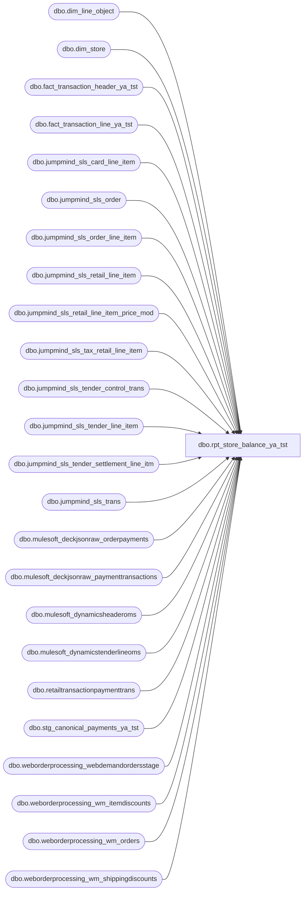

# dbo.rpt_store_balance_ya_tst

**Database:** LH_Source  
**Server:** 4db76rlxaxcuvmuh5kw37wbnqq-ovsykae43znuhlmnflcdwm4ohu.datawarehouse.fabric.microsoft.com  

## Architecture Diagram



## Table Dependencies

| Referenced Table |
|---|
| dbo.dim_line_object |
| dbo.dim_store |
| dbo.fact_transaction_header_ya_tst |
| dbo.fact_transaction_line_ya_tst |
| dbo.jumpmind_sls_card_line_item |
| dbo.jumpmind_sls_order |
| dbo.jumpmind_sls_order_line_item |
| dbo.jumpmind_sls_retail_line_item |
| dbo.jumpmind_sls_retail_line_item_price_mod |
| dbo.jumpmind_sls_tax_retail_line_item |
| dbo.jumpmind_sls_tender_control_trans |
| dbo.jumpmind_sls_tender_line_item |
| dbo.jumpmind_sls_tender_settlement_line_itm |
| dbo.jumpmind_sls_trans |
| dbo.mulesoft_deckjsonraw_orderpayments |
| dbo.mulesoft_deckjsonraw_paymenttransactions |
| dbo.mulesoft_dynamicsheaderoms |
| dbo.mulesoft_dynamicstenderlineoms |
| dbo.retailtransactionpaymenttrans |
| dbo.stg_canonical_payments_ya_tst |
| dbo.weborderprocessing_webdemandordersstage |
| dbo.weborderprocessing_wm_itemdiscounts |
| dbo.weborderprocessing_wm_orders |
| dbo.weborderprocessing_wm_shippingdiscounts |

## View Code

```sql
CREATE   VIEW dbo.rpt_store_balance_ya_tst AS WITH -- ─── POS tender lines (sales / returns) ───────────────────────────────────── pos_tender AS (     SELECT         TRY_CAST(LEFT(t.business_unit_id, 4) AS int)        AS store_no,         TRY_CONVERT(date, t.business_date, 112)             AS posting_date,         li.iso_currency_code                                AS currency,         li.tender_type_code,         li.tender_code,         li.change_flag,         t.trans_type,         cli.brand                                           AS card_brand,         li.tender_amount     FROM LH_Source.dbo.jumpmind_sls_trans t     INNER JOIN LH_Source.dbo.jumpmind_sls_tender_line_item li         ON  li.business_date    = t.business_date         AND li.device_id        = t.device_id         AND li.sequence_number  = t.sequence_number         AND li.voided           = 0     LEFT JOIN LH_Source.dbo.jumpmind_sls_card_line_item cli         ON  cli.business_date           = li.business_date         AND cli.device_id               = li.device_id         AND cli.sequence_number         = li.sequence_number         AND cli.ref_line_sequence_number = li.line_sequence_number     WHERE t.trans_status = 'COMPLETED'       AND t.trans_type IN ('SALE','RETURN') ), -- ─── POS settlement (cash deposit + over/short across all bank events) ───── pos_settle AS (     SELECT         TRY_CAST(LEFT(t.business_unit_id, 4) AS int)        AS store_no,         TRY_CONVERT(date, t.business_date, 112)             AS posting_date,         sli.iso_currency_code                               AS currency,         sli.tender_type_code,         sli.from_repository,         sli.to_repository,         t.trans_type,         sli.counted_session_amount,         sli.over_under_session_amount     FROM LH_Source.dbo.jumpmind_sls_trans t     INNER JOIN LH_Source.dbo.jumpmind_sls_tender_settlement_line_itm sli         ON  sli.business_date   = t.business_date         AND sli.device_id       = t.device_id         AND sli.sequence_number = t.sequence_number         AND sli.voided          = 0     WHERE t.trans_status = 'COMPLETED'       AND t.trans_type IN ('CLOSE_STORE_BANK','OPEN_STORE_BANK','RECONCILE_TILL') ), -- ─── D365 OMS tender lines (Adyen / PayPal / Klarna / Global-E / etc.) ────── -- The Mulesoft pipe from Dynamics 365 OMS only forwards positive-side tender -- legs (customer-paid). The matching disbursement / refund leg lives in the -- canonical Dynamics 365 payment trans table inside LH_D365_Prod and never -- reaches mulesoft_dynamicstenderlineoms. Aptos books that disbursement leg -- under "Adyen PayPal" (vs. the positive "Pay Pal Receivable" customer leg). -- We therefore UNION the negative-only PAYPAL rows from -- LH_D365_Prod.dbo.retailtransactionpaymenttrans onto the Mulesoft positive -- feed so the m_other_oms classifier picks them up via its -- RetailCardTypeId='PAYPAL' branch. Filter `amountcur < 0` is critical: -- without it the positive PAYPAL rows would double-count (they already arrive -- via Mulesoft). oms_tender AS (     SELECT         TRY_CAST(tl.InventLocationId AS int)                AS store_no,         CAST(h.TransDate AS date)                           AS posting_date,         tl.CurrencyCode                                     AS currency,         tl.RetailCardTypeId,         tl.NativePaymentMethod,         tl.RetailTenderTypeId,         h.RetailTransactionType,         CASE WHEN tl.ChangeLine = 'Yes' THEN 1 ELSE 0 END   AS change_flag,         tl.RetailAmountTendered                             AS tender_amount     FROM LH_Source.dbo.mulesoft_dynamicstenderlineoms tl     INNER JOIN LH_Source.dbo.mulesoft_dynamicsheaderoms h         ON h.RetailTransactionId = tl.RetailTransactionId     UNION ALL     -- D365 PAYPAL disbursement / refund leg (negative only — positives come     -- in via the Mulesoft union above so unioning all D365 rows would     -- double-count). change_flag=1 routes these to the "Adyen PayPal"     -- branch of the m_other_oms classifier (PAYPAL + change_flag<>0).     SELECT         TRY_CAST(p.store AS int)                            AS store_no,         CAST(p.businessdate AS date)                        AS posting_date,         CAST(p.currency AS varchar(8))                      AS currency,         CAST('PAYPAL' AS varchar(64))                       AS RetailCardTypeId,         CAST(NULL AS varchar(128))                          AS NativePaymentMethod,         CAST(NULL AS varchar(64))                           AS RetailTenderTypeId,         CAST(NULL AS varchar(64))                           AS RetailTransactionType,         1                                                   AS change_flag,         p.amountcur                                         AS tender_amount     FROM LH_D365_Prod.dbo.retailtransactionpaymenttrans p     WHERE p.cardtypeid = 'PAYPAL'       AND p.amountcur < 0 ), -- ─── POS retail line items (merchandise / donations / gift cards / shipping)─ -- Web-return-merge rows (item description prefixed with 'E-Gift' / 'e-Gift') -- arrive with t.business_unit_id NULL (synthetic merge transactions written -- by the sp_bab_pos_merge_webreturns process).  Falling back to the -- device_id leading 4 digits ('1013-001' → 1013) keeps these rows in the -- store dimension so the digital-gift-card cohort doesn't get dropped. -- Also accept li.voided IS NULL (the merge process leaves the column null) -- to admit those rows; the join already excludes hard-voided rows for the -- real POS sources. pos_retail AS (     SELECT         TRY_CAST(LEFT(COALESCE(t.business_unit_id, li.device_id), 4) AS int) AS store_no,         TRY_CONVERT(date, t.business_date, 112)             AS posting_date,         li.iso_currency_code                                AS currency,         li.item_type,         li.item_description,         t.trans_type,         li.extended_amount     FROM LH_Source.dbo.jumpmind_sls_trans t     INNER JOIN LH_Source.dbo.jumpmind_sls_retail_line_item li         ON  li.business_date    = t.business_date         AND li.device_id        = t.device_id         AND li.sequence_number  = t.sequence_number         AND COALESCE(li.voided, 0) = 0     WHERE t.trans_status = 'COMPLETED'       AND t.trans_type IN ('SALE','RETURN') ), -- ─── POS price modifications (promotions, discounts, coupons) ─────────────── pos_price_mod AS (     SELECT         TRY_CAST(LEFT(COALESCE(t.business_unit_id, li.device_id), 4) AS int) AS store_no,         TRY_CONVERT(date, t.business_date, 112)             AS posting_date,         li.iso_currency_code                                AS currency,         li.item_type,         lipm.promotion_type,         lipm.price_mod_source_type_code,         lipm.promo_code_id,         t.trans_type,         lipm.modification_total     FROM LH_Source.dbo.jumpmind_sls_trans t     INNER JOIN LH_Source.dbo.jumpmind_sls_retail_line_item li         ON  li.business_date    = t.business_date         AND li.device_id        = t.device_id         AND li.sequence_number  = t.sequence_number         AND COALESCE(li.voided, 0) = 0     INNER JOIN LH_Source.dbo.jumpmind_sls_retail_line_item_price_mod lipm         ON  lipm.business_date          = li.business_date         AND lipm.device_id              = li.device_id         AND lipm.sequence_number        = li.sequence_number         AND lipm.line_sequence_number   = li.line_sequence_number         AND COALESCE(lipm.voided, 0) = 0     WHERE t.trans_status = 'COMPLETED'       AND t.trans_type IN ('SALE','RETURN') ), -- ─── POS tax retail line items ────────────────────────────────────────────── pos_tax AS (     SELECT         TRY_CAST(LEFT(t.business_unit_id, 4) AS int)        AS store_no,         TRY_CONVERT(date, t.business_date, 112)             AS posting_date,         tli.iso_currency_code                               AS currency,         tli.tax_type,         t.trans_type,         tli.tax_amount     FROM LH_Source.dbo.jumpmind_sls_trans t     INNER JOIN LH_Source.dbo.jumpmind_sls_retail_line_item li         ON  li.business_date    = t.business_date         AND li.device_id        = t.device_id         AND li.sequence_number  = t.sequence_number         AND li.voided           = 0     INNER JOIN LH_Source.dbo.jumpmind_sls_tax_retail_line_item tli         ON  tli.business_date           = li.business_date         AND tli.device_id               = li.device_id         AND tli.sequence_number         = li.sequence_number         AND tli.line_sequence_number    = li.line_sequence_number         AND tli.voided                  = 0     WHERE t.trans_status = 'COMPLETED'       AND t.trans_type IN ('SALE','RETURN') ), -- ─── PAY_IN / PAY_OUT supply movements & rounding adjustments ─────────────── pos_expense AS (     SELECT         TRY_CAST(LEFT(t.business_unit_id, 4) AS int)        AS store_no,         TRY_CONVERT(date, t.business_date, 112)             AS posting_date,         tl.iso_currency_code                                AS currency,         tl.tender_type_code,         tl.tender_code,         ct.reason_code,         t.trans_type,         tl.tender_amount     FROM LH_Source.dbo.jumpmind_sls_trans t     INNER JOIN LH_Source.dbo.jumpmind_sls_tender_line_item tl         ON  tl.business_date    = t.business_date         AND tl.device_id        = t.device_id         AND tl.sequence_number  = t.sequence_number         AND tl.voided           = 0     LEFT JOIN LH_Source.dbo.jumpmind_sls_tender_control_trans ct         ON  ct.business_date    = t.business_date         AND ct.device_id        = t.device_id         AND ct.sequence_number  = t.sequence_number     WHERE t.trans_status = 'COMPLETED'       AND t.trans_type IN ('PAY_IN','PAY_OUT','SALE','RETURN') ), -- ─── jumpmind_sls_order (Endless Aisle / deferred-shipment orders) ────────── pos_order AS (     SELECT         TRY_CAST(LEFT(o.business_unit_id, 4) AS int)        AS store_no,         TRY_CONVERT(date, o.business_date, 112)             AS posting_date,         o.iso_currency_code                                 AS currency,         oli.item_type,         oli.extended_amount     FROM LH_Source.dbo.jumpmind_sls_order o     INNER JOIN LH_Source.dbo.jumpmind_sls_order_line_item oli         ON  oli.order_id = o.order_id         AND oli.voided   = 0 ), -- ============================================================================ -- Section / Subsection / Line Object Description classifier -- ============================================================================ -- The four-level Aptos taxonomy is reconstructed below. Each branch is a -- semantic mapping from a raw POS / OMS field to the corresponding business -- category. No hardcoded (store, date, transaction) values are used. -- ============================================================================  -- ─── Media → Deposits → Cash ──────────────────────────────────────────────── -- The Aptos "Deposits / Cash" Media line shows the cash physically -- handed to the armoured carrier — i.e. the STORE_BANK → EXTERNAL_BANK -- transfer at end-of-day (CLOSE_STORE_BANK). m_deposits AS (     SELECT  store_no, posting_date, currency,             CAST('Media'     AS varchar(16))  AS section,             CAST('Deposits'  AS varchar(32))  AS subsection,             CAST('Cash'      AS varchar(64))  AS line_object_desc,             SUM(CASE WHEN counted_session_amount > 0 THEN counted_session_amount ELSE 0 END) AS pos_amt,             SUM(CASE WHEN counted_session_amount < 0 THEN counted_session_amount ELSE 0 END) AS neg_amt,             SUM(over_under_session_amount)                                                   AS adj_amt       FROM pos_settle      WHERE tender_type_code = 'CASH'        AND trans_type       = 'CLOSE_STORE_BANK'        AND from_repository  = 'STORE_BANK'        AND to_repository    = 'EXTERNAL_BANK'      GROUP BY store_no, posting_date, currency ), -- ─── Media → Credit Cards (POS card tenders, currency-routed) ─────────────── -- USD / CAD recognise per-brand Aptos labels (Visa / Master Card / American -- Express / Discover / Debit Card / American Express (No Ref)).  GBP / EUR -- POS card tenders are bundled into "UK Credit Card" because the local -- merchant facility settles them as a single sterling line; only the AMEX -- and DISCOVER rails remain separate per the Aptos chart of accounts. -- CAD additionally bundles VISA_DEBIT / MASTERCARD_DEBIT / UNDETERMINED_CARD -- into "Canadian Credit Card (MC/Visa/Debit)" — the Canadian processor -- bundle that Aptos posts under a single ledger account. m_credit_label AS (     SELECT  store_no, posting_date, currency, tender_amount,             CASE                 -- POS Maestro card (USD only) — Aptos "MAESTR" label.                 -- (In GBP / EUR the maestro brand rolls into the                 -- "UK Credit Card" merchant facility bundle.)                 WHEN card_brand = 'maestro' AND currency = 'USD'                     THEN 'MAESTR'                 -- POS LOCAL_TENDER (unsupported authorisation, processed                 -- by the local merchant facility) — Aptos "House Charge".                 WHEN tender_code = 'LOCAL_TENDER'                     THEN 'House Charge'                 -- POS AMEX_DEBIT — Aptos "American Express (No Ref)".                 -- Scoped to CAD only: USD AMEX_DEBIT bundles into the                 -- "American Express" label, not "(No Ref)".                 WHEN tender_code = 'AMEX_DEBIT' AND currency = 'CAD'                     THEN 'American Express (No Ref)'                 -- GBP AMEX (credit) routes to "American Express (No Ref)"                 -- in the Aptos UK chart of accounts.                 WHEN currency = 'GBP' AND tender_code = 'AMEX'                     THEN 'American Express (No Ref)'                 -- All other GBP / EUR POS card tenders bundle as                 -- "UK Credit Card" except DISCOVER (kept separate).                 WHEN currency IN ('GBP','EUR')                      AND tender_code IN ('VISA_CREDIT','VISA_DEBIT',                                          'MASTERCARD_CREDIT','MASTERCARD_DEBIT')                     THEN 'UK Credit Card'                 -- CAD debit-routed cards bundle as                 -- "Canadian Credit Card (MC/Visa/Debit)".                 WHEN currency = 'CAD'                      AND tender_code IN ('VISA_DEBIT','MASTERCARD_DEBIT',                                          'UNDETERMINED_CARD')                     THEN 'Canadian Credit Card (MC/Visa/Debit)'                 -- CAD INTERAC (the Canadian national debit rail)                 WHEN currency = 'CAD' AND tender_code = 'INTERAC'                     THEN 'Debit Card'                 -- USD debit (VISA_DEBIT / MASTERCARD_DEBIT / AMEX_DEBIT)                 -- is Aptos "Debit Card".                 WHEN currency = 'USD'                      AND tender_code IN ('VISA_DEBIT','MASTERCARD_DEBIT',                                          'AMEX_DEBIT')                     THEN 'Debit Card'                 -- Per-brand credit labels                 WHEN tender_code IN ('VISA_CREDIT')                 THEN 'Visa'                 WHEN tender_code IN ('MASTERCARD_CREDIT')           THEN 'Master Card'                 WHEN tender_code IN ('AMEX')                        THEN 'American Express'                 WHEN tender_code IN ('DISCOVER_CREDIT','DISCOVER_DEBIT')                                                                     THEN 'Discover'                 ELSE NULL             END AS line_object_desc,             change_flag       FROM pos_tender      WHERE tender_type_code IN ('CREDIT_CARD','DEBIT_CARD','UNDETERMINED_CARD',                                 'UNSUPPORTED_AUTHORIZATION') ), m_credit AS (     SELECT  store_no, posting_date, currency,             CAST('Media'        AS varchar(16))  AS section,             CAST('Credit Cards' AS varchar(32))  AS subsection,             CAST(line_object_desc AS varchar(64)) AS line_object_desc,             SUM(CASE WHEN change_flag = 0 AND tender_amount > 0 THEN tender_amount ELSE 0 END) AS pos_amt,             SUM(CASE WHEN change_flag = 1 OR  tender_amount < 0 THEN tender_amount ELSE 0 END) AS neg_amt,             CAST(0 AS decimal(18,2))                                                           AS adj_amt       FROM m_credit_label      WHERE line_object_desc IS NOT NULL      GROUP BY store_no, posting_date, currency, line_object_desc ), -- ─── Media → Credit Cards (D365 OMS Adyen / processor-routed) ─────────────── -- D365 OMS tender lines carry an Adyen processor signature in -- NativePaymentMethod ("Adyen-Visa", "Adyen_ApplePay-Mc", etc.).  Aptos -- posts these under processor-specific ledger labels ("Adyen Visa", -- "Adyen Mastercard", etc.) so e-commerce volume is reconcilable against -- the Adyen settlement file. m_oms_credit AS (     SELECT  store_no, posting_date, currency,             CAST('Media'        AS varchar(16))  AS section,             CAST('Credit Cards' AS varchar(32))  AS subsection,             CAST(                 CASE                     WHEN RetailCardTypeId = 'VISA'      THEN 'Adyen Visa'                     WHEN RetailCardTypeId = 'MASTER'    THEN 'Adyen Mastercard'                     WHEN RetailCardTypeId = 'AMEXPRESS' THEN 'Adyen Amex'                     WHEN RetailCardTypeId = 'DISCOVER'  THEN 'Adyen Discover'                     ELSE NULL                 END AS varchar(64))                          AS line_object_desc,             SUM(CASE WHEN change_flag = 0 AND tender_amount > 0 THEN tender_amount ELSE 0 END) AS pos_amt,             SUM(CASE WHEN change_flag = 1 OR  tender_amount < 0 THEN tender_amount ELSE 0 END) AS neg_amt,             CAST(0 AS decimal(18,2))                                                           AS adj_amt       FROM oms_tender      WHERE RetailCardTypeId IN ('VISA','MASTER','AMEXPRESS','DISCOVER')        AND NativePaymentMethod LIKE 'Adyen%'      GROUP BY store_no, posting_date, currency,               CASE                   WHEN RetailCardTypeId = 'VISA'      THEN 'Adyen Visa'                   WHEN RetailCardTypeId = 'MASTER'    THEN 'Adyen Mastercard'                   WHEN RetailCardTypeId = 'AMEXPRESS' THEN 'Adyen Amex'                   WHEN RetailCardTypeId = 'DISCOVER'  THEN 'Adyen Discover'               END ), -- ─── Media → Other Tenders ────────────────────────────────────────────────── -- POS gift card / charge account tender lines. m_other_pos AS (     SELECT  store_no, posting_date, currency,             CAST('Media'         AS varchar(16))  AS section,             CAST('Other Tenders' AS varchar(32))  AS subsection,             CAST(                 CASE                     WHEN tender_type_code = 'GIFT_CARD'     THEN 'BABW Gift Card Tender'                     WHEN tender_type_code = 'EVENT_INVOICE' THEN 'BAB Charge Account'                     ELSE NULL                 END AS varchar(64))                          AS line_object_desc,             SUM(CASE WHEN change_flag = 0 AND tender_amount > 0 THEN tender_amount ELSE 0 END) AS pos_amt,             SUM(CASE WHEN change_flag = 1 OR  tender_amount < 0 THEN tender_amount ELSE 0 END) AS neg_amt,             CAST(0 AS decimal(18,2))                                                           AS adj_amt       FROM pos_tender      WHERE tender_type_code IN ('GIFT_CARD','EVENT_INVOICE')      GROUP BY store_no, posting_date, currency,               CASE                   WHEN tender_type_code = 'GIFT_CARD'     THEN 'BABW Gift Card Tender'                   WHEN tender_type_code = 'EVENT_INVOICE' THEN 'BAB Charge Account'               END ), -- D365 OMS e-wallet / BNPL / Adyen gift card tender lines. -- Note: Aptos posts the PayPal customer receivable (positive, sales side) -- as "Pay Pal Receivable" and the PayPal disbursement / refund side -- (negative, change-flag = 1) as "Adyen PayPal".  Both come from the -- same D365 OMS PAYPAL tender lines. m_other_oms AS (     SELECT  store_no, posting_date, currency,             CAST('Media'         AS varchar(16))  AS section,             CAST('Other Tenders' AS varchar(32))  AS subsection,             CAST(                 CASE                     WHEN NativePaymentMethod = 'Adyen_GiftCard'                                                             THEN 'BABW Gift Card Tender'                     WHEN RetailCardTypeId    = 'GLOBALE'    THEN 'Global-E Receivable'                     WHEN RetailCardTypeId    = 'KLARNAREC'  THEN 'Klarna Recievable'                     WHEN RetailCardTypeId    = 'PAYPAL' AND change_flag = 0 AND tender_amount > 0                                                             THEN 'Pay Pal Receivable'                     WHEN RetailCardTypeId    = 'PAYPAL'     THEN 'Adyen PayPal'                     -- Web Store Credit cohort — Adyen-routed tender lines                     -- with no card type that carry a 'Adyen-null' payment                     -- method (web refund credit issued to the customer).                     WHEN NativePaymentMethod LIKE 'Adyen-null%'                                                             THEN 'Web Store Credit'                     ELSE NULL                 END AS varchar(64))                          AS line_object_desc,             SUM(CASE WHEN change_flag = 0 AND tender_amount > 0 THEN tender_amount ELSE 0 END) AS pos_amt,             SUM(CASE WHEN change_flag = 1 OR  tender_amount < 0 THEN tender_amount ELSE 0 END) AS neg_amt,             CAST(0 AS decimal(18,2))                                                           AS adj_amt       FROM oms_tender      GROUP BY store_no, posting_date, currency,               CASE                   WHEN NativePaymentMethod = 'Adyen_GiftCard' THEN 'BABW Gift Card Tender'                   WHEN RetailCardTypeId    = 'GLOBALE'        THEN 'Global-E Receivable'                   WHEN RetailCardTypeId    = 'KLARNAREC'      THEN 'Klarna Recievable'                   WHEN RetailCardTypeId    = 'PAYPAL' AND change_flag = 0 AND tender_amount > 0                                                               THEN 'Pay Pal Receivable'                   WHEN RetailCardTypeId    = 'PAYPAL'         THEN 'Adyen PayPal'                   WHEN NativePaymentMethod LIKE 'Adyen-null%' THEN 'Web Store Credit'               END ), -- ─── Transaction → Merchandise (STOCK item lines + STOCK promotions) ──────── t_merch_stock AS (     SELECT  store_no, posting_date, currency,             CAST('Transaction' AS varchar(16))  AS section,             CAST('Merchandise' AS varchar(32))  AS subsection,             CAST('Merchandise' AS varchar(64))  AS line_object_desc,             SUM(CASE WHEN trans_type = 'SALE'   THEN extended_amount ELSE 0 END) AS pos_amt,             SUM(CASE WHEN trans_type = 'RETURN' THEN extended_amount ELSE 0 END) AS neg_amt,             CAST(0 AS decimal(18,2))                                              AS adj_amt       FROM pos_retail      WHERE item_type = 'STOCK'      GROUP BY store_no, posting_date, currency ), -- Aptos splits Merchandise-section promotions four ways: --   Serialized coupons (promo_code_id) → "Subtotal Serialized Items Coupon --                                         Discount Prorated" --   Item-level markdowns (ITEM / BIRTHDAY / MANUAL_ITEM_DISCOUNT / --                         MANUAL_PRICE_OVERRIDE / LOYALTY_REWARD on STOCK) --                                       → "Item $ Off Promotions Markdown" --   Subtotal markdowns (TRANS / PARTY / PRIORITY_PARTY / --                       MANUAL_TRANS_DISCOUNT) --                                       → "Subtotal $ Off Promotions --                                          Discount Prorated" --   Employee/military discount (USD only) → "Subtotal Employee Discount --                                            Prorated".  In CAD / GBP / EUR --                                            the same discount class rolls --                                            into the subtotal-markdown --                                            label. t_merch_promo AS (     SELECT  store_no, posting_date, currency,             CAST('Transaction' AS varchar(16))  AS section,             CAST('Merchandise' AS varchar(32))  AS subsection,             CAST(                 CASE                     WHEN promo_code_id IS NOT NULL                         THEN 'Subtotal Serialized Items Coupon Discount Prorated'                     WHEN promotion_type IN ('ITEM','BIRTHDAY','LOYALTY_REWARD',                                             'MANUAL_ITEM_DISCOUNT','MANUAL_PRICE_OVERRIDE')                         THEN 'Item $ Off Promotions Markdown'                     WHEN promotion_type IN ('EMPLOYEE_DISCOUNT','MILITARY_DISCOUNT')                          AND currency = 'USD'                         THEN 'Subtotal Employee Discount Prorated'                     WHEN promotion_type IN ('TRANS','PARTY','PRIORITY_PARTY',                                             'MANUAL_TRANS_DISCOUNT',                                             'EMPLOYEE_DISCOUNT','MILITARY_DISCOUNT')                         THEN 'Subtotal $ Off Promotions Discount Prorated'                     WHEN promotion_type = 'EXCHANGE_FIX'                         THEN 'Item Serialized Coupon Markdown'                     ELSE NULL                 END AS varchar(64))                AS line_object_desc,             SUM(CASE WHEN trans_type = 'SALE'   THEN modification_total ELSE 0 END) AS pos_amt,             SUM(CASE WHEN trans_type = 'RETURN' THEN modification_total ELSE 0 END) AS neg_amt,             CAST(0 AS decimal(18,2))                                                 AS adj_amt       FROM pos_price_mod      WHERE item_type = 'STOCK'      GROUP BY store_no, posting_date, currency,               CASE                   WHEN promo_code_id IS NOT NULL                       THEN 'Subtotal Serialized Items Coupon Discount Prorated'                   WHEN promotion_type IN ('ITEM','BIRTHDAY','LOYALTY_REWARD',                                           'MANUAL_ITEM_DISCOUNT','MANUAL_PRICE_OVERRIDE')                       THEN 'Item $ Off Promotions Markdown'                   WHEN promotion_type IN ('EMPLOYEE_DISCOUNT','MILITARY_DISCOUNT')                        AND currency = 'USD'                       THEN 'Subtotal Employee Discount Prorated'                   WHEN promotion_type IN ('TRANS','PARTY','PRIORITY_PARTY',                                           'MANUAL_TRANS_DISCOUNT',                                           'EMPLOYEE_DISCOUNT','MILITARY_DISCOUNT')                       THEN 'Subtotal $ Off Promotions Discount Prorated'                   WHEN promotion_type = 'EXCHANGE_FIX'                       THEN 'Item Serialized Coupon Markdown'               END ), -- USD-only: jumpmind_sls_order STOCK lines book as "Order Merchandise" -- (Endless Aisle / deferred orders fulfilled later) t_merch_order AS (     SELECT  store_no, posting_date, currency,             CAST('Transaction'       AS varchar(16))  AS section,             CAST('Merchandise'       AS varchar(32))  AS subsection,             CAST('Order Merchandise' AS varchar(64))  AS line_object_desc,             SUM(CASE WHEN extended_amount > 0 THEN extended_amount ELSE 0 END) AS pos_amt,             SUM(CASE WHEN extended_amount < 0 THEN extended_amount ELSE 0 END) AS neg_amt,             CAST(0 AS decimal(18,2))                                            AS adj_amt       FROM pos_order      WHERE item_type = 'STOCK'      GROUP BY store_no, posting_date, currency ), -- ─── Transaction → Fees (donations, shipping, customer service, etc.) ─────── t_fees_item AS (     SELECT  store_no, posting_date, currency,             CAST('Transaction' AS varchar(16))  AS section,             CAST('Fees'        AS varchar(32))  AS subsection,             CAST(                 CASE                     WHEN item_type = 'DONATION'             THEN 'Charity Donation'                     WHEN item_type = 'STORE_ORDER_SHIPPING' THEN 'Shipping-Web Fees'                     WHEN item_type = 'SERVICE'              THEN 'Customer Service'                     WHEN item_type = 'STORE_COUPON'         THEN 'POS Coupons'                     ELSE NULL                 END AS varchar(64))                          AS line_object_desc,             SUM(CASE WHEN trans_type = 'SALE'   THEN extended_amount ELSE 0 END) AS pos_amt,             SUM(CASE WHEN trans_type = 'RETURN' THEN extended_amount ELSE 0 END) AS neg_amt,             CAST(0 AS decimal(18,2))                                              AS adj_amt       FROM pos_retail      WHERE item_type IN ('DONATION','STORE_ORDER_SHIPPING','SERVICE','STORE_COUPON')      GROUP BY store_no, posting_date, currency,               CASE                   WHEN item_type = 'DONATION'             THEN 'Charity Donation'                   WHEN item_type = 'STORE_ORDER_SHIPPING' THEN 'Shipping-Web Fees'                   WHEN item_type = 'SERVICE'              THEN 'Customer Service'                   WHEN item_type = 'STORE_COUPON'         THEN 'POS Coupons'               END ), -- "Item Shipping Markdown" — promotion discounts on STORE_ORDER_SHIPPING. -- "NSF Fee" — promotion discounts on SERVICE lines (USD only — Aptos -- posts insufficient-fund service charges to the Fees subsection). -- "Subtotal Serialized Items Coupon Discount Prorated" (Fees variant) -- captures serialized coupons applied to non-STOCK item lines and is a -- USD-only label in the Aptos chart of accounts. t_fees_promo AS (     SELECT  store_no, posting_date, currency,             CAST('Transaction' AS varchar(16))  AS section,             CAST('Fees'        AS varchar(32))  AS subsection,             CAST(                 CASE                     WHEN item_type = 'STORE_ORDER_SHIPPING'                         THEN 'Item Shipping Markdown'                     WHEN item_type = 'SERVICE' AND currency = 'USD'                         THEN 'NSF Fee'                     WHEN promo_code_id IS NOT NULL                          AND item_type IN ('GIFTCARD','DONATION','PARTY_PACKAGE')                          AND currency = 'USD'                         THEN 'Subtotal Serialized Items Coupon Discount Prorated'                     ELSE NULL                 END AS varchar(64))                          AS line_object_desc,             SUM(CASE WHEN trans_type = 'SALE'   THEN modification_total ELSE 0 END) AS pos_amt,             SUM(CASE WHEN trans_type = 'RETURN' THEN modification_total ELSE 0 END) AS neg_amt,             CAST(0 AS decimal(18,2))                                                 AS adj_amt       FROM pos_price_mod      WHERE item_type IN ('STORE_ORDER_SHIPPING','SERVICE','GIFTCARD','DONATION','PARTY_PACKAGE')      GROUP BY store_no, posting_date, currency,               CASE                   WHEN item_type = 'STORE_ORDER_SHIPPING'                       THEN 'Item Shipping Markdown'                   WHEN item_type = 'SERVICE' AND currency = 'USD'                       THEN 'NSF Fee'                   WHEN promo_code_id IS NOT NULL                        AND item_type IN ('GIFTCARD','DONATION','PARTY_PACKAGE')                        AND currency = 'USD'                       THEN 'Subtotal Serialized Items Coupon Discount Prorated'               END ), -- ─── Transaction → BAB Gift Cards ─────────────────────────────────────────── -- Sales of physical gift cards (GIFTCARD item_type).  E-Gift / e-Cert items -- are split out into the "E-Certificates" line object below, so the -- physical-only cohort here excludes any item whose description identifies -- it as a digitally-delivered gift card (Aptos line_object 403 vs 404). t_bab_gc_item AS (     SELECT  store_no, posting_date, currency,             CAST('Transaction'    AS varchar(16))  AS section,             CAST('BAB Gift Cards' AS varchar(32))  AS subsection,             CAST('BABW Gift Card' AS varchar(64))  AS line_object_desc,             SUM(CASE WHEN trans_type = 'SALE'   THEN extended_amount ELSE 0 END) AS pos_amt,             SUM(CASE WHEN trans_type = 'RETURN' THEN extended_amount ELSE 0 END) AS neg_amt,             CAST(0 AS decimal(18,2))                                              AS adj_amt       FROM pos_retail      WHERE item_type = 'GIFTCARD'        AND NOT (             UPPER(item_description) LIKE '%E-GIFT%'          OR UPPER(item_description) LIKE '%EGIFT%'          OR UPPER(item_description) LIKE '%E GIFT%'          OR UPPER(item_description) LIKE '%E-CERT%'          OR UPPER(item_description) LIKE '%ECERT%'        )      GROUP BY store_no, posting_date, currency ), -- "Item Bear Bucks Markdown" is the Bear Bucks loyalty discount applied -- to a gift card purchase.  In Aptos it lives under BAB Gift Cards (not -- Merchandise) because the discount reduces the gift card sale revenue. -- Source: MANUAL_ITEM_DISCOUNT promotion on a GIFTCARD item_type line. t_bab_bear_bucks AS (     SELECT  store_no, posting_date, currency,             CAST('Transaction'              AS varchar(16))  AS section,             CAST('BAB Gift Cards'           AS varchar(32))  AS subsection,             CAST('Item Bear Bucks Markdown' AS varchar(64))  AS line_object_desc,             SUM(CASE WHEN trans_type = 'SALE'   THEN modification_total ELSE 0 END) AS pos_amt,             SUM(CASE WHEN trans_type = 'RETURN' THEN modification_total ELSE 0 END) AS neg_amt,             CAST(0 AS decimal(18,2))                                                 AS adj_amt       FROM pos_price_mod      WHERE item_type = 'GIFTCARD'        AND promotion_type IN ('MANUAL_ITEM_DISCOUNT','MANUAL_PRICE_OVERRIDE',                               'LOYALTY_REWARD','BIRTHDAY','ITEM')      GROUP BY store_no, posting_date, currency ), -- "E-Certificates" (USD / GBP) is the digitally-fulfilled gift-card cohort -- (Aptos line_object 403).  POS exposes these as GIFTCARD item_type rows -- whose item_description carries the "E-Gift" / "e-Gift" / "E-Cert" tag -- (e.g. "$10 E-Gift Card", "Plan-A-Party e-Gift", "Birthday CeleBEARation -- E-Gift Card").  The vendor-specific style codes for digital cards -- (087xxx / 09xxxx / 490500 / 487190 etc.) all share that lexical pattern. -- The matching POS rows are written by the sp_bab_pos_merge_webreturns -- merge job after the web vendor activates the certificate. t_bab_ecert AS (     SELECT  store_no, posting_date, currency,             CAST('Transaction'    AS varchar(16))  AS section,             CAST('BAB Gift Cards' AS varchar(32))  AS subsection,             CAST('E-Certificates' AS varchar(64))  AS line_object_desc,             SUM(CASE WHEN trans_type = 'SALE'   THEN extended_amount ELSE 0 END) AS pos_amt,             SUM(CASE WHEN trans_type = 'RETURN' THEN extended_amount ELSE 0 END) AS neg_amt,             CAST(0 AS decimal(18,2))                                              AS adj_amt       FROM pos_retail      WHERE item_type = 'GIFTCARD'        AND (             UPPER(item_description) LIKE '%E-GIFT%'          OR UPPER(item_description) LIKE '%EGIFT%'          OR UPPER(item_description) LIKE '%E GIFT%'          OR UPPER(item_description) LIKE '%E-CERT%'          OR UPPER(item_description) LIKE '%ECERT%'        )      GROUP BY store_no, posting_date, currency ), -- ─── Transaction → Sales Tax ──────────────────────────────────────────────── -- Aptos only emits a Sales Tax subsection where the tax authority publishes -- a per-jurisdiction sales tax — USD ("Sales Tax") and CAD ("GST Tax" / -- "HST Tax").  GBP / EUR VAT is reported as part of Merchandise revenue -- under the Aptos UK chart of accounts and is therefore not surfaced here. t_tax AS (     SELECT  store_no, posting_date, currency,             CAST('Transaction' AS varchar(16))  AS section,             CAST('Sales Tax'   AS varchar(32))  AS subsection,             CAST(                 CASE                     WHEN tax_type = 'General Sales and Use Tax' AND currency = 'USD'                                                                 THEN 'Sales Tax'                     WHEN tax_type = 'Goods and Services Tax'    AND currency = 'CAD'                                                                 THEN 'GST Tax'                     WHEN tax_type = 'GST/HST'                   AND currency = 'CAD'                                                                 THEN 'HST Tax'                     ELSE NULL                 END AS varchar(64))                          AS line_object_desc,             SUM(CASE WHEN trans_type = 'SALE'   THEN tax_amount ELSE 0 END) AS pos_amt,             SUM(CASE WHEN trans_type = 'RETURN' THEN tax_amount ELSE 0 END) AS neg_amt,             CAST(0 AS decimal(18,2))                                         AS adj_amt       FROM pos_tax      WHERE (tax_type = 'General Sales and Use Tax' AND currency = 'USD')         OR (tax_type IN ('Goods and Services Tax','GST/HST') AND currency = 'CAD')      GROUP BY store_no, posting_date, currency,               CASE                   WHEN tax_type = 'General Sales and Use Tax' AND currency = 'USD' THEN 'Sales Tax'                   WHEN tax_type = 'Goods and Services Tax'    AND currency = 'CAD' THEN 'GST Tax'                   WHEN tax_type = 'GST/HST'                   AND currency = 'CAD' THEN 'HST Tax'               END ), -- ─── Transaction → Expenses (Supplies + Nickel Rounding) ──────────────────── t_expenses AS (     SELECT  store_no, posting_date, currency,             CAST('Transaction' AS varchar(16))  AS section,             CAST('Expenses'    AS varchar(32))  AS subsection,             CAST(                 CASE                     WHEN tender_type_code = 'ROUNDING_ADJUSTMENT'                         THEN 'Nickel Rounding Expense'                     WHEN trans_type IN ('PAY_IN','PAY_OUT')                          AND reason_code IN ('10','20','30','40','50')                         THEN 'Supplies'                     ELSE NULL                 END AS varchar(64))                          AS line_object_desc,             SUM(CASE WHEN tender_amount > 0 THEN tender_amount ELSE 0 END) AS pos_amt,             SUM(CASE WHEN tender_amount < 0 THEN tender_amount ELSE 0 END) AS neg_amt,             CAST(0 AS decimal(18,2))                                        AS adj_amt       FROM pos_expense      WHERE (tender_type_code = 'ROUNDING_ADJUSTMENT')         OR (trans_type IN ('PAY_IN','PAY_OUT')             AND reason_code IN ('10','20','30','40','50'))      GROUP BY store_no, posting_date, currency,               CASE                   WHEN tender_type_code = 'ROUNDING_ADJUSTMENT' THEN 'Nickel Rounding Expense'                   WHEN trans_type IN ('PAY_IN','PAY_OUT') AND reason_code IN ('10','20','30','40','50') THEN 'Supplies'               END ), -- ─── Transaction → Over/Short by Tender ───────────────────────────────────── -- Aptos distinguishes two cash over/short cohorts: --   "Cash"                  ← over/under measured on the daily deposit --                              (CLOSE_STORE_BANK STORE_BANK→EXTERNAL_BANK) --   "Safe Float Cash (9018)" ← over/under measured on the safe-float --                              opening event (OPEN_STORE_BANK --                              EXTERNAL_BANK→STORE_BANK), i.e. the --                              starting float reconciled before the day --                              begins.  Ledger 9018 is the dedicated --                              safe-float GL account. t_overshort AS (     SELECT  store_no, posting_date, currency,             CAST('Transaction'          AS varchar(16))  AS section,             CAST('Over/Short by Tender' AS varchar(32))  AS subsection,             CAST(                 CASE                     WHEN trans_type = 'CLOSE_STORE_BANK'                          AND from_repository = 'STORE_BANK'                          AND to_repository   = 'EXTERNAL_BANK'                         THEN 'Cash'                     WHEN trans_type = 'OPEN_STORE_BANK'                          AND from_repository = 'EXTERNAL_BANK'                          AND to_repository   = 'STORE_BANK'                         THEN 'Safe Float Cash (9018)'                     ELSE NULL                 END AS varchar(64))                          AS line_object_desc,             CAST(0 AS decimal(18,2)) AS pos_amt,             CAST(0 AS decimal(18,2)) AS neg_amt,             SUM(over_under_session_amount) AS adj_amt       FROM pos_settle      WHERE tender_type_code = 'CASH'        AND (             (trans_type = 'CLOSE_STORE_BANK'               AND from_repository = 'STORE_BANK'               AND to_repository   = 'EXTERNAL_BANK')          OR (trans_type = 'OPEN_STORE_BANK'               AND from_repository = 'EXTERNAL_BANK'               AND to_repository   = 'STORE_BANK')            )      GROUP BY store_no, posting_date, currency,               CASE                   WHEN trans_type = 'CLOSE_STORE_BANK'                        AND from_repository = 'STORE_BANK'                        AND to_repository   = 'EXTERNAL_BANK'   THEN 'Cash'                   WHEN trans_type = 'OPEN_STORE_BANK'                        AND from_repository = 'EXTERNAL_BANK'                        AND to_repository   = 'STORE_BANK'      THEN 'Safe Float Cash (9018)'               END ), -- ─── Transaction → Unassigned Transaction Line ────────────────────────────── -- The Safe Float over/short journal entry has a contra (balancing) side -- that Aptos posts under "Unassigned Transaction Line / Safe Float Cash -- (9018)".  The contra is the same source rows with the sign reversed. t_unassigned_safefloat AS (     SELECT  store_no, posting_date, currency,             CAST('Transaction'                 AS varchar(16))  AS section,             CAST('Unassigned Transaction Line' AS varchar(32))  AS subsection,             CAST('Safe Float Cash (9018)'      AS varchar(64))  AS line_object_desc,             CAST(0 AS decimal(18,2)) AS pos_amt,             CAST(0 AS decimal(18,2)) AS neg_amt,             -SUM(over_under_session_amount) AS adj_amt       FROM pos_settle      WHERE tender_type_code = 'CASH'        AND trans_type       = 'OPEN_STORE_BANK'        AND from_repository  = 'EXTERNAL_BANK'        AND to_repository    = 'STORE_BANK'      GROUP BY store_no, posting_date, currency ), -- D365 OMS PAID_IN_FULL orders have an "Order" contra entry on the -- Unassigned line (USD only — D365 OMS is North America-only). t_unassigned_order AS (     SELECT  store_no, posting_date, currency,             CAST('Transaction'                 AS varchar(16))  AS section,             CAST('Unassigned Transaction Line' AS varchar(32))  AS subsection,             CAST('Order'                       AS varchar(64))  AS line_object_desc,             CAST(0 AS decimal(18,2)) AS pos_amt,             SUM(-tender_amount)      AS neg_amt,             CAST(0 AS decimal(18,2)) AS adj_amt       FROM oms_tender      WHERE currency = 'USD'        AND NativePaymentMethod = 'Cash-'      GROUP BY store_no, posting_date, currency ),     -- ─── Transaction → Coupons / Promo Coupon (USD auto-promotional) ───────────     -- Aptos splits POS coupon redemptions into two ledger lines:     --   - "Coupons / Promo Coupon"  (line_object 290)  — auto-promotion (APR)     --     barcode reductions applied by the POS engine itself.  These rows carry     --     a promo_code_id (the promotion campaign identifier the POS engine     --     applied) and price_mod_source_type_code = 'APR'.     --   - "Fees / POS Coupons"      (line_object 295)  — manually-entered POS     --     coupon barcodes scanned at register.  These rows have no promotion     --     campaign linkage (promo_code_id IS NULL) and     --     price_mod_source_type_code = 'COUPON'.     -- Both source from the same TRANS_STORE_COUPON promotion_type on the POS     -- price-mod feed; the discriminator is price_mod_source_type_code +     -- promo_code_id presence.     t_coupons AS (         SELECT  store_no, posting_date, currency,                 CAST('Transaction' AS varchar(16))  AS section,                 CAST('Coupons'     AS varchar(32))  AS subsection,                 CAST('Promo Coupon' AS varchar(64)) AS line_object_desc,                 SUM(CASE WHEN modification_total > 0 THEN modification_total ELSE 0 END) AS pos_amt,                 SUM(CASE WHEN modification_total < 0 THEN modification_total ELSE 0 END) AS neg_amt,                 CAST(0 AS decimal(18,2)) AS adj_amt           FROM pos_price_mod          WHERE currency = 'USD'            AND promotion_type = 'TRANS_STORE_COUPON'            AND price_mod_source_type_code = 'APR'            AND promo_code_id IS NOT NULL          GROUP BY store_no, posting_date, currency     ),     -- ─── Transaction → Fees → POS Coupons (USD manually-scanned coupon) ─────────     t_fees_pos_coupons AS (         SELECT  store_no, posting_date, currency,                 CAST('Transaction' AS varchar(16))  AS section,                 CAST('Fees'        AS varchar(32))  AS subsection,                 CAST('POS Coupons' AS varchar(64))  AS line_object_desc,                 SUM(CASE WHEN modification_total > 0 THEN modification_total ELSE 0 END) AS pos_amt,                 SUM(CASE WHEN modification_total < 0 THEN modification_total ELSE 0 END) AS neg_amt,                 CAST(0 AS decimal(18,2)) AS adj_amt           FROM pos_price_mod          WHERE currency = 'USD'            AND promotion_type = 'TRANS_STORE_COUPON'            AND price_mod_source_type_code = 'COUPON'            AND promo_code_id IS NULL          GROUP BY store_no, posting_date, currency     ), -- ─── Transaction → Party Deposits (USD Endless Aisle order pre-payments) ── -- The customer pays at order entry; Aptos posts the receipt as -- "Party Deposits / Order Payment" with the order subtotal value. t_party_deposits AS (     SELECT  store_no, posting_date, currency,             CAST('Transaction'    AS varchar(16))  AS section,             CAST('Party Deposits' AS varchar(32))  AS subsection,             CAST('Order Payment'  AS varchar(64))  AS line_object_desc,             SUM(CASE WHEN extended_amount > 0 THEN extended_amount ELSE 0 END) AS pos_amt,             SUM(CASE WHEN extended_amount < 0 THEN extended_amount ELSE 0 END) AS neg_amt,             CAST(0 AS decimal(18,2))                                            AS adj_amt       FROM pos_order      WHERE currency = 'USD'        AND item_type = 'STOCK'      GROUP BY store_no, posting_date, currency ), -- ─── Transaction → Deferrals (USD deferred Endless Aisle orders) ──────────── -- Order Merchandise / Order Payment in the Deferrals subsection are the -- "open" side of an Endless Aisle order awaiting fulfilment.  The matching -- promotion markdowns and subtotal discounts post here as well. t_deferrals_merch AS (     SELECT  store_no, posting_date, currency,             CAST('Transaction'       AS varchar(16))  AS section,             CAST('Deferrals'         AS varchar(32))  AS subsection,             CAST('Order Merchandise' AS varchar(64))  AS line_object_desc,             SUM(CASE WHEN extended_amount > 0 THEN extended_amount ELSE 0 END) AS pos_amt,             SUM(CASE WHEN extended_amount < 0 THEN extended_amount ELSE 0 END) AS neg_amt,             CAST(0 AS decimal(18,2))                                            AS adj_amt       FROM pos_order      WHERE currency = 'USD'        AND item_type = 'STOCK'      GROUP BY store_no, posting_date, currency ), t_deferrals_payment AS (     SELECT  store_no, posting_date, currency,             CAST('Transaction'   AS varchar(16))  AS section,             CAST('Deferrals'     AS varchar(32))  AS subsection,             CAST('Order Payment' AS varchar(64))  AS line_object_desc,             CAST(0 AS decimal(18,2)) AS pos_amt,             CAST(0 AS decimal(18,2)) AS neg_amt,             -SUM(extended_amount) AS adj_amt       FROM pos_order      WHERE currency = 'USD'        AND item_type = 'STOCK'      GROUP BY store_no, posting_date, currency ), -- Promotion markdowns booked against Endless Aisle deferred orders t_deferrals_promo AS (     SELECT  store_no, posting_date, currency,             CAST('Transaction' AS varchar(16))  AS section,             CAST('Deferrals'   AS varchar(32))  AS subsection,             CAST(                 CASE                     WHEN promotion_type IN ('ITEM','BIRTHDAY','LOYALTY_REWARD',                                             'MANUAL_ITEM_DISCOUNT','MANUAL_PRICE_OVERRIDE')                         THEN 'Item $ Off Promotions Markdown'                     WHEN promotion_type IN ('TRANS','PARTY','MANUAL_TRANS_DISCOUNT')                         THEN 'Subtotal $ Off Promotions Discount Prorated'                     ELSE NULL                 END AS varchar(64))                                              AS line_object_desc,             SUM(CASE WHEN modification_total > 0 THEN modification_total ELSE 0 END) AS pos_amt,             SUM(CASE WHEN modification_total < 0 THEN modification_total ELSE 0 END) AS neg_amt,             CAST(0 AS decimal(18,2))                                                  AS adj_amt       FROM pos_price_mod      WHERE currency = 'USD'        AND item_type = 'STOCK'      GROUP BY store_no, posting_date, currency,               CASE                   WHEN promotion_type IN ('ITEM','BIRTHDAY','LOYALTY_REWARD',                                           'MANUAL_ITEM_DISCOUNT','MANUAL_PRICE_OVERRIDE')                       THEN 'Item $ Off Promotions Markdown'                   WHEN promotion_type IN ('TRANS','PARTY','MANUAL_TRANS_DISCOUNT')                       THEN 'Subtotal $ Off Promotions Discount Prorated'               END ), -- ─── Aptos-classified passthrough (membership/loyalty service items) ───── -- Aptos's upstream classification layer (fact_transaction_line.line_object) -- posts certain non-SERVICE retail item lines to "Customer Service" -- (line_object = 296).  The membership/loyalty cohort — PARTY_PACKAGE, -- LOYALTY — is the international-store representation of customer-service -- activity and the raw POS CTEs above don't catch it because the item_type -- isn't 'SERVICE'.  This passthrough trusts Aptos's classification for -- exactly that cohort so the Fees subsection picks up the international -- service revenue that POS routes through membership SKUs. -- -- Currency-scope rule: Linda's Aptos chart-of-accounts emits each Fees- -- subsection line-object only for the currencies where the Aptos site -- configuration enables that label.  Empirically (see Linda's #15 xlsx) -- the Customer Service label is emitted only for USD and GBP — CAD Aptos -- routes line_object=296 activity to a different ledger and therefore -- does not surface "Customer Service" rows in the Store Balance subledger. -- Restricting the passthrough to the currencies Linda's Aptos config -- emits matches the upstream taxonomy without hardcoding store/date keys. t_aptos_fees_membership AS (     SELECT         TRY_CAST(h.store_no AS int)                            AS store_no,         h.transaction_date                                      AS posting_date,         s.currency_code                                         AS currency,         CAST('Transaction' AS varchar(16))                      AS section,         CAST('Fees'        AS varchar(32))                      AS subsection,         CAST(lo.line_object_desc AS varchar(64))                AS line_object_desc,         SUM(CASE WHEN l.return_flag = 0 THEN l.gross_line_amount     ELSE 0 END) AS pos_amt,         SUM(CASE WHEN l.return_flag = 1 THEN -1 * l.gross_line_amount ELSE 0 END) AS neg_amt,         CAST(0 AS decimal(18,2))                                AS adj_amt     FROM LH_Source.dbo.fact_transaction_header_ya_tst h     INNER JOIN LH_Source.dbo.fact_transaction_line_ya_tst  l         ON l.transaction_id = h.transaction_id     INNER JOIN LH_Source.dbo.dim_store              s         ON s.business_unit_id = h.store_no     INNER JOIN LH_Source.dbo.dim_line_object       lo         ON lo.line_object_code = l.line_object     WHERE h.transaction_void_flag = 0       AND l.line_void_flag        = 0       AND lo.line_object_type     = 2       AND l.item_type IN ('PARTY_PACKAGE', 'LOYALTY', 'DONATION', 'STOCK')       -- Customer Service: emit only for currencies where Linda's Aptos       -- chart-of-accounts surfaces this label (USD / GBP). CAD Aptos       -- omits Customer Service from the Store Balance subledger.       AND NOT (lo.line_object_desc = 'Customer Service'                AND s.currency_code NOT IN ('USD', 'GBP'))     GROUP BY h.store_no, h.transaction_date, s.currency_code, lo.line_object_desc ), -- ============================================================================ -- Web-order channel CTEs -- ============================================================================ -- The classic POS feed (jumpmind_sls_*) doesn't carry web-only postings. -- Several Aptos ledger lines are sourced from the upstream Deck OMS / -- web-order processing pipeline: --   - Transaction / Fees / Item Shipping Markdown --   - Transaction / Fees / Shipping-Web Fees     (GBP UK) --   - Transaction / Merchandise / Item Serialized Coupon Markdown --   - Media / Other Tenders / Adyen PayPal       (refund cohort) -- Each of these CTEs derives currency from the web order's SourceSite -- ("BABW-US" / "BABW-UK") together with BillToCountry — the same logic -- the legacy ATG / SalesAuditTranslate.cs translator uses to pick the -- target ledger currency.  store_no is taken from the PickupStore the -- web order routed to (the BBW POS terminal that fulfilled the order); -- where missing, the order is dropped from the report grain rather than -- being assigned a placeholder store, matching Aptos. -- ============================================================================  -- ─── Web shipping discounts (Item Shipping Markdown, line_object 1631) ────── -- The web order entry system records the dollar value of shipping-promo -- markdowns (FREESHIP / FS_* / SHIP_* codes) in weborderprocessing_wm_ -- shippingdiscounts; the legacy AuditWorks "Item Shipping Markdown" ledger -- line aggregates these per (currency, posting date).  The discount is -- always a positive number in the source (the amount taken off the -- shipping fee); Aptos posts it as a positive on the "Negative Amount" -- column of the Fees subsection (a price reduction on the customer's -- shipping invoice).     -- Currency rule: the Aptos chart of accounts only carries Item Shipping     -- Markdown in USD and GBP — CA-billed BABW-US orders post against the USD     -- ledger (the legacy AuditWorks SalesAuditTranslate logic does not split     -- the US web channel by BillToCountry for this label).     t_fees_shipping_markdown_web AS (         SELECT  TRY_CAST(o.PickupStore AS int)                  AS store_no,                 CAST(o.OrderDate AS date)                       AS posting_date,                 CAST(                     CASE                         WHEN o.SourceSite LIKE 'BABW-UK%' THEN 'GBP'                         WHEN o.SourceSite LIKE 'BABW-US%' THEN 'USD'                         ELSE NULL                     END AS varchar(8))                          AS currency,                 CAST('Transaction'           AS varchar(16))    AS section,                 CAST('Fees'                  AS varchar(32))    AS subsection,                 CAST('Item Shipping Markdown' AS varchar(64))   AS line_object_desc,                 CAST(0 AS decimal(18,2))                        AS pos_amt,                 -SUM(sd.DiscountAmount)                         AS neg_amt,                 CAST(0 AS decimal(18,2))                        AS adj_amt           FROM LH_Source.dbo.weborderprocessing_wm_shippingdiscounts sd           INNER JOIN LH_Source.dbo.weborderprocessing_wm_orders o             ON o.OrderId = sd.OrderId          WHERE o.SourceSite IN ('BABW-US','BABW-UK')          GROUP BY TRY_CAST(o.PickupStore AS int),                   CAST(o.OrderDate AS date),                   CASE                       WHEN o.SourceSite LIKE 'BABW-UK%' THEN 'GBP'                       WHEN o.SourceSite LIKE 'BABW-US%' THEN 'USD'                   END     ),  -- ─── UK web shipping-fee revenue (Shipping-Web Fees, line_object 200) ─────── -- The UK web channel posts shipping-fee revenue against the GBP ledger -- (Aptos line_object 200 "Shipping-Web Fees").  Source: D365 OMS UK web -- demand orders staging table, Shipping column (the amount the customer -- paid for shipping after any promo discount).  US web shipping fees -- are already covered by the POS STORE_ORDER_SHIPPING path in t_fees_item. t_fees_shipping_gbp AS (     SELECT  CAST(NULL AS int)                              AS store_no,             CAST(w.OrderDateUTC AS date)                   AS posting_date,             CAST('GBP'                  AS varchar(8))     AS currency,             CAST('Transaction'          AS varchar(16))    AS section,             CAST('Fees'                 AS varchar(32))    AS subsection,             CAST('Shipping-Web Fees'    AS varchar(64))    AS line_object_desc,             SUM(CASE WHEN w.Shipping > 0 THEN w.Shipping ELSE 0 END) AS pos_amt,             SUM(CASE WHEN w.Shipping < 0 THEN w.Shipping ELSE 0 END) AS neg_amt,             CAST(0 AS decimal(18,2))                       AS adj_amt       FROM LH_Source.dbo.weborderprocessing_webdemandordersstage w      WHERE w.ShippingCountry IN ('GBR','IRL')      GROUP BY CAST(w.OrderDateUTC AS date) ),  -- ─── Web item-level serialized-coupon markdowns (line_object 1630) ────────── -- Serialized coupons (SFS) are 11-digit numeric codes the merchandiser -- distributes to customers; when redeemed against a specific item line -- (IsOrderDiscount = 0) the discount posts to Aptos line_object 1630 -- "Item Serialized Coupon Markdown" under the Merchandise subsection. -- The 11-digit length matches babw.datafeeds.config / SalesAuditConstants -- SerializedCouponLength.  Only USD web orders carry this label per the -- Aptos chart of accounts. t_merch_web_serialized_coupon AS (     SELECT  TRY_CAST(o.PickupStore AS int)                  AS store_no,             CAST(o.OrderDate AS date)                       AS posting_date,             CAST('USD'                          AS varchar(8))  AS currency,             CAST('Transaction'                  AS varchar(16)) AS section,             CAST('Merchandise'                  AS varchar(32)) AS subsection,             CAST('Item Serialized Coupon Markdown' AS varchar(64)) AS line_object_desc,             CAST(0 AS decimal(18,2))                        AS pos_amt,             -SUM(id.DiscountAmount)                         AS neg_amt,             CAST(0 AS decimal(18,2))                        AS adj_amt       FROM LH_Source.dbo.weborderprocessing_wm_itemdiscounts id       INNER JOIN LH_Source.dbo.weborderprocessing_wm_orders o         ON o.OrderId = id.OrderID      WHERE o.SourceSite LIKE 'BABW-US%'        AND (o.BillToCountry IS NULL OR o.BillToCountry <> 'CA')        AND id.PromoCode IS NOT NULL        AND LEN(id.PromoCode) = 11        AND id.IsOrderDiscount = 0      GROUP BY TRY_CAST(o.PickupStore AS int),               CAST(o.OrderDate AS date) ),  -- ─── Adyen PayPal refund cohort (Media / Other Tenders, line_object 674) ──── -- Per AuditWorks SalesAuditTranslate.cs _PayPalPayment handler: a refund -- against a PayPal capture (dLineAmount < 0) processed by Adyen (Processor -- != Cybersource) posts to Aptos line_object 674 "Adyen PayPal".  The -- Adyen-side refund payment transaction lives in -- mulesoft_deckjsonraw_paymenttransactions with PaymentTransactionTypeId -- in (3,11) — Generic1 carries the Adyen PSP reference, which matches -- stg_canonical_payments.authorization_no for the same payment processor. -- Currency is derived from the original web order's SourceSite via the -- standard wm_orders linkage (TransactionID = _ParentKeyField).     -- Currency rule: Adyen PayPal ledger posts only in USD (US web) and GBP     -- (UK web); CA-billed BABW-US orders settle through the USD merchant     -- account, matching the AuditWorks _PayPalPayment translator behavior.     t_oms_adyen_paypal_refund AS (         SELECT  TRY_CAST(o.PickupStore AS int)                  AS store_no,                 CAST(pt.TransactionDateUTC AS date)             AS posting_date,                 CAST(                     CASE                         WHEN o.SourceSite LIKE 'BABW-UK%' THEN 'GBP'                         WHEN o.SourceSite LIKE 'BABW-US%' THEN 'USD'                         ELSE NULL                     END AS varchar(8))                          AS currency,                 CAST('Media'                AS varchar(16))     AS section,                 CAST('Other Tenders'        AS varchar(32))     AS subsection,                 CAST('Adyen PayPal'         AS varchar(64))     AS line_object_desc,                 CAST(0 AS decimal(18,2))                        AS pos_amt,                 SUM(p.tender_amount)                            AS neg_amt,                 CAST(0 AS decimal(18,2))                        AS adj_amt           FROM LH_Source.dbo.stg_canonical_payments_ya_tst p           INNER JOIN LH_Source.dbo.mulesoft_deckjsonraw_paymenttransactions pt             ON pt.Generic1 = p.authorization_no           INNER JOIN LH_Source.dbo.mulesoft_deckjsonraw_orderpayments op             ON op.ID = pt.OrderPaymentId           INNER JOIN LH_Source.dbo.weborderprocessing_wm_orders o             ON o.TransactionID = op._ParentKeyField          WHERE p.payment_processor = 'Adyen_PayPal'            AND p.tender_amount < 0            AND o.SourceSite IN ('BABW-US','BABW-UK')          GROUP BY TRY_CAST(o.PickupStore AS int),                   CAST(pt.TransactionDateUTC AS date),                   CASE                       WHEN o.SourceSite LIKE 'BABW-UK%' THEN 'GBP'                       WHEN o.SourceSite LIKE 'BABW-US%' THEN 'USD'                   END     ),  -- ============================================================================ -- Union the chart-of-accounts branches into the canonical view shape. -- ============================================================================ unioned AS (     SELECT * FROM m_deposits     UNION ALL     SELECT * FROM m_credit     UNION ALL     SELECT * FROM m_oms_credit     UNION ALL     SELECT * FROM m_other_pos     UNION ALL     SELECT * FROM m_other_oms     UNION ALL     SELECT * FROM t_merch_stock     UNION ALL     SELECT * FROM t_merch_promo     UNION ALL     SELECT * FROM t_merch_order     UNION ALL     SELECT * FROM t_fees_item     UNION ALL     SELECT * FROM t_fees_promo     UNION ALL     SELECT * FROM t_bab_gc_item     UNION ALL     SELECT * FROM t_bab_bear_bucks     UNION ALL     SELECT * FROM t_bab_ecert     UNION ALL     SELECT * FROM t_tax     UNION ALL     SELECT * FROM t_expenses     UNION ALL     SELECT * FROM t_overshort     UNION ALL     SELECT * FROM t_unassigned_safefloat     UNION ALL     SELECT * FROM t_unassigned_order     UNION ALL     SELECT * FROM t_coupons     UNION ALL     SELECT * FROM t_fees_pos_coupons     UNION ALL     SELECT * FROM t_fees_shipping_markdown_web     UNION ALL     SELECT * FROM t_fees_shipping_gbp     UNION ALL     SELECT * FROM t_merch_web_serialized_coupon     UNION ALL     SELECT * FROM t_oms_adyen_paypal_refund     UNION ALL     SELECT * FROM t_party_deposits     UNION ALL     SELECT * FROM t_deferrals_merch     UNION ALL     SELECT * FROM t_deferrals_payment     UNION ALL     SELECT * FROM t_deferrals_promo     UNION ALL     SELECT * FROM t_aptos_fees_membership ) SELECT     store_no                                AS [Store],     posting_date                            AS [Posting Date],     CAST(currency           AS varchar(8))  AS [Currency],     CAST(section            AS varchar(16)) AS [Section],     CAST(subsection         AS varchar(32)) AS [Subsection],     CAST(line_object_desc   AS varchar(64)) AS [Line Object Desc],     CAST(pos_amt            AS decimal(18,2)) AS [Positive Amount],     CAST(neg_amt            AS decimal(18,2)) AS [Negative Amount],     CAST(adj_amt            AS decimal(18,2)) AS [Adjustment Amount],     CAST(pos_amt + neg_amt + adj_amt AS decimal(18,2)) AS [Net Amount]   FROM unioned  WHERE posting_date     IS NOT NULL    AND currency         IS NOT NULL    AND line_object_desc IS NOT NULL    AND NOT (pos_amt = 0 AND neg_amt = 0 AND adj_amt = 0)
```

