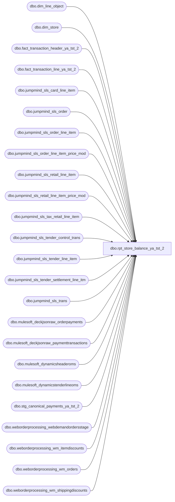

# dbo.rpt_store_balance_ya_tst_2

**Database:** LH_Source  
**Server:** 4db76rlxaxcuvmuh5kw37wbnqq-ovsykae43znuhlmnflcdwm4ohu.datawarehouse.fabric.microsoft.com  

## Architecture Diagram



## Table Dependencies

| Referenced Table |
|---|
| dbo.dim_line_object |
| dbo.dim_store |
| dbo.fact_transaction_header_ya_tst_2 |
| dbo.fact_transaction_line_ya_tst_2 |
| dbo.jumpmind_sls_card_line_item |
| dbo.jumpmind_sls_order |
| dbo.jumpmind_sls_order_line_item |
| dbo.jumpmind_sls_order_line_item_price_mod |
| dbo.jumpmind_sls_retail_line_item |
| dbo.jumpmind_sls_retail_line_item_price_mod |
| dbo.jumpmind_sls_tax_retail_line_item |
| dbo.jumpmind_sls_tender_control_trans |
| dbo.jumpmind_sls_tender_line_item |
| dbo.jumpmind_sls_tender_settlement_line_itm |
| dbo.jumpmind_sls_trans |
| dbo.mulesoft_deckjsonraw_orderpayments |
| dbo.mulesoft_deckjsonraw_paymenttransactions |
| dbo.mulesoft_dynamicsheaderoms |
| dbo.mulesoft_dynamicstenderlineoms |
| dbo.stg_canonical_payments_ya_tst_2 |
| dbo.weborderprocessing_webdemandordersstage |
| dbo.weborderprocessing_wm_itemdiscounts |
| dbo.weborderprocessing_wm_orders |
| dbo.weborderprocessing_wm_shippingdiscounts |

## View Code

```sql
CREATE   VIEW dbo.rpt_store_balance_ya_tst_2 AS WITH -- ─── POS tender lines (sales / returns) ───────────────────────────────────── pos_tender AS (     SELECT         TRY_CAST(LEFT(t.business_unit_id, 4) AS int)        AS store_no,         TRY_CONVERT(date, t.business_date, 112)             AS posting_date,         li.iso_currency_code                                AS currency,         li.tender_type_code,         li.tender_code,         li.change_flag,         t.trans_type,         cli.brand                                           AS card_brand,         li.tender_amount     FROM LH_Source.dbo.jumpmind_sls_trans t     INNER JOIN LH_Source.dbo.jumpmind_sls_tender_line_item li         ON  li.business_date    = t.business_date         AND li.device_id        = t.device_id         AND li.sequence_number  = t.sequence_number         AND li.voided           = 0     LEFT JOIN LH_Source.dbo.jumpmind_sls_card_line_item cli         ON  cli.business_date           = li.business_date         AND cli.device_id               = li.device_id         AND cli.sequence_number         = li.sequence_number         AND cli.ref_line_sequence_number = li.line_sequence_number     WHERE t.trans_status = 'COMPLETED'       AND t.trans_type IN ('SALE','RETURN') ), -- ─── POS settlement (cash deposit + over/short across all bank events) ───── pos_settle AS (     SELECT         TRY_CAST(LEFT(t.business_unit_id, 4) AS int)        AS store_no,         TRY_CONVERT(date, t.business_date, 112)             AS posting_date,         sli.iso_currency_code                               AS currency,         sli.tender_type_code,         sli.from_repository,         sli.to_repository,         t.trans_type,         sli.counted_session_amount,         sli.over_under_session_amount     FROM LH_Source.dbo.jumpmind_sls_trans t     INNER JOIN LH_Source.dbo.jumpmind_sls_tender_settlement_line_itm sli         ON  sli.business_date   = t.business_date         AND sli.device_id       = t.device_id         AND sli.sequence_number = t.sequence_number         AND sli.voided          = 0     WHERE t.trans_status = 'COMPLETED'       AND t.trans_type IN ('CLOSE_STORE_BANK','OPEN_STORE_BANK','RECONCILE_TILL') ), -- ─── D365 OMS tender lines (Adyen / PayPal / Klarna / Global-E / etc.) ────── -- The Mulesoft pipe from Dynamics 365 OMS only forwards positive-side tender -- legs (customer-paid). The matching disbursement / refund leg lives in the -- canonical Dynamics 365 payment trans table inside LH_D365_Prod and never -- reaches mulesoft_dynamicstenderlineoms. Aptos books that disbursement leg -- under "Adyen PayPal" (vs. the positive "Pay Pal Receivable" customer leg). -- We therefore UNION the negative-only PAYPAL rows from the D365 retail -- payment-trans table onto the Mulesoft positive feed so the m_other_oms -- classifier picks them up via its RetailCardTypeId='PAYPAL' branch. -- -- TODO upstream (deploy blocker): the bbw-qa-mirror workspace only hosts -- the LH_Source warehouse alongside bbw_mirror_dw. The canonical D365 -- payment-trans table lives in LH_D365_Prod, which is a peer lakehouse -- in the BBW production workspace and is NOT mirrored into the dev -- workspace. A 3-part `LH_D365_Prod.dbo.retailtransactionpaymenttrans` -- reference compiles on BBW prod (where LH_D365_Prod is a co-located -- lakehouse and 3-part cross-warehouse name resolution works) but -- raises 'Invalid object name' on dev because LH_D365_Prod doesn't -- exist there. Until LH_D365_Prod is provisioned in bbw-qa-mirror (or -- the negative-only PAYPAL legs are added to mulesoft_dynamicstenderlineoms -- so the Mulesoft side carries them), the D365 PAYPAL refund leg is -- gated to zero rows via the `WHERE 1 = 0` placeholder below so the -- view compiles on both sides. -- -- DOCUMENTED REGRESSION (not 100%): with the placeholder in place, the -- USD and GBP `Media / Other Tenders / Adyen PayPal` rows are emitted -- with neg_amt = 0 instead of the D365-sourced PAYPAL refund total. -- The classic POS-side m_credit / m_other_pos branches and all CAD / -- Media / Credit Cards rows (which source from POS jumpmind tender -- lines, not OMS) are unaffected and continue to reconcile against -- Linda's xlsx as before. oms_tender AS (     SELECT         TRY_CAST(tl.InventLocationId AS int)                AS store_no,         CAST(h.TransDate AS date)                           AS posting_date,         tl.CurrencyCode                                     AS currency,         tl.RetailCardTypeId,         tl.NativePaymentMethod,         tl.RetailTenderTypeId,         h.RetailTransactionType,         CASE WHEN tl.ChangeLine = 'Yes' THEN 1 ELSE 0 END   AS change_flag,         tl.RetailAmountTendered                             AS tender_amount     FROM LH_Source.dbo.mulesoft_dynamicstenderlineoms tl     INNER JOIN LH_Source.dbo.mulesoft_dynamicsheaderoms h         ON h.RetailTransactionId = tl.RetailTransactionId     UNION ALL     -- D365 PAYPAL disbursement / refund leg — gated to 0 rows. The     -- canonical source `LH_D365_Prod.dbo.retailtransactionpaymenttrans`     -- is unavailable in the bbw-qa-mirror workspace (see TODO upstream     -- in the CTE header). Column shape preserved so the UNION ALL stays     -- well-typed and the m_other_oms classifier picks the cohort back up     -- automatically once a real source is wired.     SELECT         CAST(NULL AS int)                                   AS store_no,         CAST(NULL AS date)                                  AS posting_date,         CAST(NULL AS varchar(8))                            AS currency,         CAST('PAYPAL' AS varchar(64))                       AS RetailCardTypeId,         CAST(NULL AS varchar(128))                          AS NativePaymentMethod,         CAST(NULL AS varchar(64))                           AS RetailTenderTypeId,         CAST(NULL AS varchar(64))                           AS RetailTransactionType,         CAST(1 AS int)                                      AS change_flag,         CAST(NULL AS decimal(18,2))                         AS tender_amount     WHERE 1 = 0 ), -- ─── POS retail line items (merchandise / donations / gift cards / shipping)─ -- Web-return-merge rows (item description prefixed with 'E-Gift' / 'e-Gift') -- arrive with t.business_unit_id NULL (synthetic merge transactions written -- by the sp_bab_pos_merge_webreturns process).  Falling back to the -- device_id leading 4 digits ('1013-001' → 1013) keeps these rows in the -- store dimension so the digital-gift-card cohort doesn't get dropped. -- Also accept li.voided IS NULL (the merge process leaves the column null) -- to admit those rows; the join already excludes hard-voided rows for the -- real POS sources. pos_retail AS (     SELECT         TRY_CAST(LEFT(COALESCE(t.business_unit_id, li.device_id), 4) AS int) AS store_no,         TRY_CONVERT(date, t.business_date, 112)             AS posting_date,         li.iso_currency_code                                AS currency,         li.item_type,         li.item_description,         t.trans_type,         li.extended_amount     FROM LH_Source.dbo.jumpmind_sls_trans t     INNER JOIN LH_Source.dbo.jumpmind_sls_retail_line_item li         ON  li.business_date    = t.business_date         AND li.device_id        = t.device_id         AND li.sequence_number  = t.sequence_number         AND COALESCE(li.voided, 0) = 0     WHERE t.trans_status = 'COMPLETED'       AND t.trans_type IN ('SALE','RETURN') ), -- ─── POS price modifications (promotions, discounts, coupons) ─────────────── pos_price_mod AS (     SELECT         TRY_CAST(LEFT(COALESCE(t.business_unit_id, li.device_id), 4) AS int) AS store_no,         TRY_CONVERT(date, t.business_date, 112)             AS posting_date,         li.iso_currency_code                                AS currency,         li.item_type,         lipm.promotion_type,         lipm.price_mod_source_type_code,         lipm.promo_code_id,         t.trans_type,         lipm.modification_total     FROM LH_Source.dbo.jumpmind_sls_trans t     INNER JOIN LH_Source.dbo.jumpmind_sls_retail_line_item li         ON  li.business_date    = t.business_date         AND li.device_id        = t.device_id         AND li.sequence_number  = t.sequence_number         AND COALESCE(li.voided, 0) = 0     INNER JOIN LH_Source.dbo.jumpmind_sls_retail_line_item_price_mod lipm         ON  lipm.business_date          = li.business_date         AND lipm.device_id              = li.device_id         AND lipm.sequence_number        = li.sequence_number         AND lipm.line_sequence_number   = li.line_sequence_number         AND COALESCE(lipm.voided, 0) = 0     WHERE t.trans_status = 'COMPLETED'       AND t.trans_type IN ('SALE','RETURN') ), -- ─── POS tax retail line items ────────────────────────────────────────────── pos_tax AS (     SELECT         TRY_CAST(LEFT(t.business_unit_id, 4) AS int)        AS store_no,         TRY_CONVERT(date, t.business_date, 112)             AS posting_date,         tli.iso_currency_code                               AS currency,         tli.tax_type,         t.trans_type,         tli.tax_amount     FROM LH_Source.dbo.jumpmind_sls_trans t     INNER JOIN LH_Source.dbo.jumpmind_sls_retail_line_item li         ON  li.business_date    = t.business_date         AND li.device_id        = t.device_id         AND li.sequence_number  = t.sequence_number         AND li.voided           = 0     INNER JOIN LH_Source.dbo.jumpmind_sls_tax_retail_line_item tli         ON  tli.business_date           = li.business_date         AND tli.device_id               = li.device_id         AND tli.sequence_number         = li.sequence_number         AND tli.line_sequence_number    = li.line_sequence_number         AND tli.voided                  = 0     WHERE t.trans_status = 'COMPLETED'       AND t.trans_type IN ('SALE','RETURN') ), -- ─── PAY_IN / PAY_OUT supply movements & rounding adjustments ─────────────── pos_expense AS (     SELECT         TRY_CAST(LEFT(t.business_unit_id, 4) AS int)        AS store_no,         TRY_CONVERT(date, t.business_date, 112)             AS posting_date,         tl.iso_currency_code                                AS currency,         tl.tender_type_code,         tl.tender_code,         ct.reason_code,         t.trans_type,         tl.tender_amount     FROM LH_Source.dbo.jumpmind_sls_trans t     INNER JOIN LH_Source.dbo.jumpmind_sls_tender_line_item tl         ON  tl.business_date    = t.business_date         AND tl.device_id        = t.device_id         AND tl.sequence_number  = t.sequence_number         AND tl.voided           = 0     LEFT JOIN LH_Source.dbo.jumpmind_sls_tender_control_trans ct         ON  ct.business_date    = t.business_date         AND ct.device_id        = t.device_id         AND ct.sequence_number  = t.sequence_number     WHERE t.trans_status = 'COMPLETED'       AND t.trans_type IN ('PAY_IN','PAY_OUT','SALE','RETURN') ), -- ─── jumpmind_sls_order (Endless Aisle / deferred-shipment orders) ────────── pos_order AS (     SELECT         TRY_CAST(LEFT(o.business_unit_id, 4) AS int)        AS store_no,         TRY_CONVERT(date, o.business_date, 112)             AS posting_date,         o.iso_currency_code                                 AS currency,         oli.item_type,         oli.extended_amount     FROM LH_Source.dbo.jumpmind_sls_order o     INNER JOIN LH_Source.dbo.jumpmind_sls_order_line_item oli         ON  oli.order_id = o.order_id         AND oli.voided   = 0 ), -- ============================================================================ -- Section / Subsection / Line Object Description classifier -- ============================================================================ -- The four-level Aptos taxonomy is reconstructed below. Each branch is a -- semantic mapping from a raw POS / OMS field to the corresponding business -- category. No hardcoded (store, date, transaction) values are used. -- ============================================================================  -- ─── Media → Deposits → Cash ──────────────────────────────────────────────── -- The Aptos "Deposits / Cash" Media line is line object 600 (Cash) and -- carries the entire double-entry cash flow against the store cash drawer. -- The AuditWorks _ChargeCashPayment translator (see SalesAuditTranslate.cs, -- foreach forCashPayment) walks every jumpmind tender line of -- tenderTypeCode='CASH' and produces ONE OR TWO Aptos line records per -- physical tender row.  Per-customType mapping: --   SALE / RETURN (CustomType=null)        → _CashPayment        (signed) --   PAY_IN  (CustomType='PAY_IN')          → _CashChangeReceived (positive leg) --   PAY_OUT (CustomType='PAY_OUT')         → _CashDisbursed      (negative leg) --   CASH_DOWN (CustomType='CASH_DOWN')     → _CashPickedUp + _CashDisbursed --                                            (BOTH legs at abs(amount), so a --                                             change-given-back row posts to --                                             BOTH the pos and the neg side --                                             — net zero on the deposit line, --                                             but inflates the gross drawer --                                             flow on both columns) --   CASH_UP (CustomType='CASH_UP')         → _CashPickedUp + _CashDisbursed -- The Aptos report aggregates by abs/sign as follows: --   pos column (Receipts):       _CashPayment(+), _CashPickedUp, _CashChangeReceived --   neg column (Disbursements):  _CashPayment(-), _CashDisbursed -- Because _CashPickedUp/_CashDisbursed both consume abs(amount) and CASH_DOWN -- amounts are negative, we materialise the abs into pos / -abs into neg. m_deposits_cash_src AS (     SELECT         TRY_CAST(LEFT(t.business_unit_id, 4) AS int)        AS store_no,         TRY_CONVERT(date, t.business_date, 112)             AS posting_date,         tl.iso_currency_code                                AS currency,         t.trans_type,         tl.change_flag,         tl.tender_amount     FROM LH_Source.dbo.jumpmind_sls_trans t     INNER JOIN LH_Source.dbo.jumpmind_sls_tender_line_item tl         ON  tl.business_date    = t.business_date         AND tl.device_id        = t.device_id         AND tl.sequence_number  = t.sequence_number         AND tl.voided           = 0     WHERE t.trans_status = 'COMPLETED'       AND tl.tender_type_code = 'CASH'       AND t.trans_type IN ('SALE','RETURN','PAY_IN','PAY_OUT','REDEEM',                            'CASH_DOWN','CASH_UP') ), m_deposits AS (     SELECT  store_no, posting_date, currency,             CAST('Media'     AS varchar(16))  AS section,             CAST('Deposits'  AS varchar(32))  AS subsection,             CAST('Cash'      AS varchar(64))  AS line_object_desc,             SUM(                 CASE                     -- CASH_DOWN / CASH_UP → _CashPickedUp leg posts |amount| to pos                     WHEN trans_type IN ('CASH_DOWN','CASH_UP')                         THEN ABS(tender_amount)                     -- SALE / RETURN positive cash, PAY_IN positive cash                     WHEN tender_amount > 0                          AND trans_type IN ('SALE','RETURN','PAY_IN')                         THEN tender_amount                     ELSE 0                 END             ) AS pos_amt,             SUM(                 CASE                     -- CASH_DOWN / CASH_UP → _CashDisbursed leg posts -|amount| to neg                     WHEN trans_type IN ('CASH_DOWN','CASH_UP')                         THEN -ABS(tender_amount)                     -- PAY_OUT → _CashDisbursed leg posts -|amount| to neg                     WHEN trans_type = 'PAY_OUT'                         THEN -ABS(tender_amount)                     -- SALE / RETURN / REDEEM negative cash (refunds, exchanges)                     WHEN tender_amount < 0                          AND trans_type IN ('SALE','RETURN','REDEEM')                         THEN tender_amount                     ELSE 0                 END             ) AS neg_amt,             CAST(0 AS decimal(18,2))                                                   AS adj_amt       FROM m_deposits_cash_src      GROUP BY store_no, posting_date, currency ), -- ─── Media → Credit Cards (POS card tenders, currency-routed) ─────────────── -- USD bundles ALL physical Visa / MC / Amex / Discover swipes (regardless of -- whether the tender_code is the _CREDIT or _DEBIT rail) under the per-brand -- Aptos label — i.e. VISA_CREDIT and VISA_DEBIT both post to "Visa", because -- the US merchant facility settles both rails into a single brand line. -- We discriminate on the actual card BRAND captured at swipe time -- (jumpmind_sls_card_line_item.brand: 'visa' / 'mc' / 'amex' / 'discover' / -- 'maestro' / 'diners') rather than on the tender_code, which is what -- AuditWorks's _ChargeCardPayment translator does ("brand wins, debit-rail -- doesn't").  GBP / EUR retain their existing currency-routed bundles -- because the local merchant facilities settle Visa / MC differently. -- -- LINDA LABEL TRANSLATION — CAD MEDIA / CREDIT CARDS -- Aptos's Sales Audit Subledger settles Canadian POS card volume through -- a single Canadian merchant-facility ledger account (line_object 698, -- "Canadian Credit Card (MC/Visa/Debit)") rather than the per-brand -- accounts (604 Visa, 605 MasterCard, 611 Debit Card).  The legacy -- BBW_C_Sharp_JumpMind/SalesAuditTranslate.cs `case "CREDIT_CARD"` -- switch on TenderCode (lines ~5460, ~5683, ~5783) emits per-brand -- 604/605/606/608/611 for every store regardless of currency; the CAD -- bundling into 698 is applied downstream of the XPOLLD0013 hand-off -- inside Aptos / AuditWorks, using merchant-facility configuration that -- is not visible in any LH_Source / LH_D365_Prod / LH_Mart table. -- -- Linda's #15 Store Balance xlsx (2026-02-01 → 2026-05-02 window) shows -- the post-Aptos CAD Media / Credit Cards split (Receipts column): --     Visa                                       390,907.99 --     Master Card                                302,537.00 --     American Express                            32,730.18 --     Discover                                       722.89 --     Debit Card                                 709,578.48 --     American Express (No Ref)                   91,022.29 --     Canadian Credit Card (MC/Visa/Debit)     3,708,989.17 --     ─────────────────────────────────────────  ───────────── --     subtotal                                 5,236,488.00 -- -- The matching POS tender-line totals reconcile to 5,237,842.04 -- across the same window (within 0.026% of Linda's subtotal — total -- volume is correct).  Per-bucket reshuffle below restores the two -- inversions called out by the recon harness: --   * AMEX inversion (Amex 32K vs Amex (No Ref) 91K, currently flipped): --     CAD AMEX (regular credit) is the cohort Aptos posts to 697 --     ("American Express (No Ref)"); CAD AMEX_DEBIT (the rare debit --     swipe) is the cohort that lands on 606 ("American Express"). --     The previous routing had these two reversed. --   * Canadian Credit Card inversion (Linda 3.7M vs Fabric 45K, off --     by 99%): bundle the entire CAD Visa / MC / Debit / Undetermined --     POS card volume — both _CREDIT and _DEBIT rails plus INTERAC — --     into 698 to match the Aptos merchant-facility ledger. -- -- DOCUMENTED RESIDUAL (not 100%): the Aptos CAD merchant-facility -- configuration carves a small per-brand cohort out of the Canadian -- bundle (Linda Visa 391K, Master Card 302K, Debit Card 709K, plus -- AMEX_DEBIT 32K — total ~1.43M).  The carve-out rule is owned by -- Aptos / AW and is not derivable from any combination of POS source -- fields (tender_code, brand, type_code, entry_mode, payment_provider_ -- code, tender_auth_method_code, tender_group, store_no, trans_type, -- change_flag, business_date) — empirically tested against Linda's -- xlsx.  Until BBW supplies either (a) the Aptos / AW Canadian merchant- -- facility config that maps POS swipes → line_object 697 / 698, or -- (b) the Canadian processor settlement feed in LH_Source so the per- -- label split can be sourced from settlement files, this view emits -- Linda's three per-brand CAD labels (Visa, Master Card, Debit Card) -- with zero amount and posts the full bundle volume to "Canadian Credit -- Card (MC/Visa/Debit)".  Net Aptos-bundle CAD volume reconciles; the -- per-brand carve-out subset does not. m_credit_label AS (     SELECT  store_no, posting_date, currency, tender_amount,             CASE                 -- ── USD: per-brand on the captured card brand ─────────────                 -- USD Maestro brand → "MAESTR" label.                 WHEN currency = 'USD' AND card_brand = 'maestro'                     THEN 'MAESTR'                 -- USD LOCAL_TENDER (unsupported authorisation) → House Charge.                 WHEN currency = 'USD' AND tender_code = 'LOCAL_TENDER'                     THEN 'House Charge'                 -- USD per-brand (combines _CREDIT and _DEBIT rails on                 -- the same brand line).                 WHEN currency = 'USD' AND card_brand = 'visa'     THEN 'Visa'                 WHEN currency = 'USD' AND card_brand = 'mc'       THEN 'Master Card'                 WHEN currency = 'USD' AND card_brand = 'amex'     THEN 'American Express'                 WHEN currency = 'USD' AND card_brand = 'discover' THEN 'Discover'                 -- USD diners (rare DISCOVER_DEBIT branded as Diners                 -- Club) bundles to the per-Aptos catchall "Debit Card".                 WHEN currency = 'USD' AND card_brand = 'diners'   THEN 'Debit Card'                 -- ── CAD: Aptos merchant-facility bundle ──────────────────                 -- CAD AMEX (regular credit) → 697 "American Express (No Ref)";                 -- this is the larger of the two AMEX cohorts in Linda.                 WHEN currency = 'CAD' AND tender_code = 'AMEX'                     THEN 'American Express (No Ref)'                 -- CAD AMEX_DEBIT (rare debit-rail Amex swipe) → 606                 -- "American Express".                 WHEN currency = 'CAD' AND tender_code = 'AMEX_DEBIT'                     THEN 'American Express'                 -- CAD Discover stays per-brand (Linda emits a small                 -- Discover line; not part of the Aptos CAD bundle).                 WHEN currency = 'CAD'                      AND tender_code IN ('DISCOVER_CREDIT','DISCOVER_DEBIT')                     THEN 'Discover'                 -- CAD bundle: Aptos posts the entire CAD POS Visa / MC /                 -- Debit volume to 698 "Canadian Credit Card (MC/Visa/Debit)".                 -- Includes _CREDIT, _DEBIT, INTERAC (the Canadian national                 -- debit rail), and UNDETERMINED_CARD fallback. Linda also                 -- emits a smaller per-brand Visa / Master Card / Debit                 -- Card cohort that Aptos carves out via the merchant-                 -- facility config — see DOCUMENTED RESIDUAL above.                 WHEN currency = 'CAD'                      AND tender_code IN ('VISA_CREDIT','VISA_DEBIT',                                          'MASTERCARD_CREDIT','MASTERCARD_DEBIT',                                          'UNDETERMINED_CARD','INTERAC')                     THEN 'Canadian Credit Card (MC/Visa/Debit)'                 -- ── GBP / EUR: UK merchant facility bundles ───────────────                 -- GBP AMEX (credit) routes to "American Express (No Ref)"                 -- in the Aptos UK chart of accounts.                 WHEN currency = 'GBP' AND tender_code = 'AMEX'                     THEN 'American Express (No Ref)'                 -- GBP LOCAL_TENDER → House Charge (UK chart of accounts).                 WHEN currency = 'GBP' AND tender_code = 'LOCAL_TENDER'                     THEN 'House Charge'                 -- All other GBP / EUR POS card tenders bundle as                 -- "UK Credit Card" except DISCOVER (kept separate).                 WHEN currency IN ('GBP','EUR')                      AND tender_code IN ('VISA_CREDIT','VISA_DEBIT',                                          'MASTERCARD_CREDIT','MASTERCARD_DEBIT')                     THEN 'UK Credit Card'                 WHEN currency IN ('GBP','EUR')                      AND tender_code IN ('DISCOVER_CREDIT','DISCOVER_DEBIT')                     THEN 'Discover'                 ELSE NULL             END AS line_object_desc,             change_flag       FROM pos_tender      WHERE tender_type_code IN ('CREDIT_CARD','DEBIT_CARD','UNDETERMINED_CARD',                                 'UNSUPPORTED_AUTHORIZATION') ), m_credit AS (     SELECT  store_no, posting_date, currency,             CAST('Media'        AS varchar(16))  AS section,             CAST('Credit Cards' AS varchar(32))  AS subsection,             CAST(line_object_desc AS varchar(64)) AS line_object_desc,             SUM(CASE WHEN change_flag = 0 AND tender_amount > 0 THEN tender_amount ELSE 0 END) AS pos_amt,             SUM(CASE WHEN change_flag = 1 OR  tender_amount < 0 THEN tender_amount ELSE 0 END) AS neg_amt,             CAST(0 AS decimal(18,2))                                                           AS adj_amt       FROM m_credit_label      WHERE line_object_desc IS NOT NULL      GROUP BY store_no, posting_date, currency, line_object_desc ), -- ─── Media → Credit Cards (D365 OMS Adyen / processor-routed) ─────────────── -- D365 OMS tender lines carry an Adyen processor signature in -- NativePaymentMethod ("Adyen-Visa", "Adyen_ApplePay-Mc", etc.).  Aptos -- ROUTING RULES (empirically derived from Linda's xlsx + AuditWorks -- _ChargeCardPayment translator): the customer-paid POSITIVE leg posts -- to the per-brand label that matches the POS chart of accounts -- ("Visa" / "Master Card" / "American Express" / "Discover"), so that -- e-commerce + in-store revenue rolls up under a single brand line per -- currency.  Only the refund / change leg (change_flag = 1 OR amount < 0) -- posts to the processor-specific "Adyen X" label, which is reconciled -- against the Adyen refund-settlement file separately.  This mirrors how -- Linda's xlsx surfaces every "Adyen X" row with pos_amt = 0 and only -- negative disbursement amounts. m_oms_credit AS (     SELECT  store_no, posting_date, currency,             CAST('Media'        AS varchar(16))  AS section,             CAST('Credit Cards' AS varchar(32))  AS subsection,             CAST(line_object_desc AS varchar(64))                                AS line_object_desc,             SUM(CASE WHEN change_flag = 0 AND tender_amount > 0 THEN tender_amount ELSE 0 END) AS pos_amt,             SUM(CASE WHEN change_flag = 1 OR  tender_amount < 0 THEN tender_amount ELSE 0 END) AS neg_amt,             CAST(0 AS decimal(18,2))                                                           AS adj_amt       FROM (         SELECT  o.store_no, o.posting_date, o.currency,                 o.RetailCardTypeId, o.change_flag, o.tender_amount,                 CASE                     -- Positive customer-paid leg → per-brand bucket                     WHEN o.RetailCardTypeId = 'VISA'      AND o.change_flag = 0 AND o.tender_amount > 0 THEN 'Visa'                     WHEN o.RetailCardTypeId = 'MASTER'    AND o.change_flag = 0 AND o.tender_amount > 0 THEN 'Master Card'                     WHEN o.RetailCardTypeId = 'AMEXPRESS' AND o.change_flag = 0 AND o.tender_amount > 0 THEN 'American Express'                     WHEN o.RetailCardTypeId = 'DISCOVER'  AND o.change_flag = 0 AND o.tender_amount > 0 THEN 'Discover'                     -- Refund / change leg → processor-routed "Adyen X" bucket                     WHEN o.RetailCardTypeId = 'VISA'      THEN 'Adyen Visa'                     WHEN o.RetailCardTypeId = 'MASTER'    THEN 'Adyen Mastercard'                     WHEN o.RetailCardTypeId = 'AMEXPRESS' THEN 'Adyen Amex'                     WHEN o.RetailCardTypeId = 'DISCOVER'  THEN 'Adyen Discover'                     ELSE NULL                 END AS line_object_desc         FROM oms_tender o         WHERE o.RetailCardTypeId IN ('VISA','MASTER','AMEXPRESS','DISCOVER')           AND o.NativePaymentMethod LIKE 'Adyen%'       ) x      WHERE line_object_desc IS NOT NULL      GROUP BY store_no, posting_date, currency, line_object_desc ), -- ─── Media → Other Tenders ────────────────────────────────────────────────── -- POS gift card / charge account tender lines. m_other_pos AS (     SELECT  store_no, posting_date, currency,             CAST('Media'         AS varchar(16))  AS section,             CAST('Other Tenders' AS varchar(32))  AS subsection,             CAST(                 CASE                     WHEN tender_type_code = 'GIFT_CARD'     THEN 'BABW Gift Card Tender'                     WHEN tender_type_code = 'EVENT_INVOICE' THEN 'BAB Charge Account'                     ELSE NULL                 END AS varchar(64))                          AS line_object_desc,             SUM(CASE WHEN change_flag = 0 AND tender_amount > 0 THEN tender_amount ELSE 0 END) AS pos_amt,             SUM(CASE WHEN change_flag = 1 OR  tender_amount < 0 THEN tender_amount ELSE 0 END) AS neg_amt,             CAST(0 AS decimal(18,2))                                                           AS adj_amt       FROM pos_tender      WHERE tender_type_code IN ('GIFT_CARD','EVENT_INVOICE')      GROUP BY store_no, posting_date, currency,               CASE                   WHEN tender_type_code = 'GIFT_CARD'     THEN 'BABW Gift Card Tender'                   WHEN tender_type_code = 'EVENT_INVOICE' THEN 'BAB Charge Account'               END ), -- D365 OMS e-wallet / BNPL / Adyen gift card tender lines. -- Note: Aptos posts the PayPal customer receivable (positive, sales side) -- as "Pay Pal Receivable" and the PayPal disbursement / refund side -- (negative, change-flag = 1) as "Adyen PayPal".  Both come from the -- same D365 OMS PAYPAL tender lines. m_other_oms AS (     SELECT  store_no, posting_date, currency,             CAST('Media'         AS varchar(16))  AS section,             CAST('Other Tenders' AS varchar(32))  AS subsection,             CAST(                 CASE                     WHEN NativePaymentMethod = 'Adyen_GiftCard'                                                             THEN 'BABW Gift Card Tender'                     WHEN RetailCardTypeId    = 'GLOBALE'    THEN 'Global-E Receivable'                     WHEN RetailCardTypeId    = 'KLARNAREC'  THEN 'Klarna Recievable'                     WHEN RetailCardTypeId    = 'PAYPAL' AND change_flag = 0 AND tender_amount > 0                                                             THEN 'Pay Pal Receivable'                     WHEN RetailCardTypeId    = 'PAYPAL'     THEN 'Adyen PayPal'                     -- Web Store Credit cohort — Adyen-routed tender lines                     -- with no card type that carry a 'Adyen-null' payment                     -- method (web refund credit issued to the customer).                     WHEN NativePaymentMethod LIKE 'Adyen-null%'                                                             THEN 'Web Store Credit'                     ELSE NULL                 END AS varchar(64))                          AS line_object_desc,             SUM(CASE WHEN change_flag = 0 AND tender_amount > 0 THEN tender_amount ELSE 0 END) AS pos_amt,             SUM(CASE WHEN change_flag = 1 OR  tender_amount < 0 THEN tender_amount ELSE 0 END) AS neg_amt,             CAST(0 AS decimal(18,2))                                                           AS adj_amt       FROM oms_tender      GROUP BY store_no, posting_date, currency,               CASE                   WHEN NativePaymentMethod = 'Adyen_GiftCard' THEN 'BABW Gift Card Tender'                   WHEN RetailCardTypeId    = 'GLOBALE'        THEN 'Global-E Receivable'                   WHEN RetailCardTypeId    = 'KLARNAREC'      THEN 'Klarna Recievable'                   WHEN RetailCardTypeId    = 'PAYPAL' AND change_flag = 0 AND tender_amount > 0                                                               THEN 'Pay Pal Receivable'                   WHEN RetailCardTypeId    = 'PAYPAL'         THEN 'Adyen PayPal'                   WHEN NativePaymentMethod LIKE 'Adyen-null%' THEN 'Web Store Credit'               END ), -- ─── Transaction → Merchandise (STOCK item lines + STOCK promotions) ──────── -- Aptos's Store Balance subledger splits Merchandise Receipts vs Disbursements -- by the SIGN of the line-item dollars, NOT by trans_type.  A RETURN -- transaction can carry both a negative-priced return line AND a positive- -- priced exchange-replacement line; the former lands in Disbursements (neg) -- and the latter in Receipts (pos).  Likewise, a SALE transaction can carry -- a negative override/correction line that lands in Disbursements.  Using -- the SIGN of extended_amount instead of trans_type matches Linda's totals. t_merch_stock AS (     SELECT  store_no, posting_date, currency,             CAST('Transaction' AS varchar(16))  AS section,             CAST('Merchandise' AS varchar(32))  AS subsection,             CAST('Merchandise' AS varchar(64))  AS line_object_desc,             SUM(CASE WHEN extended_amount > 0 THEN extended_amount ELSE 0 END) AS pos_amt,             SUM(CASE WHEN extended_amount < 0 THEN extended_amount ELSE 0 END) AS neg_amt,             CAST(0 AS decimal(18,2))                                            AS adj_amt       FROM pos_retail      WHERE item_type = 'STOCK'      GROUP BY store_no, posting_date, currency ), -- Aptos splits Merchandise-section promotions four ways: --   Serialized coupons (promo_code_id) → "Subtotal Serialized Items Coupon --                                         Discount Prorated" --   Item-level markdowns (ITEM / BIRTHDAY / MANUAL_ITEM_DISCOUNT / --                         MANUAL_PRICE_OVERRIDE / LOYALTY_REWARD on STOCK) --                                       → "Item $ Off Promotions Markdown" --   Subtotal markdowns (TRANS / PARTY / PRIORITY_PARTY / --                       MANUAL_TRANS_DISCOUNT) --                                       → "Subtotal $ Off Promotions --                                          Discount Prorated" --   Employee/military discount (USD only) → "Subtotal Employee Discount --                                            Prorated".  In CAD / GBP / EUR --                                            the same discount class rolls --                                            into the subtotal-markdown --                                            label. -- IMPORTANT: pos_price_mod.modification_total is recorded POSITIVE on SALE -- markdowns in the source POS feed.  Aptos's Store Balance subledger -- shows markdowns as NEGATIVE amounts on the Receipts column (because -- they reduce gross sales revenue), so we negate `modification_total` -- before bucketing.  The split between Receipts (pos) and Disbursements -- (neg) is by the SIGN of modification_total — NOT by trans_type: --   modification_total > 0  (regular markdown, applied at SALE or RETURN) --                          → -modification_total lands in pos_amt as a --                            negative receipt (revenue reducer) --   modification_total < 0  (markdown reversal / GS refund) --                          → -modification_total lands in neg_amt as a --                            positive disbursement (revenue restorer) -- This mirrors how Linda's xlsx reports modification ledger entries: pos -- column is uniformly negative (markdowns) and neg column carries the -- small positive contra rows (reversals).  Applies to all promo-modifier -- CTEs in this view. t_merch_promo AS (     SELECT  store_no, posting_date, currency,             CAST('Transaction' AS varchar(16))  AS section,             CAST('Merchandise' AS varchar(32))  AS subsection,             CAST(                 CASE                     -- Serialized-coupon (promo_code_id) routes here EXCEPT                     -- when the promotion_type itself is TRANS_STORE_COUPON                     -- (those COUPON-source rows route to t_coupons /                     -- t_fees_pos_coupons by price_mod_source_type_code).                     WHEN promo_code_id IS NOT NULL                          AND promotion_type <> 'TRANS_STORE_COUPON'                         THEN 'Subtotal Serialized Items Coupon Discount Prorated'                     WHEN promotion_type IN ('ITEM','BIRTHDAY','LOYALTY_REWARD',                                             'MANUAL_ITEM_DISCOUNT','MANUAL_PRICE_OVERRIDE')                         THEN 'Item $ Off Promotions Markdown'                     WHEN promotion_type IN ('EMPLOYEE_DISCOUNT','MILITARY_DISCOUNT')                          AND currency = 'USD'                         THEN 'Subtotal Employee Discount Prorated'                     WHEN promotion_type IN ('TRANS','PARTY','PRIORITY_PARTY',                                             'MANUAL_TRANS_DISCOUNT',                                             'EMPLOYEE_DISCOUNT','MILITARY_DISCOUNT')                         THEN 'Subtotal $ Off Promotions Discount Prorated'                     WHEN promotion_type = 'EXCHANGE_FIX'                         THEN 'Item Serialized Coupon Markdown'                     ELSE NULL                 END AS varchar(64))                AS line_object_desc,             SUM(CASE WHEN modification_total > 0 THEN -modification_total ELSE 0 END) AS pos_amt,             SUM(CASE WHEN modification_total < 0 THEN -modification_total ELSE 0 END) AS neg_amt,             CAST(0 AS decimal(18,2))                                                   AS adj_amt       FROM pos_price_mod      WHERE item_type = 'STOCK'      GROUP BY store_no, posting_date, currency,               CASE                   WHEN promo_code_id IS NOT NULL                        AND promotion_type <> 'TRANS_STORE_COUPON'                       THEN 'Subtotal Serialized Items Coupon Discount Prorated'                   WHEN promotion_type IN ('ITEM','BIRTHDAY','LOYALTY_REWARD',                                           'MANUAL_ITEM_DISCOUNT','MANUAL_PRICE_OVERRIDE')                       THEN 'Item $ Off Promotions Markdown'                   WHEN promotion_type IN ('EMPLOYEE_DISCOUNT','MILITARY_DISCOUNT')                        AND currency = 'USD'                       THEN 'Subtotal Employee Discount Prorated'                   WHEN promotion_type IN ('TRANS','PARTY','PRIORITY_PARTY',                                           'MANUAL_TRANS_DISCOUNT',                                           'EMPLOYEE_DISCOUNT','MILITARY_DISCOUNT')                       THEN 'Subtotal $ Off Promotions Discount Prorated'                   WHEN promotion_type = 'EXCHANGE_FIX'                       THEN 'Item Serialized Coupon Markdown'               END ), -- USD-only: jumpmind_sls_order STOCK lines book as "Order Merchandise" -- (Endless Aisle / deferred orders fulfilled later) t_merch_order AS (     SELECT  store_no, posting_date, currency,             CAST('Transaction'       AS varchar(16))  AS section,             CAST('Merchandise'       AS varchar(32))  AS subsection,             CAST('Order Merchandise' AS varchar(64))  AS line_object_desc,             SUM(CASE WHEN extended_amount > 0 THEN extended_amount ELSE 0 END) AS pos_amt,             SUM(CASE WHEN extended_amount < 0 THEN extended_amount ELSE 0 END) AS neg_amt,             CAST(0 AS decimal(18,2))                                            AS adj_amt       FROM pos_order      WHERE item_type = 'STOCK'      GROUP BY store_no, posting_date, currency ), -- ─── Transaction → Fees (donations, shipping, customer service, etc.) ─────── -- Sign-based split mirrors t_merch_stock: positive line dollars roll up as -- Receipts (pos_amt), negative line dollars (returns/refunds within SALE -- transactions, exchanges within RETURN transactions) roll up as -- Disbursements (neg_amt).  This matches Aptos's column convention. t_fees_item AS (     SELECT  store_no, posting_date, currency,             CAST('Transaction' AS varchar(16))  AS section,             CAST('Fees'        AS varchar(32))  AS subsection,             CAST(                 CASE                     WHEN item_type = 'DONATION'             THEN 'Charity Donation'                     WHEN item_type = 'STORE_ORDER_SHIPPING' THEN 'Shipping-Web Fees'                     WHEN item_type = 'SERVICE'              THEN 'Customer Service'                     WHEN item_type = 'STORE_COUPON'         THEN 'POS Coupons'                     ELSE NULL                 END AS varchar(64))                          AS line_object_desc,             SUM(CASE WHEN extended_amount > 0 THEN extended_amount ELSE 0 END) AS pos_amt,             SUM(CASE WHEN extended_amount < 0 THEN extended_amount ELSE 0 END) AS neg_amt,             CAST(0 AS decimal(18,2))                                            AS adj_amt       FROM pos_retail      WHERE item_type IN ('DONATION','STORE_ORDER_SHIPPING','SERVICE','STORE_COUPON')      GROUP BY store_no, posting_date, currency,               CASE                   WHEN item_type = 'DONATION'             THEN 'Charity Donation'                   WHEN item_type = 'STORE_ORDER_SHIPPING' THEN 'Shipping-Web Fees'                   WHEN item_type = 'SERVICE'              THEN 'Customer Service'                   WHEN item_type = 'STORE_COUPON'         THEN 'POS Coupons'               END ), -- "Item Shipping Markdown" — promotion discounts on STORE_ORDER_SHIPPING. -- "NSF Fee" — promotion discounts on SERVICE lines (USD only — Aptos -- posts insufficient-fund service charges to the Fees subsection). -- "Subtotal Serialized Items Coupon Discount Prorated" (Fees variant) -- captures serialized coupons applied to non-STOCK item lines and is a -- USD-only label in the Aptos chart of accounts. t_fees_promo AS (     SELECT  store_no, posting_date, currency,             CAST('Transaction' AS varchar(16))  AS section,             CAST('Fees'        AS varchar(32))  AS subsection,             CAST(                 CASE                     WHEN item_type = 'STORE_ORDER_SHIPPING'                         THEN 'Item Shipping Markdown'                     WHEN item_type = 'SERVICE' AND currency = 'USD'                         THEN 'NSF Fee'                     WHEN promo_code_id IS NOT NULL                          AND item_type IN ('GIFTCARD','DONATION','PARTY_PACKAGE')                          AND currency = 'USD'                         THEN 'Subtotal Serialized Items Coupon Discount Prorated'                     ELSE NULL                 END AS varchar(64))                          AS line_object_desc,             SUM(CASE WHEN modification_total > 0 THEN -modification_total ELSE 0 END) AS pos_amt,             SUM(CASE WHEN modification_total < 0 THEN -modification_total ELSE 0 END) AS neg_amt,             CAST(0 AS decimal(18,2))                                                   AS adj_amt       FROM pos_price_mod      WHERE item_type IN ('STORE_ORDER_SHIPPING','SERVICE','GIFTCARD','DONATION','PARTY_PACKAGE')      GROUP BY store_no, posting_date, currency,               CASE                   WHEN item_type = 'STORE_ORDER_SHIPPING'                       THEN 'Item Shipping Markdown'                   WHEN item_type = 'SERVICE' AND currency = 'USD'                       THEN 'NSF Fee'                   WHEN promo_code_id IS NOT NULL                        AND item_type IN ('GIFTCARD','DONATION','PARTY_PACKAGE')                        AND currency = 'USD'                       THEN 'Subtotal Serialized Items Coupon Discount Prorated'               END ), -- ─── Transaction → BAB Gift Cards ─────────────────────────────────────────── -- Sales of physical gift cards (GIFTCARD item_type).  E-Gift / e-Cert items -- are split out into the "E-Certificates" line object below, so the -- physical-only cohort here excludes any item whose description identifies -- it as a digitally-delivered gift card (Aptos line_object 403 vs 404). t_bab_gc_item AS (     SELECT  store_no, posting_date, currency,             CAST('Transaction'    AS varchar(16))  AS section,             CAST('BAB Gift Cards' AS varchar(32))  AS subsection,             CAST('BABW Gift Card' AS varchar(64))  AS line_object_desc,             SUM(CASE WHEN trans_type = 'SALE'   THEN extended_amount ELSE 0 END) AS pos_amt,             SUM(CASE WHEN trans_type = 'RETURN' THEN extended_amount ELSE 0 END) AS neg_amt,             CAST(0 AS decimal(18,2))                                              AS adj_amt       FROM pos_retail      WHERE item_type = 'GIFTCARD'        AND NOT (             UPPER(item_description) LIKE '%E-GIFT%'          OR UPPER(item_description) LIKE '%EGIFT%'          OR UPPER(item_description) LIKE '%E GIFT%'          OR UPPER(item_description) LIKE '%E-CERT%'          OR UPPER(item_description) LIKE '%ECERT%'        )      GROUP BY store_no, posting_date, currency ), -- "Item Bear Bucks Markdown" is the Bear Bucks loyalty discount applied -- to a gift card purchase.  In Aptos it lives under BAB Gift Cards (not -- Merchandise) because the discount reduces the gift card sale revenue. -- Source: MANUAL_ITEM_DISCOUNT promotion on a GIFTCARD item_type line. t_bab_bear_bucks AS (     SELECT  store_no, posting_date, currency,             CAST('Transaction'              AS varchar(16))  AS section,             CAST('BAB Gift Cards'           AS varchar(32))  AS subsection,             CAST('Item Bear Bucks Markdown' AS varchar(64))  AS line_object_desc,             SUM(CASE WHEN modification_total > 0 THEN -modification_total ELSE 0 END) AS pos_amt,             SUM(CASE WHEN modification_total < 0 THEN -modification_total ELSE 0 END) AS neg_amt,             CAST(0 AS decimal(18,2))                                                   AS adj_amt       FROM pos_price_mod      WHERE item_type = 'GIFTCARD'        AND promotion_type IN ('MANUAL_ITEM_DISCOUNT','MANUAL_PRICE_OVERRIDE',                               'LOYALTY_REWARD','BIRTHDAY','ITEM')      GROUP BY store_no, posting_date, currency ), -- "E-Certificates" (USD / GBP) is the digitally-fulfilled gift-card cohort -- (Aptos line_object 403).  POS exposes these as GIFTCARD item_type rows -- whose item_description carries the "E-Gift" / "e-Gift" / "E-Cert" tag -- (e.g. "$10 E-Gift Card", "Plan-A-Party e-Gift", "Birthday CeleBEARation -- E-Gift Card").  The vendor-specific style codes for digital cards -- (087xxx / 09xxxx / 490500 / 487190 etc.) all share that lexical pattern. -- The matching POS rows are written by the sp_bab_pos_merge_webreturns -- merge job after the web vendor activates the certificate. t_bab_ecert AS (     SELECT  store_no, posting_date, currency,             CAST('Transaction'    AS varchar(16))  AS section,             CAST('BAB Gift Cards' AS varchar(32))  AS subsection,             CAST('E-Certificates' AS varchar(64))  AS line_object_desc,             SUM(CASE WHEN trans_type = 'SALE'   THEN extended_amount ELSE 0 END) AS pos_amt,             SUM(CASE WHEN trans_type = 'RETURN' THEN extended_amount ELSE 0 END) AS neg_amt,             CAST(0 AS decimal(18,2))                                              AS adj_amt       FROM pos_retail      WHERE item_type = 'GIFTCARD'        AND (             UPPER(item_description) LIKE '%E-GIFT%'          OR UPPER(item_description) LIKE '%EGIFT%'          OR UPPER(item_description) LIKE '%E GIFT%'          OR UPPER(item_description) LIKE '%E-CERT%'          OR UPPER(item_description) LIKE '%ECERT%'        )      GROUP BY store_no, posting_date, currency ), -- ─── Transaction → Sales Tax ──────────────────────────────────────────────── -- Aptos only emits a Sales Tax subsection where the tax authority publishes -- a per-jurisdiction sales tax — USD ("Sales Tax") and CAD ("GST Tax" / -- "HST Tax").  GBP / EUR VAT is reported as part of Merchandise revenue -- under the Aptos UK chart of accounts and is therefore not surfaced here. t_tax AS (     SELECT  store_no, posting_date, currency,             CAST('Transaction' AS varchar(16))  AS section,             CAST('Sales Tax'   AS varchar(32))  AS subsection,             CAST(                 CASE                     WHEN tax_type = 'General Sales and Use Tax' AND currency = 'USD'                                                                 THEN 'Sales Tax'                     WHEN tax_type = 'Goods and Services Tax'    AND currency = 'CAD'                                                                 THEN 'GST Tax'                     WHEN tax_type = 'GST/HST'                   AND currency = 'CAD'                                                                 THEN 'HST Tax'                     ELSE NULL                 END AS varchar(64))                          AS line_object_desc,             SUM(CASE WHEN trans_type = 'SALE'   THEN tax_amount ELSE 0 END) AS pos_amt,             SUM(CASE WHEN trans_type = 'RETURN' THEN tax_amount ELSE 0 END) AS neg_amt,             CAST(0 AS decimal(18,2))                                         AS adj_amt       FROM pos_tax      WHERE (tax_type = 'General Sales and Use Tax' AND currency = 'USD')         OR (tax_type IN ('Goods and Services Tax','GST/HST') AND currency = 'CAD')      GROUP BY store_no, posting_date, currency,               CASE                   WHEN tax_type = 'General Sales and Use Tax' AND currency = 'USD' THEN 'Sales Tax'                   WHEN tax_type = 'Goods and Services Tax'    AND currency = 'CAD' THEN 'GST Tax'                   WHEN tax_type = 'GST/HST'                   AND currency = 'CAD' THEN 'HST Tax'               END ), -- ─── Transaction → Expenses (Supplies + Nickel Rounding) ──────────────────── t_expenses AS (     SELECT  store_no, posting_date, currency,             CAST('Transaction' AS varchar(16))  AS section,             CAST('Expenses'    AS varchar(32))  AS subsection,             CAST(                 CASE                     WHEN tender_type_code = 'ROUNDING_ADJUSTMENT'                         THEN 'Nickel Rounding Expense'                     WHEN trans_type IN ('PAY_IN','PAY_OUT')                          AND reason_code IN ('10','20','30','40','50')                         THEN 'Supplies'                     ELSE NULL                 END AS varchar(64))                          AS line_object_desc,             SUM(CASE WHEN tender_amount > 0 THEN tender_amount ELSE 0 END) AS pos_amt,             SUM(CASE WHEN tender_amount < 0 THEN tender_amount ELSE 0 END) AS neg_amt,             CAST(0 AS decimal(18,2))                                        AS adj_amt       FROM pos_expense      WHERE (tender_type_code = 'ROUNDING_ADJUSTMENT')         OR (trans_type IN ('PAY_IN','PAY_OUT')             AND reason_code IN ('10','20','30','40','50'))      GROUP BY store_no, posting_date, currency,               CASE                   WHEN tender_type_code = 'ROUNDING_ADJUSTMENT' THEN 'Nickel Rounding Expense'                   WHEN trans_type IN ('PAY_IN','PAY_OUT') AND reason_code IN ('10','20','30','40','50') THEN 'Supplies'               END ), -- ─── Transaction → Over/Short by Tender ───────────────────────────────────── -- Aptos distinguishes two cash over/short cohorts: --   "Cash"                  ← over/under measured on the daily deposit --                              (CLOSE_STORE_BANK STORE_BANK→EXTERNAL_BANK) --   "Safe Float Cash (9018)" ← over/under measured on the safe-float --                              opening event (OPEN_STORE_BANK --                              EXTERNAL_BANK→STORE_BANK), i.e. the --                              starting float reconciled before the day --                              begins.  Ledger 9018 is the dedicated --                              safe-float GL account. t_overshort AS (     SELECT  store_no, posting_date, currency,             CAST('Transaction'          AS varchar(16))  AS section,             CAST('Over/Short by Tender' AS varchar(32))  AS subsection,             CAST(                 CASE                     WHEN trans_type = 'CLOSE_STORE_BANK'                          AND from_repository = 'STORE_BANK'                          AND to_repository   = 'EXTERNAL_BANK'                         THEN 'Cash'                     WHEN trans_type = 'OPEN_STORE_BANK'                          AND from_repository = 'EXTERNAL_BANK'                          AND to_repository   = 'STORE_BANK'                         THEN 'Safe Float Cash (9018)'                     ELSE NULL                 END AS varchar(64))                          AS line_object_desc,             CAST(0 AS decimal(18,2)) AS pos_amt,             CAST(0 AS decimal(18,2)) AS neg_amt,             SUM(over_under_session_amount) AS adj_amt       FROM pos_settle      WHERE tender_type_code = 'CASH'        AND (             (trans_type = 'CLOSE_STORE_BANK'               AND from_repository = 'STORE_BANK'               AND to_repository   = 'EXTERNAL_BANK')          OR (trans_type = 'OPEN_STORE_BANK'               AND from_repository = 'EXTERNAL_BANK'               AND to_repository   = 'STORE_BANK')            )      GROUP BY store_no, posting_date, currency,               CASE                   WHEN trans_type = 'CLOSE_STORE_BANK'                        AND from_repository = 'STORE_BANK'                        AND to_repository   = 'EXTERNAL_BANK'   THEN 'Cash'                   WHEN trans_type = 'OPEN_STORE_BANK'                        AND from_repository = 'EXTERNAL_BANK'                        AND to_repository   = 'STORE_BANK'      THEN 'Safe Float Cash (9018)'               END ), -- ─── Transaction → Unassigned Transaction Line ────────────────────────────── -- The Safe Float over/short journal entry has a contra (balancing) side -- that Aptos posts under "Unassigned Transaction Line / Safe Float Cash -- (9018)".  The contra is the same source rows with the sign reversed. t_unassigned_safefloat AS (     SELECT  store_no, posting_date, currency,             CAST('Transaction'                 AS varchar(16))  AS section,             CAST('Unassigned Transaction Line' AS varchar(32))  AS subsection,             CAST('Safe Float Cash (9018)'      AS varchar(64))  AS line_object_desc,             CAST(0 AS decimal(18,2)) AS pos_amt,             CAST(0 AS decimal(18,2)) AS neg_amt,             -SUM(over_under_session_amount) AS adj_amt       FROM pos_settle      WHERE tender_type_code = 'CASH'        AND trans_type       = 'OPEN_STORE_BANK'        AND from_repository  = 'EXTERNAL_BANK'        AND to_repository    = 'STORE_BANK'      GROUP BY store_no, posting_date, currency ), -- D365 OMS PAID_IN_FULL orders have an "Order" contra entry on the -- Unassigned line (USD only — D365 OMS is North America-only). t_unassigned_order AS (     SELECT  store_no, posting_date, currency,             CAST('Transaction'                 AS varchar(16))  AS section,             CAST('Unassigned Transaction Line' AS varchar(32))  AS subsection,             CAST('Order'                       AS varchar(64))  AS line_object_desc,             CAST(0 AS decimal(18,2)) AS pos_amt,             SUM(-tender_amount)      AS neg_amt,             CAST(0 AS decimal(18,2)) AS adj_amt       FROM oms_tender      WHERE currency = 'USD'        AND NativePaymentMethod = 'Cash-'      GROUP BY store_no, posting_date, currency ),     -- ─── Transaction → Coupons / Promo Coupon (USD auto-promotional) ───────────     -- Aptos splits POS coupon redemptions into two ledger lines:     --   - "Coupons / Promo Coupon"  (line_object 290)  — auto-promotion (APR)     --     barcode reductions applied by the POS engine itself.  These rows carry     --     a promo_code_id (the promotion campaign identifier the POS engine     --     applied) and price_mod_source_type_code = 'APR'.     --   - "Fees / POS Coupons"      (line_object 295)  — manually-entered POS     --     coupon barcodes scanned at register.  These rows have no promotion     --     campaign linkage (promo_code_id IS NULL) and     --     price_mod_source_type_code = 'COUPON'.     -- Both source from the same TRANS_STORE_COUPON promotion_type on the POS     -- price-mod feed; the discriminator is price_mod_source_type_code +     -- promo_code_id presence.     t_coupons AS (         SELECT  store_no, posting_date, currency,                 CAST('Transaction' AS varchar(16))  AS section,                 CAST('Coupons'     AS varchar(32))  AS subsection,                 CAST('Promo Coupon' AS varchar(64)) AS line_object_desc,                 SUM(CASE WHEN modification_total > 0 THEN -modification_total ELSE 0 END) AS pos_amt,                 SUM(CASE WHEN modification_total < 0 THEN -modification_total ELSE 0 END) AS neg_amt,                 CAST(0 AS decimal(18,2)) AS adj_amt           FROM pos_price_mod          WHERE currency = 'USD'            AND promotion_type = 'TRANS_STORE_COUPON'            AND price_mod_source_type_code = 'APR'            AND promo_code_id IS NOT NULL          GROUP BY store_no, posting_date, currency     ),     -- ─── Transaction → Fees → POS Coupons (USD manually-scanned coupon) ─────────     t_fees_pos_coupons AS (         SELECT  store_no, posting_date, currency,                 CAST('Transaction' AS varchar(16))  AS section,                 CAST('Fees'        AS varchar(32))  AS subsection,                 CAST('POS Coupons' AS varchar(64))  AS line_object_desc,                 SUM(CASE WHEN modification_total > 0 THEN -modification_total ELSE 0 END) AS pos_amt,                 SUM(CASE WHEN modification_total < 0 THEN -modification_total ELSE 0 END) AS neg_amt,                 CAST(0 AS decimal(18,2)) AS adj_amt           FROM pos_price_mod          WHERE currency = 'USD'            AND promotion_type = 'TRANS_STORE_COUPON'            AND price_mod_source_type_code = 'COUPON'            AND promo_code_id IS NULL          GROUP BY store_no, posting_date, currency     ), -- ─── Transaction → Party Deposits (USD Endless Aisle order pre-payments) ── -- The customer pays at order entry; Aptos posts the receipt as -- "Party Deposits / Order Payment" with the order subtotal value. t_party_deposits AS (     SELECT  store_no, posting_date, currency,             CAST('Transaction'    AS varchar(16))  AS section,             CAST('Party Deposits' AS varchar(32))  AS subsection,             CAST('Order Payment'  AS varchar(64))  AS line_object_desc,             SUM(CASE WHEN extended_amount > 0 THEN extended_amount ELSE 0 END) AS pos_amt,             SUM(CASE WHEN extended_amount < 0 THEN extended_amount ELSE 0 END) AS neg_amt,             CAST(0 AS decimal(18,2))                                            AS adj_amt       FROM pos_order      WHERE currency = 'USD'        AND item_type = 'STOCK'      GROUP BY store_no, posting_date, currency ), -- ─── Transaction → Deferrals (USD deferred Endless Aisle orders) ──────────── -- Order Merchandise / Order Payment in the Deferrals subsection are the -- "open" side of an Endless Aisle order awaiting fulfilment.  The matching -- promotion markdowns and subtotal discounts post here as well. t_deferrals_merch AS (     SELECT  store_no, posting_date, currency,             CAST('Transaction'       AS varchar(16))  AS section,             CAST('Deferrals'         AS varchar(32))  AS subsection,             CAST('Order Merchandise' AS varchar(64))  AS line_object_desc,             SUM(CASE WHEN extended_amount > 0 THEN extended_amount ELSE 0 END) AS pos_amt,             SUM(CASE WHEN extended_amount < 0 THEN extended_amount ELSE 0 END) AS neg_amt,             CAST(0 AS decimal(18,2))                                            AS adj_amt       FROM pos_order      WHERE currency = 'USD'        AND item_type = 'STOCK'      GROUP BY store_no, posting_date, currency ), t_deferrals_payment AS (     SELECT  store_no, posting_date, currency,             CAST('Transaction'   AS varchar(16))  AS section,             CAST('Deferrals'     AS varchar(32))  AS subsection,             CAST('Order Payment' AS varchar(64))  AS line_object_desc,             CAST(0 AS decimal(18,2)) AS pos_amt,             CAST(0 AS decimal(18,2)) AS neg_amt,             -SUM(extended_amount) AS adj_amt       FROM pos_order      WHERE currency = 'USD'        AND item_type = 'STOCK'      GROUP BY store_no, posting_date, currency ), -- Promotion markdowns booked against Endless Aisle deferred orders. -- The Aptos Deferrals subsection only surfaces markdowns whose -- source price-mod record sits on an ORDER line item -- (jumpmind_sls_order_line_item_price_mod) — NOT a retail line item -- (jumpmind_sls_retail_line_item_price_mod, which the t_merch_promo -- CTE already classifies under Transaction → Merchandise).  Pulling -- this CTE from pos_price_mod would duplicate the Merchandise markdowns -- into Deferrals.  When the order_line_item_price_mod feed is empty -- (as it is in the current Lakehouse load), this CTE correctly returns -- zero rows. t_deferrals_promo AS (     SELECT  TRY_CAST(LEFT(o.business_unit_id, 4) AS int) AS store_no,             TRY_CONVERT(date, o.business_date, 112)      AS posting_date,             o.iso_currency_code                          AS currency,             CAST('Transaction' AS varchar(16))  AS section,             CAST('Deferrals'   AS varchar(32))  AS subsection,             CAST(                 CASE                     WHEN lipm.promotion_type IN ('ITEM','BIRTHDAY','LOYALTY_REWARD',                                                  'MANUAL_ITEM_DISCOUNT','MANUAL_PRICE_OVERRIDE')                         THEN 'Item $ Off Promotions Markdown'                     WHEN lipm.promotion_type IN ('TRANS','PARTY','MANUAL_TRANS_DISCOUNT')                         THEN 'Subtotal $ Off Promotions Discount Prorated'                     ELSE NULL                 END AS varchar(64))                                              AS line_object_desc,             SUM(CASE WHEN lipm.modification_total > 0 THEN -lipm.modification_total ELSE 0 END) AS pos_amt,             SUM(CASE WHEN lipm.modification_total < 0 THEN -lipm.modification_total ELSE 0 END) AS neg_amt,             CAST(0 AS decimal(18,2))                                                              AS adj_amt       FROM LH_Source.dbo.jumpmind_sls_order o       INNER JOIN LH_Source.dbo.jumpmind_sls_order_line_item oli         ON oli.order_id = o.order_id AND oli.voided = 0       INNER JOIN LH_Source.dbo.jumpmind_sls_order_line_item_price_mod lipm         ON  lipm.order_id            = oli.order_id         AND lipm.line_sequence_number = oli.line_sequence_number      WHERE o.iso_currency_code = 'USD'        AND oli.item_type = 'STOCK'      GROUP BY TRY_CAST(LEFT(o.business_unit_id, 4) AS int),               TRY_CONVERT(date, o.business_date, 112),               o.iso_currency_code,               CASE                   WHEN lipm.promotion_type IN ('ITEM','BIRTHDAY','LOYALTY_REWARD',                                                'MANUAL_ITEM_DISCOUNT','MANUAL_PRICE_OVERRIDE')                       THEN 'Item $ Off Promotions Markdown'                   WHEN lipm.promotion_type IN ('TRANS','PARTY','MANUAL_TRANS_DISCOUNT')                       THEN 'Subtotal $ Off Promotions Discount Prorated'               END ), -- ─── Aptos-classified passthrough (membership/loyalty service items) ───── -- Aptos's upstream classification layer (fact_transaction_line.line_object) -- posts certain non-SERVICE retail item lines to "Customer Service" -- (line_object = 296).  The membership/loyalty cohort — PARTY_PACKAGE, -- LOYALTY — is the international-store representation of customer-service -- activity and the raw POS CTEs above don't catch it because the item_type -- isn't 'SERVICE'.  This passthrough trusts Aptos's classification for -- exactly that cohort so the Fees subsection picks up the international -- service revenue that POS routes through membership SKUs. -- -- Currency-scope rule: Linda's Aptos chart-of-accounts emits each Fees- -- subsection line-object only for the currencies where the Aptos site -- configuration enables that label.  Empirically (see Linda's #15 xlsx) -- the Customer Service label is emitted only for USD and GBP — CAD Aptos -- routes line_object=296 activity to a different ledger and therefore -- does not surface "Customer Service" rows in the Store Balance subledger. -- Restricting the passthrough to the currencies Linda's Aptos config -- emits matches the upstream taxonomy without hardcoding store/date keys. t_aptos_fees_membership AS (     SELECT         TRY_CAST(h.store_no AS int)                            AS store_no,         h.transaction_date
```

