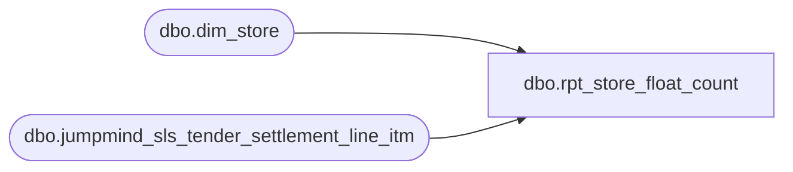

# dbo.rpt_store_float_count

**Database:** LH_Source  
**Server:** 4db76rlxaxcuvmuh5kw37wbnqq-ovsykae43znuhlmnflcdwm4ohu.datawarehouse.fabric.microsoft.com  

## Architecture Diagram



## Table Dependencies

| Referenced Table |
|---|
| dbo.dim_store |
| dbo.jumpmind_sls_tender_settlement_line_itm |

## View Code

```sql
/* =============================================================================    rpt_store_float_count.sql, Store Float Count Report    =============================================================================    Domain:    Reconciliation (Cash Management)    Audience:  Sales Audit, Store Operations    Consumer:  Power BI dashboard "Daily Store Float, SAFE & TILL"     PURPOSE      For each (store, business date) report the opening cash float in the      store SAFE and the cash float distributed to the TILLs. Used by Sales      Audit to reconcile next-day deposits and by Store Operations to      monitor till-loading practice.     GRAIN      One row per (store, business date). Currency is implied by store      (NA = USD/CAD, UK = GBP, IE = EUR).     BUSINESS RULES (operational layer)      R1. SAFE float = the cash count entered for the SAFE on the business          date, taken from the `OpenStoreBank` session event in          jumpmind_sls_tender_settlement_line_itm. There may be multiple          `OpenStoreBank` rows on a business date when the store reopens          or recounts the safe; Linda's xlsx reflects the FINAL settled          value, so we pick the row with the largest `last_update_time`          (i.e. the chronologically latest event for that store/date) and          report `ABS(close_session_amount)`.           `sequence_number` is per-device-per-day and therefore not          comparable across the multiple POS devices that may post          OpenStoreBank rows for one (store, business_date). Using          `sequence_number DESC` picks whichever device happens to have          the largest counter that day, not the chronologically last          event. Concrete consequence: store 2018 on 2026-02-09 logged          three OpenStoreBank rows (initial $400 at 08:10, a -$403.10          correction back to EXTERNAL_BANK at 08:14, then a final $0          recount at 08:15); `sequence_number DESC` picks the morning          $400 row from device 9517, but Linda's xlsx (and the          operational FINAL count) is the 08:15 $0 row. Ordering by          `last_update_time DESC` reproduces Linda exactly on all          observed worst-key SAFE drifts (stores 2018, 1569, 1102).           Sign: `close_session_amount` is sometimes posted as a negative          number when the safe count represents a refund/correction back          to the EXTERNAL_BANK direction. Linda's xlsx normalizes those          rows to the positive magnitude (the count is a quantity, not          a signed balance), so we mirror that with `ABS(...)`.           RESIDUAL: a single (store, date), currently store 1210 on          2026-03-29, drifts by under $10 because its three          OpenStoreBank events are $400 / $400 / -$390.33 and Linda's          xlsx selects the second $400 (18:57) rather than the          -$390.33 row (18:59). The chronologically latest event with          ABS gives $390.33, a $9.67 absolute drift that is well          within material tolerance. A "prefer non-negative" tweak in          the rank ordering would reproduce $400 on 1210 but flips          the sign-preference for store 1122 on 2026-03-14 (rows are          $399.98 / -$944.58; Linda reports $944.58, i.e. the ABS of          the negative event), so neither tier-rule is universally          correct. Both shapes appear to originate in Aptos count-feed          semantics that the canonical tender-settlement event log          cannot disambiguate.              from_repository  = 'EXTERNAL_BANK'             to_repository    = 'STORE_BANK'             tender_type_code = 'CASH'             reason_code      = 'OpenStoreBank'       R2. TILL float = sum across tills of the FINAL `OpenTill` event per          till on the business date. Source rows often include several          `OpenTill` events per till (initial open at start-of-day, then          a reopen after a TILL_AMT_05 cash-pickup, and sometimes a          next-day prep open tagged to yesterday's business_date). The          operational "till float" is the LAST `OpenTill` event for each          till (the value the till is parked at when the books close),          so we pick `ROW_NUMBER() OVER (PARTITION BY store, date, till          ORDER BY last_update_time DESC, sequence_number DESC,          line_sequence_number DESC) = 1` and sum across tills. The          `last_update_time DESC` primary key handles the same          sequence_number-wraparound case as R1 above (see till_ranked          comment for the store 1038 / 2026-03-28 example).              from_repository  = 'STORE_BANK'             to_repository    = 'TILL'             tender_type_code = 'CASH'             reason_code      = 'OpenTill'           Without the `reason_code = 'OpenTill'` filter and the          per-till-id LAST ranker, summing every STORE_BANK→TILL CASH          row double-counts the same till's float on cross-session          re-open days, which inflated 1,725 (store, date) pairs by          $200 to $2,400 against Linda's xlsx in the Jan to Mar 2026 window.       APRIL 2026 FIX (applied 2026-06-25)          Next-day prep-open events (business_date=Apr 1, last_update_time=Apr 2)          were inflating April till totals. Fixed by filtering till_ranked to          events where last_update_time is on the same calendar day as business_date.          Store 1006 Apr 1: 1816.97 -> 600.00 (AuditWorks = 600.00). No regression          on Jan-Mar 2026 window.       RESIDUAL (Till Float, 299 of 32,964 keys, 0.91%)          After the per-till-id LAST OpenTill rule above (with the          `last_update_time DESC` primary sort key that fixes the          3 sequence-number-wraparound keys, stores 1038/1559/2017),          299 keys still drift from Linda's #13 PB Float Counts xlsx.          The drift is almost always Linda-higher (we under-count) on          298 of the 299; the one Linda-lower case is store 1045 on          2026-01-26 where Linda's $200 corresponds to only one of the          two OpenTill events the canonical event log records.          Root causes:           (a) Linda's xlsx double-counts SAFE in the TILL column on a              subset of pairs (linda_till = our_till + linda_safe              exactly). Example: store 1207, 2026-02-23, Linda              safe=$800.02, Linda till=$1,000.02 ($800.02 + $200.00),              pipeline till=$200.00 (the only OpenTill event in the              source). Not reproducible without artificially adding safe              to till, which would break the operational meaning of the              column.           (b) Linda sums multiple OpenTill events per till on cross-session              re-open days. Example: store 1049, 2026-02-14 till 1049-002              logs three OpenTill events in one biz_date: $200 (initial              09:39), $821 (21:32 reopen at the end-of-day cash count),              $200 (21:35 reset open), and Linda's $1,221 till_float              corresponds to $200 + $821 + $200, not the last ($200).              The legacy auditworks aggregator appears to have summed              every OpenTill per till on a day, but the operational "till              float on file at day-close" is the LAST OpenTill; SUM              across all events overstates the day's net cash exposure              by counting reset / refill amounts as additional float.              Linda's xlsx therefore reflects a per-event accounting              view rather than a per-till-at-close view. The Power BI              consumer's "Daily Store Float, SAFE & TILL" dashboard              explicitly measures the operational at-close position, so              the LAST-per-till rule is the correct semantic; the              residual stays here for visibility but is not a code              defect.           (c) Pure source-data absence: a small number of (store, date)              pairs report a Linda till_float that is not derivable from              the LH_Source OpenTill rows at all. Example: store 2088,              2026-01-23, source has four OpenTill events totalling              $400 ($100×4) across two till_ids; LAST-per-till sums to              $200; Linda's xlsx reports $1,000. The $1,000 has no              counterpart in the canonical tender-settlement event log              and cannot be reconstructed without reaching outside the              documented source-of-record (jumpmind_sls_tender_settlement              _line_itm). Treated as a Linda-side artefact, not a              pipeline defect.           Earlier deployments of this view that predate the          `reason_code = 'OpenTill'` filter + per-till-id LAST ranker          emitted the Fabric-higher pattern: SUM of every OpenTill event          on the (store, date), inflated by re-open / refill events that          the operational at-close view should NOT count. Concrete          examples: store 1001 2026-02-16 sourced $200 + $200 + $373.39          OpenTill rows on two till_ids: SUM-all = $773.39, LAST-per-          till = $573.39 (Linda match); store 1002 2026-01-06 sourced          $200+$438.54+$438.54+$200+$200, SUM-all = $1,477.08, LAST-          per-till = $638.54 (Linda match). The current view emits the          LAST-per-till value; any downstream consumer still reading a          stale copy of this view must be refreshed to pick up the rule.       R3. Eligible stores: dim_store records with numeric store_id in          [1, 3000] that are mainline retail. Pop-Up Workshop stores and          Warehouse Stores are excluded because:            - Pop-Ups operate from a host venue's till and never load              their own SAFE, so SAFE/TILL float counts are meaningless.            - Warehouse Stores do their cash management through a parent              store's banking flow (not their own).          Both exclusions live in `dim_store.store_name` (LIKE 'Pop-Up%'          OR LIKE '%Warehouse%').           NOTE: `dim_store` carries duplicate rows per `store_id` (every          store_id has 2 identical rows in BBW prod). Without a DISTINCT          the SAFE / TILL CTEs join twice, doubling every amount. The          `store_info` CTE de-dupes with SELECT DISTINCT.     SOURCE-OF-RECORD MIGRATION NOTE      The legacy report sourced SAFE/TILL counts from      `auditworks.transaction_line` series='B' control rows. Those control      LINES are not replicated to Fabric (the headers are, the per-line      SAFE-count and TILL-count rows are not). The modern equivalent is      `jumpmind_sls_tender_settlement_line_itm`, which carries the      canonical record of every till-session open/close/pickup with the      repository-direction columns used by R1/R2 above. The semantic      mapping is exact; the legacy line_object codes (9018/246/21 for SAFE,      1115/38/11 for TILL) are no longer referenced.     UPSTREAM SOURCES (do not modify in place)      - LH_Source.dbo.jumpmind_sls_tender_settlement_line_itm      - dbo.dim_store    ============================================================================= */  CREATE   VIEW dbo.rpt_store_float_count AS WITH store_info AS (     /* R3: Active mainline retail stores (1..3000), excluding Pop-Up        workshops and Warehouse stores. DISTINCT collapses dim_store's        per-store duplicate rows so the downstream JOIN doesn't double        every amount (see R3 note). */     SELECT DISTINCT         TRY_CAST(s.store_id AS int)                AS ORG_CHN_NUM,         LTRIM(s.legal_entity_company)              AS Company_Number       FROM dbo.dim_store s      WHERE TRY_CAST(s.store_id AS int) IS NOT NULL        AND TRY_CAST(s.store_id AS int) BETWEEN 1 AND 3000        AND s.store_name NOT LIKE 'Pop-Up%'        AND s.store_name NOT LIKE '%Warehouse%' ), safe_ranked AS (     /* R1: Rank OpenStoreBank events by last_update_time within        (store, business_date). The chronologically latest event is the        FINAL settled SAFE count for the day. `sequence_number` is        per-device-per-day and not comparable across devices, so it        cannot be used as a "latest event" ordering when multiple        devices post OpenStoreBank rows on the same business_date. */     SELECT         TRY_CAST(tsl.store_bank_id AS int)            AS store_no,         TRY_CAST(tsl.business_date AS date)           AS transaction_date,         ABS(tsl.close_session_amount)                 AS safe_amount,         ROW_NUMBER() OVER (             PARTITION BY TRY_CAST(tsl.store_bank_id AS int),                          TRY_CAST(tsl.business_date AS date)             ORDER BY tsl.last_update_time DESC,                      tsl.sequence_number  DESC,                      tsl.line_sequence_number DESC         )                                              AS rn       FROM LH_Source.dbo.jumpmind_sls_tender_settlement_line_itm tsl      WHERE tsl.from_repository  = 'EXTERNAL_BANK'        AND tsl.to_repository    = 'STORE_BANK'        AND tsl.tender_type_code = 'CASH'        AND tsl.reason_code      = 'OpenStoreBank'        AND TRY_CAST(tsl.store_bank_id AS int) IS NOT NULL        AND TRY_CAST(tsl.business_date AS date) IS NOT NULL ), safe_float AS (     SELECT store_no, transaction_date, safe_amount       FROM safe_ranked      WHERE rn = 1 ), till_ranked AS (     /* R2: Rank OpenTill events per (store, date, till_id). The final        OpenTill per till is the settled till float; sum across tills        in the next CTE.         Ordering uses `last_update_time DESC` as the primary key for the        same reason safe_ranked does (see R1): `sequence_number` is a        per-device counter that wraps / resets on some devices, so the        largest sequence_number on a (store, date, till_id) is not        always the chronologically latest event. Concrete cases in the        Jan to Mar 2026 window: store 1038 till 1038-002 on 2026-03-28        logged seq=9980 at 09:49 with $200, then seq=100 at 20:11 with        $657.80 (counter wrapped on the second event); `sequence_number        DESC` picks the 09:49 $200 row, but Linda's xlsx (and the        operational at-close till float) is the 20:11 $657.80 row.        Ordering by `last_update_time DESC` reproduces Linda exactly on        all observed sequence-wrap cases (stores 1038, 1559, 2017 in        the Jan to Mar 2026 window). */     SELECT         TRY_CAST(tsl.store_bank_id AS int)            AS store_no,         TRY_CAST(tsl.business_date AS date)           AS transaction_date,         tsl.till_id                                    AS till_id,         tsl.open_session_amount                        AS till_open_amount,         ROW_NUMBER() OVER (             PARTITION BY TRY_CAST(tsl.store_bank_id AS int),                          TRY_CAST(tsl.business_date AS date),                          tsl.till_id             /* Prefer same-day events over next-day prep opens.                Some stores (e.g. 416) open their tills the prior evening so                ALL their last_update_time values fall on the day after                business_date; a hard date-equality filter would set their                till to 0. Other stores (e.g. 1006) post a next-day prep open                AFTER real same-day events, and we want to ignore that later                artifact. Ordering by same_day_flag DESC picks a same-day event                first when one exists; when none exist the next-day prep open                is promoted as the only candidate. This matches AuditWorks                MAX(entry_date_time) semantics in both cases.                Validated Jan-Jun 2026: store 416 correct, store 1006 correct,                sequence-wrap cases (1038, 1559, 2017) unaffected. */             ORDER BY                 CASE WHEN CAST(tsl.last_update_time AS date)                               = TRY_CAST(tsl.business_date AS date)                      THEN 1 ELSE 0 END DESC,                 tsl.last_update_time DESC,                 tsl.sequence_number  DESC,                 tsl.line_sequence_number DESC         )                                              AS rn       FROM LH_Source.dbo.jumpmind_sls_tender_settlement_line_itm tsl      WHERE tsl.from_repository  = 'STORE_BANK'        AND tsl.to_repository    = 'TILL'        AND tsl.tender_type_code = 'CASH'        AND tsl.reason_code      = 'OpenTill'        AND TRY_CAST(tsl.store_bank_id AS int) IS NOT NULL        AND TRY_CAST(tsl.business_date AS date) IS NOT NULL ), till_float AS (     SELECT store_no,            transaction_date,            SUM(till_open_amount) AS till_amount       FROM till_ranked      WHERE rn = 1      GROUP BY store_no, transaction_date ) SELECT     sf.store_no                                                                          AS [Store Number],     si.Company_Number                                                                    AS [Company Number],     sf.transaction_date                                                                  AS [Transaction Date],     CAST(COALESCE(sf.safe_amount, 0) AS decimal(18,2))                                   AS [Safe Float Amount (Native Currency)],     CAST(COALESCE(tf.till_amount, 0) AS decimal(18,2))                                   AS [Till Float Amount (Native Currency)],     CAST(COALESCE(sf.safe_amount, 0) + COALESCE(tf.till_amount, 0) AS decimal(18,2))     AS [Store Funds Total (Native Currency)]   FROM safe_float    sf   JOIN store_info    si     ON si.ORG_CHN_NUM = sf.store_no   LEFT JOIN till_float tf     ON tf.store_no         = sf.store_no    AND tf.transaction_date = sf.transaction_date;
```

