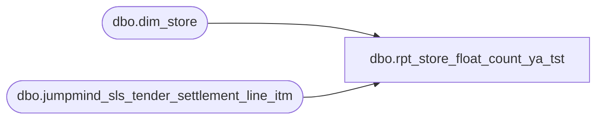

# dbo.rpt_store_float_count_ya_tst

**Database:** LH_Source  
**Server:** 4db76rlxaxcuvmuh5kw37wbnqq-ovsykae43znuhlmnflcdwm4ohu.datawarehouse.fabric.microsoft.com  

## Architecture Diagram



## Table Dependencies

| Referenced Table |
|---|
| dbo.dim_store |
| dbo.jumpmind_sls_tender_settlement_line_itm |

## View Code

```sql
CREATE   VIEW dbo.rpt_store_float_count_ya_tst AS WITH store_info AS (     /* R3: Active mainline retail stores (1..3000), excluding Pop-Up        workshops and Warehouse stores (out of scope for cash-float        reporting — see R3 in header). */     SELECT         TRY_CAST(s.store_id AS int)                AS ORG_CHN_NUM,         LTRIM(s.legal_entity_company)              AS Company_Number       FROM dbo.dim_store s      WHERE TRY_CAST(s.store_id AS int) IS NOT NULL        AND TRY_CAST(s.store_id AS int) BETWEEN 1 AND 3000        AND s.store_name NOT LIKE 'Pop-Up%'        AND s.store_name NOT LIKE '%Warehouse%' ), safe_float AS (     /* R1: SAFE float = inbound cash deposit from external bank into the        store-bank. One row per (store, business_date). */     SELECT         TRY_CAST(tsl.store_bank_id AS int)            AS store_no,         TRY_CAST(tsl.business_date AS date)           AS transaction_date,         SUM(tsl.close_session_amount)                 AS safe_amount       FROM dbo.jumpmind_sls_tender_settlement_line_itm tsl      WHERE tsl.from_repository  = 'EXTERNAL_BANK'        AND tsl.to_repository    = 'STORE_BANK'        AND tsl.tender_type_code = 'CASH'        AND TRY_CAST(tsl.store_bank_id AS int) IS NOT NULL        AND TRY_CAST(tsl.business_date AS date) IS NOT NULL      GROUP BY TRY_CAST(tsl.store_bank_id AS int),               TRY_CAST(tsl.business_date AS date) ), till_float AS (     /* R2: TILL float = cash distributed from store-bank into tills at        open. Sum across all tills on the business_date. */     SELECT         TRY_CAST(tsl.store_bank_id AS int)            AS store_no,         TRY_CAST(tsl.business_date AS date)           AS transaction_date,         SUM(tsl.open_session_amount)                  AS till_amount       FROM dbo.jumpmind_sls_tender_settlement_line_itm tsl      WHERE tsl.from_repository  = 'STORE_BANK'        AND tsl.to_repository    = 'TILL'        AND tsl.tender_type_code = 'CASH'        AND TRY_CAST(tsl.store_bank_id AS int) IS NOT NULL        AND TRY_CAST(tsl.business_date AS date) IS NOT NULL      GROUP BY TRY_CAST(tsl.store_bank_id AS int),               TRY_CAST(tsl.business_date AS date) ) SELECT     sf.store_no                                                                          AS [Store Number],     si.Company_Number                                                                    AS [Company Number],     sf.transaction_date                                                                  AS [Transaction Date],     CAST(COALESCE(sf.safe_amount, 0) AS decimal(18,2))                                   AS [Safe Float Amount (Native Currency)],     CAST(COALESCE(tf.till_amount, 0) AS decimal(18,2))                                   AS [Till Float Amount (Native Currency)],     CAST(COALESCE(sf.safe_amount, 0) + COALESCE(tf.till_amount, 0) AS decimal(18,2))     AS [Store Funds Total (Native Currency)]   FROM safe_float    sf   JOIN store_info    si     ON si.ORG_CHN_NUM = sf.store_no   LEFT JOIN till_float tf     ON tf.store_no         = sf.store_no    AND tf.transaction_date = sf.transaction_date;
```

