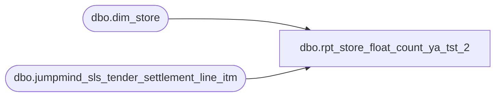

# dbo.rpt_store_float_count_ya_tst_2

**Database:** LH_Source  
**Server:** 4db76rlxaxcuvmuh5kw37wbnqq-ovsykae43znuhlmnflcdwm4ohu.datawarehouse.fabric.microsoft.com  

## Architecture Diagram



## Table Dependencies

| Referenced Table |
|---|
| dbo.dim_store |
| dbo.jumpmind_sls_tender_settlement_line_itm |

## View Code

```sql
CREATE   VIEW dbo.rpt_store_float_count_ya_tst_2 AS WITH store_info AS (     /* R3: Active mainline retail stores (1..3000), excluding Pop-Up        workshops and Warehouse stores. DISTINCT collapses dim_store's        per-store duplicate rows so the downstream JOIN doesn't double        every amount (see R3 note). */     SELECT DISTINCT         TRY_CAST(s.store_id AS int)                AS ORG_CHN_NUM,         LTRIM(s.legal_entity_company)              AS Company_Number       FROM dbo.dim_store s      WHERE TRY_CAST(s.store_id AS int) IS NOT NULL        AND TRY_CAST(s.store_id AS int) BETWEEN 1 AND 3000        AND s.store_name NOT LIKE 'Pop-Up%'        AND s.store_name NOT LIKE '%Warehouse%' ), safe_ranked AS (     /* R1: Rank OpenStoreBank events by sequence_number within        (store, business_date). The latest event is the settled SAFE        count for the day. */     SELECT         TRY_CAST(tsl.store_bank_id AS int)            AS store_no,         TRY_CAST(tsl.business_date AS date)           AS transaction_date,         ABS(tsl.close_session_amount)                 AS safe_amount,         ROW_NUMBER() OVER (             PARTITION BY TRY_CAST(tsl.store_bank_id AS int),                          TRY_CAST(tsl.business_date AS date)             ORDER BY tsl.sequence_number DESC,                      tsl.line_sequence_number DESC         )                                              AS rn       FROM LH_Source.dbo.jumpmind_sls_tender_settlement_line_itm tsl      WHERE tsl.from_repository  = 'EXTERNAL_BANK'        AND tsl.to_repository    = 'STORE_BANK'        AND tsl.tender_type_code = 'CASH'        AND tsl.reason_code      = 'OpenStoreBank'        AND TRY_CAST(tsl.store_bank_id AS int) IS NOT NULL        AND TRY_CAST(tsl.business_date AS date) IS NOT NULL ), safe_float AS (     SELECT store_no, transaction_date, safe_amount       FROM safe_ranked      WHERE rn = 1 ), till_ranked AS (     /* R2: Rank OpenTill events per (store, date, till_id). The final        OpenTill per till is the settled till float; sum across tills        in the next CTE. */     SELECT         TRY_CAST(tsl.store_bank_id AS int)            AS store_no,         TRY_CAST(tsl.business_date AS date)           AS transaction_date,         tsl.till_id                                    AS till_id,         tsl.open_session_amount                        AS till_open_amount,         ROW_NUMBER() OVER (             PARTITION BY TRY_CAST(tsl.store_bank_id AS int),                          TRY_CAST(tsl.business_date AS date),                          tsl.till_id             ORDER BY tsl.sequence_number DESC,                      tsl.line_sequence_number DESC         )                                              AS rn       FROM LH_Source.dbo.jumpmind_sls_tender_settlement_line_itm tsl      WHERE tsl.from_repository  = 'STORE_BANK'        AND tsl.to_repository    = 'TILL'        AND tsl.tender_type_code = 'CASH'        AND tsl.reason_code      = 'OpenTill'        AND TRY_CAST(tsl.store_bank_id AS int) IS NOT NULL        AND TRY_CAST(tsl.business_date AS date) IS NOT NULL ), till_float AS (     SELECT store_no,            transaction_date,            SUM(till_open_amount) AS till_amount       FROM till_ranked      WHERE rn = 1      GROUP BY store_no, transaction_date ) SELECT     sf.store_no                                                                          AS [Store Number],     si.Company_Number                                                                    AS [Company Number],     sf.transaction_date                                                                  AS [Transaction Date],     CAST(COALESCE(sf.safe_amount, 0) AS decimal(18,2))                                   AS [Safe Float Amount (Native Currency)],     CAST(COALESCE(tf.till_amount, 0) AS decimal(18,2))                                   AS [Till Float Amount (Native Currency)],     CAST(COALESCE(sf.safe_amount, 0) + COALESCE(tf.till_amount, 0) AS decimal(18,2))     AS [Store Funds Total (Native Currency)]   FROM safe_float    sf   JOIN store_info    si     ON si.ORG_CHN_NUM = sf.store_no   LEFT JOIN till_float tf     ON tf.store_no         = sf.store_no    AND tf.transaction_date = sf.transaction_date;
```

