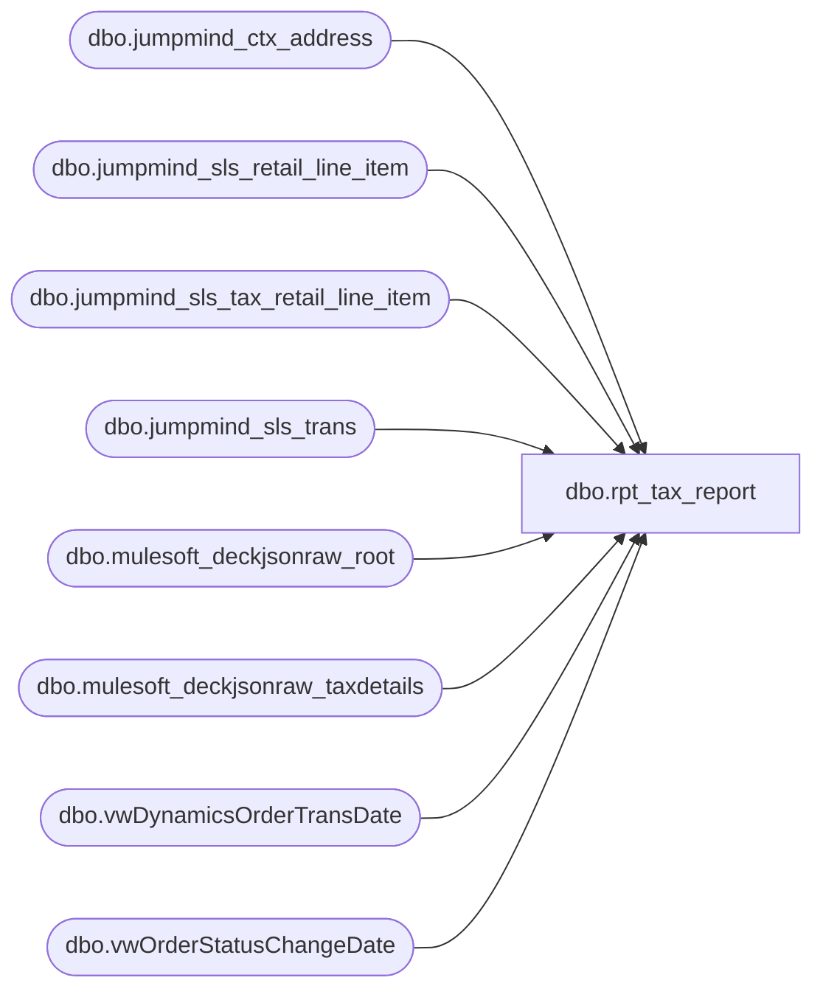

# dbo.rpt_tax_report

**Database:** LH_Source  
**Server:** 4db76rlxaxcuvmuh5kw37wbnqq-ovsykae43znuhlmnflcdwm4ohu.datawarehouse.fabric.microsoft.com  

## Architecture Diagram



## Table Dependencies

| Referenced Table |
|---|
| dbo.jumpmind_ctx_address |
| dbo.jumpmind_sls_retail_line_item |
| dbo.jumpmind_sls_tax_retail_line_item |
| dbo.jumpmind_sls_trans |
| dbo.mulesoft_deckjsonraw_root |
| dbo.mulesoft_deckjsonraw_taxdetails |
| dbo.vwDynamicsOrderTransDate |
| dbo.vwOrderStatusChangeDate |

## View Code

```sql
/* =============================================================================    rpt_tax_report.sql -- #18 US Sales Tax Subledger  (BLUEPRINT REBUILD)    =============================================================================    Domain:   Sales / Tax Subledger (US GL 204500)    Consumer: Power BI "#18 - Tax Report"    Contract (unchanged): [Store] int, [Object-Action] varchar, [Debit] dec,                          [Credit] dec, [Balance] dec, [Posting Date] date.     SOURCE OF TRUTH (finance "LH_Data_Summed_by_GL" blueprint, GL 204500)      Re-sourced off LH_Source only; no LH_Mart. Two contributions:        POS  (blueprint salesTax):  jumpmind_sls_tax_retail_line_item               .money_tax_amount, for non-void COMPLETED SALE/RETURN lines,               US stores (jumpmind_ctx_address.country_id = 'US'), money_tax               <> 0. (CA -> 204560 and UK/IE -> 204580 are different GLs and               are NOT part of this US 204500 report.)        OMS  (blueprint omsSalesTax): mulesoft_deckjsonraw_taxdetails.TotalAmount               for SiteCode = 'BAB' (US), OrderStatus IN (6,10), shipped,               non-Webstore.     PRESENTATION (preserved from the prior view)      Object-Action splits on the SIGN of per-transaction net tax:        net tax > 0 -> 'Sales Tax charged'   (booked as Credit)        net tax < 0 -> 'Sales Tax refunded'  (booked as Debit)      [Balance] is the per-store running ledger (charged then refunded).      Sign convention matches the prior view (charged -> negative Credit cell,      refunded -> positive Debit cell) so the Power BI consumer is unchanged.     CHANGES vs prior view      - Source swapped from LH_Mart.transaction_facts.tax_amount to the blueprint        jumpmind + deck tax feeds (LH_Mart removed).      - Date window is now rolling 2 years instead of hard-coded Q1 2026, so the        report stays live. Consumers filter [Posting Date] in Power BI.     DATA GAPS (per 2026-06-15 ask)      - Store scope uses jumpmind_ctx_address (every real US store), not the        blueprint's static 448-store list, so new stores are included; a        single-period blueprint run can therefore read slightly lower than this        report by any store finance has not yet added to its list.      - The 72-cell net-zero-parent split-posting residual documented previously        (Aptos pre-aggregation gap) is unrelated to source and unaffected.    ============================================================================= */  CREATE   VIEW dbo.rpt_tax_report AS WITH pos_tax AS (     /* Blueprint salesTax, US only, summed to one signed net-tax per POS        transaction so the charged/refunded sign split is per-transaction. */     SELECT         TRY_CONVERT(int, t.business_unit_id) AS store_no,         CAST(t.create_time AS date)          AS posting_date,         t.device_id, t.business_date, t.sequence_number,         SUM(tax.money_tax_amount)            AS net_tax       FROM LH_Source.dbo.jumpmind_sls_retail_line_item tli       JOIN LH_Source.dbo.jumpmind_sls_trans t         ON t.device_id = tli.device_id        AND t.business_date = tli.business_date        AND t.sequence_number = tli.sequence_number       JOIN LH_Source.dbo.jumpmind_sls_tax_retail_line_item tax         ON tax.device_id = tli.device_id        AND tax.business_date = tli.business_date        AND tax.sequence_number = tli.sequence_number        AND tax.line_sequence_number = tli.line_sequence_number       INNER JOIN LH_Source.dbo.jumpmind_ctx_address cbu         ON cbu.business_unit_id = LEFT(tli.device_id, 4)      WHERE tli.voided = 0        AND t.trans_type IN ('SALE','RETURN')        AND t.trans_status = 'COMPLETED'        AND tax.money_tax_amount <> 0        AND cbu.country_id = 'US'        AND t.create_time >= DATEADD(year, -2, GETDATE())      GROUP BY TRY_CONVERT(int, t.business_unit_id), CAST(t.create_time AS date),               t.device_id, t.business_date, t.sequence_number ), oms_tax AS (     /* Blueprint omsSalesTax, US (SiteCode BAB -> 204500), per order. */     SELECT         TRY_CONVERT(int, v.InventLocationId) AS store_no,         CAST(r.OrderDateUTC AS date)         AS posting_date,         r.OrderID,         SUM(td.TotalAmount)                  AS net_tax       FROM LH_Source.dbo.mulesoft_deckjsonraw_taxdetails td       INNER JOIN LH_Source.dbo.mulesoft_deckjsonraw_root r               ON td._ParentKeyField = r.OrderID       INNER JOIN LH_Source.dbo.vwDynamicsOrderTransDate v               ON r.OrderNumber = v.OrderNumber       INNER JOIN LH_Source.dbo.vwOrderStatusChangeDate v2               ON r.OrderNumber = v2.OrderNumber      WHERE r.SiteCode = 'BAB'        AND r.OrderStatus IN (6, 10)        AND v.ECommOrderType NOT IN ('Webstore')        AND v.Shipped = 1        AND r.OrderDateUTC >= DATEADD(year, -2, GETDATE())      GROUP BY TRY_CONVERT(int, v.InventLocationId), CAST(r.OrderDateUTC AS date), r.OrderID ), txn AS (     SELECT store_no, posting_date, net_tax FROM pos_tax     UNION ALL     SELECT store_no, posting_date, net_tax FROM oms_tax ), classified AS (     SELECT         store_no                                                       AS [Store],         CASE WHEN net_tax > 0 THEN 'Sales Tax charged'              ELSE 'Sales Tax refunded' END                            AS [Object-Action],         posting_date,         net_tax AS amt       FROM txn      WHERE net_tax <> 0        AND store_no IS NOT NULL ), agg AS (     SELECT         [Store],         [Object-Action],         MIN(posting_date) AS [Posting Date],         CAST(SUM(CASE WHEN [Object-Action] = 'Sales Tax refunded' THEN -amt ELSE 0 END) AS decimal(18,2)) AS [Debit],         CAST(SUM(CASE WHEN [Object-Action] = 'Sales Tax charged'  THEN -amt ELSE 0 END) AS decimal(18,2)) AS [Credit]       FROM classified      GROUP BY [Store], [Object-Action] ) SELECT     [Store],     [Object-Action],     [Debit],     [Credit],     CAST(         SUM([Debit] + [Credit]) OVER (             PARTITION BY [Store]             ORDER BY CASE [Object-Action]                           WHEN 'Sales Tax charged'  THEN 0                           WHEN 'Sales Tax refunded' THEN 1                           ELSE 2 END             ROWS UNBOUNDED PRECEDING         ) AS decimal(18,2)     ) AS [Balance],     [Posting Date] FROM agg;
```

