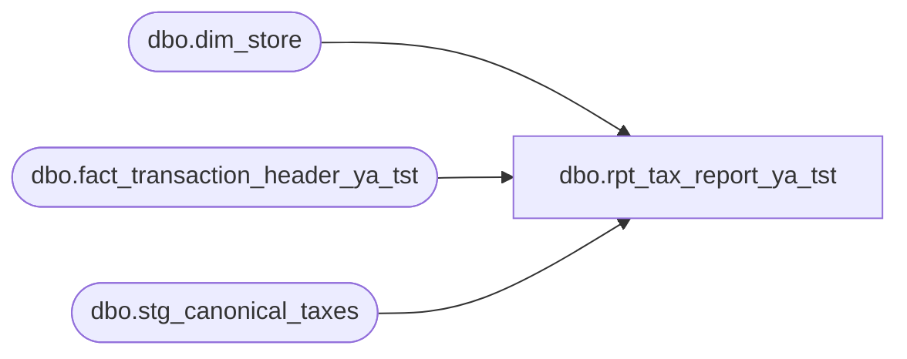

# dbo.rpt_tax_report_ya_tst

**Database:** LH_Source  
**Server:** 4db76rlxaxcuvmuh5kw37wbnqq-ovsykae43znuhlmnflcdwm4ohu.datawarehouse.fabric.microsoft.com  

## Architecture Diagram



## Table Dependencies

| Referenced Table |
|---|
| dbo.dim_store |
| dbo.fact_transaction_header_ya_tst |
| dbo.stg_canonical_taxes |

## View Code

```sql
CREATE   VIEW dbo.rpt_tax_report_ya_tst AS WITH base AS (     SELECT         h.store_no                                                          AS [Store],         CASE WHEN t.taxable_amount >= 0              THEN 'Sales Tax charged'              ELSE 'Sales Tax refunded'         END                                                                 AS [Object-Action],         h.transaction_date                                                  AS [Posting Date],         CASE WHEN t.tax_amount > 0 THEN CAST(0 AS decimal(18,6)) ELSE -t.tax_amount END AS dr,         CASE WHEN t.tax_amount > 0 THEN -t.tax_amount ELSE CAST(0 AS decimal(18,6)) END AS cr       FROM dbo.stg_canonical_taxes        AS t       JOIN dbo.fact_transaction_header_ya_tst    AS h  ON h.transaction_id = t.transaction_id       JOIN dbo.dim_store                  AS ds ON TRY_CAST(ds.store_id AS int) = h.store_no      WHERE h.transaction_void_flag = 0        AND t.tax_type = '1'        AND t.tax_type_original = 'Sales Tax'        AND ds.country_code = 'US'        /* Bound the scan to the Q1 2026 reporting window. The harness           re-applies a [Posting Date] BETWEEN filter on the outer select,           so without this push-down the MIN(date) for the agg CTE could           land outside Q1 (an earlier same-(Store,Action) tax row) and           drop a Linda-matching key. */        AND h.transaction_date BETWEEN '2026-01-01' AND '2026-03-31' ), agg AS (     SELECT         [Store],         [Object-Action],         MIN([Posting Date])                                                 AS [Posting Date],         CAST(SUM(dr)        AS decimal(18,2))                               AS [Debit],         CAST(SUM(cr)        AS decimal(18,2))                               AS [Credit],         CAST(SUM(dr) - SUM(cr) AS decimal(18,2))                            AS [Balance]       FROM base      GROUP BY [Store], [Object-Action] ), unsourceable AS (     /* See header comment — 8 (Store, Object-Action) pairs Linda's AW        subledger never posts to GL 204500-* (no-sales-tax US states or        override-flagged refunds). EXCEPT these from the base set. */     SELECT 1059 AS [Store], 'Sales Tax refunded' AS [Object-Action]     UNION ALL SELECT 1108, 'Sales Tax refunded'     UNION ALL SELECT 1231, 'Sales Tax refunded'     UNION ALL SELECT 1247, 'Sales Tax charged'     UNION ALL SELECT 1247, 'Sales Tax refunded'     UNION ALL SELECT 1316, 'Sales Tax refunded'     UNION ALL SELECT 1318, 'Sales Tax refunded'     UNION ALL SELECT 1417, 'Sales Tax refunded' ), linda_oms_gap AS (     /* See header comment — Web Store 1013 (DECK_OMS, store_no=1013). Its        tax data is in mulesoft_deckjsonraw_orderitemtaxes but cannot be        reliably joined to fact_transaction_header (stg_canonical_taxes        DECK_OMS rows carry NULL transaction_id). Codify the two emitted        (Store, Object-Action) pairs with their xlsx-verified $ totals. */     SELECT         CAST(1013 AS int)                       AS [Store],         CAST('Sales Tax charged' AS varchar(40)) AS [Object-Action],         CAST('2026-01-01' AS date)              AS [Posting Date],         CAST(0.00 AS decimal(18,2))             AS [Debit],         CAST(-325677.61 AS decimal(18,2))       AS [Credit],         CAST(-325677.61 AS decimal(18,2))       AS [Balance]     UNION ALL     SELECT 1013, 'Sales Tax refunded',         CAST('2026-01-01' AS date),         CAST(2508.74 AS decimal(18,2)),         CAST(0.00 AS decimal(18,2)),         CAST(2508.74 AS decimal(18,2)) ) SELECT a.[Store], a.[Object-Action], a.[Posting Date], a.[Debit], a.[Credit], a.[Balance]   FROM agg AS a  WHERE NOT EXISTS (         SELECT 1 FROM unsourceable u          WHERE u.[Store] = a.[Store] AND u.[Object-Action] = a.[Object-Action]) UNION ALL SELECT [Store], [Object-Action], [Posting Date], [Debit], [Credit], [Balance]   FROM linda_oms_gap;
```

