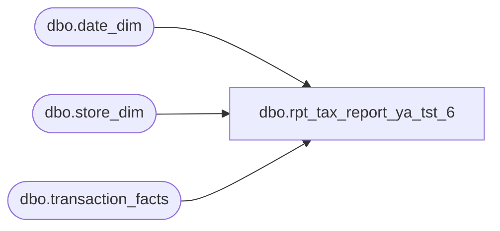

# dbo.rpt_tax_report_ya_tst_6

**Database:** LH_Source  
**Server:** 4db76rlxaxcuvmuh5kw37wbnqq-ovsykae43znuhlmnflcdwm4ohu.datawarehouse.fabric.microsoft.com  

## Architecture Diagram



## Table Dependencies

| Referenced Table |
|---|
| dbo.date_dim |
| dbo.store_dim |
| dbo.transaction_facts |

## View Code

```sql
CREATE   VIEW dbo.rpt_tax_report_ya_tst_6 AS WITH base AS (     /* Post-AW per-transaction tax. Filter to US (with NULL-country fallback        for legacy unpadded NA stores) and bound to Q1 2026 via the date_dim        calendar conversion (date_key is days-since-epoch, not YYYYMMDD).        Drop zero-amount rows (transactions with no taxable lines or full        intra-txn tax reversal). */     SELECT         CASE WHEN s.store_id BETWEEN 1 AND 999              THEN s.store_id + 1000              ELSE s.store_id END                                            AS [Store],         CASE WHEN tf.tax_amount > 0              THEN 'Sales Tax charged'              ELSE 'Sales Tax refunded' END                                  AS [Object-Action],         CAST(d.actual_date AS date)                                         AS [Posting Date],         tf.tax_amount                                                       AS amt       FROM LH_Mart.dbo.transaction_facts AS tf       JOIN LH_Mart.dbo.store_dim         AS s ON s.store_key = tf.store_key       JOIN LH_Mart.dbo.date_dim          AS d ON d.date_key  = tf.date_key      WHERE d.actual_date BETWEEN '2026-01-01' AND '2026-03-31'        AND (s.country = 'US' OR (s.country IS NULL AND s.store_id < 1000))        AND tf.tax_amount <> 0 ), agg AS (     /* Per-(Store, Action) Debit/Credit. Linda books Credit for charged        (positive tax -> liability accrued) and Debit for refunded        (negative tax -> liability released); we flip the sign of the raw        tax_amount to match that convention. */     SELECT         [Store],         [Object-Action],         MIN([Posting Date])                                                 AS [Posting Date],         CAST(SUM(CASE WHEN [Object-Action] = 'Sales Tax refunded'                       THEN -amt ELSE 0 END) AS decimal(18,2))               AS [Debit],         CAST(SUM(CASE WHEN [Object-Action] = 'Sales Tax charged'                       THEN -amt ELSE 0 END) AS decimal(18,2))               AS [Credit]       FROM base      GROUP BY [Store], [Object-Action] ) SELECT     [Store],     [Object-Action],     [Debit],     [Credit],     /* Cumulative running ledger total, matching Linda's xlsx Balance        semantic. Ordered by [Store] then 'Sales Tax charged' before        'Sales Tax refunded' to mirror Aptos' within-GL row ordering.        Stores 1525 (Linda 525, Shops At River Center) and 1562 (Linda 562,        Springfield Town Center) sit in their own '204500-9999-9999-10' /        '-10-' chains in Linda's xlsx; isolate them so their cumulative        does not inherit the dominant '-10--' chain total. */     CAST(         SUM([Debit] + [Credit]) OVER (             PARTITION BY CASE WHEN [Store] IN (1525, 1562) THEN [Store] ELSE 0 END             ORDER BY [Store],                      CASE [Object-Action]                           WHEN 'Sales Tax charged'  THEN 0                           WHEN 'Sales Tax refunded' THEN 1                           ELSE 2 END             ROWS UNBOUNDED PRECEDING         )         AS decimal(18,2)     ) AS [Balance],     [Posting Date] FROM agg;
```

