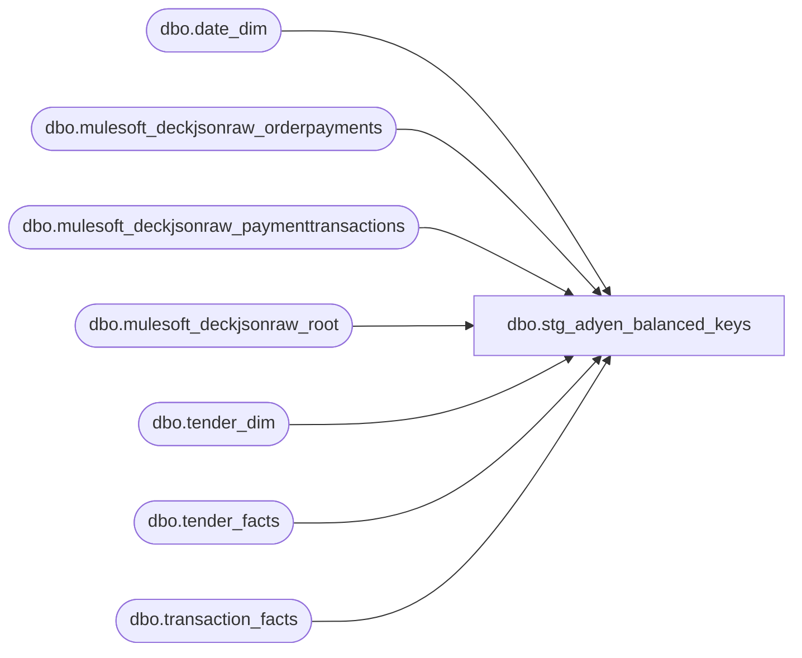

# dbo.stg_adyen_balanced_keys

**Database:** LH_Source  
**Server:** 4db76rlxaxcuvmuh5kw37wbnqq-ovsykae43znuhlmnflcdwm4ohu.datawarehouse.fabric.microsoft.com  

## Architecture Diagram



## Table Dependencies

| Referenced Table |
|---|
| dbo.date_dim |
| dbo.mulesoft_deckjsonraw_orderpayments |
| dbo.mulesoft_deckjsonraw_paymenttransactions |
| dbo.mulesoft_deckjsonraw_root |
| dbo.tender_dim |
| dbo.tender_facts |
| dbo.transaction_facts |

## View Code

```sql
CREATE   VIEW dbo.stg_adyen_balanced_keys AS WITH adyen_deck_events AS (     SELECT         r.OrderNumber                              AS web_order_number,         op.Generic1                                AS deck_brand,         CASE pt.PaymentTransactionTypeId             WHEN 2  THEN  CAST(pt.Amount AS decimal(18,2))             WHEN 11 THEN -CAST(pt.Amount AS decimal(18,2))             ELSE 0         END                                        AS deck_event_signed_amount,         CAST(pt.TransactionDateUTC AS date)        AS deck_event_date_utc       FROM LH_Source.dbo.mulesoft_deckjsonraw_orderpayments         op       JOIN LH_Source.dbo.mulesoft_deckjsonraw_root                  r         ON r.OrderID = op._ParentKeyField       JOIN LH_Source.dbo.mulesoft_deckjsonraw_paymenttransactions   pt         ON pt.OrderPaymentId = op.ID      WHERE op.PaymentProcessor LIKE 'Adyen%'        AND pt.IsDecline = 'False'        AND pt.PaymentTransactionTypeId IN (2, 11) ), adyen_brand_tender AS (     SELECT 'Visa'             AS brand_norm, 604 AS tender_code UNION ALL     SELECT 'visa'             ,              604                UNION ALL     SELECT 'VISA'             ,              604                UNION ALL     SELECT 'Mc'               ,              605                UNION ALL     SELECT 'mc'               ,              605                UNION ALL     SELECT 'MC'               ,              605                UNION ALL     SELECT 'Mastercard'       ,              605                UNION ALL     SELECT 'MasterCard'       ,              605                UNION ALL     SELECT 'MASTERCARD'       ,              605                UNION ALL     SELECT 'mastercard'       ,              605                UNION ALL     SELECT 'Master'           ,              605                UNION ALL     SELECT 'master'           ,              605                UNION ALL     SELECT 'American Express' ,              606                UNION ALL     SELECT 'AmericanExpress'  ,              606                UNION ALL     SELECT 'Amex'             ,              606                UNION ALL     SELECT 'amex'             ,              606                UNION ALL     SELECT 'AMEX'             ,              606                UNION ALL     SELECT 'Discover'         ,              608                UNION ALL     SELECT 'discover'         ,              608                UNION ALL     SELECT 'DISCOVER'         ,              608 ), adyen_mart_cc_txns AS (     SELECT         tf.transaction_id                          AS mart_transaction_id,         tff.tender_key                             AS tender_key,         TRY_CONVERT(int, td.tender_code)           AS tender_code,         tff.tender_amt                             AS tender_amt,         dd.actual_date                             AS posting_date,         CASE             WHEN tf.webOrderNumber LIKE '%[_]%'                 THEN LEFT(tf.webOrderNumber, CHARINDEX('_', tf.webOrderNumber) - 1)             ELSE tf.webOrderNumber         END                                        AS clean_web_order_number       FROM LH_Mart.dbo.transaction_facts tf       JOIN LH_Mart.dbo.tender_facts      tff ON tff.transaction_id = tf.transaction_id       JOIN LH_Mart.dbo.tender_dim        td  ON td.tender_key      = tff.tender_key       JOIN LH_Mart.dbo.date_dim          dd  ON dd.date_key        = tf.date_key      WHERE TRY_CONVERT(int, td.tender_code) IN (604, 605, 606, 608)        AND tf.webOrderNumber IS NOT NULL ), adyen_per_event_alloc AS (     SELECT         m.mart_transaction_id,         m.tender_key,         m.tender_amt,         e.deck_event_signed_amount       FROM adyen_mart_cc_txns m       JOIN adyen_deck_events  e         ON  e.web_order_number    = m.clean_web_order_number        AND  e.deck_event_date_utc = m.posting_date       JOIN adyen_brand_tender bt         ON  bt.brand_norm  = e.deck_brand        AND  bt.tender_code = m.tender_code ) SELECT mart_transaction_id, tender_key   FROM adyen_per_event_alloc  GROUP BY mart_transaction_id, tender_key HAVING ABS(SUM(deck_event_signed_amount) - MAX(tender_amt)) <= 0.01;
```

