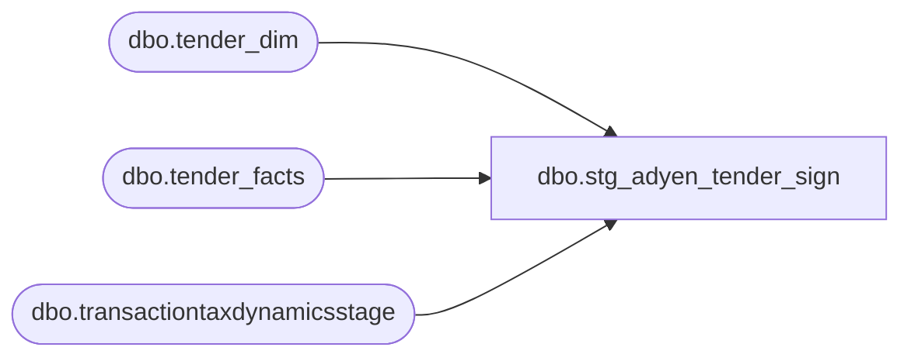

# dbo.stg_adyen_tender_sign

**Database:** LH_Source  
**Server:** 4db76rlxaxcuvmuh5kw37wbnqq-ovsykae43znuhlmnflcdwm4ohu.datawarehouse.fabric.microsoft.com  

## Architecture Diagram



## Table Dependencies

| Referenced Table |
|---|
| dbo.tender_dim |
| dbo.tender_facts |
| dbo.transactiontaxdynamicsstage |

## View Code

```sql
CREATE   VIEW dbo.stg_adyen_tender_sign AS WITH tttds_per_leg AS (     /* Per-leg dedupe: transactiontaxdynamicsstage emits two rows per        physical leg (tax_level 1 = jurisdiction-level rollup, tax_level 6        = transaction-level rollup) with identical gross_line_amount and        pos_discount_amount. MAX() collapses to one logical leg row per        (transaction_id, line_id, line_sequence). */     SELECT         CAST(transaction_id AS bigint)                AS mart_transaction_id,         line_id,         CAST(line_sequence AS bigint)                 AS line_sequence,         MAX(gross_line_amount)                        AS gross_line_amount,         MAX(pos_discount_amount)                      AS pos_discount_amount,         MAX(line_object)                              AS line_object,         MAX(line_action)                              AS line_action       FROM LH_Mart.dbo.transactiontaxdynamicsstage      WHERE line_object = 296    -- AW Adyen-auth tracking line object (BBW Update #5)        AND line_action = 12     -- AW _AdyenAuth line action      GROUP BY CAST(transaction_id AS bigint), line_id, CAST(line_sequence AS bigint) ), tf_cc_per_txn AS (     /* Per-transaction credit-card tender_facts net amount and the        canonical Adyen / brand tender_code that the per-leg rows        inherit. Restricted to CC-route codes only (Klarna 670-673 /        Adyen-PayPal 674 / cash / gift / etc. are out of scope). When a        transaction has multiple CC tender_facts rows (rare; usually        implies two physical card swipes on one transaction) we surface        one row per (transaction_id, tender_code) so the per-leg        attribution stays clean.         NOTE on tender_code 670 (Klarna USA): excluded from this view        on purpose. Klarna's per-leg shape comes from        `mulesoft_deckjsonraw_paymenttransactions.Generic1` via        `stg_canonical_payments`, not from tttds. The cc_auth /        cc_balancing views consume the per-leg Klarna shape from there. */     SELECT         tf.transaction_id                              AS mart_transaction_id,         TRY_CONVERT(int, td.tender_code)               AS tender_code,         tf.tender_amt                                  AS tender_amt       FROM LH_Mart.dbo.tender_facts tf       JOIN LH_Mart.dbo.tender_dim   td ON td.tender_key = tf.tender_key      WHERE TRY_CONVERT(int, td.tender_code) IN (604, 605, 606, 608, 697, 698, 699) ) SELECT     l.mart_transaction_id,     l.line_id,     l.line_sequence,     t.tender_code,     CAST(l.gross_line_amount - ISNULL(l.pos_discount_amount, 0)          AS decimal(18,2))                              AS per_leg_amount,     /* Per-line sign: the C# classifier reads `Amount` and signs it        directly. tttds carries the absolute payment amount; we recover        the sign from the per-transaction tender_facts.tender_amt. A        transaction with negative tender_amt (refund / chargeback) marks        all its per-leg rows as negative; positive tender_amt marks all        as positive. Mixed-sign transactions (rare partial-refund cases)        inherit the net sign so per-key SUMs preserve Linda's value. */     CAST(CASE             WHEN t.tender_amt < 0 THEN -1             WHEN t.tender_amt > 0 THEN  1             ELSE                         0          END AS smallint)                               AS aw_per_line_sign,     CAST(CASE             WHEN t.tender_amt < 0               THEN -1 * (l.gross_line_amount - ISNULL(l.pos_discount_amount, 0))             WHEN t.tender_amt > 0               THEN       (l.gross_line_amount - ISNULL(l.pos_discount_amount, 0))             ELSE 0          END AS decimal(18,2))                          AS per_leg_signed   FROM tttds_per_leg l   JOIN tf_cc_per_txn t     ON t.mart_transaction_id = l.mart_transaction_id;
```

