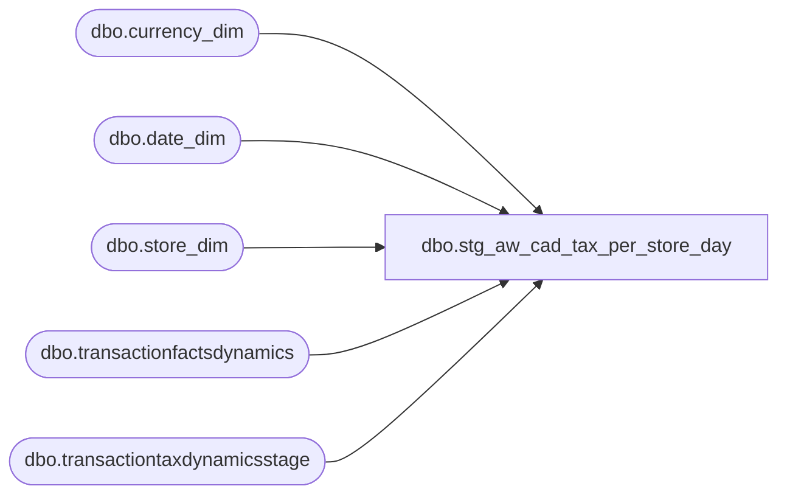

# dbo.stg_aw_cad_tax_per_store_day

**Database:** LH_Source  
**Server:** 4db76rlxaxcuvmuh5kw37wbnqq-ovsykae43znuhlmnflcdwm4ohu.datawarehouse.fabric.microsoft.com  

## Architecture Diagram



## Table Dependencies

| Referenced Table |
|---|
| dbo.currency_dim |
| dbo.date_dim |
| dbo.store_dim |
| dbo.transactionfactsdynamics |
| dbo.transactiontaxdynamicsstage |

## View Code

```sql
CREATE   VIEW dbo.stg_aw_cad_tax_per_store_day AS SELECT  TRY_CAST(sd.store_id AS int)                AS store_no,         CAST(dd.actual_date AS date)                AS posting_date,         cd.currency_code                            AS currency,         CAST('Transaction' AS varchar(16))          AS section,         CAST('Sales Tax'   AS varchar(32))          AS subsection,         CAST(CASE WHEN ttd.line_object IN (550, 551) THEN 'GST Tax'                   WHEN ttd.line_object = 552        THEN 'HST Tax'              END AS varchar(64))                    AS line_object_desc,         SUM(CASE WHEN ttd.line_action = 11 THEN  ttd.gross_line_amount ELSE 0 END) AS pos_amt,         SUM(CASE WHEN ttd.line_action = 12 THEN -ttd.gross_line_amount ELSE 0 END) AS neg_amt,         CAST(0 AS decimal(18,2))                    AS adj_amt   FROM LH_Mart.dbo.transactiontaxdynamicsstage ttd   JOIN LH_Mart.dbo.transactionfactsdynamics tfd     ON tfd.transaction_id = ttd.transaction_id   JOIN LH_Mart.dbo.date_dim     dd ON dd.date_key     = tfd.date_key   JOIN LH_Mart.dbo.currency_dim cd ON cd.currency_key = tfd.currency_key   JOIN LH_Mart.dbo.store_dim    sd ON sd.store_key    = tfd.store_key  WHERE cd.currency_code = 'CAD'    AND ttd.line_object IN (550, 551, 552)  GROUP BY sd.store_id, dd.actual_date, cd.currency_code,           CASE WHEN ttd.line_object IN (550, 551) THEN 'GST Tax'                WHEN ttd.line_object = 552        THEN 'HST Tax'           END;
```

