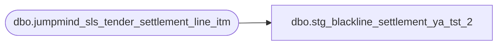

# dbo.stg_blackline_settlement_ya_tst_2

**Database:** LH_Source  
**Server:** 4db76rlxaxcuvmuh5kw37wbnqq-ovsykae43znuhlmnflcdwm4ohu.datawarehouse.fabric.microsoft.com  

## Architecture Diagram



## Table Dependencies

| Referenced Table |
|---|
| dbo.jumpmind_sls_tender_settlement_line_itm |

## View Code

```sql
CREATE   VIEW [dbo].[stg_blackline_settlement_ya_tst_2] AS SELECT     TRY_CONVERT(int, s.store_bank_id)             AS store_no,     CONVERT(date, CAST(s.business_date AS varchar(8)), 112) AS transaction_date,     s.tender_type_code,     s.iso_currency_code,     s.from_repository,     s.to_repository,     s.reason_code,     CAST(s.voided                     AS bit)             AS voided,     CAST(s.pickup_amount              AS decimal(18,2))   AS pickup_amount,     CAST(s.open_session_amount        AS decimal(18,2))   AS open_session_amount,     CAST(s.close_session_amount       AS decimal(18,2))   AS close_session_amount,     CAST(s.counted_session_amount     AS decimal(18,2))   AS counted_session_amount,     CAST(s.over_under_session_amount  AS decimal(18,2))   AS over_under_session_amount FROM LH_Source.dbo.jumpmind_sls_tender_settlement_line_itm AS s WHERE s.voided = 0
```

