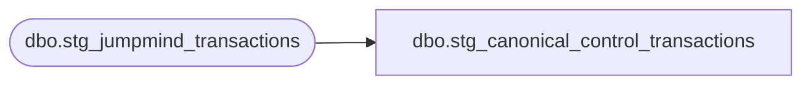

# dbo.stg_canonical_control_transactions

**Database:** LH_Source  
**Server:** 4db76rlxaxcuvmuh5kw37wbnqq-ovsykae43znuhlmnflcdwm4ohu.datawarehouse.fabric.microsoft.com  

## Architecture Diagram



## Table Dependencies

| Referenced Table |
|---|
| dbo.stg_jumpmind_transactions |

## View Code

```sql
CREATE   VIEW dbo.stg_canonical_control_transactions AS SELECT     t.transaction_id,     t.store_id,     t.transaction_no,     t.transaction_series,     t.transaction_category,     t.transaction_void_flag,     t.entry_date_time,     t.business_date,     t.cashier_no,     t.till_no,     t.closeout_flag,     /* Control-transaction-specific classification */     CASE         WHEN t.transaction_category = 10                              THEN 'CASHIER'         WHEN t.transaction_category = 20                              THEN 'REGISTER_CLOSEOUT'         WHEN t.transaction_category = 100                             THEN 'PAYROLL'         WHEN t.transaction_category = 207                             THEN 'BANKING'         WHEN t.transaction_category = 208                             THEN 'STORE_EMPLOYEE_MGMT'         WHEN t.transaction_category = 250                             THEN 'MEDIA_RECONCILIATION'         WHEN t.transaction_category = 251                             THEN 'BANK_RECONCILIATION'         WHEN t.transaction_category = 252                             THEN 'PERIOD_END'         WHEN t.transaction_category BETWEEN 241 AND 249               THEN 'CL_OPERATIONS'         WHEN t.transaction_category BETWEEN 253 AND 255               THEN 'PROMOTIONAL_OR_WRITE_OFF'         ELSE                                                                NULL     END                                                              AS control_kind,     t.source_system   FROM dbo.stg_jumpmind_transactions AS t  /* Category 30 (TRAINING_MODE) removed per audit — training transactions     are flagged regular POS rows, not operational control records.     Per C# ControlTransaction.IsControlTransaction() training_mode is not     treated as a control op. */  WHERE t.transaction_category IN (10, 20, 100, 207, 208, 250, 251, 252)     OR t.transaction_category BETWEEN 241 AND 255;
```

