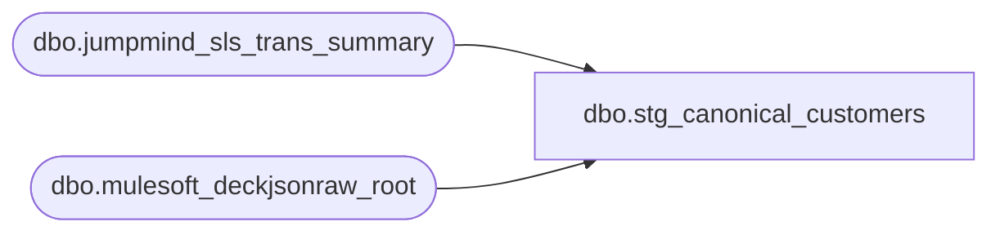

# dbo.stg_canonical_customers

**Database:** LH_Source  
**Server:** 4db76rlxaxcuvmuh5kw37wbnqq-ovsykae43znuhlmnflcdwm4ohu.datawarehouse.fabric.microsoft.com  

## Architecture Diagram



## Table Dependencies

| Referenced Table |
|---|
| dbo.jumpmind_sls_trans_summary |
| dbo.mulesoft_deckjsonraw_root |

## View Code

```sql
CREATE   VIEW dbo.stg_canonical_customers AS WITH pos_customers AS (     /* JumpMind POS: header-level customer info from trans_summary. Customer        role defaults to 1 (Purchasing Customer); first_name/last_name split        from the single customer_name field is non-trivial — surface raw        name as last_name, leave first_name NULL.        Address fields TODO — requires jumpmind_ctx_address join. */     SELECT         CAST(c.device_id        AS varchar(64)) + '|' +         CAST(c.business_date    AS varchar(8))  + '|' +         CAST(c.sequence_number  AS varchar(20))                  AS transaction_id,         CAST(0 AS int)                                            AS line_id,         /* header-level → line 0 */         CAST(1 AS int)                                            AS customer_role,   /* Purchasing Customer default */         CAST(NULL AS varchar(20))                                 AS title,         CAST(NULL AS varchar(100))                                AS first_name,      /* ⚠ TODO split customer_name */         c.customer_name                                           AS last_name,         CAST(NULL AS varchar(200))                                AS address_1,       /* ⚠ TODO jumpmind_ctx_address join */         CAST(NULL AS varchar(200))                                AS address_2,         CAST(NULL AS varchar(100))                                AS city,         CAST(NULL AS varchar(50))                                 AS state,         CAST(NULL AS varchar(50))                                 AS country,         CAST(NULL AS varchar(20))                                 AS postal_code,         CAST(NULL AS varchar(50))                                 AS telephone_no_1,         CAST(NULL AS varchar(50))                                 AS telephone_no_2,         c.customer_id                                             AS customer_no,         CAST(NULL AS varchar(50))                                 AS county,         CAST(NULL AS varchar(20))                                 AS pos_tax_jurisdiction_code,         CAST(NULL AS varchar(50))                                 AS fax_no,         CAST(NULL AS varchar(200))                                AS email_address,         CAST('JUMPMIND' AS varchar(10))                           AS source_system       FROM LH_Source.dbo.jumpmind_sls_trans_summary AS c      /* Filter removed per audit: BBW C# BuildCustomerInfo emits a customer         record for every transaction (with NULLs/defaults for guest sales),         so dropping rows with NULL customer_id+customer_name silently         excluded ~50% of POS sales (anonymous walk-in transactions). */ ), oms_customers AS (     /* OMS emits two rows per order (per Brandon May 7):          role=1 Purchasing Customer (billing): unsuffixed columns          role=2 Send To Customer    (shipping): suffix-1 columns */     SELECT         c.OrderNumber                                            AS transaction_id,         CAST(0 AS int)                                            AS line_id,         CAST(1 AS int)                                            AS customer_role,    /* 1 = Purchasing/Billing */         CAST(NULL AS varchar(20))                                 AS title,         c.FirstName                                               AS first_name,         c.LastName                                                AS last_name,         c.Address1                                                AS address_1,         c.Address2                                                AS address_2,         c.City                                                    AS city,         c.Province                                                AS state,         c.Country                                                 AS country,         c.PostalCode                                              AS postal_code,         c.Phone                                                   AS telephone_no_1,         c.MobilePhone                                             AS telephone_no_2,         c.CustomerID                                              AS customer_no,         CAST(NULL AS varchar(50))                                 AS county,         CAST(NULL AS varchar(20))                                 AS pos_tax_jurisdiction_code,         CAST(NULL AS varchar(50))                                 AS fax_no,         c.Email                                                   AS email_address,         CAST('DECK_OMS' AS varchar(10))                           AS source_system       FROM LH_Source.dbo.mulesoft_deckjsonraw_root AS c      UNION ALL      SELECT         c.OrderNumber                                            AS transaction_id,         CAST(0 AS int)                                            AS line_id,         CAST(2 AS int)                                            AS customer_role,    /* 2 = Send To/Shipping */         CAST(NULL AS varchar(20))                                 AS title,         c.FirstName1                                              AS first_name,         c.LastName1                                               AS last_name,         c.Address4                                                AS address_1,        /* per Brandon — note non-sequential numbering */         c.Address5                                                AS address_2,         c.City1                                                   AS city,         c.Province1                                               AS state,         c.Country1                                                AS country,         c.PostalCode1                                             AS postal_code,         c.Phone1                                                  AS telephone_no_1,         CAST(NULL AS varchar(50))                                 AS telephone_no_2,         c.CustomerID                                              AS customer_no,         CAST(NULL AS varchar(50))                                 AS county,         CAST(NULL AS varchar(20))                                 AS pos_tax_jurisdiction_code,         CAST(NULL AS varchar(50))                                 AS fax_no,         c.Email1                                                  AS email_address,         CAST('DECK_OMS' AS varchar(10))                           AS source_system       FROM LH_Source.dbo.mulesoft_deckjsonraw_root AS c      WHERE c.Address4 IS NOT NULL  /* skip ship-to row when no shipping address (e.g. digital gift card orders) */ ) SELECT     u.transaction_id,     u.line_id,     /* Aptos XPOLLD0013 Customer Detail (record type 'C', 19 fields) */     CAST('C' AS char(1))                                AS record_type,     u.customer_role                                     AS customer_role,     u.title                                             AS title,     u.first_name                                        AS first_name,     u.last_name                                         AS last_name,     u.address_1                                         AS address_1,     u.address_2                                         AS address_2,     u.city                                              AS city,     u.state                                             AS state,     u.country                                           AS country,     u.postal_code                                       AS postal_code,     u.telephone_no_1                                    AS telephone_no_1,     u.telephone_no_2                                    AS telephone_no_2,     u.customer_no                                       AS customer_no,     u.county                                            AS county,     u.pos_tax_jurisdiction_code                         AS pos_tax_jurisdiction_code,     u.fax_no                                            AS fax_no,     u.email_address                                     AS email_address,     /* Lineage */     u.source_system,     /* Helpers */     CASE u.customer_role         WHEN 1   THEN 'Purchasing Customer'         WHEN 2   THEN 'Send To Customer'         WHEN 3   THEN 'Mail Check To Customer'         WHEN 4   THEN 'Customer Liability Customer'         WHEN 5   THEN 'Miscellaneous Customer'         WHEN 200 THEN 'Pickup Customer'         WHEN 201 THEN 'Rain check Customer'         WHEN 202 THEN 'Tender verification Customer'         WHEN 203 THEN 'Restricted transaction Customer'         WHEN 204 THEN 'Bill To Customer'         ELSE NULL     END                                                 AS customer_role_desc   FROM (SELECT * FROM pos_customers UNION ALL SELECT * FROM oms_customers) AS u;
```

