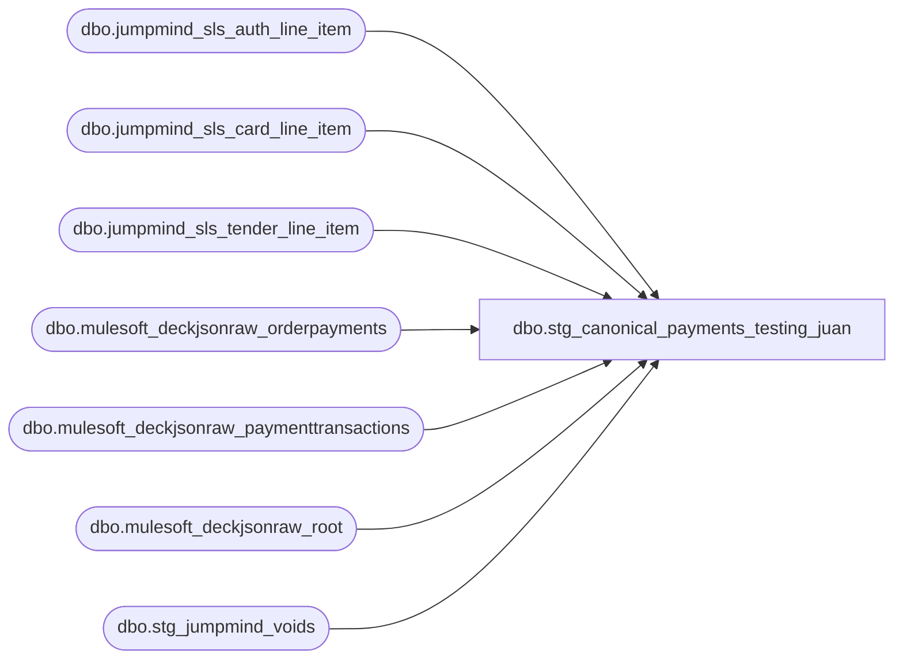

# dbo.stg_canonical_payments_testing_juan

**Database:** LH_Source  
**Server:** 4db76rlxaxcuvmuh5kw37wbnqq-ovsykae43znuhlmnflcdwm4ohu.datawarehouse.fabric.microsoft.com  

## Architecture Diagram



## Table Dependencies

| Referenced Table |
|---|
| dbo.jumpmind_sls_auth_line_item |
| dbo.jumpmind_sls_card_line_item |
| dbo.jumpmind_sls_tender_line_item |
| dbo.mulesoft_deckjsonraw_orderpayments |
| dbo.mulesoft_deckjsonraw_paymenttransactions |
| dbo.mulesoft_deckjsonraw_root |
| dbo.stg_jumpmind_voids |

## View Code

```sql
/* =============================================================================    stg_canonical_payments.sql — Tender / Payment Lines (BuildPayments equivalent)    =============================================================================    Purpose: Equivalent to Stage B `BuildPayments` and per-tender Build*Payment             methods. One row per tender with normalized type code mapping.             Implements the reference-no length split (Aptos spec footnote 9).             Maps tender types to line_object codes via GetCreditCardLineObject             equivalent (BABW.Services.SalesAuditTranslate.cs:5643).     Source tables:      - LH_Source.dbo.jumpmind_sls_tender_line_item        (POS tender lines)        (jumpmind_sls_trans_tender_line_item does not exist in LH_Source —         repointed per Deck/Jumpmind inventory May 6)      - LH_Source.dbo.mulesoft_deckjsonraw_orderpayments    (OMS payments)      - LH_Source.dbo.mulesoft_deckjsonraw_root             (joined for OrderNumber)      - dbo.stg_jumpmind_voids (for void-enriched negation marker)     Tender → line_object mapping (from dim_line_object + GetCreditCardLineObject):      CASH                          → 600      CHECK                         → 601      CREDIT_CARD (generic)         → various 6xx — uses cardType + processor      STORE_CREDIT / HOUSE_ORDER    → 609 (Conflict 3 resolution: same code)      MAESTRO                       → 614      LOCAL_TENDER                  → 626      JCB                           → 642      EURO_FOREIGN                  → 643      AMEX (no ref)                 → 697      CANADIAN_CC (MC/Visa/Debit)   → 698      PROMO_GIFT_CERT               → 623      E_CERTIFICATE                 → 624      MALL_CERTIFICATE              → 619      SFS_REWARD_CERT               → 640      PAYPAL                        → derived per processor      KLARNA                        → derived per processor      GLOBALE                       → derived per processor      AMAZON                        → derived per processor     Business rules applied:      - Reference no length split: values >20 chars → encrypted_reference_no        (field 18) per Aptos spec      - VOID-enriched POST_VOID rows: negate tender amounts (per        Service1.cs:485-488)      - 028 _Tendered action used for sales; 027 _Credited for refunds;        018 _ChangeReturned for change-money-back rows      - GuestSatisfactionRefund flag preserved per-tender for line_object 296        emission upstream     ⚠ TODOs:      - GetCreditCardLineObject full lookup table (cardType × paymentProcessor)        not enumerated here — captures major card brand mappings, edge cases        flagged.      - Verify column names for both tender source tables.    ============================================================================= */  CREATE VIEW [dbo].[stg_canonical_payments_testing_juan] AS WITH pos_tenders AS (     /* Source: jumpmind_sls_tender_line_item (tender row) LEFT JOIN        jumpmind_sls_card_line_item (card brand / masked PAN / expiration) via        composite key + card.ref_line_sequence_number → tender.line_sequence_number.        Auth code comes from auth_line_item; left-joined here for the        reference_no field (not strictly required for line_object derivation        but kept for downstream rpt_credit_card_auth visibility).         card_type single-char per BuildAuthRecord switch (SalesAuditTranslate.cs        4039-4073). Card brand enum values per LH_Source dump (May 8): mixed        case, lowercase plus uppercase variants exist. Use UPPER() for compare.        payment_processor: jumpmind_sls_card_line_item.payment_provider_code is        always NULL in production data per the May 8 dump, so processor is        inferred from the brand prefix instead (ADYEN_*, PAYPAL, KLARNA, etc.). */     SELECT         CAST(tli.device_id        AS varchar(64)) + '|' +         CAST(tli.business_date    AS varchar(8))  + '|' +         CAST(tli.sequence_number  AS varchar(20))            AS transaction_id,         tli.line_sequence_number                              AS line_id,         tli.line_sequence_number                              AS line_sequence,         tli.tender_type_code                                  AS tender_type_raw,         tli.tender_code                                       AS tender_code_raw,         /* Single-char card_type per BuildAuthRecord switch */         CASE             WHEN UPPER(cli.brand) IN ('VISA','V')                                   THEN 'V'             WHEN UPPER(cli.brand) IN ('MASTERCARD','MC','M')                        THEN 'M'             WHEN UPPER(cli.brand) IN ('AMEX','AMERICAN EXPRESS','AMERICAN_EXPRESS','A') THEN 'A'             WHEN UPPER(cli.brand) IN ('DISCOVER','D')                               THEN 'D'             WHEN UPPER(cli.brand) IN ('MAESTRO','VPAY','INTERAC_CARD','USPINDEBIT',                                       'DEBIT CARD','DEBIT','SOLO','SWITCH','T')     THEN 'T'             WHEN UPPER(cli.brand) IN ('JCB','J')                                    THEN 'J'             /* UK CREDIT CARD: per Brandon May 8 — legacy bucket where Visa/MC                were aggregated together. New logic should not preserve the                bucket; default to 'V' (Visa) for line_object routing. */             WHEN UPPER(cli.brand) = 'UK CREDIT CARD'                                THEN 'V'             ELSE NULL         END                                                  AS card_type,         /* payment_processor: payment_provider_code is always NULL in the            production data per May 8 dump, so infer from brand prefix. */         CASE             WHEN UPPER(cli.brand) LIKE 'ADYEN%'                                     THEN 'ADYEN'             WHEN UPPER(cli.brand) = 'PAYPAL'                                        THEN 'PAYPAL'             WHEN UPPER(cli.brand) = 'KLARNA'                                        THEN 'KLARNA'             WHEN UPPER(cli.brand) = 'AMAZON'                                        THEN 'AMAZON'             WHEN UPPER(cli.brand) = 'GLOBALE'                                       THEN 'GLOBALE'             WHEN UPPER(cli.brand) = 'APPLEPAY'                                      THEN 'APPLEPAY'             ELSE NULL  /* default credit card processor unknown — payment_provider_code is NULL on source */         END                                                  AS payment_processor,         tli.tender_amount                                     AS tender_amount,         tli.iso_currency_code                                 AS currency_code,         cli.masked_card_number                                AS reference_no_raw,         ali.auth_code                                         AS authorization_no,         CAST(NULL AS bit)                                     AS gsr_flag,            /* ⚠ TODO Brandon — POS-side GSR per-tender flag */         CAST(tli.change_flag AS bit)                          AS is_change_returned,         CAST('JUMPMIND' AS varchar(10))                       AS source_system       FROM LH_Source.dbo.jumpmind_sls_tender_line_item AS tli       LEFT JOIN LH_Source.dbo.jumpmind_sls_card_line_item AS cli         ON  cli.device_id                = tli.device_id         AND cli.business_date            = tli.business_date         AND cli.sequence_number          = tli.sequence_number         AND cli.ref_line_sequence_number = tli.line_sequence_number       LEFT JOIN LH_Source.dbo.jumpmind_sls_auth_line_item AS ali         ON  ali.device_id                 = cli.device_id         AND ali.business_date             = cli.business_date         AND ali.sequence_number           = cli.sequence_number         AND ali.card_line_sequence_number = cli.line_sequence_number         AND (ali.voided = 0)         AND (ali.post_void = 0 OR ali.post_void IS NULL)      WHERE tli.voided = 0  /* exclude voided tender lines per Service1.cs convention */ ), oms_payments AS (     /* Source: mulesoft_deckjsonraw_orderpayments JOINed to root + paymenttransactions.         Schema realities verified May 8 from 500-row sample:          - orderpayments.OrderID = 0 for ALL sample rows. The OrderID column is            NOT populated on this table (Brandon's May 7 "use OrderID" guidance            applied to orderitems, NOT orderpayments). Must JOIN root via            orderpayments._ParentKeyField → root._RowIndex (the JSON-shred            hierarchy key chain).          - orderpayments.CardType = NULL across ALL sample rows. The card            brand is in orderpayments.Generic1 (e.g. "Visa") instead.          - orderpayments.ExpirationMonth/Year = 0 across ALL sample rows;            expiry data is NOT in those columns despite the schema having            them. Source unconfirmed (likely inside PaymentToken or absent            from the contract). Read as NULL until confirmed.          - orderpayments.Generic2 = last 4 digits of card (e.g. "7658").         Tender-amount derivation (Ryan May 7 Cassandra confirmation):          PaymentTransactionTypeId mapping in 500-row sample: 10 (362), 1 (81),          13 (34), 14 (18), 2 (5). Type 13 (7%) is unhandled — falls to ELSE          Amount as-is. ⚠ TODO Ryan: confirm what type 13 represents.            IN (3, 4, 11)        → -ABS(Amount)   (refund / void / return)            IN (1, 2, 10, 14)    →  ABS(Amount)   (auth / capture / credit-positive)            else (incl. 13)      →  Amount as-is          Fallback chain when no paymenttransactions event:            CapturedAmount → AuthorizedAmount → -CreditedAmount → 0 */     SELECT         djr.OrderNumber                                       AS transaction_id,         op.ID                                                 AS line_id,         op._RowIndex                                          AS line_sequence,         op.PaymentSubType                                     AS tender_type_raw,    /* OMS sample: 'Adyen' (processor label, single distinct value) */         op.PaymentProcessor                                   AS tender_code_raw,    /* OMS sample: 'AdyenV2' — used as tender_code analog for granular routing */         /* card_type single-char derived from Generic1 brand text per the OMS            sample (CardType column is always NULL). Same UPPER() set as POS. */         CASE             WHEN UPPER(op.Generic1) IN ('VISA','V')                                   THEN 'V'             WHEN UPPER(op.Generic1) IN ('MASTERCARD','MC','M')                        THEN 'M'             WHEN UPPER(op.Generic1) IN ('AMEX','AMERICAN EXPRESS','AMERICAN_EXPRESS','A') THEN 'A'             WHEN UPPER(op.Generic1) IN ('DISCOVER','D')                               THEN 'D'             WHEN UPPER(op.Generic1) IN ('MAESTRO','VPAY','INTERAC_CARD','USPINDEBIT',                                         'DEBIT CARD','DEBIT','SOLO','SWITCH','T')     THEN 'T'             WHEN UPPER(op.Generic1) IN ('JCB','J')                                    THEN 'J'             ELSE NULL         END                                                   AS card_type,         op.PaymentProcessor                                   AS payment_processor,         CAST(             COALESCE(                 CASE                     WHEN pt.Amount IS NULL OR pt.Amount = 0          THEN NULL                     WHEN pt.PaymentTransactionTypeId IN (3, 4, 11)   THEN -ABS(pt.Amount)                     WHEN pt.PaymentTransactionTypeId IN (1, 2, 10, 14) THEN  ABS(pt.Amount)                     ELSE pt.Amount   /* ⚠ TODO Ryan: PaymentTransactionTypeId=13 (7% of sample) — sign convention? */                 END,                 NULLIF(op.CapturedAmount,    0),                 NULLIF(op.AuthorizedAmount,  0),                 -1 * NULLIF(op.CreditedAmount, 0),                 0             )             AS decimal(18,2))                                 AS tender_amount,         CAST(NULL AS varchar(3))                              AS currency_code,      /* ⚠ TODO root.SiteCulture or no direct currency col */         op.Generic2                                           AS reference_no_raw,   /* OMS sample: last 4 of card (e.g. '7658') */         pt.Generic1                                           AS authorization_no,   /* paymenttransactions.Generic1 = pspReference per Ryan May 8 */         CAST(NULL AS bit)                                     AS gsr_flag,           /* ⚠ TODO Brandon */         CAST(0 AS bit)                                        AS is_change_returned,         CAST('DECK_OMS' AS varchar(10))                       AS source_system       FROM LH_Source.dbo.mulesoft_deckjsonraw_orderpayments AS op       LEFT JOIN LH_Source.dbo.mulesoft_deckjsonraw_root AS djr         ON djr.OrderID   = op._ParentKeyField  /* orderpayments.OrderID is 0; use JSON-shred parent-key chain instead */       OUTER APPLY (           SELECT TOP 1 x.Amount, x.PaymentTransactionTypeId, x.Generic1             FROM LH_Source.dbo.mulesoft_deckjsonraw_paymenttransactions AS x            WHERE x.OrderPaymentId = op.ID              AND (x.IsDecline = 0 OR x.IsDecline IS NULL)            ORDER BY x.TransactionDateUTC DESC       ) AS pt ), unified AS (     SELECT * FROM pos_tenders     UNION ALL     SELECT * FROM oms_payments ), /* Apply VOID-enriched negation: if the host transaction is a stg_jumpmind_voids    POST_VOID, negate the tender amount per Service1.cs:485 */ apply_void_negation AS (     SELECT         u.*,         CASE             WHEN v.void_enriched_flag = 1 THEN -1 * u.tender_amount             ELSE                                u.tender_amount         END                                                       AS tender_amount_signed       FROM unified AS u       LEFT JOIN dbo.stg_jumpmind_voids AS v         ON v.transaction_id = u.transaction_id ), /* Map tender type → line_object per JumpMind C# tender switch    (JumpMindPOSSalesAuditTranslate.cs:779-863) + Build*Payment AWLineObject    assignments. Tender_type_code enum confirmed from May 8 sample (500 rows):      CASH (28%), CREDIT_CARD (28%), DEBIT_CARD (21%), GIFT_CARD (14%),      ROUNDING_ADJUSTMENT (8%), UNDETERMINED_CARD (<1%).    tender_code granular variants observed:      CASH_CAD / CASH_EUR / CASH_ROUNDING_CAD / VISA_CREDIT / VISA_DEBIT /      INTERAC / GIFTCARD / MASTERCARD_CREDIT / MASTERCARD_DEBIT / AMEX. */ derive_line_object AS (     SELECT         a.*,         CASE             /* Cash — BuildCashPayment AWLineObject=600 (line 1236).                Foreign-currency cash routes to 643 per build prompt. */             WHEN a.tender_type_raw = 'CASH'                 AND a.tender_code_raw LIKE '%EUR%'                   THEN 643   /* Euro foreign cash */             WHEN a.tender_type_raw = 'CASH'                          THEN 600             /* Rounding — BuildRoundingPayment AWLineObject=799 (line 1259) */             WHEN a.tender_type_raw = 'ROUNDING_ADJUSTMENT'           THEN 799             /* Check */             WHEN a.tender_type_raw = 'CHECK'                         THEN 601             /* Store credit / house order — same code per Conflict 3 resolution */             WHEN a.tender_type_raw IN ('STORE_CREDIT','HOUSE_ORDER','HouseOrder') THEN 609             /* Local tender — UNSUPPORTED_AUTHORIZATION + tender_code='LOCAL_TENDER'                per JumpMind C# 826-829 */             WHEN a.tender_type_raw = 'UNSUPPORTED_AUTHORIZATION'                 AND a.tender_code_raw = 'LOCAL_TENDER'               THEN 626             /* Gift card — JumpMind C# routes to BuildGiftCardPayment which                does not set AWLineObject directly. Default to 624 (E_CERTIFICATE).                ⚠ TODO: differentiate 619/623/624/640 by tender_code or other                column once data shows variety. */             WHEN a.tender_type_raw = 'GIFT_CARD'                     THEN 624             /* Debit cards — JumpMind C# 787-792 routes DEBIT_CARD through                BuildCreditCardPayment but the line_object should be 611                regardless of brand (per BuildAuthRecord case 611 'T' Debit). */             WHEN a.tender_type_raw = 'DEBIT_CARD'                    THEN 611             /* Interac (Canadian Interac debit) tender_code under CREDIT_CARD type */             WHEN a.tender_type_raw = 'CREDIT_CARD'                 AND a.tender_code_raw = 'INTERAC'                    THEN 611             /* Credit card branch — uses card_type from card_line_item.brand.                Per BuildAuthRecord switch (SalesAuditTranslate.cs:4039-4073):                    604=V, 605=M, 606=A, 608=D, 611=T, 642=J. */             WHEN a.tender_type_raw = 'CREDIT_CARD'                   THEN                 CASE                     WHEN a.card_type = 'V'                            THEN 604                     WHEN a.card_type = 'M'                            THEN 605                     WHEN a.card_type = 'A'                            THEN 606                     WHEN a.card_type = 'D'                            THEN 608                     WHEN a.card_type = 'T'                            THEN 611                     WHEN a.card_type = 'J'                            THEN 642                     ELSE                                                   604   /* default Visa fallback */                 END             /* Undetermined card — JumpMind C# 793-797 routes through same                BuildCreditCardPayment. Use card brand if known, default 604. */             WHEN a.tender_type_raw = 'UNDETERMINED_CARD'             THEN                 CASE                     WHEN a.card_type = 'V'                            THEN 604                     WHEN a.card_type = 'M'                            THEN 605                     WHEN a.card_type = 'A'                            THEN 606                     WHEN a.card_type = 'D'                            THEN 608                     ELSE                                                   604                 END             /* BNPL / wallet — AuditWorks line_object values per                docs/reference-data/AuditWorks_line_object_join_line_object_type.csv                (verified May 10):                  631 = Amazon Receivable                  632 = Pay Pal Receivable      (674 = Adyen PayPal — alt processor)                  637 = Klarna Recievable [sic]                  638 = Global-E Receivable                Prior code emitted 615-618 which mapped 'PayPal' → 615 (= 'Mail Check'                in AuditWorks). Wallet payments were being misclassified as                mail-check tenders. Corrected to AuditWorks ground truth. */             WHEN a.tender_type_raw = 'PayPal'                         THEN 632             WHEN a.tender_type_raw = 'Klarna'                         THEN 637             WHEN a.tender_type_raw = 'Globale'                        THEN 638             WHEN a.tender_type_raw = 'Amazon'                         THEN 631             /* OMS-side processor inference — Mulesoft Deck uses different                column shape (PaymentProcessor='AdyenV2' or 'PayPal' etc.) */             WHEN a.payment_processor = 'PAYPAL'                       THEN 632             WHEN a.payment_processor = 'KLARNA'                       THEN 637             WHEN a.payment_processor = 'GLOBALE'                      THEN 638             WHEN a.payment_processor = 'AMAZON'                       THEN 631             /* Event invoice — JumpMind C# 846-861 BuildEventCheck */             WHEN a.tender_type_raw = 'EVENT_INVOICE'                  THEN 690   /* ⚠ TODO confirm with Brandon */             /* Currency / convenience codes from build prompt (preserved) */             WHEN a.tender_type_raw = 'ACH'                            THEN 603             WHEN a.tender_type_raw = 'MAESTRO'                        THEN 614             WHEN a.tender_type_raw = 'PROMO_GIFT_CERT'                THEN 623             WHEN a.tender_type_raw = 'E_CERTIFICATE'                  THEN 624             WHEN a.tender_type_raw = 'MALL_CERTIFICATE'               THEN 619             WHEN a.tender_type_raw = 'LOCAL_TENDER'                   THEN 626             WHEN a.tender_type_raw = 'SFS_REWARD_CERT'                THEN 640             WHEN a.tender_type_raw = 'EURO_FOREIGN'                   THEN 643             WHEN a.tender_type_raw = 'JCB'                            THEN 642             WHEN a.tender_type_raw = 'AMEX_NO_REF'                    THEN 697             WHEN a.tender_type_raw = 'CANADIAN_CC'                    THEN 698             ELSE                                                            -1   /* sentinel — unmapped tender_type_code */         END                                                       AS line_object       FROM apply_void_negation AS a ), derive_line_action AS (     SELECT         d.*,         CASE             WHEN d.is_change_returned = 1                          THEN '018'   /* _ChangeReturned */             WHEN d.tender_amount_signed < 0                         THEN '027'  /* _Credited (refund) */             ELSE                                                          '028'  /* _Tendered */         END                                                       AS line_action       FROM derive_line_object AS d ) SELECT     f.transaction_id,     f.line_id,     f.line_sequence,     /* Aptos-shaped fields */     CAST('L' AS char(1))                                AS record_type,     f.line_object                                       AS line_object,     f.line_action                                       AS line_action,     /* Reference no length split (field 5 vs 18) per Aptos spec footnote 9 */     CASE WHEN LEN(f.reference_no_raw) <= 20          THEN CAST(f.reference_no_raw AS varchar(80))          ELSE NULL     END                                                 AS reference_no,     CASE WHEN LEN(f.reference_no_raw) > 20          THEN CAST(f.reference_no_raw AS varchar(80))          ELSE NULL     END                                                 AS encrypted_reference_no,     f.tender_amount_signed                              AS tender_amount,     f.currency_code,     f.authorization_no,     /* Tender-specific extension columns */     f.tender_type_raw,     f.tender_code_raw,     f.card_type,     f.payment_processor,     f.gsr_flag,     f.is_change_returned,     f.source_system   FROM derive_line_action AS f;
```

