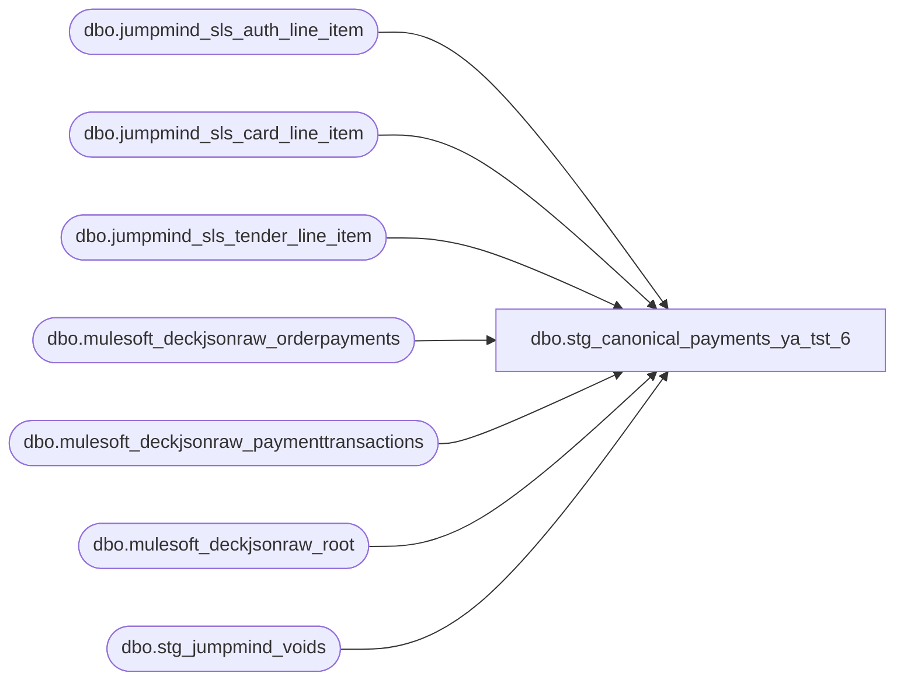

# dbo.stg_canonical_payments_ya_tst_6

**Database:** LH_Source  
**Server:** 4db76rlxaxcuvmuh5kw37wbnqq-ovsykae43znuhlmnflcdwm4ohu.datawarehouse.fabric.microsoft.com  

## Architecture Diagram



## Table Dependencies

| Referenced Table |
|---|
| dbo.jumpmind_sls_auth_line_item |
| dbo.jumpmind_sls_card_line_item |
| dbo.jumpmind_sls_tender_line_item |
| dbo.mulesoft_deckjsonraw_orderpayments |
| dbo.mulesoft_deckjsonraw_paymenttransactions |
| dbo.mulesoft_deckjsonraw_root |
| dbo.stg_jumpmind_voids |

## View Code

```sql
CREATE   VIEW dbo.stg_canonical_payments_ya_tst_6 AS WITH pos_tenders AS (     /* Source: jumpmind_sls_tender_line_item (tender row) LEFT JOIN        jumpmind_sls_card_line_item (card brand / masked PAN / expiration) via        composite key + card.ref_line_sequence_number → tender.line_sequence_number.        Auth code comes from auth_line_item; left-joined here for the        reference_no field (not strictly required for line_object derivation        but kept for downstream rpt_credit_card_auth visibility).         card_type single-char per BuildAuthRecord switch (SalesAuditTranslate.cs        4039-4073). Card brand enum values per LH_Source dump (May 8): mixed        case, lowercase plus uppercase variants exist. Use UPPER() for compare.        payment_processor: jumpmind_sls_card_line_item.payment_provider_code is        always NULL in production data per the May 8 dump, so processor is        inferred from the brand prefix instead (ADYEN_*, PAYPAL, KLARNA, etc.). */ SELECT         CAST(tli.device_id        AS varchar(64)) + '|' +         CAST(tli.business_date    AS varchar(8))  + '|' +         CAST(tli.sequence_number  AS varchar(20))            AS transaction_id,         tli.line_sequence_number                              AS line_id,         tli.line_sequence_number                              AS line_sequence,         tli.tender_type_code                                  AS tender_type_raw,         tli.tender_code                                       AS tender_code_raw,         CASE             WHEN UPPER(cli.brand) IN ('VISA','V')                                   THEN 'V'             WHEN UPPER(cli.brand) IN ('MASTERCARD','MC','M')                        THEN 'M'             WHEN UPPER(cli.brand) IN ('AMEX','AMERICAN EXPRESS','AMERICAN_EXPRESS','A') THEN 'A'             WHEN UPPER(cli.brand) IN ('DISCOVER','D')                               THEN 'D'             WHEN UPPER(cli.brand) IN ('MAESTRO','VPAY','INTERAC_CARD','USPINDEBIT',                                       'DEBIT CARD','DEBIT','SOLO','SWITCH','T')     THEN 'T'             WHEN UPPER(cli.brand) IN ('JCB','J')                                    THEN 'J'             WHEN UPPER(cli.brand) = 'UK CREDIT CARD'                                THEN 'V'             ELSE NULL         END                                                  AS card_type,         CASE             WHEN UPPER(cli.brand) LIKE 'ADYEN%'                                     THEN 'ADYEN'             WHEN UPPER(cli.brand) = 'PAYPAL'                                        THEN 'PAYPAL'             WHEN UPPER(cli.brand) = 'KLARNA'                                        THEN 'KLARNA'             WHEN UPPER(cli.brand) = 'AMAZON'                                        THEN 'AMAZON'             WHEN UPPER(cli.brand) = 'GLOBALE'                                       THEN 'GLOBALE'             WHEN UPPER(cli.brand) = 'APPLEPAY'                                      THEN 'APPLEPAY'             ELSE NULL         END                                                  AS payment_processor,         tli.tender_amount                                     AS tender_amount,         tli.iso_currency_code                                 AS currency_code,         cli.masked_card_number                                AS reference_no_raw,         ali.auth_code                                         AS authorization_no,         CAST(NULL AS bit)                                     AS gsr_flag,         CAST(tli.change_flag AS bit)                          AS is_change_returned,         CAST('JUMPMIND' AS varchar(10))                       AS source_system       FROM LH_Source.dbo.jumpmind_sls_tender_line_item AS tli       LEFT JOIN LH_Source.dbo.jumpmind_sls_card_line_item AS cli         ON  cli.device_id                = tli.device_id         AND cli.business_date            = tli.business_date         AND cli.sequence_number          = tli.sequence_number         AND cli.ref_line_sequence_number = tli.line_sequence_number       LEFT JOIN LH_Source.dbo.jumpmind_sls_auth_line_item AS ali         ON  ali.device_id                 = cli.device_id         AND ali.business_date             = cli.business_date         AND ali.sequence_number           = cli.sequence_number         AND ali.card_line_sequence_number = cli.line_sequence_number         AND (ali.voided = 0)         AND (ali.post_void = 0 OR ali.post_void IS NULL)      WHERE tli.voided = 0 ), oms_payments AS (     SELECT         djr.OrderNumber                                       AS transaction_id,         op.ID                                                 AS line_id,         op._RowIndex                                          AS line_sequence,         op.PaymentSubType                                     AS tender_type_raw,         op.PaymentProcessor                                   AS tender_code_raw,         CASE             WHEN UPPER(op.Generic1) IN ('VISA','V')                                   THEN 'V'             WHEN UPPER(op.Generic1) IN ('MASTERCARD','MC','M')                        THEN 'M'             WHEN UPPER(op.Generic1) IN ('AMEX','AMERICAN EXPRESS','AMERICAN_EXPRESS','A') THEN 'A'             WHEN UPPER(op.Generic1) IN ('DISCOVER','D')                               THEN 'D'             WHEN UPPER(op.Generic1) IN ('MAESTRO','VPAY','INTERAC_CARD','USPINDEBIT',                                         'DEBIT CARD','DEBIT','SOLO','SWITCH','T')     THEN 'T'             WHEN UPPER(op.Generic1) IN ('JCB','J')                                    THEN 'J'             ELSE NULL         END                                                   AS card_type,         op.PaymentProcessor                                   AS payment_processor,         CAST(             COALESCE(                 CASE                     WHEN pt.Amount IS NULL OR pt.Amount = 0          THEN NULL                     WHEN pt.PaymentTransactionTypeId IN (3, 4, 11)   THEN -ABS(pt.Amount)                     WHEN pt.PaymentTransactionTypeId IN (1, 2, 10, 14) THEN  ABS(pt.Amount)                     ELSE pt.Amount                 END,                 NULLIF(op.CapturedAmount,    0),                 NULLIF(op.AuthorizedAmount,  0),                 -1 * NULLIF(op.CreditedAmount, 0),                 0             )             AS decimal(18,2))                                 AS tender_amount,         CAST(NULL AS varchar(3))                              AS currency_code,         op.Generic2                                           AS reference_no_raw,         pt.Generic1                                           AS authorization_no,         CAST(NULL AS bit)                                     AS gsr_flag,         CAST(0 AS bit)                                        AS is_change_returned,         CAST('DECK_OMS' AS varchar(10))                       AS source_system       FROM LH_Source.dbo.mulesoft_deckjsonraw_orderpayments AS op       LEFT JOIN LH_Source.dbo.mulesoft_deckjsonraw_root AS djr         ON djr._RowIndex = op._ParentKeyField       OUTER APPLY (           SELECT TOP 1 x.Amount, x.PaymentTransactionTypeId, x.Generic1             FROM LH_Source.dbo.mulesoft_deckjsonraw_paymenttransactions AS x            WHERE x.OrderPaymentId = op.ID              AND (x.IsDecline = 0 OR x.IsDecline IS NULL)            ORDER BY x.TransactionDateUTC DESC       ) AS pt ), unified AS (     SELECT * FROM pos_tenders     UNION ALL     SELECT * FROM oms_payments ), apply_void_negation AS (     SELECT         u.*,         CASE             WHEN v.void_enriched_flag = 1 THEN -1 * u.tender_amount             ELSE                                u.tender_amount         END                                                       AS tender_amount_signed       FROM unified AS u       LEFT JOIN dbo.stg_jumpmind_voids AS v         ON v.transaction_id = u.transaction_id ), derive_line_object AS (     SELECT         a.*,         CASE             WHEN a.tender_type_raw = 'BANK_CHECK'                              THEN 602             WHEN a.tender_type_raw = 'FOREIGN_CASH'                            THEN 625             /* UPPER() applied — handles mixed-case 'Cash' from OMS source */             WHEN UPPER(a.tender_type_raw) = 'CASH'                 AND a.tender_code_raw LIKE '%EUR%'                             THEN 643             WHEN UPPER(a.tender_type_raw) = 'CASH'                             THEN 600             WHEN a.tender_type_raw = 'ROUNDING_ADJUSTMENT'                     THEN 799             WHEN a.tender_type_raw = 'CHECK'                                   THEN 601             WHEN a.tender_type_raw IN ('STORE_CREDIT','HOUSE_ORDER','HouseOrder') THEN 609             WHEN a.tender_type_raw = 'UNSUPPORTED_AUTHORIZATION'                 AND a.tender_code_raw = 'LOCAL_TENDER'                         THEN 626             WHEN a.tender_type_raw = 'GIFT_CARD'                               THEN 624             WHEN a.tender_type_raw = 'DEBIT_CARD'                              THEN 611             WHEN a.tender_type_raw = 'CREDIT_CARD'                 AND a.tender_code_raw = 'INTERAC'                              THEN 611             WHEN a.tender_type_raw = 'CREDIT_CARD'                             THEN                 CASE                     WHEN a.card_type = 'V'  THEN 604                     WHEN a.card_type = 'M'  THEN 605                     WHEN a.card_type = 'A'  THEN 606                     WHEN a.card_type = 'D'  THEN 608                     WHEN a.card_type = 'T'  THEN 611                     WHEN a.card_type = 'J'  THEN 642                     ELSE                        604                 END             WHEN a.tender_type_raw = 'UNDETERMINED_CARD'                       THEN                 CASE                     WHEN a.card_type = 'V'  THEN 604                     WHEN a.card_type = 'M'  THEN 605                     WHEN a.card_type = 'A'  THEN 606                     WHEN a.card_type = 'D'  THEN 608                     ELSE                        604                 END             WHEN a.tender_type_raw = 'PayPal'                                  THEN 632             WHEN a.tender_type_raw = 'Klarna'                                  THEN 637             WHEN a.tender_type_raw = 'Globale'                                 THEN 638             WHEN a.tender_type_raw = 'Amazon'                                  THEN 631             WHEN a.payment_processor = 'PAYPAL'                                THEN 632             WHEN a.payment_processor = 'KLARNA'                                THEN 637             WHEN a.payment_processor = 'GLOBALE'                               THEN 638             WHEN a.payment_processor = 'AMAZON'                                THEN 631             WHEN a.tender_type_raw = 'EVENT_INVOICE'                           THEN 690             WHEN a.tender_type_raw = 'ACH'                                     THEN 603             WHEN a.tender_type_raw = 'MAESTRO'                                 THEN 614             WHEN a.tender_type_raw = 'PROMO_GIFT_CERT'                         THEN 623             WHEN a.tender_type_raw = 'E_CERTIFICATE'                           THEN 624             WHEN a.tender_type_raw = 'MALL_CERTIFICATE'                        THEN 619             WHEN a.tender_type_raw = 'LOCAL_TENDER'                            THEN 626             WHEN a.tender_type_raw = 'SFS_REWARD_CERT'                         THEN 640             WHEN a.tender_type_raw = 'EURO_FOREIGN'                            THEN 643             WHEN a.tender_type_raw = 'JCB'                                     THEN 642             WHEN a.tender_type_raw = 'AMEX_NO_REF'                             THEN 697             WHEN a.tender_type_raw = 'CANADIAN_CC'                             THEN 698             ELSE                                                                -1         END                                                       AS line_object       FROM apply_void_negation AS a ), derive_line_action AS (     SELECT         d.*,         CASE             WHEN d.is_change_returned = 1       THEN '018'             WHEN d.tender_amount_signed < 0      THEN '027'             ELSE                                      '028'         END                                                       AS line_action       FROM derive_line_object AS d ) SELECT     f.transaction_id,     f.line_id,     f.line_sequence,     CAST('L' AS char(1))                                AS record_type,     f.line_object                                       AS line_object,     f.line_action                                       AS line_action,     CASE WHEN LEN(f.reference_no_raw) <= 20          THEN CAST(f.reference_no_raw AS varchar(80))          ELSE NULL     END                                                 AS reference_no,     CASE WHEN LEN(f.reference_no_raw) > 20          THEN CAST(f.reference_no_raw AS varchar(80))          ELSE NULL     END                                                 AS encrypted_reference_no,     f.tender_amount_signed                              AS tender_amount,     f.currency_code,     f.authorization_no,     f.tender_type_raw,     f.tender_code_raw,     f.card_type,     f.payment_processor,     f.gsr_flag,     f.is_change_returned,     f.source_system   FROM derive_line_action AS f;
```

