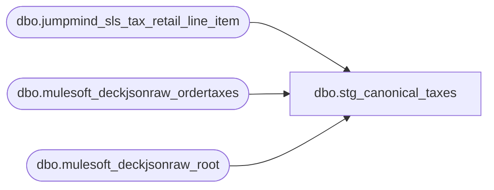

# dbo.stg_canonical_taxes

**Database:** LH_Source  
**Server:** 4db76rlxaxcuvmuh5kw37wbnqq-ovsykae43znuhlmnflcdwm4ohu.datawarehouse.fabric.microsoft.com  

## Architecture Diagram



## Table Dependencies

| Referenced Table |
|---|
| dbo.jumpmind_sls_tax_retail_line_item |
| dbo.mulesoft_deckjsonraw_ordertaxes |
| dbo.mulesoft_deckjsonraw_root |

## View Code

```sql
CREATE   VIEW dbo.stg_canonical_taxes AS WITH pos_tax AS (     /* jumpmind_sls_tax_retail_line_item composite key = (device_id,        business_date, sequence_number, line_sequence_number, tax_line_sequence_number).        authority_id replaces tax_authority; tax_jurisdiction has no direct        column — group_id is the closest analogue; tax_percentage replaces        tax_rate. */     SELECT         CAST(rt.device_id        AS varchar(64)) + '|' +         CAST(rt.business_date    AS varchar(8))  + '|' +         CAST(rt.sequence_number  AS varchar(20))            AS transaction_id,         rt.line_sequence_number                              AS line_id,         rt.authority_id                                      AS tax_authority_raw,         rt.group_id                                          AS tax_jurisdiction,   /* ⚠ confirm: group_id ≈ tax_jurisdiction */         rt.rule_name                                         AS rule_name,         rt.tax_type                                          AS tax_type_raw,         rt.taxable_amount                                    AS taxable_amount,         rt.tax_amount                                        AS tax_amount,         rt.tax_percentage                                    AS tax_rate,         CAST('JUMPMIND' AS varchar(10))                      AS source_system       FROM LH_Source.dbo.jumpmind_sls_tax_retail_line_item AS rt      WHERE rt.voided = 0 ), oms_tax AS (     /* mulesoft_deckjsonraw_ordertaxes is sparse (13 cols): only        Description, TaxType (bigint), Amount, Rate, IsVAT, TaxExempt.        No authority/jurisdiction/taxable_amount columns exist on this table.        OrderNumber pulled via _ParentKeyField → root._RowIndex. */     SELECT         djr.OrderNumber                                      AS transaction_id,         ot.ID                                                AS line_id,         CAST(NULL AS varchar(50))                            AS tax_authority_raw,  /* ⚠ TODO source */         CAST(NULL AS varchar(50))                            AS tax_jurisdiction,   /* ⚠ TODO source */         ot.Description                                       AS rule_name,         CAST(ot.TaxType AS varchar(20))                      AS tax_type_raw,         CAST(NULL AS decimal(18,2))                          AS taxable_amount,     /* ⚠ TODO not in source */         CAST(ot.Amount AS decimal(18,2))                     AS tax_amount,         CAST(ot.Rate AS decimal(18,6))                       AS tax_rate,         CAST('DECK_OMS' AS varchar(10))                      AS source_system       FROM LH_Source.dbo.mulesoft_deckjsonraw_ordertaxes AS ot       LEFT JOIN LH_Source.dbo.mulesoft_deckjsonraw_root AS djr         ON djr._RowIndex = ot._ParentKeyField         /* ⚠ ordertaxes has no OrderID column per inventory; forced to use            _ParentKeyField. If transaction_id renders NULL like Ryan saw on            orderitems, this join is the suspect — would need an alternative            lookup path (TaxType resolution table, or revisit ordertaxes            schema with BBW). */ ), unified AS (     SELECT * FROM pos_tax     UNION ALL     SELECT * FROM oms_tax ), derive_tax_attrs AS (     SELECT         u.*,         /* Detect asterisk prefix (Aptos meaningful char per build prompt §3.8) */         CASE WHEN LEFT(LTRIM(RTRIM(u.tax_jurisdiction)), 1) = '*' THEN 1 ELSE 0 END                                                                 AS has_asterisk_prefix,         /* TaxType derivation per build prompt §3.8:              - GST/HST/VAT in ruleName: TaxType = "2"              - Else: TaxType = "1"            Prior code had a `WHEN u.rule_name = 'T'` exact-match branch as a            T-override; sample data shows rule_name carries descriptive text            ("US Shipping Tax", "VAT Tax" etc.) so that branch was dead.            Removed; if a tax_type_raw passthrough is ever needed, gate it on            tax_type_raw IS NOT NULL instead. */         CASE             WHEN u.rule_name LIKE '%GST%'               OR u.rule_name LIKE '%HST%'               OR u.rule_name LIKE '%VAT%'                       THEN '2'             ELSE                                                     '1'         END                                                     AS tax_type,         /* TaxTypeOriginal descriptive relabel */         CASE             WHEN u.rule_name LIKE '%GST%' THEN 'GST Tax'             WHEN u.rule_name LIKE '%HST%' THEN 'HST Tax'             WHEN u.rule_name LIKE '%PST%' THEN 'PST Tax'             WHEN u.rule_name LIKE '%VAT%' THEN 'VAT Tax'             ELSE                                'Sales Tax'         END                                                     AS tax_type_original,         /* Tax level per Aptos spec (Tax Override Detail T record field 7) */         CASE             WHEN u.rule_name LIKE '%GST%' OR u.rule_name LIKE '%HST%'               OR u.rule_name LIKE '%VAT%'                                    THEN 2             ELSE                                                                  1         END                                                     AS tax_level       FROM unified AS u ) SELECT     d.transaction_id,     d.line_id,     d.tax_authority_raw,     d.tax_jurisdiction,     d.has_asterisk_prefix,     d.rule_name,     d.tax_type,     d.tax_type_original,     d.tax_level,     d.taxable_amount,     d.tax_amount,     d.tax_rate,     d.source_system   FROM derive_tax_attrs AS d;
```

