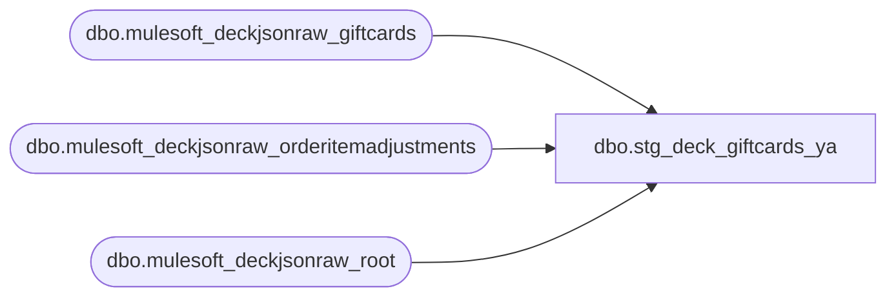

# dbo.stg_deck_giftcards_ya

**Database:** LH_Source  
**Server:** 4db76rlxaxcuvmuh5kw37wbnqq-ovsykae43znuhlmnflcdwm4ohu.datawarehouse.fabric.microsoft.com  

## Architecture Diagram



## Table Dependencies

| Referenced Table |
|---|
| dbo.mulesoft_deckjsonraw_giftcards |
| dbo.mulesoft_deckjsonraw_orderitemadjustments |
| dbo.mulesoft_deckjsonraw_root |

## View Code

```sql
CREATE   VIEW dbo.stg_deck_giftcards_ya AS WITH gc_discount AS (     /* iter 11: AW xlsx shows net = gross / 2 for loyalty-reward gift        card sales (gross=10, net=5). MerchandiseNetTotal in the        giftcards table equals MerchandiseGrossTotal — the actual        discount lives in mulesoft_deckjsonraw_orderitemadjustments,        keyed by OrderItemID. SUM(NetPrice) is the per-line discount        (positive number, per stg_deck_lines convention). */     SELECT         adj.OrderItemID,         SUM(CAST(adj.NetPrice AS decimal(18,2)))                 AS discount       FROM LH_Source.dbo.mulesoft_deckjsonraw_orderitemadjustments AS adj      GROUP BY adj.OrderItemID ) SELECT     CAST(r.OrderNumber AS varchar(64))                          AS transaction_id,     CAST(g.ID AS bigint)                                         AS line_id,     CAST(g._RowIndex AS bigint)                                  AS line_sequence,     /* iter 19: AW splits OMS gift card sales between line_object 403        and 404 based on mulesoft_deckjsonraw_giftcards.GiftCardType:          GiftCardType = 1 (e-gift, custom value, SKU 09xxxx/49xxxx) → 403          GiftCardType = 2 (physical, fixed denomination, SKU 03xxxx/43xxxx) → 404        Confirmed on 10 sample cards: 5 AW-classified-404 all had        GiftCardType=2; 5 AW-classified-403 all had GiftCardType=1. */     CAST(CASE WHEN g.GiftCardType = 2 THEN 404 ELSE 403 END AS int) AS line_object,     CAST('001' AS varchar(3))                                    AS line_action,     CAST(g.GiftCardNumber AS varchar(80))                        AS reference_no,     CAST(NULL AS varchar(80))                                    AS encrypted_reference_no,     CAST(g.MerchandiseGrossTotal AS decimal(18,2))               AS gross_line_amount,     /* iter 11: discount from orderitemadjustments; fall back to giftcards        Gross−Net delta (usually 0) when no adjustment row. */     COALESCE(         d.discount,         CAST(g.MerchandiseGrossTotal - g.MerchandiseNetTotal AS decimal(18,2))     )                                                            AS pos_discount_amount,     CAST(0 AS int)                                               AS units,     CAST(1 AS bit)                                               AS voiding_reversal_flag,     CAST(0 AS bit)                                               AS stage_b_line_void_flag,     CAST(g.ExternalItemID AS varchar(50))                        AS upc,     CAST('GIFTCARD' AS varchar(50))                              AS item_type,     CAST(0 AS bit)                                               AS return_flag,     CAST(0 AS bit)                                               AS gsr_flag,     CAST(0 AS bit)                                               AS is_employee_discount,     CAST(NULL AS varchar(50))                                    AS discount_type,     CAST(NULL AS varchar(50))                                    AS discount_scope,     CAST(NULL AS varchar(50))                                    AS promo_code,     CAST(NULL AS varchar(50))                                    AS resolved_promo_code,     CAST(NULL AS varchar(50))                                    AS campaign_id,     CAST(NULL AS varchar(200))                                   AS discount_text,     CAST(NULL AS int)                                            AS discount_line_object,     CAST(NULL AS varchar(50))                                    AS find_a_bear_id,     CAST(0 AS bit)                                               AS is_stock_order_line_item,     CAST(NULL AS bit)                                            AS house_order_flag,     CAST(NULL AS varchar(50))                                    AS virtual_world_code,     CAST('DECK_OMS_GC' AS varchar(10))                           AS source_system   FROM LH_Source.dbo.mulesoft_deckjsonraw_giftcards AS g   JOIN LH_Source.dbo.mulesoft_deckjsonraw_root      AS r         ON r.OrderID = g.OrderID   LEFT JOIN gc_discount AS d         ON d.OrderItemID = g.OrderItemID  WHERE r.SiteCode IN ('BAB','BABUK')    AND g.OrderID IS NOT NULL    AND g.GiftCardNumber IS NOT NULL;
```

