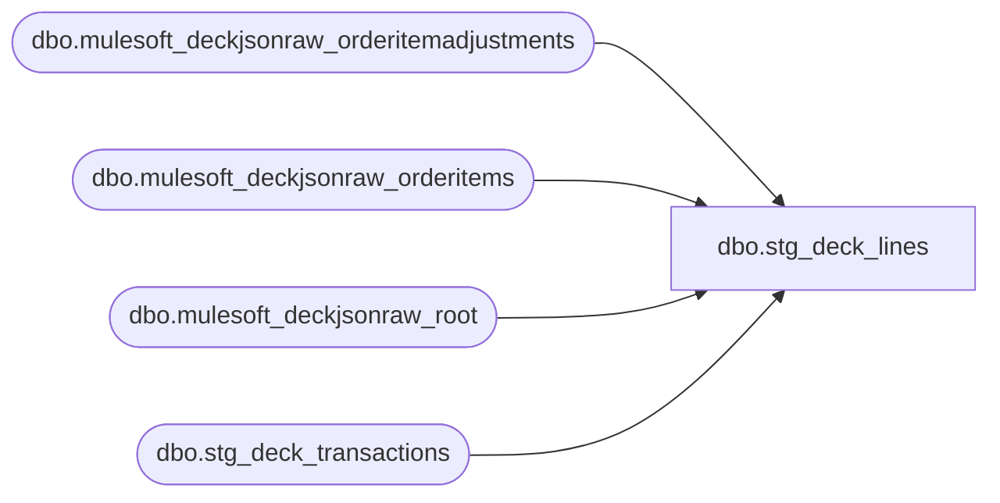

# dbo.stg_deck_lines

**Database:** LH_Source  
**Server:** 4db76rlxaxcuvmuh5kw37wbnqq-ovsykae43znuhlmnflcdwm4ohu.datawarehouse.fabric.microsoft.com  

## Architecture Diagram



## Table Dependencies

| Referenced Table |
|---|
| dbo.mulesoft_deckjsonraw_orderitemadjustments |
| dbo.mulesoft_deckjsonraw_orderitems |
| dbo.mulesoft_deckjsonraw_root |
| dbo.stg_deck_transactions |

## View Code

```sql
/* =============================================================================    stg_deck_lines.sql — OMS Transaction Lines (Stage A + Stage B)    =============================================================================    Purpose: Reads MuleSoft Deck Commerce LH_Source line tables and produces             output matching the Aptos XPOLLD0013 Detail (record type 'L') and             Tender line shape. Companion to stg_jumpmind_lines for the OMS             channel.     CTE order (per build prompt — unification BEFORE derivation):      1. raw_oms_lines             — Stage A: mulesoft_deckjsonraw_orderitems                                     + mulesoft_deckjsonraw_orderitemadjustments      2. agg_adjustments           — sum discount adjustments per line      3. derive_returns            — line-level returnFlag from refund/return                                     indicators on OMS rows      4. derive_line_object        — same 4D decision as stg_jumpmind_lines                                     but with OMS-specific itemType mappings      5. derive_line_action        — same range-dispatch as POS      6. final SELECT              — Stage B XPOLLD0013 Detail shape     Source tables:      - LH_Source.dbo.mulesoft_deckjsonraw_orderitems        (78 cols)      - LH_Source.dbo.mulesoft_deckjsonraw_orderitemadjustments  (21 cols)      - LH_Source.dbo.mulesoft_deckjsonraw_root              (joined for OrderNumber)      - mulesoft_dynamicsheaderoms does NOT exist; GSR flag comes from        stg_deck_transactions which itself reads root.     Schema realignment (May 6 inventory):      - Quantity / UnitPrice / ExtendedAmount / Currency / ItemType /        IsRefunded / IsCancelled / IsStockOrderLineItem / SourceStoreId /        FulfillmentStoreId NOT directly on orderitems. Mirror-and-flag:          units                      → assume 1 per row (OMS line-per-unit)          regular_unit_price         → GrossPrice          gross_line_amount          → GrossPrice          currency_code              → NULL (from root.SiteCulture if needed)          item_type                  → ItemTypeLocalizeName          item_refunded              → ItemStatusCode IN (return-coded values)          item_cancelled             → CancelReasonCode IS NOT NULL          is_stock_order_line_item   → NULL stub          SourceStoreId              → WarehouseCode          FulfillmentStoreId         → PickupNodeCode      - orderitemadjustments: AdjustmentAmount column does NOT exist;        use NetPrice as the discount delta. AdjustmentType is bigint;        AdjustmentTypeValue is the human-readable label.     Business rules applied:      - 296 GSR emit on gsr_flag=true (per Stage B C# 4917-4925)      - Returns: line-level refund_flag wins      - line_action 028 only with Tender-type companion      - pos_discount_amount POSITIVE on both sales and returns        (AuditWorks convention per Matthew May 5)      - No VOID enrichment needed for OMS — cancellations come through as        IsCancelled flag on the header      - SettlementTime drives revenue recognition for BOPIS/BOSFS     ⚠ TODOs:      - BOPIS/BOSFS source-of-record decision (PENDING Ben before NA-007)      - Verify column names for `mulesoft_deckjsonraw_orderitems` and        `mulesoft_deckjsonraw_orderitemadjustments` once LH_Source schema        confirmed.      - Adjustment line classification: emp/promo/coupon distinction may need        refinement based on actual AdjustmentType / AdjustmentClassificationID        values in the OMS raw data.    ============================================================================= */  CREATE   VIEW dbo.stg_deck_lines AS WITH /* ═════════════════════════════════════════════════════════════════════════    STAGE A — Source unification: Deck JSON line items + adjustments    ═════════════════════════════════════════════════════════════════════════ */ raw_oms_lines AS (     /* OrderNumber pulled via OrderID FK (Brandon May 7 — _ParentKeyField        JSON-shred surrogate produced NULL transaction_id; OrderID is the        canonical cross-table FK and matches reliably).        See header comment for the full mirror-and-flag column map. */     SELECT         djr.OrderNumber                                           AS transaction_id,         oi.ID                                                     AS line_id,         oi._RowIndex                                              AS line_sequence,         oi.GTIN                                                   AS upc,         oi.StyleNumber,         /* OMS source carries ItemTypeID (int) and a localised            ItemTypeLocalizeName ('Regular Item', 'eGift', 'Custom Item',            'Gift Card', NULL). The downstream derive_line_object CASE            was written against JumpMind enum strings ('STOCK','GIFTCARD',            etc.) which never appear in either column, so the prior            pass-through of ItemTypeLocalizeName left every OMS row at            the -1 sentinel: verified 2026-05-20 on (2013, 2026-02-22)            where all 780 fact_transaction_line rows for that key carried            line_object = -1.             ItemTypeID volume distribution from a Q1 2026 probe:              ID  3 'Regular Item'   1,489,378 rows  $26.7M  -> STOCK              ID  4 'Custom Item'       42,937 rows  $409k   -> STOCK              ID  5 'Custom Item 2'      2,491 rows  $4.3k   -> STOCK              ID  6 NULL (style 032360)    928 rows  $14k    -> STOCK              ID 24 'eGift'             62,261 rows  $1.7M   -> NULL              ID  2 'Gift Card'          3,718 rows  $188k   -> NULL             Gift-card IDs 2 and 24 are intentionally NOT mapped here.            The gift-card consumer reports (rpt_gift_card_activations,            rpt_gift_card_redemptions, rpt_jm_gc_sold_by_gc) compensate            for the broken OMS path via parallel webdemandorderitems            branches; mapping IDs 2/24 to 403/404 here would cause those            branches to double-count. Migrating them onto fact_transaction_line            is a separate workstream.             SAFE CHECK: no current 04_reports view filters            fact_transaction_line on line_object = 100 (rpt_gaap_flash_sales            and rpt_merch_report both source from LH_Mart directly), so            this mapping is additive and does not regress any existing            identity match. */         CASE oi.ItemTypeID             WHEN 3 THEN 'STOCK'             WHEN 4 THEN 'STOCK'             WHEN 5 THEN 'STOCK'             WHEN 6 THEN 'STOCK'             ELSE        CAST(NULL AS varchar(64))         END                                                       AS item_type,           /* ItemTypeID-driven */         /* item_refunded mirror: ItemStatusCode return-coded. Brandon to            confirm exact codes — using prefix match for safety. */         CASE WHEN oi.ItemStatusCode LIKE 'R%' OR oi.ItemStatusCode LIKE '%RETURN%'              THEN 1 ELSE 0 END                                    AS item_refunded,        /* ⚠ Brandon */         CASE WHEN oi.CancelReasonCode IS NOT NULL THEN 1 ELSE 0 END                                                                   AS item_cancelled,         CAST(1 AS int)                                            AS units,                /* ⚠ OMS line-per-unit assumption */         /* CORRECTED 2026-05-11 per "Existing Report Samples" evidence (see            stg_jumpmind_lines.sql for the analysis). Pass GrossPrice through            with its source sign — legacy SmartLook formula expects signed            gross with db_cr_none hardcoded to 1. If OMS source is already            absolute, this is a no-op; if signed for returns, this matches            legacy report output convention. */         CAST(oi.GrossPrice AS decimal(18,2))                      AS regular_unit_price,         CAST(oi.GrossPrice AS decimal(18,2))                      AS gross_line_amount,         CAST(NULL AS varchar(3))                                  AS currency_code,        /* ⚠ TODO root.SiteCulture */         CAST(NULL AS bit)                                         AS is_stock_order_line_item,  /* ⚠ TODO not in orderitems */         oi.OrderShippingID                                        AS OrderShippingId,         oi.WarehouseCode                                          AS SourceStoreId,         /* mirror */         oi.PickupNodeCode                                         AS FulfillmentStoreId    /* mirror */       FROM LH_Source.dbo.mulesoft_deckjsonraw_orderitems AS oi       LEFT JOIN LH_Source.dbo.mulesoft_deckjsonraw_root AS djr         ON djr.OrderID = oi.OrderID ), raw_adjustments AS (     /* Joins via canonical FKs:          adjustments.OrderItemID → orderitems.ID          orderitems.OrderID      → root.OrderID  (orderitems IS populated;                                                   unlike orderpayments.OrderID=0)         Schema realities verified May 8 from 500-row sample:          - AdjustmentType (bigint) values: 12 (99.4%), 1 (0.6%). The            prior code aliased AdjustmentTypeValue (varchar) AS AdjustmentType            but AdjustmentTypeValue is EMPTY in 500/500 rows — that alias            was dead. We now use the bigint column directly.          - AdjustmentClassificationID = 0 for all rows (useless).          - NetPrice = GrossPrice = adjustment amount (both columns hold            the same delta, e.g. 5.26 for a $5.26 LoyaltyCoupon credit).          - PromotionID values: 'LoyaltyCoupon-<id>' or short codes like            '5off20'.          - DiscountText: 'Order Price Adjustment' (descriptive constant).          - CampaignID: NULL in sample.         EMP detection: per Brandon May 8, the canonical signal is the new        prm_promotion table joined on promotion_id WHERE promotion_type =        'EMPLOYEE_DISCOUNT'. Until that table is replicated to LH_Source,        EMP detection on OMS data falls back to a string match on        PromotionID containing 'Emp' (legacy heuristic). The JOIN scaffold        below is left commented for one-line activation when the table lands. */     SELECT         djr.OrderNumber                                           AS transaction_id,         adj.OrderItemID                                           AS line_id,         adj.AdjustmentType                                        AS adjustment_type_code,  /* bigint: 1 or 12 in sample. ⚠ TODO Brandon: confirm 1 vs 12 semantics. */         adj.AdjustmentClassificationID                            AS adjustment_classification_id,         adj.PromotionID                                           AS promotion_id,         adj.CampaignID                                            AS campaign_id,         adj.DiscountText                                          AS discount_text,         CAST(adj.NetPrice AS decimal(18,2))                       AS discount_amount,       /* sample-confirmed: NetPrice=GrossPrice=delta */         CASE             /* Brandon May 8: prm_promotion is the authoritative EMP signal.                When that table lands in LH_Source, replace the legacy text                match with:                  LEFT JOIN LH_Source.dbo.jumpmind_prm_promotion AS pp                    ON pp.promotion_id = adj.PromotionID                  WHERE pp.promotion_type = 'EMPLOYEE_DISCOUNT' THEN 1                Until then, fall back to substring match on PromotionID. */             WHEN UPPER(adj.PromotionID) LIKE '%EMP%'              THEN 1             ELSE 0         END                                                       AS is_employee_discount       FROM LH_Source.dbo.mulesoft_deckjsonraw_orderitemadjustments AS adj       LEFT JOIN LH_Source.dbo.mulesoft_deckjsonraw_orderitems AS oi         ON oi.ID = adj.OrderItemID       LEFT JOIN LH_Source.dbo.mulesoft_deckjsonraw_root AS djr         ON djr.OrderID = oi.OrderID ), agg_adjustments AS (     SELECT         adj.transaction_id,         adj.line_id,         SUM(adj.discount_amount)                                  AS pos_discount_amount,         MAX(adj.is_employee_discount)                             AS is_employee_discount,         MAX(adj.adjustment_type_code)                             AS adjustment_type_code,  /* bigint: 1 or 12 */         MAX(adj.promotion_id)                                     AS promo_code,         MAX(adj.campaign_id)                                      AS campaign_id,         MAX(adj.discount_text)                                    AS discount_text       FROM raw_adjustments AS adj      GROUP BY adj.transaction_id, adj.line_id ), /* GSR flag from header — OMS GSR comes directly from Deck JSON, no Brandon    pending. Pulled from stg_deck_transactions which already surfaces it. */ gsr_propagation AS (     SELECT         t.transaction_id,         t.gsr_flag                                                 AS header_gsr_flag       FROM dbo.stg_deck_transactions AS t ), /* ═════════════════════════════════════════════════════════════════════════    STAGE B — Derivation    ═════════════════════════════════════════════════════════════════════════ */ derive_returns AS (     SELECT         l.*,         CASE WHEN l.item_refunded = 1 OR l.item_cancelled = 1 THEN 1 ELSE 0 END AS return_flag       FROM raw_oms_lines AS l ), derive_attrs AS (     SELECT         r.*,         ag.pos_discount_amount,         COALESCE(ag.is_employee_discount, 0)                      AS is_employee_discount,         ag.adjustment_type_code,         /* discount_type is the JumpMind-side TRANS/ITEM signal. For OMS we            map AdjustmentType bigint values to the JumpMind enum so the            downstream GetLineObject decision tree (which keys off TRANS/ITEM)            handles both source families uniformly.            ⚠ TODO Brandon: confirm AdjustmentType=1 vs 12 mapping. Sample            is 99.4% type 12; defaulting type 12 → ITEM (line-level) per            the 'Order Price Adjustment' DiscountText label. */         CASE             WHEN ag.adjustment_type_code = 1   THEN 'TRANS'             WHEN ag.adjustment_type_code = 12  THEN 'ITEM'             ELSE                                    NULL         END                                                       AS discount_type,         ag.promo_code,         ag.campaign_id,         ag.discount_text,         COALESCE(g.header_gsr_flag, 0)                            AS gsr_flag,         /* OMS doesn't have a change-money-back concept — always 0 */         CAST(0 AS bit)                                            AS change_flag,         /* discount_scope mirrors discount_type: TRANS=subtotal, ITEM=line.            Replaces the prior LIKE '%TRANSACTION%' check on the empty            AdjustmentTypeValue column. */         CASE             WHEN ag.adjustment_type_code = 1   THEN 'TRANSACTION'             ELSE                                    'LINE'         END                                                       AS discount_scope,         /* OMS doesn't have house_order_flag at the line level — comes from            the header's HouseOrderPayment context */         CAST(NULL AS bit)                                         AS house_order_flag,         CAST(NULL AS varchar(50))                                 AS virtual_world_code       FROM derive_returns AS r       LEFT JOIN agg_adjustments  AS ag ON ag.transaction_id = r.transaction_id AND ag.line_id = r.line_id       LEFT JOIN gsr_propagation  AS g  ON g.transaction_id  = r.transaction_id ), /* line_object derivation — split into BASE merchandise + discount_line_object,    parallel to stg_jumpmind_lines. Prior code had MARKDOWN/PROMO/POS_COUPON/    CUB_CASH branches that never matched (those values never existed in    AdjustmentTypeValue, which is empty in 500/500 sample rows). */ derive_line_object AS (     SELECT         a.*,         /* ── BASE merchandise line_object ── */         CASE             WHEN a.gsr_flag = 1 AND a.discount_type IS NULL          THEN 296             WHEN a.item_type = 'GIFTCARD'                              THEN 404             WHEN a.item_type = 'EMBROIDERY'                            THEN 202             WHEN a.item_type = 'DONATION'                              THEN 101             WHEN a.item_type IN ('STORE_ORDER_SHIPPING','SHIPPING')    THEN 200             WHEN a.item_type IN ('STOCK','SERVICE')                    THEN 100             ELSE -1                                                              /* sentinel — unmapped item_type */         END                                                       AS line_object       FROM derive_attrs AS a ), /* DISCOUNT line_object — translated GetLineObject (C# 5142-5258).    For the BABW OMS path discountType is "1" (DollarsOff) per    ScriptMain 1.cs:742. discountScope mapped from AdjustmentType:    1→SubtotalDiscount, 12→LineItemDiscount. */ derive_discount_line_object AS (     SELECT         d.*,         CASE d.discount_type             WHEN 'TRANS' THEN 1             WHEN 'ITEM'  THEN 3             ELSE              NULL         END                                                       AS discount_scope_int,         CAST('1' AS varchar(1))                                   AS discount_type_code,         /* Serialized voucher detection per Brandon May 8: 17-digit numeric            starting with '2' identifies serialized coupons + reward certs. */         CASE             WHEN d.promo_code IS NULL                                                       THEN 0             WHEN TRY_CAST(d.promo_code AS bigint) IS NULL                                   THEN 0             WHEN LEN(d.promo_code) = 17 AND LEFT(d.promo_code, 1) = '2'                     THEN 1             ELSE                                                                                 0         END                                                       AS is_serialized_voucher       FROM derive_line_object AS d ), derive_discount_line_object_final AS (     SELECT         d.*,         CASE             WHEN d.discount_type IS NULL                                                     THEN NULL             /* EMP override per C# 5250-5253 */             WHEN UPPER(COALESCE(d.promo_code,'')) LIKE '%EMP%'                               THEN 1740             /* DollarsOff + SubtotalDiscount (TRANS) — C# 5189-5208 */             WHEN d.discount_type_code = '1' AND d.discount_scope_int = 1 THEN                 CASE                     WHEN d.is_serialized_voucher = 1 AND d.line_object BETWEEN 400 AND 499  THEN 1625                     WHEN d.is_serialized_voucher = 1                                        THEN 1636                     WHEN d.line_object BETWEEN 400 AND 499                                  THEN 1626                     WHEN d.line_object = 102                                                THEN 1652                     WHEN d.line_object = 103                                                THEN 1653                     WHEN d.line_object = 104                                                THEN 1654                     WHEN d.line_object = 110                                                THEN 1660                     ELSE                                                                         1645                 END             /* DollarsOff + LineItemDiscount (ITEM) — C# 5209-5226 */             WHEN d.discount_type_code = '1' AND d.discount_scope_int = 3 THEN                 CASE                     WHEN d.is_serialized_voucher = 1 AND d.line_object BETWEEN 400 AND 499  THEN 1625                     WHEN d.is_serialized_voucher = 1                                        THEN 1630                     WHEN d.line_object BETWEEN 400 AND 499                                  THEN 1625                     WHEN d.line_object = 102                                                THEN 1698                     WHEN d.line_object = 103                                                THEN 1699                     WHEN d.line_object = 104                                                THEN 1697                     WHEN d.line_object = 110                                                THEN 1660                     ELSE                                                                         1617                 END             ELSE                                                                                 1617         END                                                       AS discount_line_object       FROM derive_discount_line_object AS d ), derive_line_action AS (     /* Identical range-dispatch to stg_jumpmind_lines.derive_line_action */     SELECT         d.*,         CASE             WHEN d.line_object = 296                                    THEN                 CASE WHEN d.gsr_flag = 1 THEN '012' ELSE '011' END             WHEN d.line_object BETWEEN 100 AND 199                      THEN                 CASE WHEN d.return_flag = 1 OR d.gsr_flag = 1 THEN '002' ELSE '001' END             WHEN d.line_object BETWEEN 200 AND 289               OR d.line_object IN (294, 301)                            THEN                 CASE WHEN d.return_flag = 1 OR d.gsr_flag = 1 THEN '012' ELSE '011' END             /* Fees-A 290-293, 295: AuditWorks 016 _Recovered (non-return),                012 _Refunded (return/GSR). Per AuditWorks_line_action.csv. */             WHEN d.line_object IN (290,291,292,293,295)                 THEN                 CASE WHEN d.return_flag = 1 OR d.gsr_flag = 1 THEN '012' ELSE '016' END             WHEN d.line_object = 297                                    THEN '011'             WHEN d.line_object BETWEEN 400 AND 499                      THEN                 CASE                     WHEN d.return_flag = 1 OR d.gsr_flag = 1            THEN '002'                     WHEN d.discount_type = 'REDEEM'                      THEN '025'                     ELSE '001'                 END             WHEN d.line_object BETWEEN 500 AND 599                      THEN                 CASE WHEN d.return_flag = 1 OR d.gsr_flag = 1 THEN '012' ELSE '011' END             WHEN d.line_object BETWEEN 600 AND 699               OR d.line_object = 1000                                   THEN                 CASE                     WHEN d.return_flag = 1 OR d.gsr_flag = 1             THEN '027'                     ELSE '028'                 END             /* Discount 1600-1999: AuditWorks 020 _Deducted (non-return),                021 _Reversed (return/GSR). Range covers item markdown 1600s,                subtotal discount 1700s, memo 1800s. Per AuditWorks_line_action.csv. */             WHEN d.line_object BETWEEN 1600 AND 1999                    THEN                 CASE WHEN d.return_flag = 1 OR d.gsr_flag = 1 THEN '021' ELSE '020' END             ELSE '038'         END                                                       AS line_action       FROM derive_discount_line_object_final AS d ) /* ═════════════════════════════════════════════════════════════════════════    STAGE B — Final SELECT — Aptos XPOLLD0013 Detail shape    ═════════════════════════════════════════════════════════════════════════ */ SELECT     f.transaction_id,     f.line_id,     f.line_sequence,     /* Aptos XPOLLD0013 Detail fields (1-18) */     CAST('L' AS char(1))                                AS record_type,                /*  1 */     f.line_id                                           AS line_id_aptos,              /*  2 */     f.line_object                                       AS line_object,                /*  3 */     f.line_action                                       AS line_action,                /*  4 */     /* Reference no length split — UPC for OMS items */     CASE WHEN LEN(f.upc) <= 20 THEN CAST(f.upc AS varchar(80)) ELSE NULL END                                                         AS reference_no,               /*  5 */     f.gross_line_amount                                 AS line_amount,                /*  6 */     CAST(0 AS int)                                      AS unused_1,                   /*  7 */     CAST(1 AS int)                                      AS line_amount_divider,        /*  8 */     CAST(0 AS int)                                      AS unused_2,                   /*  9 */     CAST(1 AS int)                                      AS voiding_reversal_flag,      /* 10 */     f.pos_discount_amount                               AS line_amount_deduction,      /* 11 */     f.units                                             AS line_amount_multiplication_factor, /* 12 */     CAST(0 AS bit)                                      AS line_void_flag,             /* 13 */     CAST(0 AS int)                                      AS attachment_quantity,        /* 14 */     CAST(0 AS int)                                      AS line_object_adjustment,     /* 15 */     CAST(NULL AS varchar(500))                          AS lookup_pos_code,            /* 16 */     CAST(NULL AS varchar(500))                          AS pos_description_token_list, /* 17 */     CASE WHEN LEN(f.upc) > 20 THEN CAST(f.upc AS varchar(80)) ELSE NULL END                                                         AS encrypted_reference_no,     /* 18 */     /* Lineage / extension */     f.upc,     f.StyleNumber,     f.item_type,     f.return_flag,     f.gsr_flag,     f.is_employee_discount,     f.discount_type,     f.discount_scope,     f.promo_code,     f.promo_code                                        AS resolved_promo_code,            /* OMS path: promo_code already carries the canonical promotion_id */     f.campaign_id,     f.discount_text,     f.discount_line_object,                                                                /* GetLineObject discount routing (parallel to JumpMind) */     f.regular_unit_price,     f.units,     f.currency_code,     f.is_stock_order_line_item,     f.SourceStoreId,     f.FulfillmentStoreId,     CAST('DECK_OMS' AS varchar(10))                     AS source_system   FROM derive_line_action AS f;
```

