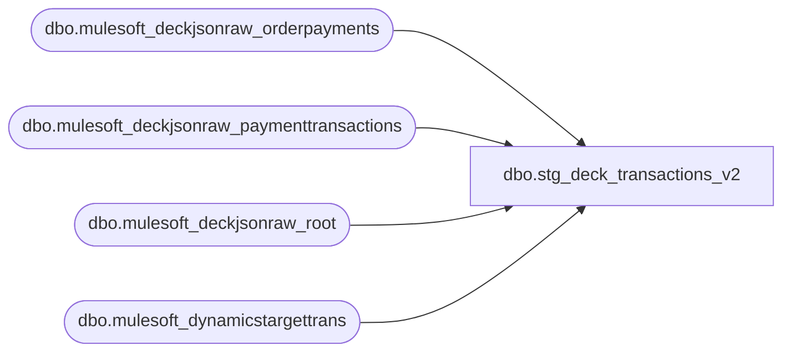

# dbo.stg_deck_transactions_v2

**Database:** LH_Source  
**Server:** 4db76rlxaxcuvmuh5kw37wbnqq-ovsykae43znuhlmnflcdwm4ohu.datawarehouse.fabric.microsoft.com  

## Architecture Diagram



## Table Dependencies

| Referenced Table |
|---|
| dbo.mulesoft_deckjsonraw_orderpayments |
| dbo.mulesoft_deckjsonraw_paymenttransactions |
| dbo.mulesoft_deckjsonraw_root |
| dbo.mulesoft_dynamicstargettrans |

## View Code

```sql
/* =============================================================================    stg_deck_transactions_v2.sql — OMS Header rebuild for Retail Returns parity    =============================================================================    Purpose: Parallel stage view forked from stg_deck_transactions.sql to drive             rpt_retail_returns_v2. Two material differences vs v1:                1. Store derivation comes from                  mulesoft_dynamicstargettrans.SiteWarehouseCode (latest by                  ExportCreatedUTC), falling back to root.SiteCode. Mapping:                  BAB → 1013, BABUK → 2013, else 9999. Matches the manual                  retail-returns reference query and avoids the OIV /                  PickupNodeCode rabbit hole.                2. oms_order_total carries a SIGNED value derived from                  mulesoft_deckjsonraw_paymenttransactions by                  PaymentTransactionTypeId — refunds net negative without any                  OIV / cancel-pickup detection logic. This lets the report's                  tender_total < 0 filter surface returns naturally.     Sign rules (PaymentTransactionTypeId):      IN (3, 4, 11)       → -ABS(Amount)   (refund / credit / void)      IN (1, 2, 10, 14)   → +ABS(Amount)   (auth / capture / settle)      other / NULL        → ABS(Amount)    (passthrough — conservative)       Fallback chain when paymenttransactions has no rows for an order:         CapturedAmount  → +         AuthorizedAmount → +         CreditedAmount  → -         0     Column contract: identical shape to stg_deck_transactions plus three    customer attribution columns (customer_first_name, customer_last_name,    customer_loyalty_card) pulled directly from root for OMS rows. The    verbatim port of rpt_retail_returns joins POS customer info via the    JumpMind composite key, which never matches OMS rows; this v2 chain    surfaces the OMS customer name from the Deck JSON itself.     source_system = 'DECK_OMS_V2' so fact_transaction_header (v1) cannot    accidentally consume this view.    ============================================================================= */  CREATE   VIEW dbo.stg_deck_transactions_v2 AS WITH canonical_oms AS (     SELECT         CAST(djr.OrderNumber AS varchar(64))                      AS transaction_id,         djr.OrderID,         djr.OrderNumber,         djr.SiteCode                                              AS site_code,         /* Latest SiteWarehouseCode per OrderID from dynamicstargettrans —            authoritative warehouse attribution per the manual reference query. */         dtt.SiteWarehouseCode                                     AS site_warehouse_code,         djr.OrderDateUTC                                          AS entry_date_time,         CASE WHEN djr.Settled = 1 THEN djr.OrderStatusChangeDateUTC              ELSE NULL         END                                                       AS settlement_time,         djr.OrderStatusCode                                       AS order_status_raw,         djr.InternalOrderStatusName                               AS oms_fulfillment_status,         djr.FirstName1                                            AS customer_first_name,         djr.LastName1                                             AS customer_last_name,         djr.Custom3                                               AS customer_loyalty_card,         djr.UserID                                                AS oms_user_id,         CASE WHEN djr.OrderStatusCode LIKE '%CANCEL%' THEN 1 ELSE 0 END                                                                   AS oms_is_cancelled,         CASE WHEN djr.OrderStatusCode LIKE '%REFUND%'               OR djr.OrderStatusCode LIKE '%RETURN%'               OR TRY_CONVERT(bit, djr.ManualReturn) = 1 THEN 1 ELSE 0 END                                                                   AS oms_is_refunded       FROM LH_Source.dbo.mulesoft_deckjsonraw_root AS djr       OUTER APPLY (           SELECT TOP (1) d.SiteWarehouseCode             FROM LH_Source.dbo.mulesoft_dynamicstargettrans AS d            WHERE d.OrderId = djr.OrderID            ORDER BY TRY_CONVERT(datetime2(7), d.ExportCreatedUTC) DESC       ) dtt ), /* Aggregate signed payment-transaction amounts per order. Net per order    because rpt_retail_returns emits one row per (transaction, line); we use    the order-level net to drive tender_total. */ payment_signed AS (     SELECT         TRY_CONVERT(int, op._ParentKeyField)                     AS order_id,         SUM(             CASE                 WHEN pt.Amount IS NULL OR pt.Amount = 0           THEN 0                 WHEN pt.PaymentTransactionTypeId IN (3, 4, 11)    THEN -ABS(pt.Amount)                 WHEN pt.PaymentTransactionTypeId IN (1, 2, 10, 14) THEN  ABS(pt.Amount)                 ELSE ABS(pt.Amount)             END         )                                                         AS pt_signed_total,         SUM(TRY_CONVERT(decimal(18,2), op.CapturedAmount))        AS captured_total,         SUM(TRY_CONVERT(decimal(18,2), op.AuthorizedAmount))      AS authorized_total,         SUM(TRY_CONVERT(decimal(18,2), op.CreditedAmount))        AS credited_total       FROM LH_Source.dbo.mulesoft_deckjsonraw_orderpayments AS op       LEFT JOIN LH_Source.dbo.mulesoft_deckjsonraw_paymenttransactions AS pt         ON TRY_CONVERT(int, pt._ParentKeyField) = TRY_CONVERT(int, op._ParentKeyField)      GROUP BY TRY_CONVERT(int, op._ParentKeyField) ), derive_total AS (     SELECT         c.*,         COALESCE(             NULLIF(p.pt_signed_total, 0),             NULLIF(p.captured_total, 0),             NULLIF(p.authorized_total, 0),             -1 * NULLIF(p.credited_total, 0),             0         )                                                         AS oms_order_total       FROM canonical_oms AS c       LEFT JOIN payment_signed AS p ON p.order_id = c.OrderID ), derive_store AS (     SELECT         d.*,         /* SiteWarehouseCode wins; fall back to SiteCode. */         CASE COALESCE(NULLIF(LTRIM(RTRIM(d.site_warehouse_code)), ''),                       NULLIF(LTRIM(RTRIM(d.site_code)),           ''))             WHEN 'BAB'   THEN '1013'             WHEN 'BABCA' THEN '1013'             WHEN 'BABUK' THEN '2013'             WHEN 'BABEU' THEN '2013'   /* TODO confirm with Brandon */             ELSE '9999'         END                                                       AS store_id       FROM derive_total AS d ) SELECT     o.transaction_id,     o.OrderID,     o.OrderNumber,     o.store_id,     TRY_CONVERT(int, o.store_id)                        AS store_no,     CAST('052' AS varchar(50))                          AS register_no,     o.entry_date_time,     TRY_CONVERT(date, o.entry_date_time)                AS business_date,     CAST('W' AS char(1))                                AS transaction_series,     CAST(o.OrderNumber AS varchar(64))                  AS transaction_no,     CAST(13 AS int)                                     AS cashier_no,     CAST(1 AS int)                                      AS transaction_category,     CASE WHEN o.oms_is_cancelled = 1 THEN 2 ELSE 0 END  AS transaction_void_flag,     o.settlement_time,     o.site_code,     o.site_warehouse_code,     o.order_status_raw,     o.oms_fulfillment_status,     o.oms_is_cancelled,     o.oms_is_refunded,     CAST(o.oms_order_total AS decimal(18,2))            AS oms_order_total,     o.customer_first_name,     o.customer_last_name,     o.customer_loyalty_card,     o.oms_user_id,     CAST('DECK_OMS_V2' AS varchar(20))                  AS source_system   FROM derive_store AS o;
```

