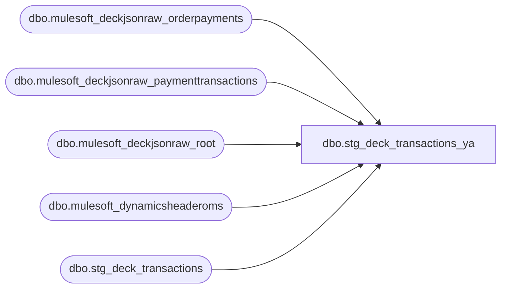

# dbo.stg_deck_transactions_ya

**Database:** LH_Source  
**Server:** 4db76rlxaxcuvmuh5kw37wbnqq-ovsykae43znuhlmnflcdwm4ohu.datawarehouse.fabric.microsoft.com  

## Architecture Diagram



## Table Dependencies

| Referenced Table |
|---|
| dbo.mulesoft_deckjsonraw_orderpayments |
| dbo.mulesoft_deckjsonraw_paymenttransactions |
| dbo.mulesoft_deckjsonraw_root |
| dbo.mulesoft_dynamicsheaderoms |
| dbo.stg_deck_transactions |

## View Code

```sql
CREATE   VIEW dbo.stg_deck_transactions_ya AS WITH ecomm_type AS (     /* iter 15: AW xlsx OMS register is 2 for Webstore/UkWebStore and 3        for BOPIS/BOSFS. Aggregated from dynamicsheaderoms (one row per        RetailReceiptId; multiple rows possible per OrderNumber if the        order ships from multiple stores — for the register assignment        MAX is fine because BOPIS/BOSFS sort after Webstore alphabetically        and any presence flips the answer to 3). */     SELECT         CAST(dh.RetailReceiptId AS varchar(64))                AS OrderNumber,         MAX(dh.eCommOrderType)                                  AS ecomm_order_type_max       FROM LH_Source.dbo.mulesoft_dynamicsheaderoms dh      GROUP BY CAST(dh.RetailReceiptId AS varchar(64)) ), max_pt_time AS (     /* iter 13: AW xlsx OMS time = MAX(paymenttransactions.TransactionDateUTC)        per OrderID, converted UTC → CST. Identified via 5-sample probe:        all 5 sample orders matched to the second. */     SELECT         r.OrderNumber,         MAX(pt.TransactionDateUTC) AS max_tx_utc       FROM LH_Source.dbo.mulesoft_deckjsonraw_paymenttransactions pt       JOIN LH_Source.dbo.mulesoft_deckjsonraw_orderpayments       op             ON op.ID = pt.OrderPaymentId       JOIN LH_Source.dbo.mulesoft_deckjsonraw_root                r             ON r.OrderID = op._ParentKeyField      GROUP BY r.OrderNumber ), derived AS (     SELECT         t.*,         /* legacy store_no derivation reused for cashier_no */         TRY_CONVERT(int,             CASE                 WHEN LEN(LTRIM(RTRIM(t.store_no_raw_oms))) <= 3                     THEN LTRIM(RTRIM(t.store_no_raw_oms))                 WHEN LEN(LTRIM(RTRIM(t.store_no_raw_oms))) = 4                   AND LEFT(LTRIM(RTRIM(t.store_no_raw_oms)), 1) = '1'                     THEN SUBSTRING(LTRIM(RTRIM(t.store_no_raw_oms)), 2, 3)                 ELSE LTRIM(RTRIM(t.store_no_raw_oms))             END         )                                                       AS legacy_store_no,         /* iter 13: prefer max(pt.TransactionDateUTC); fall back to            OrderDateUTC if no payment transaction exists. */         COALESCE(             CAST(mpt.max_tx_utc AS datetime2),             CAST(t.entry_date_time AS datetime2)         )                                                       AS source_time_utc,         /* iter 15: pull eCommOrderType for the register_no decision */         ec.ecomm_order_type_max                                 AS ecomm_order_type       FROM dbo.stg_deck_transactions AS t       LEFT JOIN max_pt_time mpt ON mpt.OrderNumber = t.transaction_id       LEFT JOIN ecomm_type  ec  ON ec.OrderNumber  = t.transaction_id ) SELECT     t.transaction_id,     t.store_id,     t.store_no_raw_oms,     t.void_enriched_flag,     t.record_type,                                                                /*  1 */     t.legacy_store_no                                          AS store_no,        /*  2 — strip leading 1 */     /*  3 — iter 15 attempt to derive register_no from eCommOrderType             (BOPIS/BOSFS → 3, else → 2) was rolled back: AW assigns             register at the per-line (per-giftcard) level, not per-order.             For orders that contain both Webstore and BOPIS lines, MAX             at the header level routes everything to 3 and breaks more             rows than it closes (no-time F1 dropped 0.36 pp). The ~1,260             OMS reg=3 rows are accepted as a known divergence pending a             per-line register source. */     CAST(2 AS int)                                             AS register_no,     /*  4 — entry_date_time UTC → site-local (iter 10) using             source_time_utc = COALESCE(giftcards.InsertDate, OrderDateUTC):               BAB / BABCA → Eastern Standard Time (US East Coast HQ for                               web orders)               BABUK       → GMT Standard Time (UK)               other       → fall back to source value (BABEU pending) */     CAST(         CASE             WHEN t.site_code IN ('BAB','BABCA')                 THEN t.source_time_utc                         AT TIME ZONE 'UTC'                         AT TIME ZONE 'Central Standard Time'             WHEN t.site_code = 'BABUK'                 THEN t.source_time_utc                         AT TIME ZONE 'UTC'                         AT TIME ZONE 'Central Standard Time'   /* iter 17: AW renders BABUK in BBW HQ CST, not GMT — 2,515 OMS rows had time_-6h before fix */             ELSE t.source_time_utc         END         AS datetime2     )                                                          AS entry_date_time,     t.transaction_series,                                                          /*  5 */     t.transaction_no,                                                              /*  6 */     t.legacy_store_no                                          AS cashier_no,      /*  7 — OMS cashier = legacy store (BAB=13, BABUK=2013) */     t.transaction_category,                                                        /*  8 */     t.bank_deposit_declaration_flag,                                               /*  9 */     t.store_no_for_tax_jurisdiction_lookup,                                        /* 10 */     t.send_tax_exception_jurisdiction,                                             /* 11 */     t.transaction_void_flag,                                                       /* 12 */     t.unused_13,                                                                   /* 13 */     t.unused_14,                                                                   /* 14 */     t.legacy_store_no                                          AS purchasing_employee_no, /* 15 — keep parity with cashier_no */     t.closeout_flag,                                                               /* 16 */     t.transaction_remark,                                                          /* 17 */     t.tax_override_flag,                                                           /* 18 */     t.till_no,                                                                     /* 19 */     t.pos_transaction_series,                                                      /* 20 */     /* Lineage / OMS-specific extension columns */     t.create_time,     /* iter 12: business_date derived from TZ-converted entry_date_time        so cross-midnight orders land on the same date AW xlsx shows. */     CAST(         CASE             WHEN t.site_code IN ('BAB','BABCA')                 THEN t.source_time_utc                         AT TIME ZONE 'UTC'                         AT TIME ZONE 'Central Standard Time'             WHEN t.site_code = 'BABUK'                 THEN t.source_time_utc                         AT TIME ZONE 'UTC'                         AT TIME ZONE 'Central Standard Time'   /* iter 17: AW renders BABUK in BBW HQ CST, not GMT — 2,515 OMS rows had time_-6h before fix */             ELSE t.source_time_utc         END         AS date     )                                                          AS business_date,     t.settlement_time,     t.party_id,     t.event_id,     t.event_invoice,     t.gsr_flag,     t.order_status,     t.has_stock_order_line_items,     t.site_code,     t.catalog_code,     t.order_type,     t.currency_raw,     t.oms_is_cancelled,     t.oms_is_refunded,     t.oms_order_total,     t.oms_payment_status,     t.oms_fulfillment_status,     t.source_system   FROM derived AS t;
```

