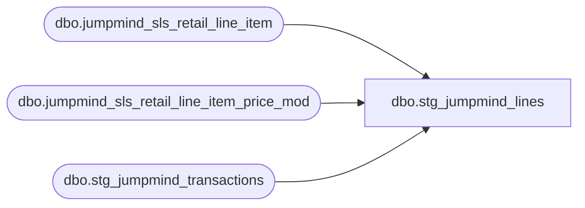

# dbo.stg_jumpmind_lines

**Database:** LH_Source  
**Server:** 4db76rlxaxcuvmuh5kw37wbnqq-ovsykae43znuhlmnflcdwm4ohu.datawarehouse.fabric.microsoft.com  

## Architecture Diagram



## Table Dependencies

| Referenced Table |
|---|
| dbo.jumpmind_sls_retail_line_item |
| dbo.jumpmind_sls_retail_line_item_price_mod |
| dbo.stg_jumpmind_transactions |

## View Code

```sql
/* =============================================================================    stg_jumpmind_lines.sql — POS Transaction Lines (Stage A + Stage B)    =============================================================================    Purpose: Reads JumpMind LH_Source line-item tables and produces output             matching the Aptos XPOLLD0013 Detail (record type 'L') and Tender             line shape. This is the heart of the migration: it derives             line_object and line_action codes via the multi-dimensional rules             from Stage B's GetLineObject/GetLineAction (with Stage A's 4-arg             signature for changeFlag handling).     CTE order (per build prompt — unification BEFORE derivation):      1. raw_lines                 — Stage A: jumpmind_sls_retail_line_item                                     + price_modifiers + extensions (find_a_bear_id)      2. derive_returns            — line-level returnFlag from itemReturned      3. derive_discount_attrs     — discount line attribution (type, scope,                                     promo code, EMP flag)      4. derive_credit_card_lo     — GetCreditCardLineObject(cardType, processor)                                     for tender lines      5. derive_line_object        — GetLineObject(discountType, promoCode,                                     discountScope, itemType) — 4D decision      6. derive_line_action        — GetLineAction(iLineObject, returnFlag,                                     gsrFlag, changeFlag) — range-dispatched      7. final SELECT              — Stage B XPOLLD0013 Detail/Tender shape     Source tables:      - LH_Source.dbo.jumpmind_sls_retail_line_item        (canonical line; has itemReturned, regular_unit_price, etc.)      - LH_Source.dbo.jumpmind_sls_retail_trans_price_mod        (price modifiers — discounts, promo codes, EMP flags)      - dbo.stg_jumpmind_voids (for void_enriched_flag → tender amount negation)     C# source references:      - Stage A: JumpMindPOSSalesAuditTranslate.cs (Stage A line transforms)      - Stage B: BABW.Services.SalesAuditTranslate/SalesAuditTranslate.cs          BuildLineRecord                           line 2123          GetLineObject(discountType, promoCode,                        discountScope, itemType)    line 5142          GetCreditCardLineObject(cardType,                                   processor)        line 5643          GetLineAction(iLineObject, returnFlag,                        gsrFlag)                    line 4833 (3-arg, Stage B)          HandleTaxOverrideDetail (296 in not-taxable line 4805)      - Stage A: SalesAuditTranslate.cs:7215 (4-arg GetLineAction with changeFlag)     Business rules applied:      - 296 (Guest Satisfaction Refund): emitted when gsrFlag=true per Stage B        lines 4917-4925: _Refunded if gsrFlag, _Charged otherwise      - Returns: line-level itemReturned wins over transaction-level      - line_action 028 (_Tendered): emitted only for Tender-type line_objects        (validated against dim_line_object_action_association)      - pos_discount_amount: stored POSITIVE on both sales and returns per        AuditWorks convention (Matthew May 5); sign of net contribution comes        from db_cr_none in Step 4 fact view. ABS() wrap on the SUM enforces        this convention when modification_total values net negative.      - Reference no 20-byte split: values >20 chars → encrypted_reference_no        (field 18) per Aptos spec footnote 9      - find_a_bear_id surfaced from extension column (Brandon May 4)      - Money string parsing: applies stg_money_parse pattern if columns are        string-format; assumes string format until verified     Schema verification status (Ryan May 6 dump for retail_line_item):      ✅ Confirmed columns: item_id, item_type, item_returned, line_sequence_number,         quantity, regular_unit_price, actual_unit_price, extended_amount,         iso_currency_code, find_a_bear_id, line_item_type, voided, device_id,         business_date, sequence_number      ✅ Synthetic transaction_id: composite (device_id|business_date|sequence_number)         per JumpMind convention — actual table has no transaction_id column.      ✅ INTENTIONAL NULL stubs (not on retail_line_item; verified May 6 not used         by any of the 19 SmartLook reports or fabric-sql-dev annotated drafts):         is_kit, is_kit_part, house_order_flag, virtual_world_code.         These were preserved as Aptos lineage columns; no downstream report         consumes them. Do NOT spend cycles locating these — leave as NULL.      ⚠ jumpmind_sls_retail_trans_price_mod schema NOT yet dumped — column names         in raw_price_mods CTE inferred to follow same JumpMind convention.     ⚠ TODOs in this view:      - GetLineObject full decision table requires Linda's PDF or BABW C# line        5142+ for full reverse-engineering. This implementation captures the        major branches; rare/edge codes flagged with TODO at point-of-use.      - GSR flag at the line level: comes from LineItem.GuestSatisfactionRefund        in C# canonical types. PENDING Brandon for shredded column location;        view uses a parameterized placeholder for now.      - Stage A vs Stage B GetLineAction: this view uses 3-arg Stage B form        since Stage B is the XPOLLD0013-emission layer. Stage A's changeFlag        4th arg is captured in CTE for cross-reference.      - dim_line_object_action_association sanity check on emitted (lo, la)        pairs is recommended after first run.    ============================================================================= */  CREATE   VIEW dbo.stg_jumpmind_lines AS WITH /* ═════════════════════════════════════════════════════════════════════════    STAGE A — Source unification    ═════════════════════════════════════════════════════════════════════════ */ raw_lines AS (     SELECT         /* Synthetic transaction_id from JumpMind composite key. The actual            jumpmind_sls_retail_line_item table has no transaction_id column;            composite is (device_id, business_date, sequence_number).            Pattern matches fabric-sql-dev/sql-merch_report.sql annotated draft. */         CAST(rli.device_id        AS varchar(64))  + '|' +         CAST(rli.business_date    AS varchar(8))   + '|' +         CAST(rli.sequence_number  AS varchar(20))                    AS transaction_id,         rli.line_sequence_number                AS line_id,         /* actual is line_sequence_number */         rli.line_sequence_number                AS line_sequence,   /* same source column */         rli.item_id                             AS upc,             /* actual source is item_id; aliased to upc for downstream consistency */         rli.item_type,                          /* STOCK / GIFTCARD / EMBROIDERY / DONATION / TIP / SERVICE / STORE_ORDER_SHIPPING */         rli.item_returned,                                          /* line-level return marker (was is_returned) */         /* INTENTIONAL NULL — verified not consumed by any SmartLook report            or fabric-sql-dev draft (May 6 column-usage audit). Lineage only. */         CAST(NULL AS bit)                       AS is_kit,         CAST(NULL AS bit)                       AS is_kit_part,         /* CORRECTED 2026-05-11 per "Existing Report Samples" evidence:            - GAAP Flash Sales sample: merchandise sale = +1154.46 (positive)            - Blackline Deposit sample: cash = +662.42 (positive)            - CC Auth sample: tender sale = +21.90 (positive), return = -18.26            Legacy SmartLook formula SUM(gross × db_cr_none × vrf) with no × -1            produces these signs ONLY when gross_line_amount is SIGNED at source            AND db_cr_none is hardcoded to 1 (per BBW Update #6).            LH_Source.extended_amount IS signed (empirical Step 5A: positive for            sales, negative for returns). Therefore pass-through, no ABS(). */         rli.quantity                            AS units,         rli.regular_unit_price                  AS regular_unit_price,         rli.actual_unit_price                   AS discounted_unit_price,         rli.extended_amount                     AS gross_line_amount,      /* signed at source — passes through to fact_transaction_line */         rli.iso_currency_code                   AS currency_code,         rli.find_a_bear_id,                     /* BBW extension per Brandon */         /* Stock-order detection: line_item_type='ORDER_IN_STORE' indicates            endless-aisle stock order line per fabric-sql-dev/sql-merch_report.sql */         CASE WHEN rli.line_item_type = 'ORDER_IN_STORE' THEN 1 ELSE 0 END                                                 AS is_stock_order_line_item,         /* INTENTIONAL NULL — verified not consumed by any SmartLook report or            fabric-sql-dev draft (May 6 column-usage audit). Preserved as            lineage shape only; no downstream impact. */         CAST(NULL AS bit)                       AS house_order_flag,         CAST(NULL AS varchar(50))               AS virtual_world_code       FROM LH_Source.dbo.jumpmind_sls_retail_line_item AS rli      WHERE COALESCE(rli.voided, 0) = 0          /* exclude voided line items per fabric-sql-dev */ ), /* Price modifiers — discounts and markdowns applied per line.    Source repointed to jumpmind_sls_retail_line_item_price_mod (38 cols, line    level) — the original target jumpmind_sls_retail_trans_price_mod (21 cols)    is the transaction-level subtotal-discount table, not the line-level table    the JumpMind C# Pricemodifier2 DTO maps to (see    JumpMindPOSSalesAuditTranslate.cs:1935 BuildDiscounts and the    priceModifier.{promotionId, description, loyaltyPromotionId, promoCodeId,    promotionType, modificationTotal} reads at lines 1980/2049/1086-1088). */ raw_price_mods AS (     SELECT         CAST(pm.device_id        AS varchar(64)) + '|' +         CAST(pm.business_date    AS varchar(8))  + '|' +         CAST(pm.sequence_number  AS varchar(20))                     AS transaction_id,         pm.line_sequence_number                                      AS line_id,         pm.mod_line_sequence_number                                  AS price_mod_sequence,         pm.price_mod_type_code                                       AS discount_type,        /* MARKDOWN / EMPLOYEE / COUPON / etc. — JumpMind C# reads as priceModifier.priceModTypeCode */         pm.price_mod_source_type_code                                AS discount_scope,       /* LINE / TRANSACTION — priceModifier.priceModSourceTypeCode */         pm.promotion_id                                              AS promo_code,           /* priceModifier.promotionId — line 1086 cc.PromoCode */         pm.loyalty_promotion_id                                      AS campaign_id,          /* priceModifier.loyaltyPromotionId — line 1088 VoucherNumber */         pm.description                                               AS discount_text,        /* priceModifier.description — line 1087 cc.DiscountName */         pm.promotion_type                                            AS promotion_type,       /* priceModifier.promotionType — drives LOYALTY_REWARD branch at line 2042 */         pm.modification_total                                        AS discount_amount,      /* priceModifier.modificationTotal — the actual applied amount */         /* PromoCode resolution per JumpMind C# BuildDiscountDetail:2082-2097:              1. promo_code_id (if non-empty)              2. else loyalty_promotion_id (if non-empty)              3. else LEFT(promotion_id, 20)            Plus special: 'manualPriceOverride3' → empty string. */         CASE             WHEN pm.promo_code_id IS NOT NULL AND pm.promo_code_id <> ''            THEN pm.promo_code_id             WHEN pm.loyalty_promotion_id IS NOT NULL AND pm.loyalty_promotion_id <> '' THEN pm.loyalty_promotion_id             ELSE LEFT(COALESCE(pm.promotion_id, ''), 20)         END                                                          AS resolved_promo_code,         /* EMP detection — per Brandon May 8: the canonical signal lives on            the new prm_promotion table (Postgres), pending replication to            LH_Source. Once available:              LEFT JOIN LH_Source.dbo.jumpmind_prm_promotion AS pp                ON pp.promotion_id = pm.promotion_id              ... CASE WHEN pp.promotion_type = 'EMPLOYEE_DISCOUNT' THEN 1 ELSE 0 END            Until the table is replicated, fall back to substring match on the            resolved promoCode string (per C# GetLineObject:5250 logic). The            sample-data resolved_promo_code values are 17-digit numeric IDs            that don't contain 'EMP', so the fallback rarely fires on POS data;            item_type='EMPLOYEE' (rare) is the only current signal path. */         CASE             WHEN UPPER(                 CASE                     WHEN pm.promo_code_id IS NOT NULL AND pm.promo_code_id <> ''            THEN pm.promo_code_id                     WHEN pm.loyalty_promotion_id IS NOT NULL AND pm.loyalty_promotion_id <> '' THEN pm.loyalty_promotion_id                     ELSE LEFT(COALESCE(pm.promotion_id, ''), 20)                 END             ) LIKE '%EMP%' THEN 1             ELSE 0         END                                                          AS is_employee_discount       FROM LH_Source.dbo.jumpmind_sls_retail_line_item_price_mod AS pm      WHERE pm.voided = 0 ), /* Aggregate price modifiers per line — single-row attribution. Multiple    modifiers per line are summed; the first non-null discount_type wins    for downstream GetLineObject routing.     ABS() wrap on the SUM (2026-05-13): per AuditWorks convention    (Matthew May 5), pos_discount_amount is stored POSITIVE on both    sales and returns; sign of net contribution comes from db_cr_none    in the fact view. Without ABS(), the 1,666 rows where SUM(modification_total)    nets negative cause (gross - pos_discount_amount) to ADD the discount    instead of subtracting it, inflating GAAP Flash Sales by 2×|D| per row    ($24,227 in Jan 2026 reconciliation). */ agg_discounts AS (     SELECT         pm.transaction_id,         pm.line_id,         ABS(SUM(pm.discount_amount))                                 AS pos_discount_amount,         MAX(pm.is_employee_discount)                                 AS is_employee_discount,         /* First-seen attribution for the routing decision */         MAX(pm.discount_type)                                        AS discount_type,         MAX(pm.discount_scope)                                       AS discount_scope,         MAX(pm.promo_code)                                           AS promo_code,         MAX(pm.resolved_promo_code)                                  AS resolved_promo_code,         MAX(pm.campaign_id)                                          AS campaign_id,         MAX(pm.discount_text)                                        AS discount_text,         MAX(pm.promotion_type)                                       AS promotion_type       FROM raw_price_mods AS pm      GROUP BY pm.transaction_id, pm.line_id ), /* GSR flag join from header (TODO: Brandon-confirmed line-level column).    For now, propagate the header-level GSR flag from stg_jumpmind_transactions    down to all lines of the transaction. When Brandon confirms a line-level    column, replace this propagation. */ gsr_propagation AS (     SELECT         t.transaction_id,         t.gsr_flag                                                    AS header_gsr_flag       FROM dbo.stg_jumpmind_transactions AS t ), /* ═════════════════════════════════════════════════════════════════════════    STAGE B — Derivation: returns, discount attrs, line_object, line_action    ═════════════════════════════════════════════════════════════════════════ */ derive_returns AS (     /* Line-level returnFlag is the line's `item_returned` boolean. This        overrides the transaction-level RETURN type (per build prompt §3.2) so        mixed-receipt transactions work correctly. */     SELECT         l.*,         CASE WHEN l.item_returned = 1 THEN 1 ELSE 0 END               AS return_flag       FROM raw_lines AS l ), derive_attrs AS (     SELECT         r.*,         ad.pos_discount_amount,         COALESCE(ad.is_employee_discount, 0)                          AS is_employee_discount,         ad.discount_type,         ad.discount_scope,         ad.promo_code,         ad.resolved_promo_code,         ad.campaign_id,         ad.discount_text,         ad.promotion_type,         COALESCE(g.header_gsr_flag, 0)                                AS gsr_flag,         /* changeFlag per Stage A 4-arg GetLineAction — captured for fact-layer            cross-check; not used in Stage B 3-arg derivation. ChangeFlag in            C# is true when this is a change-money-back line in a mixed tender            transaction. Detect via item_type='CHANGE' or sentinel pattern. */         CASE WHEN r.item_type = 'CHANGE' THEN 1 ELSE 0 END            AS change_flag       FROM derive_returns AS r       LEFT JOIN agg_discounts   AS ad ON ad.transaction_id = r.transaction_id AND ad.line_id = r.line_id       LEFT JOIN gsr_propagation AS g  ON g.transaction_id  = r.transaction_id ), /* line_object derivation — split into two outputs:      line_object          = BASE merchandise / item line_object (NEVER a                             discount code). Driven by item_type / virtual_world.      discount_line_object = the discount routing code (1614, 1617, 1625, 1626,                             1630, 1631, 1636, 1645, 1648, 1660, 1661, 1740, etc.)                             when a price modifier is present, else NULL.     The C# emits a separate AuditWorks 'L' record for each discount; this view    carries both codes on a single row so the consumer can either (a) use the    merged shape (line_object + pos_discount_amount) for net-sales reports or    (b) UNION the discount rows for discount-breakdown reports.     discount_line_object is computed by translating GetLineObject literally    from BABW SalesAuditTranslate.cs:5142-5258:      inputs:        discountType  — "1" DollarsOff (always for JumpMind, line 1980/2049)                        or "2" PercentOff (OMS path).        discountScope — _SubtotalDiscount=1 / _ShippingDiscount=2 / _LineItemDiscount=3.                        JumpMind C# maps price_mod_type_code: TRANS→1, ITEM→3.                        price_mod_type_code enum confirmed (May 8 dump):                        only TRANS and ITEM exist in production data.        promoCode     — resolved chain: promo_code_id → loyalty_promotion_id →                        LEFT(promotion_id,20) (BuildDiscountDetail:2082-2097)        itemType      — the BASE line_object of the line being discounted                        (102, 103, 104, 110, 400-499 trigger special routing).       EMP override (C# 5250-5253): UPPER(promoCode) CONTAINS 'EMP' → 1740,        overrides any other line_object derivation.      IsSerializedVoucher (C# 6006): TRY_PARSE numeric AND LEN matches the        SalesAuditConfiguration.SerializedCouponLength config setting (config        value not yet sourced from BBW infra; placeholder hardcoded to 17 —        commonest e-coupon length. ⚠ TODO Brandon: confirm value).      isHouseOrder (C# 5158): always FALSE for POS (no HouseOrderPayments        concept on JumpMind side; the flag is set only in BABW OMS path        SalesAuditTranslate.cs:1673). */ derive_line_object AS (     SELECT         a.*,         /* ── BASE merchandise line_object ── */         CASE             /* GSR override only when no discount applied (otherwise GSR is                handled via discount_line_object). Per C# 4917-4925 the 296                emission is for the Guest-Satisfaction-Refund leg of a tender,                which is a separate concern from line-level merchandise. */             WHEN a.gsr_flag = 1 AND a.discount_type IS NULL          THEN 296             /* Item-type direct mapping. Enum values confirmed from May 8                retail_line_item sample (500 rows): STOCK (86%), LOYALTY (9%),                GIFTCARD (3%), DONATION (1%), EMPLOYEE (<1%). */             WHEN a.item_type = 'GIFTCARD'                              THEN 404             WHEN a.item_type = 'EMBROIDERY'                            THEN 202             WHEN a.item_type = 'DONATION'                              THEN 101             WHEN a.item_type = 'TIP'                                   THEN 301             WHEN a.item_type = 'STORE_ORDER_SHIPPING'                  THEN 200             WHEN a.item_type IN ('STOCK','SERVICE')                    THEN 100   /* Merchandise */             ELSE CAST(NULL AS int)         END                                                       AS line_object       FROM derive_attrs AS a ), /* ── DISCOUNT line_object — translated GetLineObject (C# 5142-5258) ── */ derive_discount_line_object AS (     SELECT         d.*,         /* discountScope int per C# private const: TRANS→1, ITEM→3            (no SHIPPING in JumpMind POS path). */         CASE d.discount_type             WHEN 'TRANS' THEN 1             WHEN 'ITEM'  THEN 3             ELSE              NULL         END                                                       AS discount_scope_int,         /* discountType is "1" (DollarsOff) for JumpMind always per C# 1980/2049 */         CAST('1' AS varchar(1))                                   AS discount_type_code,         /* IsSerializedVoucher per Brandon May 8 confirmation:              - Everything from JumpMind is 17 digits (so length=17 is correct)              - Serialized coupons + reward certificates start with '2'              - Loyalty reward vouchers start with '5' (LOYALTY_REWARD promotion_type,                price_mod_type_code=TRANS). AuditWorks treated these as serialized,                routing them to LO 1636 the same as scanned coupon barcodes. Starting                with the LH_Mart removal (2026-06-15), these fell to LO 1645 because                the '2'-only check excluded them. SA Coupons was missing 110,259 rows                as a result. Fix: include '5' prefix so LOYALTY_REWARD vouchers                route to 1636 (TRANS scope + serialized) instead of 1645. */         CASE             WHEN d.resolved_promo_code IS NULL                                              THEN 0             WHEN TRY_CAST(d.resolved_promo_code AS bigint) IS NULL                          THEN 0             WHEN LEN(d.resolved_promo_code) = 17               AND LEFT(d.resolved_promo_code, 1) IN ('2', '5')                              THEN 1             ELSE                                                                                 0         END                                                       AS is_serialized_voucher       FROM derive_line_object AS d ), derive_discount_line_object_final AS (     SELECT         d.*,         /* When no discount applied, NULL. Otherwise apply C# GetLineObject            decision tree. Only the DollarsOff branch is reachable from the            JumpMind path (discountType always "1"). */         CASE             /* No discount on this line */             WHEN d.discount_type IS NULL                                                     THEN NULL             /* EMP override (C# 5250-5253): unconditional 1740 */             WHEN UPPER(COALESCE(d.resolved_promo_code,'')) LIKE '%EMP%'                      THEN 1740             /* DollarsOff + SubtotalDiscount (TRANS) — C# 5189-5208 */             WHEN d.discount_type_code = '1' AND d.discount_scope_int = 1 THEN                 CASE                     WHEN d.is_serialized_voucher = 1 AND d.line_object BETWEEN 400 AND 499  THEN 1625  /* GC serialized */                     WHEN d.is_serialized_voucher = 1                                        THEN 1636  /* Subtotal serialized PRORATED */                     WHEN d.line_object BETWEEN 400 AND 499                                  THEN 1626  /* GC subtotal */                     WHEN d.line_object = 102                                                THEN 1652  /* VW Item subtotal */                     WHEN d.line_object = 103                                                THEN 1653  /* VW Subscription subtotal */                     WHEN d.line_object = 104                                                THEN 1654  /* Kids Club subtotal */                     WHEN d.line_object = 110                                                THEN 1660  /* House Order */                     ELSE                                                                         1645  /* Subtotal $off PRORATED */                 END             /* DollarsOff + LineItemDiscount (ITEM) — C# 5209-5226 */             WHEN d.discount_type_code = '1' AND d.discount_scope_int = 3 THEN                 CASE                     WHEN d.is_serialized_voucher = 1 AND d.line_object BETWEEN 400 AND 499  THEN 1625  /* GC serialized */                     WHEN d.is_serialized_voucher = 1                                        THEN 1630  /* Item serialized */                     WHEN d.line_object BETWEEN 400 AND 499                                  THEN 1625  /* GC item */                     WHEN d.line_object = 102                                                THEN 1698  /* VW Item item */                     WHEN d.line_object = 103                                                THEN 1699  /* VW Subscription item */                     WHEN d.line_object = 104                                                THEN 1697  /* Kids Club item */                     WHEN d.line_object = 110                                                THEN 1660  /* House Order */                     ELSE                                                                         1617  /* $Off item Promo */                 END             ELSE                                                                                 1617  /* C# default for $Off */         END                                                       AS discount_line_object       FROM derive_discount_line_object AS d ), /* GetLineAction derivation — replicates Stage B SalesAuditTranslate.cs:4833    range-dispatched logic (3-arg form):      iLineObject < 200  (Merchandise 100-199):  _Sold/_Returned by returnFlag|gsr      200 ≤ lo ≤ 289, 294, 301 (Fees-B):         _Charged/_Refunded      290-293, 295    (Fees-A):                   _Charged/_Refunded      296             (GSR — Guest Sat Refund):   _Refunded if gsr else _Charged                                                  (per C# lines 4917-4925)      297             (CC Shortage):              _Charged      400-499         (BearBucks Sell):           _Sold/_Returned      500-599         (Taxes):                    _Charged/_Refunded      1000+ (control objects, drawer, etc.):     varies — TODO    Modified by returnFlag, gsrFlag (and Stage A's changeFlag).     line_action codes from SalesAuditTranslate.cs:45-67:      001 _Sold, 002 _Returned, 011 _Charged, 012 _Refunded,      013 _Received, 016 _Recovered, 020 _Deducted, 021 _Reversed,      025 _Redeemed, 027 _Credited, 028 _Tendered     ⚠ For 028 _Tendered: emitted only when companion line_object is Tender-type      (validated via dim_line_object_action_association — only Tender-type      line_objects 600/601/603/609/614/626/642 should pair with action 028). */ derive_line_action AS (     SELECT         d.*,         CASE             /* 296 GSR special handling (Stage B 4917-4925) */             WHEN d.line_object = 296                                    THEN                 CASE WHEN d.gsr_flag = 1 THEN '012' ELSE '011' END             /* Merchandise range 100-199: Sold/Returned */             WHEN d.line_object BETWEEN 100 AND 199                      THEN                 CASE WHEN d.return_flag = 1 OR d.gsr_flag = 1                      THEN '002'   /* _Returned */                      ELSE '001'   /* _Sold */                 END             /* Fees-B range 200-289, 294, 301: Charged/Refunded */             WHEN d.line_object BETWEEN 200 AND 289               OR d.line_object IN (294, 301)                            THEN                 CASE WHEN d.return_flag = 1 OR d.gsr_flag = 1                      THEN '012'   /* _Refunded */                      ELSE '011'   /* _Charged */                 END             /* Fees-A range 290-293, 295 (promotional coupon recoveries):                AuditWorks line_action 016 _Recovered (vendor-funded coupons                that the store recovers cost on) when not return/GSR; 012                _Refunded when reversed. Verified against AuditWorks_line_action.csv.                Prior code emitted 011 _Charged here which is the Fees-B verb. */             WHEN d.line_object IN (290,291,292,293,295)                 THEN                 CASE WHEN d.return_flag = 1 OR d.gsr_flag = 1                      THEN '012'   /* _Refunded */                      ELSE '016'   /* _Recovered */                 END             /* CC Shortage 297: Charged only */             WHEN d.line_object = 297                                    THEN '011'             /* BearBucks/Liabilities 400-499: Sold/Returned (issue/redeem semantics).                Redemption signal isn't on price_mod (TRANS/ITEM only) — for now                treat as Sold/Returned. ⚠ TODO confirm where the JumpMind C# gets                the 025 _Redeemed signal for gift card redemption events. */             WHEN d.line_object BETWEEN 400 AND 499                      THEN                 CASE                     WHEN d.return_flag = 1 OR d.gsr_flag = 1            THEN '002'                     ELSE                                                      '001'                 END             /* Sales Tax 500-599: Charged/Refunded */             WHEN d.line_object BETWEEN 500 AND 599                      THEN                 CASE WHEN d.return_flag = 1 OR d.gsr_flag = 1                      THEN '012'                      ELSE '011'                 END             /* Tender lines 600-699 + drawer 1000: _Tendered (028) for sales,                _ChangeReturned (018) for change. Companion-line-object check                via dim_line_object_action_association ensures 028 only emits                with Tender-type pairings. */             WHEN d.line_object BETWEEN 600 AND 699               OR d.line_object = 1000                                   THEN                 CASE                     WHEN d.change_flag = 1                               THEN '018'   /* _ChangeReturned */                     WHEN d.return_flag = 1 OR d.gsr_flag = 1             THEN '027'   /* _Credited (refund) */                     ELSE                                                       '028'   /* _Tendered */                 END             /* Item Markdown 1600s, Subtotal Discount 1700s, Memo 1800s:                AuditWorks line_action 020 _Deducted on non-return discount;                021 _Reversed on return/GSR. Verified against                AuditWorks_line_action.csv (016=recovered, 019=applied,                020=deducted, 021=reversed). Range extended from 1600-1799                to 1600-1999 to cover memo band per Stage B                SalesAuditTranslate.cs:5099-5115. Prior code emitted 019                _Applied which is a different action concept. */             WHEN d.line_object BETWEEN 1600 AND 1999                    THEN                 CASE WHEN d.return_flag = 1 OR d.gsr_flag = 1                      THEN '021'   /* _Reversed */                      ELSE '020'   /* _Deducted */                 END             /* Default fallback for codes outside known ranges */             ELSE                                                              '038'   /* _Recorded */         END                                                       AS line_action       FROM derive_discount_line_object_final AS d ), /* GetCreditCardLineObject mapping (called separately for tender lines).    This is a placeholder — actual cardType + paymentProcessor lookup happens    in stg_canonical_payments.sql since payment lines come from a different    source table. */ /* Final output */ final_output AS (     SELECT         la.*       FROM derive_line_action AS la ) /* ═════════════════════════════════════════════════════════════════════════    STAGE B — Final SELECT — Aptos XPOLLD0013 Detail (record type 'L') shape    18 fields per spec. Reference no length split:      - Values <=20 chars → reference_no (field 5)      - Values >20 chars  → encrypted_reference_no (field 18)    Per Aptos spec footnote 9, page 7-8.    ═════════════════════════════════════════════════════════════════════════ */ SELECT     /* Native FK / lineage */     f.transaction_id,     f.line_id,     f.line_sequence,     /* Aptos XPOLLD0013 Detail fields (1-18) */     CAST('L' AS char(1))                                AS record_type,                   /*  1 */     f.line_id                                           AS line_id_aptos,                 /*  2 */     f.line_object                                       AS line_object,                   /*  3 — derived */     f.line_action                                       AS line_action,                   /*  4 — derived */     /* Reference no length split (field 5 vs 18) */     CASE WHEN LEN(f.upc) <= 20 THEN CAST(f.upc AS varchar(80)) ELSE NULL END                                                         AS reference_no,                  /*  5 */     f.gross_line_amount                                 AS line_amount,                   /*  6 — POSITIVE both sales/returns */     CAST(0 AS int)                                      AS unused_1,                      /*  7 */     CAST(1 AS int)                                      AS line_amount_divider,           /*  8 */     CAST(0 AS int)                                      AS unused_2,                      /*  9 */     CAST(1 AS int)                                      AS voiding_reversal_flag,         /* 10 — always 1 in BBW production */     f.pos_discount_amount                               AS line_amount_deduction,         /* 11 — POSITIVE; sign from db_cr_none in fact */     f.units                                             AS line_amount_multiplication_factor, /* 12 — units/qty */     CAST(0 AS bit)                                      AS line_void_flag,                /* 13 — Step 4 fact_transaction_line populates from verify_transaction_$sp */     CAST(0 AS int)                                      AS attachment_quantity,           /* 14 */     CAST(0 AS int)                                      AS line_object_adjustment,        /* 15 */     CAST(NULL AS varchar(500))                          AS lookup_pos_code,               /* 16 */     CAST(NULL AS varchar(500))                          AS pos_description_token_list,    /* 17 */     CASE WHEN LEN(f.upc) > 20 THEN CAST(f.upc AS varchar(80)) ELSE NULL END                                                         AS encrypted_reference_no,        /* 18 */     /* Lineage / extension columns (NOT in XPOLLD0013) */     f.upc,     f.item_type,     f.return_flag,     f.gsr_flag,     f.change_flag,     f.is_employee_discount,     f.discount_type,     f.discount_scope,     f.promo_code,     f.resolved_promo_code,     f.campaign_id,     f.discount_text,     f.discount_line_object,                                                   /* GetLineObject discount routing per C# 5142 */     f.regular_unit_price,     f.discounted_unit_price,     f.units,     f.currency_code,     f.find_a_bear_id,                                                        /* BBW extension */     f.is_stock_order_line_item,     f.house_order_flag,     f.virtual_world_code,     CAST('JUMPMIND' AS varchar(10))                     AS source_system   FROM final_output AS f;
```

