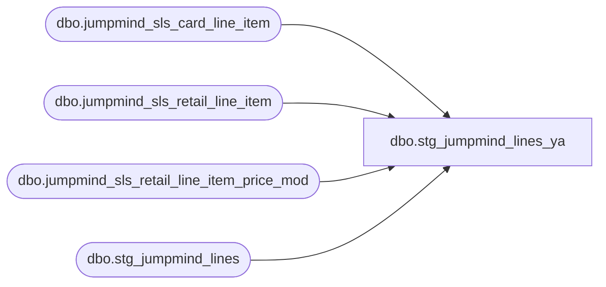

# dbo.stg_jumpmind_lines_ya

**Database:** LH_Source  
**Server:** 4db76rlxaxcuvmuh5kw37wbnqq-ovsykae43znuhlmnflcdwm4ohu.datawarehouse.fabric.microsoft.com  

## Architecture Diagram



## Table Dependencies

| Referenced Table |
|---|
| dbo.jumpmind_sls_card_line_item |
| dbo.jumpmind_sls_retail_line_item |
| dbo.jumpmind_sls_retail_line_item_price_mod |
| dbo.stg_jumpmind_lines |

## View Code

```sql
CREATE   VIEW dbo.stg_jumpmind_lines_ya AS WITH gc_card AS (     SELECT         CAST(device_id AS varchar(64))  + '|' +         CAST(business_date AS varchar(8))  + '|' +         CAST(sequence_number AS varchar(20))     AS transaction_id,         ref_line_sequence_number                  AS line_id,         card_number       FROM LH_Source.dbo.jumpmind_sls_card_line_item      WHERE type_code = 'GIFTCARD' ), refund_discount AS (     /* iter 16: refund lines in jumpmind_sls_retail_line_item have        orig_* pointer fields back to the original sale. Parent        stg_jumpmind_lines.agg_discounts joins price_mod by the        refund line's own composite key — but refund lines don't carry        their own price_mod entries, so pos_discount_amount comes out        NULL there. The fix is to look up the ORIGINAL sale's price_mod        and apply it (negated) to the refund line so the AW formula        (gross - pos_discount) yields the right net (e.g. refund        gross=-10, AW orig discount=5 → pos_discount=-5 → net=-5).         Refunds are identified by orig_line_sequence_number IS NOT NULL. */     SELECT         CAST(rli.device_id AS varchar(64))  + '|' +         CAST(rli.business_date AS varchar(8))  + '|' +         CAST(rli.sequence_number AS varchar(20)) AS transaction_id,         rli.line_sequence_number                  AS line_id,         SUM(ABS(pm.modification_total))            AS orig_discount_abs       FROM LH_Source.dbo.jumpmind_sls_retail_line_item rli       JOIN LH_Source.dbo.jumpmind_sls_retail_line_item_price_mod pm             ON pm.device_id            = rli.orig_device_id            AND pm.business_date        = rli.orig_business_date            AND pm.sequence_number      = rli.orig_sequence_number            AND pm.line_sequence_number = rli.orig_line_sequence_number            AND pm.voided = 0      WHERE rli.orig_line_sequence_number IS NOT NULL        AND ISNULL(rli.voided, 0) = 0      GROUP BY rli.device_id, rli.business_date, rli.sequence_number,               rli.line_sequence_number ) SELECT     l.transaction_id,     l.line_id,     l.line_sequence,     l.record_type,     l.line_id_aptos,     l.line_object,     l.line_action,     /* iter 5: GIFTCARD lines surface card_number; everything else passes        through the parent view's reference_no. */     CASE         WHEN l.item_type = 'GIFTCARD' AND gc.card_number IS NOT NULL             THEN CAST(gc.card_number AS varchar(80))         ELSE l.reference_no     END                                                 AS reference_no,     l.line_amount,     l.unused_1,     l.line_amount_divider,     l.unused_2,     l.voiding_reversal_flag,     /* iter 16: refund line discount override.        For refund rows (rd.orig_discount_abs IS NOT NULL), emit the        orig sale's discount NEGATED — AW formula (gross - pos_discount)        with gross<0 needs pos_discount<0 to land net = -orig_net. */     CASE         WHEN rd.orig_discount_abs IS NOT NULL             THEN CAST(-1 * rd.orig_discount_abs AS decimal(18,2))         ELSE l.line_amount_deduction     END                                                 AS line_amount_deduction,     l.line_amount_multiplication_factor,     l.line_void_flag,     l.attachment_quantity,     l.line_object_adjustment,     l.lookup_pos_code,     l.pos_description_token_list,     /* If we lifted the card_number into reference_no, blank the encrypted        slot for those rows; otherwise pass through. */     CASE         WHEN l.item_type = 'GIFTCARD' AND gc.card_number IS NOT NULL             THEN NULL         ELSE l.encrypted_reference_no     END                                                 AS encrypted_reference_no,     /* Lineage / extension columns — passthrough */     l.upc,     l.item_type,     l.return_flag,     l.gsr_flag,     l.change_flag,     l.is_employee_discount,     l.discount_type,     l.discount_scope,     l.promo_code,     l.resolved_promo_code,     l.campaign_id,     l.discount_text,     l.discount_line_object,     l.regular_unit_price,     l.discounted_unit_price,     l.units,     l.currency_code,     l.find_a_bear_id,     l.is_stock_order_line_item,     l.house_order_flag,     l.virtual_world_code,     l.source_system   FROM dbo.stg_jumpmind_lines AS l   LEFT JOIN gc_card AS gc         ON gc.transaction_id = l.transaction_id        AND gc.line_id        = l.line_id   LEFT JOIN refund_discount AS rd         ON rd.transaction_id = l.transaction_id        AND rd.line_id        = l.line_id;
```

