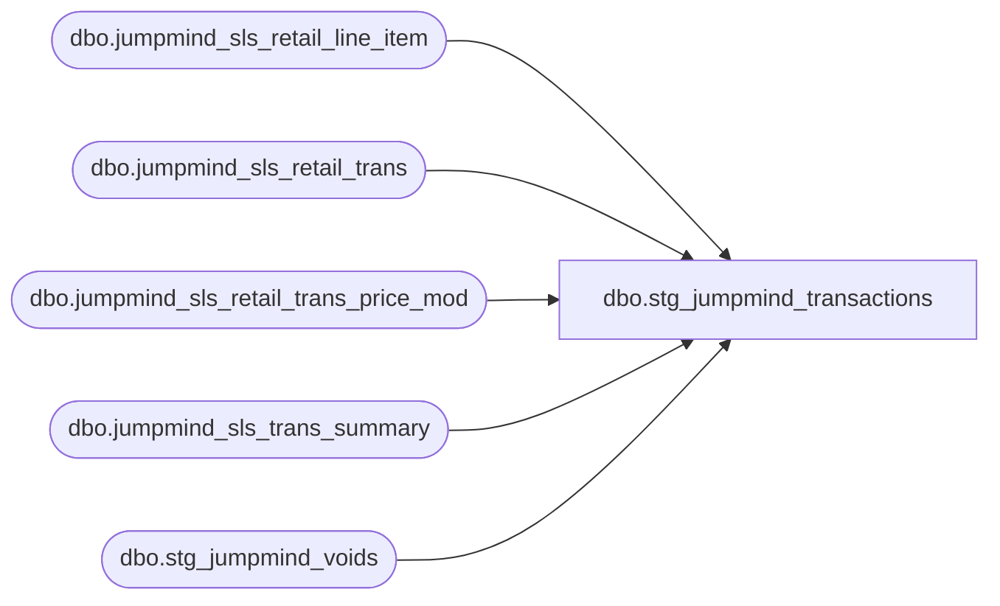

# dbo.stg_jumpmind_transactions

**Database:** LH_Source  
**Server:** 4db76rlxaxcuvmuh5kw37wbnqq-ovsykae43znuhlmnflcdwm4ohu.datawarehouse.fabric.microsoft.com  

## Architecture Diagram



## Table Dependencies

| Referenced Table |
|---|
| dbo.jumpmind_sls_retail_line_item |
| dbo.jumpmind_sls_retail_trans |
| dbo.jumpmind_sls_retail_trans_price_mod |
| dbo.jumpmind_sls_trans_summary |
| dbo.stg_jumpmind_voids |

## View Code

```sql
/* =============================================================================    stg_jumpmind_transactions.sql — POS Transaction Header (Stage A + Stage B)    =============================================================================    Purpose: Reads JumpMind LH_Source tables and produces output matching the             Aptos XPOLLD0013 Header record shape (record type 'H', 20 fields).             This view OWNS BOTH stages per build prompt:               Stage A — canonicalize JumpMind raw → SalesOrder shape               Stage B — emit Header record fields with derivation     CTE order (per build prompt — unification BEFORE derivation):      1. canonical_pos       — Stage A unification of jumpmind_sls_trans +                               jumpmind_sls_retail_trans (extensions)      2. enriched_voids      — UNION ALL with stg_jumpmind_voids (POST_VOIDs)      3. unified_source      — combined POS transaction set      4. derive_category     — TransactionCategory assignment per BBW config      5. derive_series       — TransactionSeries assignment per BBW config      6. derive_void_flag    — CustomTransactionVoidFlag per Aptos spec values      7. derive_order_status — OrderStatus 16/13      8. derive_cashier      — Cashier sentinel handling (9999 fallback)      9. final SELECT        — Stage B Header record output shape     Source tables:      - LH_Source.dbo.jumpmind_sls_trans        (top-level POS transaction, sequence_number/business_unit_id/etc.)      - LH_Source.dbo.jumpmind_sls_retail_trans        (retail-specific extensions: party_id, event_id, event_invoice,         gsr_flag pending Brandon)      - dbo.stg_jumpmind_voids        (Stage-A-enriched POST_VOIDs with marker void_enriched_flag=1)      - dbo.dim_store          (4-digit padded store_id PK)      - dbo.dim_transaction_category      - dbo.dim_transaction_series     Business rules applied:      - TransactionCategory IN (1,2): preserved as Customer + Party Customer        (per BBW Aptos config + production code §3.1 of BUILD_READINESS)      - TransactionSeries: 22 active series valid; default POS = P      - Returns: transaction_type='RETURN' OR line-level itemReturned (line view        handles line level)      - Store ID: 4-digit zero-padded with leading "1" (no BuildStoreNumber strip)      - Cashier sentinel: 9999 if username can't parse as int      - VOID → POST_VOID enrichment applied via stg_jumpmind_voids upstream      - 296 line_object: handled in stg_jumpmind_lines (downstream)     Schema realignment (Matt May 6 deployment feedback + Deck/Jumpmind inventory):      Primary source switched from `jumpmind_sls_trans` (26 cols, missing      financial + void reverse-pointer + workstation columns) to      `jumpmind_sls_trans_summary` (87 cols).      `jumpmind_sls_retail_trans` is still LEFT JOINed for BBW extensions      (party_id, event_id, event_invoice).       Field derivations:        workstation_id      = SUBSTRING(device_id after '-')        voided_device_id    = device_id when voided_sequence_number IS NOT NULL        business_date       = TRY_CAST(business_date varchar AS date)        gross_total         = total        (net_total column dropped May 7 — phantom: no upstream definition         in JumpMind/AuditWorks, no SmartLook report consumes it. Per Ryan.)     ⚠ TODOs in this view:      - GSR flag wired (Brandon May 7) — EXISTS subquery on        jumpmind_sls_retail_trans_price_mod where reason_code = '2429'.      - BOPIS/BOSFS source-of-record decision: PENDING Ben before NA-007.        Currently surfaces both POS and OMS rows; downstream reports must        deduplicate.    ============================================================================= */  CREATE   VIEW dbo.stg_jumpmind_transactions AS WITH /* ═════════════════════════════════════════════════════════════════════════    STAGE A — Source unification: shape POS into canonical SalesOrder shape    ═════════════════════════════════════════════════════════════════════════ */ canonical_pos AS (     /* Source: jumpmind_sls_trans_summary (87-col denormalized aggregate).        LEFT JOIN to jumpmind_sls_retail_trans for BBW header extensions        (party_id, event_id, event_invoice — only on retail_trans).        Composite key: (device_id, business_date, sequence_number). */     SELECT         CAST(st.device_id        AS varchar(64)) + '|' +         CAST(st.business_date    AS varchar(8))  + '|' +         CAST(st.sequence_number  AS varchar(20))                AS transaction_id,         st.business_unit_id,         SUBSTRING(st.device_id,                   CHARINDEX('-', st.device_id) + 1,                   LEN(st.device_id))                            AS workstation_id,         st.sequence_number,         st.create_time                                          AS entry_date_time,         CAST(st.create_time AS date)         AS business_date,         st.username,         st.till_id,         st.barcode,         st.device_id,         st.trans_type_code                                      AS transaction_type,         st.trans_status_code                                    AS transaction_status,         st.training_mode,         st.iso_currency_code                                    AS currency_code,         /* Header-level extensions confirmed by Brandon May 4 — only on            retail_trans, not trans_summary */         rt.party_id,         rt.event_id,         rt.event_invoice,         /* GSR flag (Brandon SME resolution Q7, see            docs/reference-data/Brandon_SME_Resolutions_2026-05.md):            transaction has a GSR discount applied when retail_trans_price_mod            has a non-voided row with reason_code = '2429' (Guest Satisfaction            Refund). Other reason codes in the same group (for future discount            classification): 2428 Store Coupon,            2437 Promo-Activate Gift Card, 2438 Promo-Cashout Gift Card,            2439 Promo-BAB Cash. */         CASE WHEN EXISTS (                  SELECT 1                    FROM LH_Source.dbo.jumpmind_sls_retail_trans_price_mod AS pm                   WHERE pm.device_id        = st.device_id                     AND pm.business_date    = st.business_date                     AND pm.sequence_number  = st.sequence_number                     AND pm.reason_code      = '2429'                     AND pm.voided           = 0              ) THEN CAST(1 AS bit) ELSE CAST(0 AS bit)         END                                                     AS gsr_flag,         st.total                                                AS gross_total,         /* voided_device_id derived: voids self-reference the same register */         CASE WHEN st.voided_sequence_number IS NOT NULL              THEN st.device_id              ELSE NULL         END                                                     AS voided_device_id,         st.voided_sequence_number,         /* Stock-order detection: presence of any line with line_item_type =            'ORDER_IN_STORE' → endless aisle. Drives OrderStatus = "13" vs            default "16" per build prompt §3.8. */         CASE WHEN EXISTS (                  SELECT 1                    FROM LH_Source.dbo.jumpmind_sls_retail_line_item AS rli                   WHERE rli.device_id        = st.device_id                     AND rli.business_date    = st.business_date                     AND rli.sequence_number  = st.sequence_number                     AND rli.line_item_type   = 'ORDER_IN_STORE'              ) THEN 1 ELSE 0         END                                                     AS has_stock_order_line_items,         CAST(0 AS bit)                                          AS void_enriched_flag       FROM LH_Source.dbo.jumpmind_sls_trans_summary AS st       LEFT JOIN LH_Source.dbo.jumpmind_sls_retail_trans AS rt         ON  rt.device_id       = st.device_id         AND rt.business_date   = st.business_date         AND rt.sequence_number = st.sequence_number      WHERE (st.trans_type_code <> 'VOID'    /* VOIDs handled via stg_jumpmind_voids */         OR (st.trans_type_code = 'VOID'             AND st.voided_sequence_number IS NULL))  /* Unenrichable VOIDs */        /* Per Juan + James May 9: ignore legacy non-integer business_unit_id           values (WEBS / DEST / fixed / 1043-003 / etc.). Confirmed no longer           used in the current system; web orders flow through OMS path           (stg_deck_transactions) where SiteCode is mapped to 1013 / 2013. */        AND TRY_CAST(LTRIM(RTRIM(st.business_unit_id)) AS int) IS NOT NULL ), /* ═════════════════════════════════════════════════════════════════════════    STAGE A continued — UNION enriched POST_VOIDs back in    ═════════════════════════════════════════════════════════════════════════ */ enriched_voids AS (     SELECT         v.transaction_id,         v.business_unit_id,         v.workstation_id,         v.sequence_number,         v.create_time                                           AS entry_date_time,         CAST(v.create_time AS date)                             AS business_date,         v.username,         v.till_id,         v.barcode,         v.device_id,         v.trans_type_code                                       AS transaction_type,  /* 'POST_VOID' */         CAST(NULL AS varchar(20))                               AS transaction_status,         CAST(0 AS bit)                                          AS training_mode,         CAST(NULL AS varchar(3))                                AS currency_code,         CAST(NULL AS varchar(50))                               AS party_id,         CAST(NULL AS varchar(50))                               AS event_id,         CAST(NULL AS varchar(50))                               AS event_invoice,         CAST(NULL AS bit)                                       AS gsr_flag,         CAST(NULL AS decimal(18,2))                             AS gross_total,         v.voided_device_id,         v.voided_sequence_number,         CAST(0 AS bit)                                          AS has_stock_order_line_items,         CAST(1 AS bit)                                          AS void_enriched_flag       FROM dbo.stg_jumpmind_voids AS v ), unified_source AS (     SELECT * FROM canonical_pos     UNION ALL     SELECT * FROM enriched_voids ), /* ═════════════════════════════════════════════════════════════════════════    STAGE B — Derivation CTEs    ═════════════════════════════════════════════════════════════════════════ */ /* Cashier sentinel: per build prompt §3.8 — non-int username → 9999.    This corresponds to C# Stage A `BuildCustomerInfo` falling back to a    sentinel when `username` can't parse as an int. */ derive_cashier AS (     SELECT         u.*,         CASE             WHEN TRY_CAST(u.username AS int) IS NULL THEN 9999             ELSE TRY_CAST(u.username AS int)         END                                                      AS cashier_no_canonical       FROM unified_source AS u ), /* Store ID standardization to 4-digit padded form per Ben + dim_store.store_id.    business_unit_id may be a few digits in JumpMind raw — pad with leading '1'.    For VOID-enriched POST_VOIDs, business_unit_id was preserved from the    original transaction so it's already in canonical form.     Non-integer business_unit_id values (legacy WEBS / DEST / fixed / 1043-003)    are filtered out at raw_pos per Juan + James May 9 — not in current    production use. Web orders flow through OMS path (stg_deck_transactions). */ derive_store AS (     SELECT         c.*,         CASE             WHEN LEN(LTRIM(RTRIM(c.business_unit_id))) = 4               AND LEFT(LTRIM(RTRIM(c.business_unit_id)), 1) = '1'                 THEN LTRIM(RTRIM(c.business_unit_id))             WHEN LEN(LTRIM(RTRIM(c.business_unit_id))) <= 3                 THEN '1' + RIGHT('000' + LTRIM(RTRIM(c.business_unit_id)), 3)             ELSE LTRIM(RTRIM(c.business_unit_id))         END                                                      AS store_id       FROM derive_cashier AS c ), /* TransactionCategory assignment per BBW config (preserves cat 2).    Default '1' (Customer1) for sale/return transactions; '10' (Cashier1) for    control transactions; cat 250 for media reconciliation; etc.    Detection rules from C# Stage A `BuildSalesOrdersAsync` and Ben's resolved    conflicts — control transactions are flagged via __transModelType containing    'Control' or 'Settlement' (per analysis docs). */ derive_category AS (     SELECT         s.*,         CASE             /* Training mode → category 30 per BBW config + Aptos spec note 14 */             WHEN s.training_mode = 1                                      THEN 30             /* Register closeout */             WHEN s.transaction_type LIKE '%CLOSEOUT%'                     THEN 20             /* Banking transactions */             WHEN s.transaction_type LIKE '%BANK%'                         THEN 207             /* Media reconciliation */             WHEN s.transaction_type LIKE '%MEDIA_REC%'                    THEN 250             /* Control transactions (cashier-side operational) */             WHEN s.transaction_type IN ('CONTROL','SETTLEMENT','PAYROLL') THEN 10             /* Party Customer detection — has party_id populated */             WHEN s.party_id IS NOT NULL                                   THEN 2             /* Default: customer-facing transaction */             ELSE 1         END                                                       AS transaction_category       FROM derive_store AS s ), /* TransactionSeries assignment per BBW config.    Default = 'P' (POS) per Aptos config. Other letters mapped from C# Stage A    transaction-type emission rules (see analysis docs).    Web/OMS rows go through stg_deck_transactions, not this view, but a JumpMind    POS row tagged as web (rare — JumpMind primarily POS) would still emit 'W'. */ derive_series AS (     SELECT         c.*,         CASE             /* Build-A-Dino — BBW-specific user series */             WHEN c.transaction_type LIKE '%BUILD_A_DINO%'                 THEN 'F'             /* Gift Card Value Link inventory series */             WHEN c.transaction_type LIKE '%GC_INVENTORY%'                 THEN 'G'             /* POS 6.2 system / control */             WHEN c.transaction_category IN (10, 20, 207)                  THEN 'B'             /* Media reconciliation initial float */             WHEN c.transaction_category = 250                              THEN 'M'             /* Media transactions */             WHEN c.transaction_type LIKE '%MEDIA%'                  AND c.transaction_category <> 250                         THEN 'Z'             /* Default for POS — per Aptos config "P = POS, Default series" */             ELSE 'P'         END                                                       AS transaction_series       FROM derive_category AS c ), /* CustomTransactionVoidFlag per Aptos spec values 1-9 (BUILD_READINESS §2.2).    C# Stage A produces subset {2, 3, 5}: ORPHANED→2, SUSPENDED→3, CANCELLED→2,    VOID→2, POST_VOID→5. Per Ben: verify_transaction_$sp is the source of    record; this view emits the C# Stage A subset, leaving final adjustment to    fact_transaction_header (Step 4) which calls verify_transaction_$sp logic. */ derive_void_flag AS (     SELECT         s.*,         CASE             WHEN s.transaction_type = 'POST_VOID'                          THEN 5             WHEN s.transaction_type IN ('VOID','CANCELLED','ORPHANED')     THEN 2             WHEN s.transaction_type = 'SUSPENDED'                          THEN 3             WHEN s.training_mode = 1                                       THEN 6             ELSE 0         END                                                       AS transaction_void_flag       FROM derive_series AS s ), /* OrderStatus derivation per build prompt §3.8.    "16" = regular POS, "13" = stockOrderLineItems present (endless aisle). */ derive_order_status AS (     SELECT         v.*,         CASE             WHEN v.has_stock_order_line_items = 1                          THEN '13'             ELSE                                                                '16'         END                                                       AS order_status       FROM derive_void_flag AS v ) /* ═════════════════════════════════════════════════════════════════════════    STAGE B — Final SELECT — Aptos XPOLLD0013 Header record shape    Field positions reflect the Aptos spec Header record (20 fields).    Source: BAB - SA 5.1 3RD PARTY TRANSLATE FORMAT LAYOUTS 1.pdf    ═════════════════════════════════════════════════════════════════════════ */ SELECT     /* Native FK / lineage columns */     o.transaction_id,     o.store_id,                                                              /* 4-digit padded */     o.business_unit_id                                  AS business_unit_id_raw,  /* JumpMind raw form */     o.void_enriched_flag,     /* Aptos XPOLLD0013 Header fields */     CAST('H' AS char(1))                                AS record_type,                /*  1 */     /* TRY_CAST, not CAST: the canonical_pos WHERE filter already drops legacy        non-integer business_unit_id rows (WEBS / DEST / fixed / string / 1043-003),        but SQL Server does not guarantee that filter runs before this projection        expression is evaluated. The optimizer can compute the store_no cast over        rows that the filter will later discard, so a hard CAST throws        "converting the varchar value 'fixed' to data type int" even though those        rows never reach the output. TRY_CAST yields NULL for any non-integer        value instead of failing; legitimate padded store_ids cast identically. */     TRY_CAST(o.store_id AS int)                         AS store_no,                   /*  2 */     o.workstation_id                                    AS register_no,                /*  3 */     o.entry_date_time                                   AS entry_date_time,            /*  4 — MM/DD/YYYY HH:MM:SS */     o.transaction_series                                AS transaction_series,         /*  5 — single char */     o.sequence_number                                   AS transaction_no,             /*  6 */     o.cashier_no_canonical                              AS cashier_no,                 /*  7 — 9999 sentinel for non-int */     o.transaction_category                              AS transaction_category,       /*  8 */     CAST(0 AS bit)                                      AS bank_deposit_declaration_flag,  /*  9 — optional memo only */     CAST(NULL AS int)                                   AS store_no_for_tax_jurisdiction_lookup, /* 10 */     CAST(NULL AS varchar(5))                            AS send_tax_exception_jurisdiction,      /* 11 */     o.transaction_void_flag                             AS transaction_void_flag,      /* 12 */     CAST(0 AS decimal(8,4))                             AS unused_13,                  /* 13 — Aptos spec marks unused */     CAST(1 AS int)                                      AS unused_14,                  /* 14 */     o.cashier_no_canonical                              AS purchasing_employee_no,     /* 15 — same sentinel */     CASE         WHEN o.transaction_type LIKE '%CLOSEOUT%' AND o.workstation_id IS NULL THEN 2  /* Store closeout */         WHEN o.transaction_type LIKE '%CLOSEOUT%'                              THEN 1  /* Register closeout */         ELSE                                                                        0     END                                                 AS closeout_flag,              /* 16 */     CAST(NULL AS varchar(1000))                         AS transaction_remark,         /* 17 */     CAST(0 AS bit)                                      AS tax_override_flag,          /* 18 */     o.till_id                                           AS till_no,                    /* 19 */     CAST(NULL AS varchar(500))                          AS pos_transaction_series,     /* 20 — POS-side override */     /* Lineage / extension columns (NOT part of XPOLLD0013) */     o.entry_date_time                                   AS create_time,     o.business_date                                     AS business_date,     o.party_id,                                                                /* BBW extension */     o.event_id,                                                                /* BBW extension */     o.event_invoice,                                                           /* BBW extension */     o.gsr_flag,                                                                /* TODO Brandon */     o.order_status,                                                            /* '16' POS / '13' endless aisle */     o.has_stock_order_line_items,     o.gross_total,     o.voided_device_id,     o.voided_sequence_number,     o.currency_code,                                                          /* ISO 4217 from trans_summary; NULL on POST_VOIDs */     CAST('JUMPMIND' AS varchar(10))                     AS source_system   FROM derive_order_status AS o;
```

