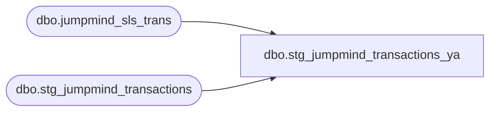

# dbo.stg_jumpmind_transactions_ya

**Database:** LH_Source  
**Server:** 4db76rlxaxcuvmuh5kw37wbnqq-ovsykae43znuhlmnflcdwm4ohu.datawarehouse.fabric.microsoft.com  

## Architecture Diagram



## Table Dependencies

| Referenced Table |
|---|
| dbo.jumpmind_sls_trans |
| dbo.stg_jumpmind_transactions |

## View Code

```sql
CREATE   VIEW dbo.stg_jumpmind_transactions_ya AS WITH derived AS (     SELECT         t.transaction_id,         t.store_id,         t.business_unit_id_raw,         t.void_enriched_flag,         t.record_type,         TRY_CONVERT(int,             CASE                 WHEN LEN(LTRIM(RTRIM(t.business_unit_id_raw))) <= 3                     THEN LTRIM(RTRIM(t.business_unit_id_raw))                 WHEN LEN(LTRIM(RTRIM(t.business_unit_id_raw))) = 4                   AND LEFT(LTRIM(RTRIM(t.business_unit_id_raw)), 1) = '1'                     THEN SUBSTRING(LTRIM(RTRIM(t.business_unit_id_raw)), 2, 3)                 ELSE LTRIM(RTRIM(t.business_unit_id_raw))             END         )                                                          AS legacy_store_no,         TRY_CONVERT(int, t.register_no)                            AS legacy_register_no,         COALESCE(             TRY_CONVERT(datetime2(6), src.begin_time),             t.entry_date_time         )                                                          AS source_entry_time,         t.transaction_series,         t.transaction_no,         t.cashier_no,         t.transaction_category,         t.bank_deposit_declaration_flag,         t.store_no_for_tax_jurisdiction_lookup,         t.send_tax_exception_jurisdiction,         t.transaction_void_flag,         t.unused_13,         t.unused_14,         t.purchasing_employee_no,         t.closeout_flag,         t.transaction_remark,         t.tax_override_flag,         t.till_no,         t.pos_transaction_series,         t.create_time,         t.business_date,         t.party_id,         t.event_id,         t.event_invoice,         t.gsr_flag,         t.order_status,         t.has_stock_order_line_items,         t.gross_total,         t.voided_device_id,         t.voided_sequence_number,         t.source_system       FROM dbo.stg_jumpmind_transactions AS t       LEFT JOIN LH_Source.dbo.jumpmind_sls_trans AS src             ON CAST(src.device_id AS varchar(64))   + '|' +                CAST(src.business_date AS varchar(8)) + '|' +                CAST(src.sequence_number AS varchar(20)) = t.transaction_id ) SELECT     d.transaction_id,     d.store_id,     d.business_unit_id_raw,     d.void_enriched_flag,     d.record_type,                                                                    /*  1 */     d.legacy_store_no                                          AS store_no,           /*  2 */     d.legacy_register_no                                       AS register_no,        /*  3 */     /*  4 — entry_date_time = begin_time.             iter 18 attempted +1h offset for store 29 (208 of its 525             POS-404 rows have AW = SQL + 1h). Rolled back: store 29             has 317 rows that DO match exactly, and applying +1h             broke them all (net -109 rows, F1 dropped 0.2 pp). Need a             finer discriminator (which specific txns are off; not all             store-29 txns). Deferred until per-cashier or per-day             signal is identified. */     d.source_entry_time                                          AS entry_date_time,     d.transaction_series,                                                             /*  5 */     d.transaction_no,                                                                 /*  6 */     d.cashier_no,                                                                     /*  7 */     d.transaction_category,                                                           /*  8 */     d.bank_deposit_declaration_flag,                                                  /*  9 */     d.store_no_for_tax_jurisdiction_lookup,                                           /* 10 */     d.send_tax_exception_jurisdiction,                                                /* 11 */     d.transaction_void_flag,                                                          /* 12 */     d.unused_13,                                                                      /* 13 */     d.unused_14,                                                                      /* 14 */     d.purchasing_employee_no,                                                         /* 15 */     d.closeout_flag,                                                                  /* 16 */     d.transaction_remark,                                                             /* 17 */     d.tax_override_flag,                                                              /* 18 */     d.till_no,                                                                        /* 19 */     d.pos_transaction_series,                                                         /* 20 */     d.create_time,     d.business_date,     d.party_id,     d.event_id,     d.event_invoice,     d.gsr_flag,     d.order_status,     d.has_stock_order_line_items,     d.gross_total,     d.voided_device_id,     d.voided_sequence_number,     d.source_system   FROM derived AS d;
```

