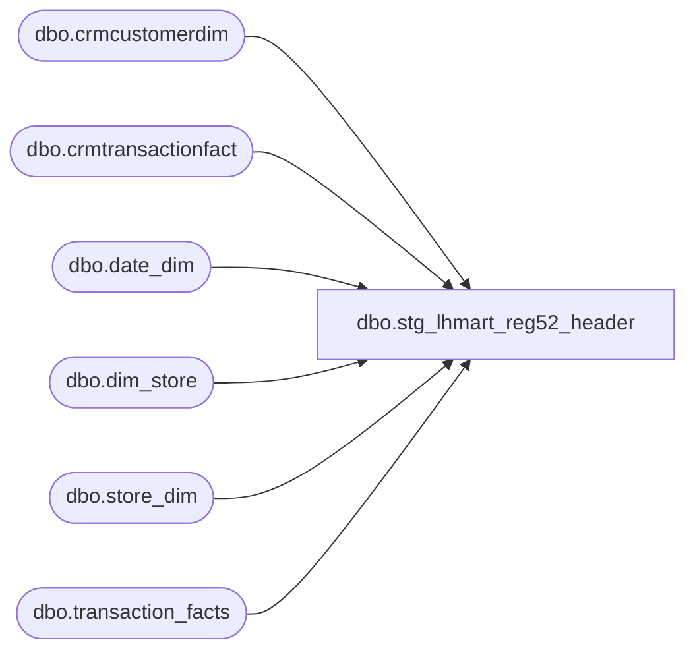

# dbo.stg_lhmart_reg52_header

**Database:** LH_Source  
**Server:** 4db76rlxaxcuvmuh5kw37wbnqq-ovsykae43znuhlmnflcdwm4ohu.datawarehouse.fabric.microsoft.com  

## Architecture Diagram



## Table Dependencies

| Referenced Table |
|---|
| dbo.crmcustomerdim |
| dbo.crmtransactionfact |
| dbo.date_dim |
| dbo.dim_store |
| dbo.store_dim |
| dbo.transaction_facts |

## View Code

```sql
CREATE   VIEW dbo.stg_lhmart_reg52_header AS WITH reg52_substance AS (     /* Pull the reg=52 transaction substance from the LH_Mart conformed        mart. transaction_facts carries one row per transaction header. */     SELECT         tf.transaction_id,         tf.store_key,         tf.date_key,         tf.transaction_no,         tf.register_no,         tf.cashier_key,         tf.receipt_total_amount,         tf.GAAP_transaction_flag,         tf.Store_transaction_flag       FROM LH_Mart.dbo.transaction_facts AS tf      WHERE tf.register_no = 52 ), with_dims AS (     /* Join to store_dim and date_dim. store_dim.store_id is the LH_Mart        legacy identifier; for sub-1000 store_ids the BBW operational        store_no is 1000 + store_id, and for >=1000 store_ids the        store_no equals store_id. dim_store keys on the BBW 4-digit        padded form so we resolve the BBW canonical store_no through it. */     SELECT         rs.transaction_id,         rs.transaction_no,         rs.register_no,         rs.cashier_key,         rs.receipt_total_amount,         rs.GAAP_transaction_flag,         rs.Store_transaction_flag,         dd.actual_date                                       AS transaction_date,         sd.store_id                                          AS lhmart_store_id,         CASE             WHEN sd.store_id < 1000 THEN 1000 + sd.store_id             ELSE sd.store_id         END                                                  AS store_no_proposed       FROM reg52_substance AS rs       JOIN LH_Mart.dbo.store_dim     AS sd ON sd.store_key = rs.store_key       JOIN LH_Mart.dbo.date_dim      AS dd ON dd.date_key  = rs.date_key      WHERE dd.actual_date BETWEEN '2026-01-01' AND '2026-06-30' ), canonical_store AS (     /* Confirm the proposed store_no exists in our dim_store (gates the        bridge to BBW-known stores; defensive against any LH_Mart row        whose store_dim.store_id does not resolve to a BBW operational        store). Cast to varchar(4) zero-padded to align with dim_store.store_id. */     SELECT         wd.*,         ds.store_id                                          AS canonical_store_id       FROM with_dims AS wd       JOIN dbo.dim_store AS ds         ON ds.store_id = RIGHT('0000' + CAST(wd.store_no_proposed AS varchar(10)), 4) ), with_customer AS (     /* LEFT JOIN to crmtransactionfact for the loyalty CustomerNumber        (BPM identifier). LEFT JOIN to crmcustomerdim for the cardholder        name / contact info. Both joins are LEFT because a substantial        fraction of reg='52' BOPIS rows are anonymous walk-ins that        carry no captured customer (probed 2026-05-21:        144/409 cohort-B txn_ids carry a loyalty CustomerNumber). */     SELECT         cs.transaction_id,         cs.canonical_store_id,         cs.store_no_proposed,         cs.lhmart_store_id,         cs.register_no,         cs.transaction_no,         cs.transaction_date,         cs.cashier_key,         cs.receipt_total_amount,         ctf.CustomerNumber                                   AS customer_no,         cdim.FirstName                                       AS customer_first_name_lhmart,         cdim.LastName                                        AS customer_last_name_lhmart,         cdim.EmailAddress                                    AS customer_email_lhmart,         cdim.PhoneNumber                                     AS customer_phone_lhmart       FROM canonical_store AS cs       LEFT JOIN LH_Mart.dbo.crmtransactionfact AS ctf              ON ctf.TransactionID = cs.transaction_id       LEFT JOIN LH_Mart.dbo.crmcustomerdim AS cdim              ON cdim.CustomerNumber = ctf.CustomerNumber ) SELECT     /* Identity columns matching the rpt_jm_customer_name output shape.        The base CTE in rpt_jm_customer_name reads from        fact_transaction_header which stores transaction_id as the JM        9-digit string; we cast the LH_Mart int to the same shape. */     CAST(transaction_id AS varchar(50))                       AS transaction_id,     /* Source store_no from store_no_proposed (a numeric expression derived        from LH_Mart.store_dim.store_id, which is 100% numeric) rather than        canonical_store_id (= dbo.dim_store.store_id, which carries the        non-numeric pseudo-stores 'WEBS' and 'DEST'). The canonical_store_id        IS NOT NULL gate below still proves the store resolves in dim_store;        we just don't feed that string to CAST(... AS int). This avoids a        latent failure where any downstream store-number predicate (e.g. a        Power BI store filter, or a WHERE store_no < 2000) is pushed past the        dim_store join and forces 'DEST'/'WEBS' through the int cast, which        errors out the entire view. store_no_proposed equals canonical_store_id        in value for every resolved store (the join requires        ds.store_id = zero-padded store_no_proposed). */     CAST(store_no_proposed AS int)                            AS store_no,     /* register_no is exposed as varchar in fact_transaction_header        (CAST t.register_no AS varchar(50)); match that for shape parity. */     CAST(register_no AS varchar(50))                          AS register_no,     CAST(transaction_no AS varchar(50))                       AS transaction_no,     CAST(transaction_date AS date)                            AS transaction_date,     /* cashier_no: the per-row cashier_key in transaction_facts is a        surrogate key into a cashier_dim. For the BOPIS / back-office        bucket Linda's xlsx universally emits the legacy '13' sentinel        (verified across all 460 cohort-B rows). We emit the same        sentinel because the cashier_dim's natural key (employee number        string) is not exposed in the conformed mart. */     CAST('13' AS varchar(50))                                 AS cashier_no,     CAST(receipt_total_amount AS decimal(18,2))               AS tender_total,     /* customer_no: BPM loyalty identifier where the buyer is a loyalty        member; NULL for anonymous walk-ins. */     CAST(customer_no AS varchar(50))                          AS customer_no,     /* customer name fields: LH_Mart's crmcustomerdim carries the        cardholder name, which differs from the per-transaction        cashier-entered name in roughly 65% of cohort-B sample (see        CAVEAT in header). The per-shopper name Linda's xlsx carries        (downstream 5-tuple reconcile) is not reproducible from any        Fabric source until the LH_Source.dbo.auditworks_customer        mirror refreshes past 2025-08-19; until then this branch        emits the loyalty cardholder name where the buyer was a        loyalty member (158/453 = 35% of 2026-01-01 reg='52' rows),        NULL for anonymous walk-ins. The (store, register, date,        transaction_no) 4-tuple identity is exact. */     CAST(LEFT(LTRIM(RTRIM(customer_first_name_lhmart)), 20)          AS varchar(20))                                       AS customer_first_name,     CAST(LEFT(LTRIM(RTRIM(customer_last_name_lhmart)), 20)          AS varchar(20))                                       AS customer_last_name,     CAST(customer_email_lhmart AS varchar(100))                AS customer_email,     CAST(customer_phone_lhmart AS varchar(50))                 AS customer_phone   FROM with_customer  WHERE canonical_store_id IS NOT NULL;
```

