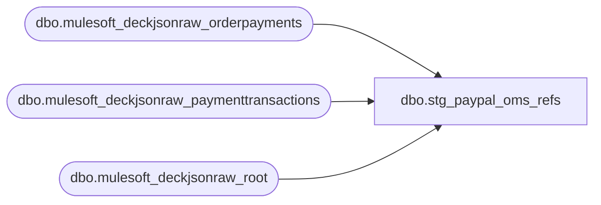

# dbo.stg_paypal_oms_refs

**Database:** LH_Source  
**Server:** 4db76rlxaxcuvmuh5kw37wbnqq-ovsykae43znuhlmnflcdwm4ohu.datawarehouse.fabric.microsoft.com  

## Architecture Diagram



## Table Dependencies

| Referenced Table |
|---|
| dbo.mulesoft_deckjsonraw_orderpayments |
| dbo.mulesoft_deckjsonraw_paymenttransactions |
| dbo.mulesoft_deckjsonraw_root |

## View Code

```sql
/* =============================================================================    stg_paypal_oms_refs.sql, per-leg PayPal reference lookup keyed by OMS order    =============================================================================    Domain:   Reconciliation (Sales Audit)    Audience: rpt_sp_paypal_auth     PURPOSE      Pre-aggregate the (OMS_OrderNumber, capture_amount, sign_cohort, dup_rank)      to PayPal reference_no lookup ONCE so the downstream rpt_sp_paypal_auth      view does only a flat equi-join hash lookup at runtime.       The previous shape inlined this lookup as two parallel CTEs inside      rpt_sp_paypal_auth (paypal_refund_refs + paypal_sales_refs), each      three-way joining LH_Source.dbo.mulesoft_deckjsonraw_orderpayments x      mulesoft_deckjsonraw_root x mulesoft_deckjsonraw_paymenttransactions      with a ROW_NUMBER() window. Combined with the UNION ALL fan-out across      two report branches, that produced a non-pushdownable plan (Fabric      Warehouse Msg 65001: non-scalable operation) on prod 2026-05-21.     SHAPE      One row per Adyen PayPal payment-transaction event that carries a      non-empty Generic1 (the Adyen confirmation reference, 16 alphanumeric).         oms_order_number   varchar    OMS OrderNumber (e.g. 'W9376532'). This is                                      the order key downstream rpt joins on.        capture_amount     dec(18,2)  abs(Amount) of this payment event,                                      used to bind a specific Adyen ref to a                                      specific transaction-line leg by amount.        sign_cohort        char(1)    'R' for refund-side captures                                      (PaymentTransactionTypeId IN (3,4,11)),                                      'S' for sale-side captures (Type 13, 14).                                      Splits the refs so a refund leg never                                      binds to a sale-side ref of the same                                      amount on the same order, and vice versa                                      (the 2026-05-21 row-doubling root cause).        reference_no       varchar    pt.Generic1, the Adyen processor reference                                      that Linda's xlsx surfaces as                                      [Reference Number].        dup_rank           int        ROW_NUMBER() OVER                                        (PARTITION BY oms_order_number,                                                      capture_amount,                                                      sign_cohort                                         ORDER BY pt.TransactionDateUTC,                                                  pt.Generic1).                                      Two same-amount same-sign refs on the                                      same OMS order map 1:1 to the two                                      same-amount Customer-Service legs on                                      the report's per-leg explosion (e.g.,                                      two Klarna installment refunds at $15.70                                      each). Pairs with the report's                                      rank_within_amt for deterministic 1:1                                      binding.     SOURCE TABLES      LH_Source.dbo.mulesoft_deckjsonraw_orderpayments       (OMS payment)      LH_Source.dbo.mulesoft_deckjsonraw_root                (joined for OrderNumber)      LH_Source.dbo.mulesoft_deckjsonraw_paymenttransactions (Adyen events)     PREDICATES      op.PaymentSubType = 'Adyen_PayPal'      pt.PaymentTransactionTypeId IN (3, 4, 11, 13, 14)      pt.Generic1 IS NOT NULL AND pt.Generic1 <> ''      pt.IsDecline = 0 OR pt.IsDecline IS NULL     PERFORMANCE      The three-table join is materialised here ONCE per refresh. Restriction      by PaymentSubType + PaymentTransactionTypeId narrows the result set to      order-of-thousands of rows per quarter (vs the tens of millions in      transaction_facts), so the downstream report's LEFT JOIN against this      view is a hash lookup rather than a re-scan of three large source      tables per call.    ============================================================================= */  CREATE   VIEW dbo.stg_paypal_oms_refs AS SELECT     djr.OrderNumber                                       AS oms_order_number,     CAST(ABS(pt.Amount) AS decimal(18,2))                 AS capture_amount,     CAST(CASE WHEN pt.PaymentTransactionTypeId IN (3, 4, 11)               THEN 'R'               ELSE 'S' END AS char(1))                    AS sign_cohort,     CAST(pt.Generic1 AS varchar(80))                      AS reference_no,     ROW_NUMBER() OVER (         PARTITION BY djr.OrderNumber,                      CAST(ABS(pt.Amount) AS decimal(18,2)),                      CASE WHEN pt.PaymentTransactionTypeId IN (3, 4, 11)                           THEN 'R' ELSE 'S' END         ORDER BY pt.TransactionDateUTC, pt.Generic1     )                                                     AS dup_rank   FROM LH_Source.dbo.mulesoft_deckjsonraw_orderpayments       AS op   JOIN LH_Source.dbo.mulesoft_deckjsonraw_root                AS djr     ON djr.OrderID = op._ParentKeyField   JOIN LH_Source.dbo.mulesoft_deckjsonraw_paymenttransactions AS pt     ON pt.OrderPaymentId = op.ID  WHERE op.PaymentSubType                = 'Adyen_PayPal'    AND pt.PaymentTransactionTypeId      IN (3, 4, 11, 13, 14)    AND pt.Generic1                       IS NOT NULL    AND pt.Generic1                       <> ''    AND (pt.IsDecline = 0 OR pt.IsDecline IS NULL);
```

