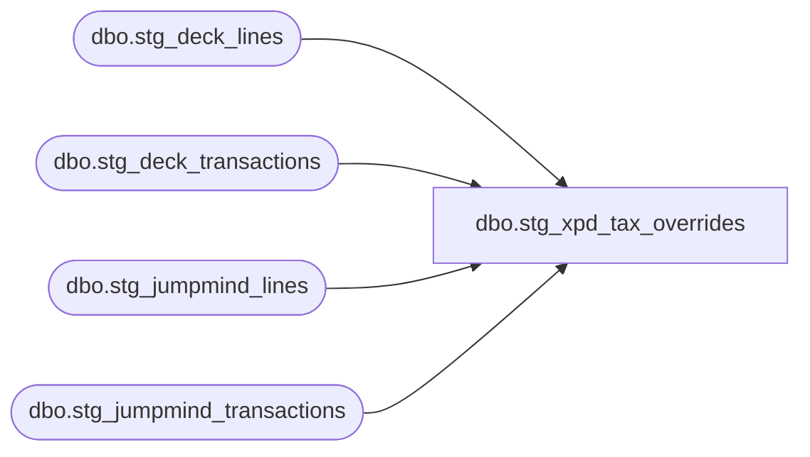

# dbo.stg_xpd_tax_overrides

**Database:** LH_Source  
**Server:** 4db76rlxaxcuvmuh5kw37wbnqq-ovsykae43znuhlmnflcdwm4ohu.datawarehouse.fabric.microsoft.com  

## Architecture Diagram



## Table Dependencies

| Referenced Table |
|---|
| dbo.stg_deck_lines |
| dbo.stg_deck_transactions |
| dbo.stg_jumpmind_lines |
| dbo.stg_jumpmind_transactions |

## View Code

```sql
CREATE   VIEW dbo.stg_xpd_tax_overrides AS WITH /* Build the not-taxable line_object list as a CTE for clarity */ not_taxable_objects AS (     SELECT line_object FROM (VALUES         (101),(204),(292),(294),(296),(403),(404),(500),(501),(550),(551),(552)     ) AS nt(line_object) ), unified_lines AS (     SELECT         l.transaction_id,         l.line_id,         l.line_object,         CAST('JUMPMIND' AS varchar(10)) AS source_system       FROM dbo.stg_jumpmind_lines AS l     UNION ALL     SELECT         l.transaction_id,         l.line_id,         l.line_object,         CAST('DECK_OMS' AS varchar(10)) AS source_system       FROM dbo.stg_deck_lines AS l ), /* Identify lines that need a Tax Override record */ override_candidates AS (     SELECT         l.transaction_id,         l.line_id,         l.line_object,         l.source_system,         /* Reason flags */         CASE WHEN nt.line_object IS NOT NULL THEN 1 ELSE 0 END AS is_not_taxable,         /* Header overrides */         h.tax_override_flag,         h.send_tax_exception_jurisdiction       FROM unified_lines AS l       LEFT JOIN not_taxable_objects AS nt ON nt.line_object = l.line_object       LEFT JOIN (                   SELECT transaction_id, tax_override_flag, send_tax_exception_jurisdiction FROM dbo.stg_jumpmind_transactions                   UNION ALL                   SELECT transaction_id, tax_override_flag, send_tax_exception_jurisdiction FROM dbo.stg_deck_transactions                 ) AS h         ON h.transaction_id = l.transaction_id      /* send_tax_exception_jurisdiction is hardcoded NULL on         stg_jumpmind_transactions (no source column on trans_summary);         the IS NOT NULL branch was always-false dead filter. Removed. When         a real source for "Send" category 1 tax overrides is identified,         re-add the filter. */      WHERE nt.line_object IS NOT NULL         OR h.tax_override_flag = 1 ) SELECT     o.transaction_id,     o.line_id,     /* Aptos XPOLLD0013 Tax Override Detail (record type 'T', 7 fields) */     CAST('T' AS char(1))                                AS record_type,                /* 1 */     o.line_id                                           AS line_id_aptos,              /* 2 */     o.send_tax_exception_jurisdiction                   AS exception_tax_jurisdiction, /* 3 */     /* Tax category derivation */     CASE         WHEN o.send_tax_exception_jurisdiction IS NOT NULL THEN 1   /* Send */         WHEN o.tax_override_flag = 1                        THEN 2   /* Tax Override */         WHEN o.is_not_taxable = 1                           THEN 3   /* Tax Exempt */         ELSE                                                     1     END                                                 AS tax_category,                /* 4 */     /* Taxable flag */     CASE         WHEN o.is_not_taxable = 1 THEN 0         ELSE                            1     END                                                 AS taxable,                     /* 5 */     CAST(NULL AS varchar(20))                           AS tax_exempt_no,               /* 6 */     /* Tax level — default 0 (all levels) for line-level overrides */     CAST(0 AS int)                                      AS tax_level,                   /* 7 */     /* Reason / lineage */     o.line_object,     o.is_not_taxable,     CASE WHEN o.is_not_taxable = 1 THEN 'NOT_TAXABLE_LINE_OBJECT'          WHEN o.tax_override_flag = 1 THEN 'HEADER_TAX_OVERRIDE'          WHEN o.send_tax_exception_jurisdiction IS NOT NULL THEN 'SEND_JURISDICTION'          ELSE NULL     END                                                 AS override_reason,     o.source_system   FROM override_candidates AS o;
```

