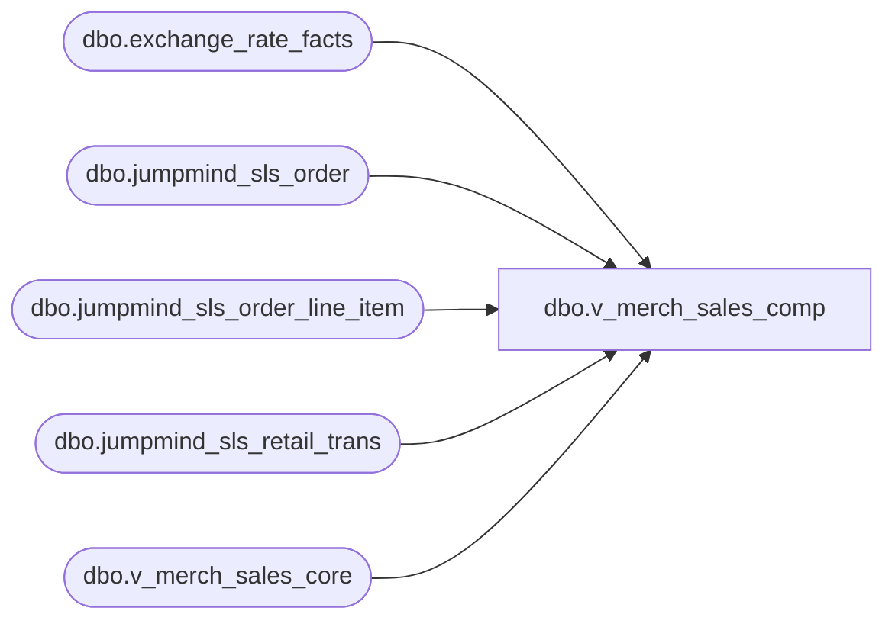

# dbo.v_merch_sales_comp

**Database:** LH_Source  
**Server:** 4db76rlxaxcuvmuh5kw37wbnqq-ovsykae43znuhlmnflcdwm4ohu.datawarehouse.fabric.microsoft.com  

## Architecture Diagram



## Table Dependencies

| Referenced Table |
|---|
| dbo.exchange_rate_facts |
| dbo.jumpmind_sls_order |
| dbo.jumpmind_sls_order_line_item |
| dbo.jumpmind_sls_retail_trans |
| dbo.v_merch_sales_core |

## View Code

```sql
CREATE   VIEW dbo.v_merch_sales_comp AS WITH salesOrders AS (     SELECT         so.business_unit_id,         soli.orig_sequence_number      AS sequence_number,         soli.orig_line_sequence_number AS line_sequence_number,         so.business_date,         so.device_id     FROM dbo.jumpmind_sls_order so     INNER JOIN dbo.jumpmind_sls_order_line_item soli         ON so.order_id = soli.order_id     INNER JOIN dbo.jumpmind_sls_retail_trans rt         ON rt.order_id = soli.order_id        AND rt.business_date = soli.orig_business_date        AND rt.sequence_number = soli.orig_sequence_number ) SELECT     c.business_unit_id,     c.business_date,     c.sequence_number,     c.device_id,     c.line_sequence_number,     c.item_description,     c.item_id,     c.item_type,     c.extended_amount,     c.tax_amount,     c.country_id,     c.create_time,      CASE         WHEN c.country_id IN ('US', 'CA')             THEN c.extended_amount          WHEN c.country_id = 'UK'             THEN c.extended_amount - c.tax_amount          WHEN c.country_id = 'IE'             THEN                 ROUND(erf.bbw_rate * c.extended_amount, 4)               - ROUND(erf.bbw_rate * c.tax_amount, 4)          ELSE c.extended_amount     END AS OriginalPrice  FROM dbo.v_merch_sales_core c LEFT JOIN salesOrders s   ON c.business_unit_id = s.business_unit_id  AND c.sequence_number = s.sequence_number  AND c.line_sequence_number = s.line_sequence_number  AND c.business_date = s.business_date  AND c.device_id = s.device_id LEFT JOIN LH_MART.dbo.exchange_rate_facts erf   ON CAST(c.create_time AS DATE) = CAST(erf.actual_date AS DATE)  AND erf.from_currency_code = 'EUR'  AND erf.to_currency_code = 'GBP' WHERE     s.sequence_number IS NULL;
```

