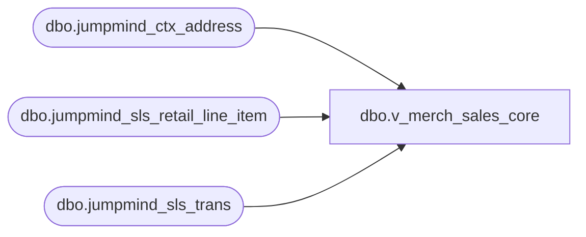

# dbo.v_merch_sales_core

**Database:** LH_Source  
**Server:** 4db76rlxaxcuvmuh5kw37wbnqq-ovsykae43znuhlmnflcdwm4ohu.datawarehouse.fabric.microsoft.com  

## Architecture Diagram



## Table Dependencies

| Referenced Table |
|---|
| dbo.jumpmind_ctx_address |
| dbo.jumpmind_sls_retail_line_item |
| dbo.jumpmind_sls_trans |

## View Code

```sql
CREATE   VIEW dbo.v_merch_sales_core AS SELECT     t.business_unit_id,     t.business_date,     t.sequence_number,     li.device_id,     li.line_sequence_number,     li.item_description,     li.item_id,     li.item_type,     li.extended_amount,     li.tax_amount,     t.create_time,     cbu.country_id FROM dbo.jumpmind_sls_retail_line_item AS li JOIN dbo.jumpmind_sls_trans AS t   ON t.device_id = li.device_id  AND t.business_date = li.business_date  AND t.sequence_number = li.sequence_number JOIN dbo.jumpmind_ctx_address AS cbu   ON cbu.business_unit_id = t.business_unit_id WHERE     t.trans_status = 'COMPLETED'     AND li.voided = 0     AND li.item_type NOT IN ('GIFTCARD', 'DONATION', 'STORE_ORDER_SHIPPING', 'SERVICE')     AND li.item_id NOT IN (         '999999990','999999995','899999902','999999996','999999997','000078','080150','080151','080188','080189','080510','080511','080512','080513','080706','080707','080742','080743','080744','080745','080746','080747','080748','080749','080751','080752','080753','080754','080755','080756','080757','080758','080759','080760','080761','080762','080763','080764','080765','080766','080767','080768','080769','080770','080771','080780','081678','083004','089505','090891','090892','098047','098089','098090','098091',         '180150','180510','180511','180512','180513','180706','180707','180745','180748','180749','180751','180753','180754','180755','180756','180760','180761','180767','180768','180770','180771','180780','183004','189014','189015','189016','189017','189018','190891','190892',         '480150','480151','480510','480511','480512','480513','480707','480708','480709','480745','480748','480749','480751','480753','480754','480755','480756','480757','480758','480760','480761','480764','480766','480767','480768','480770','480771','480780','480805','481089','483004','490891','490892',         '00001','00002','000025','000026','000027','000029','00003','000032','000035','00004','000042','000044','00006','000077','000078','000081','000082','00010','00011','00012','00013','00014','00015','00016','00017','00018','00019','00020','00021','00022','022610',         '080726','080727','080728','080729','080730','080731','080733','080736','080738','080741','091450','098041','098042','098043','098044','098075','098088','198075','400003','480200','480731','491450','491451','498033','498041','498088'     );
```

