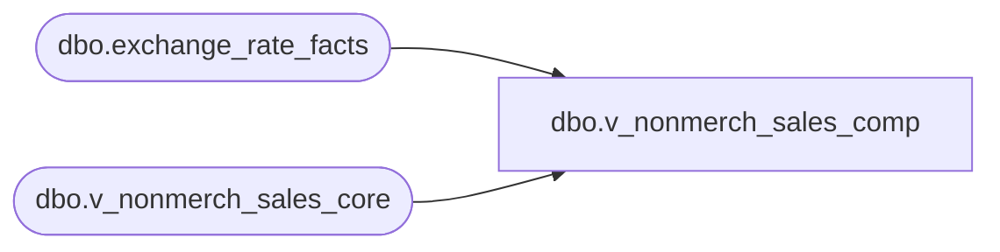

# dbo.v_nonmerch_sales_comp

**Database:** LH_Source  
**Server:** 4db76rlxaxcuvmuh5kw37wbnqq-ovsykae43znuhlmnflcdwm4ohu.datawarehouse.fabric.microsoft.com  

## Architecture Diagram



## Table Dependencies

| Referenced Table |
|---|
| dbo.exchange_rate_facts |
| dbo.v_nonmerch_sales_core |

## View Code

```sql
CREATE   VIEW dbo.v_nonmerch_sales_comp AS SELECT     c.business_unit_id,     c.business_date,     c.sequence_number,     c.device_id,     c.item_description,      x.computed_item_id AS item_id,      CASE         WHEN c.business_unit_id IN ('1031','1047','1088','1100','1207','1210','1216','1309','1332','1363','1384','1417','1476')              AND x.computed_item_id = '098088'             THEN 'SALES_TAX'         WHEN x.computed_item_id = '098088'             THEN 'SALES_SUPPLY'         ELSE c.item_type     END AS item_type,      CASE         WHEN c.country_id = 'UK'             THEN c.extended_amount - c.tax_amount         WHEN c.country_id = 'IE'             THEN ROUND(COALESCE(erf.bbw_rate, 1.0) * c.extended_amount, 4)                - ROUND(COALESCE(erf.bbw_rate, 1.0) * c.tax_amount, 4)         ELSE c.extended_amount     END AS extended_amount,      -- keep these if you want them available to the app or troubleshooting     c.create_time,     c.country_id,     c.card_number  FROM dbo.v_nonmerch_sales_core AS c CROSS APPLY (     SELECT         CASE             WHEN TRY_CONVERT(bigint, LEFT(ISNULL(c.card_number, '0'), 12)) BETWEEN 634431830110 AND 634431863609 THEN '034524'             WHEN TRY_CONVERT(bigint, LEFT(ISNULL(c.card_number, '0'), 12)) BETWEEN 634431863610 AND 634431872109 THEN '034524'             ELSE c.item_id         END AS computed_item_id ) AS x LEFT JOIN LH_MART.dbo.exchange_rate_facts AS erf   ON CAST(c.create_time AS date) = CAST(erf.actual_date AS date)  AND erf.from_currency_code = 'EUR'  AND erf.to_currency_code   = 'GBP';
```

