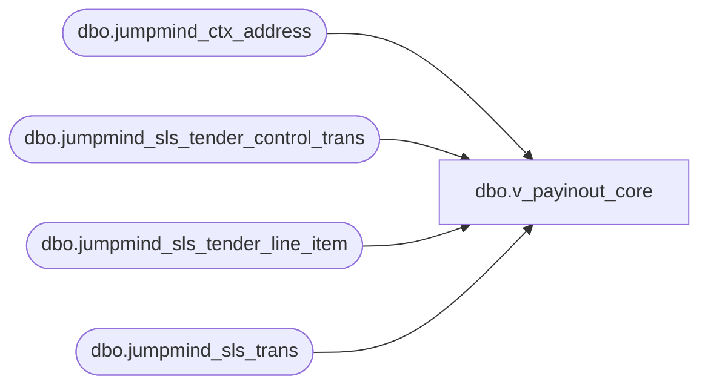

# dbo.v_payinout_core

**Database:** LH_Source  
**Server:** 4db76rlxaxcuvmuh5kw37wbnqq-ovsykae43znuhlmnflcdwm4ohu.datawarehouse.fabric.microsoft.com  

## Architecture Diagram



## Table Dependencies

| Referenced Table |
|---|
| dbo.jumpmind_ctx_address |
| dbo.jumpmind_sls_tender_control_trans |
| dbo.jumpmind_sls_tender_line_item |
| dbo.jumpmind_sls_trans |

## View Code

```sql
CREATE   VIEW dbo.v_payinout_core AS SELECT     t.business_unit_id,     t.business_date,     t.sequence_number,     li.device_id,     tct.reason_code,     li.tender_amount,     t.create_time,     cbu.country_id FROM dbo.jumpmind_sls_trans AS t JOIN dbo.jumpmind_sls_tender_line_item AS li   ON li.device_id       = t.device_id  AND li.business_date   = t.business_date  AND li.sequence_number = t.sequence_number JOIN dbo.jumpmind_sls_tender_control_trans AS tct   ON tct.device_id       = t.device_id  AND tct.business_date   = t.business_date  AND tct.sequence_number = t.sequence_number JOIN dbo.jumpmind_ctx_address AS cbu   ON cbu.business_unit_id = t.business_unit_id WHERE     t.trans_status = 'COMPLETED'     AND t.trans_type IN ('PAY_IN','PAY_OUT')     AND li.voided = 0     AND ISNULL(t.business_date,'') <> '';
```

