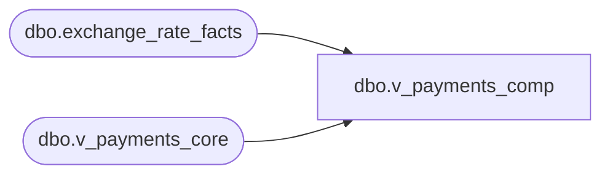

# dbo.v_payments_comp

**Database:** LH_Source  
**Server:** 4db76rlxaxcuvmuh5kw37wbnqq-ovsykae43znuhlmnflcdwm4ohu.datawarehouse.fabric.microsoft.com  

## Architecture Diagram



## Table Dependencies

| Referenced Table |
|---|
| dbo.exchange_rate_facts |
| dbo.v_payments_core |

## View Code

```sql
CREATE   VIEW dbo.v_payments_comp AS SELECT     c.business_unit_id,     c.business_date,     c.sequence_number,     c.device_id,     c.tender_code,     CASE         WHEN c.country_id = 'IE'             THEN ROUND(COALESCE(erf.bbw_rate, 1.0) * c.tender_amount, 4)         ELSE c.tender_amount     END AS tender_amount,     c.country_id,     c.create_time FROM dbo.v_payments_core AS c LEFT JOIN LH_MART.dbo.exchange_rate_facts AS erf   ON CAST(c.create_time AS date) = CAST(erf.actual_date AS date)  AND erf.from_currency_code = 'EUR'  AND erf.to_currency_code   = 'GBP';
```

