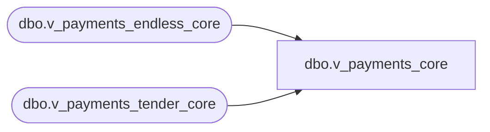

# dbo.v_payments_core

**Database:** LH_Source  
**Server:** 4db76rlxaxcuvmuh5kw37wbnqq-ovsykae43znuhlmnflcdwm4ohu.datawarehouse.fabric.microsoft.com  

## Architecture Diagram



## Table Dependencies

| Referenced Table |
|---|
| dbo.v_payments_endless_core |
| dbo.v_payments_tender_core |

## View Code

```sql
CREATE   VIEW dbo.v_payments_core AS SELECT     business_unit_id,     business_date,     sequence_number,     device_id,     tender_code,     tender_amount,     create_time,     country_id FROM dbo.v_payments_tender_core  UNION ALL  SELECT     business_unit_id,     business_date,     sequence_number,     device_id,     tender_code,     tender_amount,     create_time,     country_id FROM dbo.v_payments_endless_core;
```

