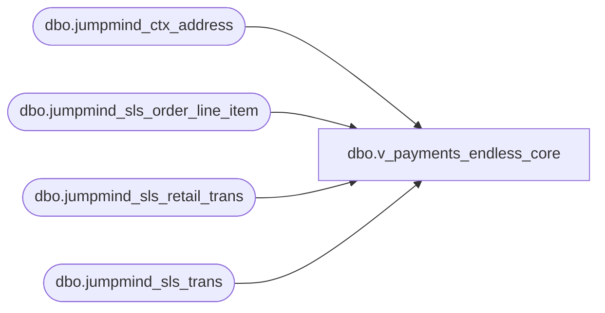

# dbo.v_payments_endless_core

**Database:** LH_Source  
**Server:** 4db76rlxaxcuvmuh5kw37wbnqq-ovsykae43znuhlmnflcdwm4ohu.datawarehouse.fabric.microsoft.com  

## Architecture Diagram



## Table Dependencies

| Referenced Table |
|---|
| dbo.jumpmind_ctx_address |
| dbo.jumpmind_sls_order_line_item |
| dbo.jumpmind_sls_retail_trans |
| dbo.jumpmind_sls_trans |

## View Code

```sql
-- Endless Aisle payments derived from order line items, pre-joined and pre-filtered CREATE   VIEW dbo.v_payments_endless_core AS SELECT     t.business_unit_id,     rt.business_date,     rt.sequence_number,     rt.device_id,     CAST('ENDLESS_AISLE' AS VARCHAR(30)) AS tender_code,     tli.extended_amount AS tender_amount,     t.create_time,     cbu.country_id FROM dbo.jumpmind_sls_order_line_item AS tli JOIN dbo.jumpmind_sls_retail_trans AS rt   ON rt.order_id        = tli.order_id  AND rt.business_date   = tli.orig_business_date  AND rt.sequence_number = tli.orig_sequence_number JOIN dbo.jumpmind_sls_trans AS t   ON t.device_id        = rt.device_id  AND t.business_date    = rt.business_date  AND t.sequence_number  = rt.sequence_number JOIN dbo.jumpmind_ctx_address AS cbu   ON cbu.business_unit_id = t.business_unit_id WHERE     tli.voided = 0     AND t.trans_status = 'COMPLETED';
```

